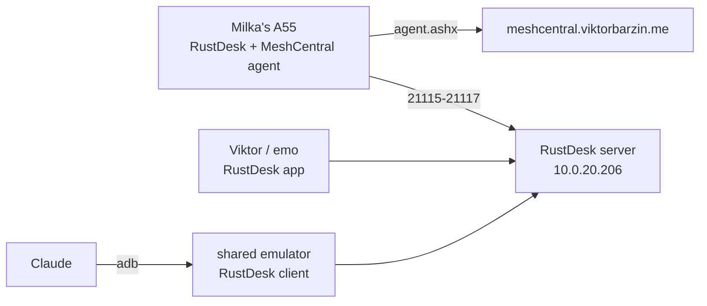

# Remote help for Milka's phone

Status: executing (2026-10-09). Agreed with Viktor in a grilling session the same day.

## Goal

Viktor, emo and Claude can see and operate Milka's phone (Samsung Galaxy A55, Android 16, One UI 8) when she calls for help. She keeps using the phone as she does today and does one thing per session: tap "Start now".

## Decisions

| Topic | Decision |
|---|---|
| Kind of help | Full control (tap and type), not only viewing |
| Helpers | Viktor and emo, from phone or laptop; Claude through the shared Android emulator |
| How she asks | She phones a helper as usual. No help button |
| Her part per session | One tap on Android's "Start now" screen-sharing prompt |
| Control tool | RustDesk 1.5.0, from the GitHub APK (not on the Play Store since 2023) |
| Dashboard | MeshCentral stays, enrolled with the Android agent for device info, files and viewing |
| Server | Self-hosted RustDesk (hbbs + hbbr) in the cluster, public, key-locked |
| Login | One permanent RustDesk password, in Vault `secret/rustdesk-milka` and in Vaultwarden shared with emo |
| Install hygiene | Samsung Auto Blocker turned back on after install; a helper turns it off briefly for each update |
| Claude's limits | Connects only when Viktor or emo ask; never opens banking or payment apps; never sends messages or calls as her; checks with a helper before anything irreversible |

## Why this shape

MeshCentral is already running, but its Android agent is view-only. Its README says the remote desktop "cannot tap, swipe, type, or otherwise control the device", and the request to add control through Accessibility was still open on 2026-10-09. RustDesk is the free option that does control, using its own Accessibility service.

The single tap per session comes from Android, not from RustDesk. Since Android 14 every screen-capture session needs the user's consent, and on Android 15 QPR1 and later capture stops when the screen locks ([MediaProjection docs](https://developer.android.com/media/grow/media-projection)). The one route that avoids the prompt, wireless debugging (ADB), switches itself off on reboot and loses its pairing when the Wi-Fi network changes, so it is not dependable for her.

Neither MeshCentral nor RustDesk offers an API for a program to take screenshots or send taps. Claude therefore uses the RustDesk Android client installed on the shared emulator (`android-emulator.viktorbarzin.me`), which it already drives over adb.

## Components

- `stacks/rustdesk`: hbbs and hbbr in one pod, `rustdesk/rustdesk-server:1.1.16`, both started with `-k _` so only clients holding the server's public key can register or relay. Dedicated MetalLB address `10.0.20.206` with `externalTrafficPolicy: Local`, the same reasoning as coturn. Keypair from Vault `secret/rustdesk` via ESO. Grey-cloud A record `rustdesk.viktorbarzin.me`, plus an internal Technitium record pointing at the LB address.
- pfSense alias `rustdesk_lb` with NAT for 21115-21117/tcp and 21116/udp, and matching forwards on the TP-Link. Both routers are configured by hand, outside Terraform.
- `stacks/meshcentral`: the init container now forces `NewAccounts` off on the existing volume. The live config had `"NewAccounts": "true"`.

## Client settings

Every RustDesk client (her phone, helpers, emulator) uses:

- ID server: `rustdesk.viktorbarzin.me`
- Relay server: `rustdesk.viktorbarzin.me`
- Key: the server's public key, `vault kv get -field=id_ed25519_pub secret/rustdesk`

The permanent password for her phone is in Vault (`secret/rustdesk-milka`, `password`).

## Open questions

- Whether the MeshCentral Android agent's relay tunnels work through Cloudflare. The agent pins the TLS certificate it sees, and Cloudflare's edge certificate rotates.
- Whether RustDesk still reports usage to rustdesk.com when pointed at our own server (F-Droid flags the app for this).
- Whether Android 16 on One UI 8 keeps RustDesk's Accessibility service enabled across reboots and app updates.
