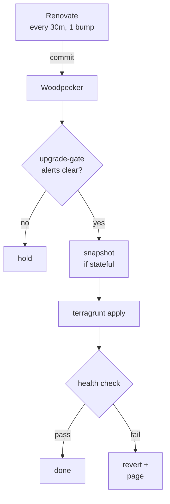
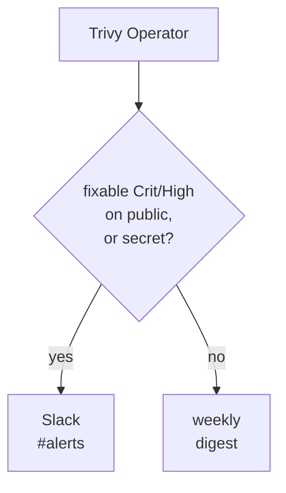
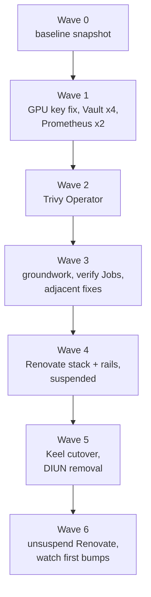

# Keeping the homelab current and CVE-aware

- Status: executing
- Date: 2026-10-09
- Decision record: ADR-0030 (Renovate lands version bumps straight to master, with CI rails and no agent)
- Origin: Muse flagged CVE-2026-88879 in Traefik on 2026-10-08. Traefik was on v3.7.1 while v3.7.14 existed. Viktor asked what our posture is against upgrades like this and wants the cluster always on the latest software.

## Goal

1. Every component moves to new upstream versions without someone having to notice first, including majors, cluster operators and database engines.
2. Every automated upgrade proves the component still works before it counts as landed, with the deepest checks on databases and the GPU stack.
3. A fixable, high-severity CVE on an internet-reachable workload reaches Slack within a day, without depending on an outside tool noticing it.
4. If the upgrade automation itself stops running, we hear about it.

## What exists today (measured 2026-10-09)

| Layer | Mechanism | State |
|---|---|---|
| Node OS | unattended-upgrades + kured, gated by upgrade-gate alerts | Working |
| Kubernetes components | daily detection CronJob + phase Job chain | Working |
| App images | Keel, injected by the Kyverno `inject-keel-annotations` policy | 159 deployments `patch`, 63 `never`, 5 `minor`, 4 `major`, 4 `force` |
| Helm charts and Terraform image pins | none automatic | 28 `helm_release`; 21 pinned, 7 with no `version` at all |
| DIUN → n8n → service-upgrade agent | workflow active | Last agent upgrade commit 2026-04-19 (see below) |
| CVE scanning | none | |

The DIUN filter passes only `status=update` (same tag, new digest) and drops `new` (a new tag). Real version bumps arrive as `new`, so the upgrade agent has received digest re-pushes but no version bumps since April. `docs/architecture/automated-upgrades.md` describes the filter as intended.

The weekly "upgrade report" (`k8s-upgrade-nightly-report`) covers Kubernetes components only. The DIUN stack comment and `automated-upgrades.md` point readers at it as if it covered images.

### Drift on the Helm-managed layer

```stats
~25 | Vault CVE fixes missing
34 months | Prometheus age
7 of 28 | charts with no pin
2026-04-19 | last DIUN agent upgrade
```

| Component | Running | Latest | Public |
|---|---|---|---|
| Prometheus | v2.48.1 (Dec 2023) | v3.15.0 | yes, behind Authentik |
| Alertmanager | v0.26.0 | v0.34.1 | yes, behind Authentik |
| Vault | 1.18.1 | 2.1.2 | yes, Vault's own auth only |
| Nextcloud | 32.0.14 | 35.0.1 | yes, app login |
| Calico | 3.30.7 | 3.33.0 | |
| GPU operator | 25.10.1 | 26.7.1 | |
| External Secrets | 2.6.0 | 2.12.0 | |
| CNPG | 1.28.1 | 1.30.1 | |
| CrowdSec | 1.7.8 | 1.8.1 | |
| Woodpecker | 3.14.1 | 3.19.0 | yes, app login |
| Traefik, Authentik, Keel | current | | |

Vault 1.18.1 is missing roughly 25 Community-relevant CVE fixes, including CVE-2025-6000 (critical, audit-plugin RCE, fixed in 1.20.1). HashiCorp now ships Community patches only on the newest line, so every one of those fixes means moving to 2.1.2. The CVE list came from a research pass and has not been checked ID by ID against the HCSEC posts.

The 2026-04-20 infra audit (`docs/plans/2026-04-20-infra-audit-design.md`, finding F03) recommended Renovate as its first "do first" item.

## Design

Renovate-owned pins land through the rails in the existing Woodpecker pipeline:



Every third-party version, apps included, moves through that path; Keel is retired. Trivy findings route by severity and exposure:



### Ownership of versions

| What | Owner |
|---|---|
| `helm_release` chart versions (all 28, after pinning the 7 unpinned ones to their live versions) | Renovate |
| Every third-party image pin in `.tf` and Helm values: about 230 apps (moved from Keel at their live tags), chart `tag` values, and the 91 `:latest` pins (pinned to the concrete version they run today, or by digest where an image publishes no version tags) | Renovate |
| Database engines: pg-cluster image, MySQL (latest innovation release), Redis, ClickHouse, Dolt | Renovate |
| Immich Postgres | Renovate, tracking the `immich-app/postgres` tag in Immich's own release compose |
| Our own images (`viktorbarzin/*`, `ghcr.io/viktorbarzin/*`), deployed by their CI | unchanged (existing build and deploy path) |
| Base images and language dependencies in our own image repos that opt in with `renovate.json` (Forgejo and GitHub) | Renovate, gated by that repo's own CI |
| Node OS packages, Kubernetes components | unchanged (unattended-upgrades + kured, k8s version chain) |

### Verification contract

An upgrade counts as landed only when the component's checks pass. Checks run as Kubernetes Jobs from a `verify` script kept next to each stack, so they can be run by the Woodpecker rails or by hand.

As built (2026-10-10): `scripts/verify/run <stack>` starts a Job in the `verify` namespace that runs the floor (`scripts/verify/lib.sh`) and `stacks/<stack>/verify.sh`, streams the log, returns pass/fail and deletes the Job. All 30 stacks in the chart, database and GPU groups have a script and passed against the versions running that day; a stack in those groups without one exits 3. Database probes log in over the network as a `verify_probe` user (Vault static roles through ESO) rather than exec into database pods. Usage and the per-stack checks: `docs/runbooks/verify-jobs.md`.

| Component | Checks |
|---|---|
| Floor (everything) | rollout complete within 10 minutes, ingress HTTP check where one exists, no new firing alerts in the component's namespaces for 10 minutes |
| Charts, databases, GPU stack | the floor, plus its own `verify` script exercising real function. Fail closed: a component in these groups without a script does not auto-land |
| Databases | operator or cluster healthy and replication lag 0; a scratch table written, read back and dropped; extensions load and answer a query where used (postgis, vector, vchord); every dependent app passes its own check; the backup job runs successfully on the new version |
| GPU stack (gpu-operator, driver, toolkit, device plugin) | `nvidia.com/gpu` allocatable still 100 and validator pods succeed; a test pod runs `nvidia-smi` and a small CUDA operation; one real inference each on llama-swap (`/v1/chat/completions`), Immich ML (`/predict`) and Frigate (`/api/stats` detector inference speed); DCGM metrics (`nvidia_tesla_t4_DCGM_*`) still flowing |
| Apps | the floor, plus the app's `verify` script where one exists. Apps go through the same rails as everything else: snapshot if stateful, and revert plus skip-that-version on failure |

Inventory behind these checks (2026-10-09):

- Databases: CNPG `dbaas/pg-cluster` (PG 16.9, 3 instances, 34 databases, custom `cnpg-postgis-pgvector` image), Immich PG 15.14 (vchord 0.4.3, vector 0.8.1), MySQL `mysql-standalone` 8.4.8 (20 schemas), Redis 8.10.0, ClickHouse 25.4.13 (rybbit), Dolt 2.0.7 (beads), Vault raft.
- GPU: one Tesla T4 on node1, time-sliced to 100 slots, driver 570.195.03 compiled at runtime. Live consumers: llama-swap, Immich ML and worker, Frigate, claude-memory, f1-stream, stremio, android-emulator.

### Database and GPU upgrade paths

- **pg-cluster majors** use CNPG's declarative offline in-place upgrade (since CNPG 1.26; we run 1.28.1) after a fresh `pg_dumpall`. Each new major needs our `cnpg-postgis-pgvector` image built for it first. After the upgrade, run the `update_extensions.sql` that `pg_upgrade` writes and an `ANALYZE`. The backup CronJob clients (`postgres:16.15-trixie`, dbaas and Immich) move in the same change, because `pg_dump` 16 refuses a PG 17 server.
- **Immich PG** moves only when Immich's release compose moves its tag. A major is an automated dump, image swap and restore, followed by the DB checks and a smart-search query.
- **MySQL** tracks the latest innovation release. It upgrades in place after a dump; the 2026-09-04 rehearsal measured an 8.4 patch upgrade at 25 s end to end.
- **Redis, ClickHouse, Dolt** upgrade in place after their backup runs.
- No restore test before DB upgrades. Recovery from a failed major is a manual restore from the pre-upgrade dump.
- **GPU node kernel stays held** at 6.8.0-117. The driver compiles against kernel headers at runtime, and the 2026-05-17 post-mortem covers what happens when the headers are missing. Everything above the kernel upgrades automatically under the GPU checks. A kernel move becomes a supervised step when a driver version supports a newer kernel whose headers exist in the repos.

### Phase 1: supervised Vault and Prometheus upgrades

These two go first because both are reachable from the internet and are one to three years behind. They are done by hand, one hop at a time, with the result checked after each.

**Vault 1.18.1 → 2.1.2**, stepping each line: 1.19.5 → 1.20.4 → 1.21.4 → 2.1.2. HashiCorp neither certifies nor forbids the direct skip, and Vault holds the secrets behind 138 ExternalSecrets, so each line gets its own hop.

- Before each hop: `vault operator raft snapshot save` to the existing NFS backup target, checked for size and readability.
- The `auto-unseal` sidecar (`stacks/vault/main.tf:216`) and the `vault-raft-backup` CronJob image (`:435`) are pinned separately and move with the chart.
- Skip 2.0.1 (IPC_LOCK regression).
- Already compatible: audit file mode `-rw-------` (CVE-2025-6000 unseal refusal does not apply), lowercase dot-free policy names, `file_path` set on the audit device, `disable_mlock` appended by the chart.
- To check before the 2.x hop: `audience` on the 6 Kubernetes auth roles, and duplicate-attribute HCL in policies (2.0.4+ fails to parse those).
- Verified after each hop: all 3 pods unsealed with one leader, ESO ClusterSecretStores `vault-kv` and `vault-database` Valid, an ExternalSecret refresh, a Woodpecker job that reads Vault, OIDC login, `homelab vault kv get`.
- Vault stays reachable at `vault.viktorbarzin.me` with its own auth (decided, see open questions).

**Prometheus v2.48.1 → v3.15**, in two hops:

1. Image to 2.55.1 on the current chart. 2.55 reads v3 TSDB blocks, so it is the rollback point.
2. Chart 25.8.2 → 29.36.1 (Prometheus v3.15, Alertmanager 0.34.1), in one commit with:
   - remove `--storage.tsdb.allow-overlapping-blocks` (removed in v3)
   - `--enable-feature=otlp-write-receiver` → `--web.enable-otlp-receiver`
   - `scrapeConfigs: null`, so chart 28+ default jobs don't duplicate our `serverFiles` jobs
   - a Terraform ClusterRole + binding granting `get nodes/proxy` to `monitoring/prometheus-server`: chart 29 dropped it from its own role, and the `kubernetes-nodes` and `kubernetes-nodes-cadvisor` jobs scrape kubelets through the API server node proxy (12 targets, all `container_*` and `kubelet_volume_stats_*`)
   - `fallback_scrape_protocol: PrometheusText0.0.4` on the 7 tuya-bridge jobs, which answer `Content-Type: text/html` that 3.x otherwise refuses

Checked already: Alertmanager matchers are all new-style; `le`/`quantile` literals are unaffected by normalization; every dependent (kured, pvc-autoresizer, the k8s version chain, vpn-portal, `homelab metrics query`) uses the `prometheus-server` Service name, which the chart keeps. The regex `.` now matching newline was audited before hop 2: one label value in the TSDB contains a newline and no rule or relabel matches it. Verified after: 26 weeks of history queryable, all scrape jobs up except `openwrt` (down at baseline), alert rules loaded, a test alert reaching Slack.

**Doc corrections** in the same phase: `docs/architecture/secrets.md` (backup target is NFS on the PVE host, not S3; Vault version), `docs/runbooks/restore-vault.md` (single-key unseal sidecar, not three-key manual), `docs/runbooks/vault-raft-leader-deadlock.md` (version), `docs/architecture/automated-upgrades.md` and the DIUN stack comment (what the weekly report covers).

### Phase 2: Trivy Operator

- New stack `stacks/trivy-operator`, chart pinned and owned by Renovate from day one.
- Scans: workload image vulnerabilities, exposed secrets in images, config audit (including RBAC), node and Kubernetes components.
- Cluster: 6 nodes, about 400 pods, 248 unique images. Scan-job concurrency capped at 3 so node1 (67% memory) and node5 (71%) aren't pushed over.
- Prerequisites:
  - Kyverno `require-trusted-registries` allows `mirror.gcr.io/aquasec/*` (confirmed as the chart's default registry for the operator, server and scan jobs).
  - A Kyverno PolicyException scoped to the node-collector, which needs host namespaces and privileges that `deny-host-namespaces`, `deny-privileged-containers` and `restrict-sys-admin` block.
  - Metrics service annotated with `prometheus.io/scrape`, and `trivy_.+` added to the `kubernetes-service-endpoints` keep allowlist (`prometheus_chart_values.tpl:858`). Without it every series is dropped.
- "Internet-reachable" means a namespace with an ingress whose `dns_type` is `proxied` or `non-proxied`. `ingress_factory` labels such ingresses so alert rules can join on namespace.
  - As built (2026-10-10): the rules join on the `cloudflare.viktorbarzin.me/dns-type` annotation `ingress_factory` already sets, exported by kube-state-metrics, instead of a new label. A label would have been an `ingress_factory` change, which CI re-applies to all 113 consuming stacks plus every platform stack.
- Alerts to Slack `#alerts` (once per finding, existing `repeat_interval`):
  - fixable Critical or High CVE on an internet-reachable workload
  - a secret found in an image layer
- Everything else (non-public or unfixable CVEs, config audit, node findings) becomes a weekly section in the existing `alert-digest`: counts by severity, top fixable items, change since last week.
- No automatic trigger from a finding to an upgrade. Renovate runs every 30 minutes, so a fixed version is picked up on its next run once the backlog has cleared. The runbook documents how to start a Renovate run by hand.

### Phase 3: Renovate, Woodpecker rails, Keel retired

**Groundwork before Renovate lands anything**

- Move the GPU time-slicing config to the right key. `stacks/nvidia/modules/nvidia/values.yaml:54` nests `devicePlugin.config` under `driver:`. The live ClusterPolicy only has it because of an earlier manual patch that Helm's 3-way merge has kept, so a gpu-operator upgrade would likely drop GPU slots from 100 to 1.
- Add an alert for `nvidia.com/gpu` allocatable below 100 (asked for in the 2026-05-17 post-mortem).
- Add a MySQL exporter, a pg-cluster Uptime Kuma monitor, and ClickHouse metrics, so the DB checks and the floor have signals to read.
- Add backup CronJobs for ClickHouse and Dolt, so the snapshot step has something to run.
- Write the `verify` script for every Renovate-owned component, and the shared Job runner.
- Give the CI Vault role the admin rights the vault stack needs, and remove the vault skip at `.woodpecker/default.yml:288`, so Vault chart bumps actually apply.

**Adjacent fixes, in the same build**

- Backup freshness metrics: the dbaas and Immich backup jobs succeed, but `apt-get update` fails on bullseye, so the Pushgateway push never happens and `backup_last_success_timestamp` reads about 33 days old.
- Remove the leftover MySQL InnoDB Cluster CR and CRDs (0 pods, reports ONLINE), `drone-logbook-backup` (failing since 2026-08-04, namespace empty) and the stale postiz backup metric.
- Fix the stale MySQL upgrade comment (`stacks/dbaas/modules/dbaas/main.tf:255-262`, superseded by the 2026-09-04 rehearsal) and the gpu-operator pin rationale (`stacks/nvidia/main.tf:136-141`; node1 runs 24.04).

**Renovate**

- New stack `stacks/renovate`: `renovate/renovate` image as a CronJob every 30 minutes, `platform: forgejo` (Forgejo 11.0.14; native since Renovate 41.41.0), plus a GitHub run for opted-in GitHub repos.
- A dedicated Forgejo bot account, allowed to push to master. Tokens in Vault via ESO. Kyverno allowlist gets the full `docker.io/renovate/*` form.
- Lands straight to master, no PRs (branch automerge with no required status checks). One commit per chart or pin.
- At most one bump lands per run. Woodpecker cancels a running pipeline when the next push arrives, so several commits in one run would cancel each other's health checks and reverts. Each run takes about 15 to 20 minutes including the 10-minute check window, so 30-minute runs don't overlap. That is up to 48 bumps a day. Keel rolled 23 workloads in the 30 days to 2026-10-09 on `patch` only (a lower bound), so steady state fits easily. The first backlog (about 20 charts plus the apps that are a minor or major behind) clears in about 4 days.
- `customManagers` regexes cover the pins Renovate's Terraform manager skips (`tag` inside Helm values maps, YAML/tpl values files).
- Grouped exceptions, where versions must move together: Vault chart + unseal sidecar + backup image.
- Stepping only where upstream requires it (`separateMultipleMajor`/`separateMultipleMinor` package rules): Vault, Authentik, CNPG, Calico, Nextcloud. Everything else jumps straight to the newest version.
- Kill switch: a Terraform variable sets the CronJob `suspend: true`.
- Liveness: each successful run pushes a timestamp to Pushgateway. An alert fires if no run has succeeded for 2 hours.
- Commit messages say what changed and why (the upstream release-note summary), as for any other commit.

**Woodpecker rails** (only for commits authored by the Renovate bot, inside the existing pipeline):

1. Upgrade gate: the same opt-in blocking-alert allowlist used by kured and the k8s version chain. Blocked → the pipeline exits without applying, and the next Renovate run tries again.
2. Snapshot for stateful stacks: Vault raft snapshot, DB dump through the existing backup CronJobs, etcd snapshot for charts that change CRDs.
3. `terragrunt apply` for the touched stack.
4. Verification: run the component's checks from the verification contract above. The Woodpecker apply loop has no per-stack hook today, so a new step reads the list of applied stacks and runs each one's verify Job.
5. On failure: `git revert` of the Renovate commit, with that exact version added to Renovate's ignore list in the same commit, and a Slack page naming the snapshot location. The next upstream release is tried automatically. No automatic data restore.

As built (2026-10-10): `scripts/renovate-rails`, called from the apply step of `.woodpecker/default.yml` (runbook `docs/runbooks/renovate.md`, section "Rails").

- The gate reads both existing lists from their source files: the k8s version chain's `UPGRADE_GATE_ALERTS` (firing criticals) and kured's `alertFilterRegexp`. It waits up to 10 minutes for them to clear.
- A blocked gate or a failed snapshot reverts the bump without an ignore entry instead of leaving it on master unapplied, because Renovate does not push a bump again once master has it. The Renovate wrapper then skips runs for 2 hours after a hold.
- Snapshot: every `*-backup` CronJob in the stack's namespaces (this covers Vault raft, dbaas, Immich, Redis, the ClickHouse and Dolt backups from wave 3, and the app backups), plus `default/backup-etcd` for any chart bump.
- A failed apply counts as a failed check, so a bump that never rolls out is reverted too. The revert commit is applied in the same pipeline and pushed without `[CI SKIP]`, so the next pipeline applies it again.
- Cancellation: ConfigMap `woodpecker/renovate-rails` records the last master commit up to which every Renovate commit was verified or reverted. Any later pipeline verifies Renovate commits after it.

**Keel retirement** (one change)

1. Scale Keel to 0 first. An active Keel writes back its cached copy of a workload and would revert annotation changes mid-cutover.
2. Write every live image tag into Terraform, resolving `:latest` pins to the version running today.
3. Remove the `KEEL_IGNORE_IMAGE` / `KEEL_LIFECYCLE_V1` / `KYVERNO_LIFECYCLE_V2` keel lines from `ignore_changes`, the Kyverno `inject-keel-annotations` policy, the `keel.sh/*` annotations, the Keel stack and its patched-fork image.
4. Check the plan before applying: pins equal the running tags, so it should show no pod restarts. Any planned restart is investigated before the apply.
5. Apply, then confirm every workload still runs the same image digest as before.

**DIUN retirement**

- Delete the n8n "DIUN Upgrade Agent" workflow and its backup JSON, remove DIUN's webhook notifier, and remove `.claude/agents/service-upgrade.md` and `.claude/reference/upgrade-config.json`.
- DIUN goes entirely, including the Keel release watch, since Keel is retired.
- `docs/architecture/automated-upgrades.md` is rewritten around Renovate and Trivy, and `docs/agents/kyverno-drift.md` drops the Keel markers.

## Build plan

The build runs as a sequence of workflows, one wave at a time, and I review each wave's results before starting the next. Inside a wave, every change that touches a stack is landed one at a time: a push to master cancels any Woodpecker pipeline still running, so two concurrent landings would cancel each other's apply.

Every stack step has the same shape:

1. Claim the stack with `presence`, work in a worktree, and land with `homelab work land`, which waits for CI.
2. Stacks CI does not apply (Vault today) are applied from the main checkout with `homelab tf apply`.
3. A separate verifier agent, which did not make the change, compares the live system against the wave-0 baseline and runs the component's checks. The step passes only on its verdict.
4. On failure, fix forward if the cause is clear. If a user-facing service is down and the fix isn't clear, revert, land the revert, and stop the wave.



| Wave | Steps | Passes when |
|---|---|---|
| 0 | Baseline: firing alerts, `cluster_healthcheck.sh`, Uptime Kuma down list, image digest per pod, `nvidia.com/gpu` allocatable, scrape `up` by job, rule count, Vault status | snapshot saved for later comparison |
| 1 | GPU time-slicing key fix + allocatable alert; Vault 1.19.5 → 1.20.4 → 1.21.4 → 2.1.2; Prometheus 2.55.1, then chart 29.36.1 / v3.15; the Vault doc corrections | GPU checks, Vault checks and Prometheus checks from this doc pass after every hop, and nothing new is firing compared with the baseline |
| 2 | Trivy Operator with its Kyverno and scrape prerequisites, alert rules, alert-digest section | VulnerabilityReports appear for running images, `trivy_` metrics are scraped, the test alert routes |
| 3 | MySQL exporter, pg-cluster monitor, ClickHouse metrics, ClickHouse and Dolt backups, the shared verify Job runner and every chart/DB/GPU verify script, CI Vault-admin, pin the 7 unpinned charts, adjacent fixes | each verify script passes against today's versions, and each new backup has run once |
| 4 | Renovate stack (suspended), Forgejo bot account, Renovate config with package rules and custom managers, Woodpecker rails, liveness alert | a dry run lists the expected pending bumps, and the rails are exercised end to end on one deliberate low-risk bump and one deliberate failing bump that reverts |
| 5 | Keel cutover in one change, DIUN and the upgrade-agent files removed, docs rewritten | the plan shows no pod restarts, and every pod runs the same image digest as in the baseline |
| 6 | Unsuspend Renovate | the first bumps land through the rails with green checks, and the backlog shrinks run over run |

## Accepted risks

Viktor chose these knowingly during the design interview:

- Majors land unattended for every component, apps included, including Calico, Vault, CNPG, the GPU operator and the other fenced operators. The rails can revert the commit but cannot undo a CRD or schema migration. Recovery from that is the snapshot, restored by hand.
- Vault stays reachable from the internet with only its own auth.
- Database engine majors, including MySQL innovation releases, land unattended in place. There is no restore test beforehand, and no automatic way back: recovery is a manual restore from the pre-upgrade dump. MySQL innovation releases cannot be downgraded.
- The CI Vault role gets admin rights over Vault's mounts and policies, so a compromised CI job could change them.
- There is no versions-behind metric. A stalled pipeline is caught by the Renovate liveness alert. A pin Renovate cannot parse would drift without an alert; the cutover checks that every pin is in a form Renovate reads.

## Open questions

- The Vault CVE list needs checking against HashiCorp's HCSEC posts; some IDs from the research pass look malformed.
- Whether Renovate automerges exactly one branch per run on its own, or needs `branchConcurrentLimit: 1` plus a schedule guard to hold that to one. To confirm against current Renovate docs before building.
- Resolved 2026-10-10: Trivy's scanner image registry default, and the node-collector's exact privilege needs. Against chart 0.37.0 (trivy-operator v0.35.0, trivy-kubernetes v0.9.1): the operator, Trivy server and scan jobs pull from `mirror.gcr.io/aquasec/*`, and the node-collector from `ghcr.io/aquasecurity/node-collector`. The node-collector needs `hostPID` and read-only hostPath mounts, runs as root, is not privileged and drops all capabilities, so only `deny-host-namespaces` needed an exception. Details in `docs/architecture/trivy.md`.
- The Prometheus regex change (`.` matching newline) has not been audited across the 402 rules.
- MySQL 8.4 → latest 9.x: confirm which jumps Oracle supports in place (LTS to innovation, innovation to innovation) and encode any required stepping in Renovate.
- Where the `cnpg-postgis-pgvector` image is built, and how a new PG major's image gets built before Renovate proposes the major.
