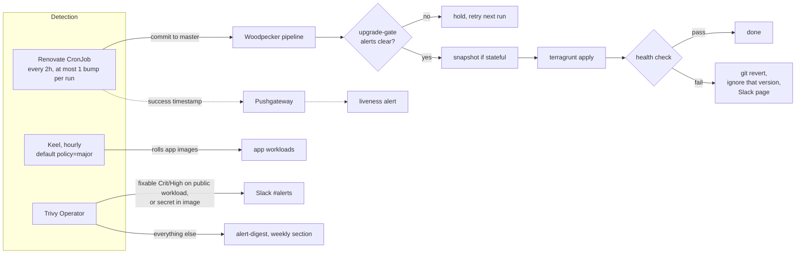

# Keeping the homelab current and CVE-aware

- Status: approved
- Date: 2026-10-09
- Decision record: ADR-0030 (Renovate lands version bumps straight to master, with CI rails and no agent)
- Origin: Muse flagged CVE-2026-88879 in Traefik on 2026-10-08. Traefik was on v3.7.1 while v3.7.14 existed. Viktor asked what our posture is against upgrades like this and wants the cluster always on the latest software.

## Goal

1. Every component moves to new upstream versions without someone having to notice first, including majors and cluster operators.
2. A fixable, high-severity CVE on an internet-reachable workload reaches Slack within a day, without depending on an outside tool noticing it.
3. If the upgrade automation itself stops running, we hear about it.

## What exists today (measured 2026-10-09)

| Layer | Mechanism | State |
|---|---|---|
| Node OS | unattended-upgrades + kured, gated by upgrade-gate alerts | Working |
| Kubernetes components | daily detection CronJob + phase Job chain | Working |
| App images | Keel, injected by the Kyverno `inject-keel-annotations` policy | 159 deployments `patch`, 63 `never`, 5 `minor`, 4 `major`, 4 `force` |
| Helm charts and Terraform image pins | none automatic | 28 `helm_release`; 21 pinned, 7 with no `version` at all |
| DIUN → n8n → service-upgrade agent | workflow active | Last agent upgrade commit 2026-04-19 (see below) |
| CVE scanning | none | |

The DIUN filter passes only `status=update` (same tag, new digest) and drops `new` (a new tag). Real version bumps arrive as `new`, so the upgrade agent has received digest re-pushes but no version bumps since April. `docs/architecture/automated-upgrades.md` describes the filter as intended.

The weekly "upgrade report" (`k8s-upgrade-nightly-report`) covers Kubernetes components only. The DIUN stack comment and `automated-upgrades.md` point readers at it as if it covered images.

### Drift on the Helm-managed layer

| Component | Running | Latest upstream | Reachable from the internet |
|---|---|---|---|
| Prometheus | v2.48.1 (Dec 2023) | v3.15.0 | yes, behind Authentik |
| Alertmanager | v0.26.0 | v0.34.1 | yes, behind Authentik |
| Vault | 1.18.1 | 2.1.2 | yes, Vault's own auth only |
| Nextcloud | 32.0.14 | 35.0.1 | yes, app login |
| Calico | 3.30.7 | 3.33.0 | |
| GPU operator | 25.10.1 | 26.7.1 | |
| External Secrets | 2.6.0 | 2.12.0 | |
| CNPG | 1.28.1 | 1.30.1 | |
| CrowdSec | 1.7.8 | 1.8.1 | |
| Woodpecker | 3.14.1 | 3.19.0 | yes, app login |
| Traefik, Authentik, Keel | current | | |

Vault 1.18.1 is missing roughly 25 Community-relevant CVE fixes, including CVE-2025-6000 (critical, audit-plugin RCE, fixed in 1.20.1). HashiCorp now ships Community patches only on the newest line, so every one of those fixes means moving to 2.1.2. The CVE list came from a research pass and has not been checked ID by ID against the HCSEC posts.

The 2026-04-20 infra audit (`docs/plans/2026-04-20-infra-audit-design.md`, finding F03) recommended Renovate as its first "do first" item.

## Design

### Ownership of versions

| What | Owner |
|---|---|
| `helm_release` chart versions (all 28, after pinning the 7 unpinned ones to their live versions) | Renovate |
| Image pins in `.tf` and Helm values for workloads Keel does not manage (`keel.sh/policy=never`, chart `tag` values) | Renovate |
| Live app image tags (Terraform has `ignore_changes`) | Keel |
| Base images and language dependencies in our own image repos that opt in with `renovate.json` (Forgejo and GitHub) | Renovate, gated by that repo's own CI |
| Node OS packages, Kubernetes components | unchanged (unattended-upgrades + kured, k8s version chain) |

### Phase 1: supervised Vault and Prometheus upgrades

These two go first because both are reachable from the internet and are one to three years behind. They are done by hand, one hop at a time, with the result checked after each.

**Vault 1.18.1 → 2.1.2**, stepping each line: 1.19.5 → 1.20.4 → 1.21.4 → 2.1.2. HashiCorp neither certifies nor forbids the direct skip, and Vault holds the secrets behind 138 ExternalSecrets, so each line gets its own hop.

- Before each hop: `vault operator raft snapshot save` to the existing NFS backup target, checked for size and readability.
- The `auto-unseal` sidecar (`stacks/vault/main.tf:216`) and the `vault-raft-backup` CronJob image (`:435`) are pinned separately and move with the chart.
- Skip 2.0.1 (IPC_LOCK regression).
- Already compatible: audit file mode `-rw-------` (CVE-2025-6000 unseal refusal does not apply), lowercase dot-free policy names, `file_path` set on the audit device, `disable_mlock` appended by the chart.
- To check before the 2.x hop: `audience` on the 6 Kubernetes auth roles, and duplicate-attribute HCL in policies (2.0.4+ fails to parse those).
- Verified after each hop: all 3 pods unsealed with one leader, ESO ClusterSecretStores `vault-kv` and `vault-database` Valid, an ExternalSecret refresh, a Woodpecker job that reads Vault, OIDC login, `homelab vault kv get`.
- Vault stays reachable at `vault.viktorbarzin.me` with its own auth (decided, see open questions).

**Prometheus v2.48.1 → v3.15**, in two hops:

1. Image to 2.55.1 on the current chart. 2.55 reads v3 TSDB blocks, so it is the rollback point.
2. Chart 25.8.2 → 29.36.1 (Prometheus v3.15, Alertmanager 0.34.1), in one commit with:
   - remove `--storage.tsdb.allow-overlapping-blocks` (removed in v3)
   - `--enable-feature=otlp-write-receiver` → `--web.enable-otlp-receiver`
   - `scrapeConfigs: null`, so chart 28+ default jobs don't duplicate our `serverFiles` jobs

Checked already: Alertmanager matchers are all new-style; `le`/`quantile` literals are unaffected by normalization; every dependent (kured, pvc-autoresizer, the k8s version chain, vpn-portal, `homelab metrics query`) uses the `prometheus-server` Service name, which the chart keeps. Not yet audited: the regex `.` now matching newline, rule by rule. Verified after: 26 weeks of history queryable, all 60 scrape jobs up, alert rules loaded, a test alert reaching Slack.

**Doc corrections** in the same phase: `docs/architecture/secrets.md` (backup target is NFS on the PVE host, not S3; Vault version), `docs/runbooks/restore-vault.md` (single-key unseal sidecar, not three-key manual), `docs/runbooks/vault-raft-leader-deadlock.md` (version), `docs/architecture/automated-upgrades.md` and the DIUN stack comment (what the weekly report covers).

### Phase 2: Trivy Operator

- New stack `stacks/trivy-operator`, chart pinned and owned by Renovate from day one.
- Scans: workload image vulnerabilities, exposed secrets in images, config audit (including RBAC), node and Kubernetes components.
- Cluster: 6 nodes, about 400 pods, 248 unique images. Scan-job concurrency capped at 3 so node1 (67% memory) and node5 (71%) aren't pushed over.
- Prerequisites:
  - Kyverno `require-trusted-registries` allows `mirror.gcr.io/aquasec/*` (the scanner image's default registry, to confirm against the chart).
  - A Kyverno PolicyException scoped to the node-collector, which needs host namespaces and privileges that `deny-host-namespaces`, `deny-privileged-containers` and `restrict-sys-admin` block.
  - Metrics service annotated with `prometheus.io/scrape`, and `trivy_.+` added to the `kubernetes-service-endpoints` keep allowlist (`prometheus_chart_values.tpl:858`). Without it every series is dropped.
- "Internet-reachable" means a namespace with an ingress whose `dns_type` is `proxied` or `non-proxied`. `ingress_factory` labels such ingresses so alert rules can join on namespace.
- Alerts to Slack `#alerts` (once per finding, existing `repeat_interval`):
  - fixable Critical or High CVE on an internet-reachable workload
  - a secret found in an image layer
- Everything else (non-public or unfixable CVEs, config audit, node findings) becomes a weekly section in the existing `alert-digest`: counts by severity, top fixable items, change since last week.
- No automatic trigger from a finding to an upgrade. Keel-owned apps pick up a fixed tag within an hour and Renovate-owned pins within 2 hours. The runbook documents how to start a Renovate run by hand.

### Phase 3: Renovate, Woodpecker rails, Keel to major

**Renovate**

- New stack `stacks/renovate`: `renovate/renovate` image as a CronJob every 2 hours, `platform: forgejo` (Forgejo 11.0.14; native since Renovate 41.41.0), plus a GitHub run for opted-in GitHub repos.
- A dedicated Forgejo bot account, allowed to push to master. Tokens in Vault via ESO. Kyverno allowlist gets the full `docker.io/renovate/*` form.
- Lands straight to master, no PRs (branch automerge with no required status checks). One commit per chart or pin.
- At most one bump lands per run. Woodpecker cancels a running pipeline when the next push arrives, so several commits in one run would cancel each other's health checks and reverts. About 20 components are behind today, plus stepped hops, so the backlog clears in about 3 days.
- `customManagers` regexes cover the pins Renovate's Terraform manager skips (`tag` inside Helm values maps, YAML/tpl values files).
- Grouped exceptions, where versions must move together: Vault chart + unseal sidecar + backup image.
- Stepping only where upstream requires it (`separateMultipleMajor`/`separateMultipleMinor` package rules): Vault, Authentik, CNPG, Calico. Everything else jumps straight to the newest version.
- Kill switch: a Terraform variable sets the CronJob `suspend: true`.
- Liveness: each successful run pushes a timestamp to Pushgateway. An alert fires if no run has succeeded for 8 hours.
- Commit messages say what changed and why (the upstream release-note summary), as for any other commit.

**Woodpecker rails** (only for commits authored by the Renovate bot, inside the existing pipeline):

1. Upgrade gate: the same opt-in blocking-alert allowlist used by kured and the k8s version chain. Blocked → the pipeline exits without applying, and the next Renovate run tries again.
2. Snapshot for stateful stacks: Vault raft snapshot, DB dump through the existing backup CronJobs, etcd snapshot for charts that change CRDs.
3. `terragrunt apply` for the touched stack.
4. Health check: rollout complete for the stack's workloads within 10 minutes, ingress HTTP check where one exists, no new firing alerts from the stack's namespaces during a 10-minute window.
5. On failure: `git revert` of the Renovate commit, with that exact version added to Renovate's ignore list in the same commit, and a Slack page naming the snapshot location. The next upstream release is tried automatically. No automatic data restore.

**Keel**

- The Kyverno-injected default moves from `policy: patch` to `policy: major` for every unfenced workload, in one change.
- Existing fences stay: Calico, gpu-operator (`never`), ESO, Kyverno (`patch`), and the excluded infrastructure namespaces. Those move through Renovate as chart bumps.

**DIUN retirement**

- Delete the n8n "DIUN Upgrade Agent" workflow and its backup JSON, remove DIUN's webhook notifier, and remove `.claude/agents/service-upgrade.md` and `.claude/reference/upgrade-config.json`.
- DIUN keeps only the Keel release watch until the Keel fork exit (keel-hq/keel#943 in a release), then goes too.
- `docs/architecture/automated-upgrades.md` is rewritten around Renovate, Keel and Trivy.

## Accepted risks

Viktor chose these knowingly during the design interview:

- Majors land unattended, including Calico, Vault, CNPG, the GPU operator and the other fenced operators. The rails can revert the commit but cannot undo a CRD or schema migration. Recovery from that is the snapshot, restored by hand.
- Keel on `major` will move Nextcloud from 32 straight to 35. Nextcloud's upgrader does not support skipping majors, so expect a manual repair, starting from the DB backup.
- The Keel default flips to `major` for all unfenced workloads at once, so many apps may upgrade within the first hour.
- Vault stays reachable from the internet with only its own auth.
- There is no versions-behind metric. A stalled pipeline is caught by the Renovate liveness alert, and silent drift on things Renovate doesn't own (Keel `never` workloads without a Terraform pin) is not tracked.

## Open questions

- The Vault CVE list needs checking against HashiCorp's HCSEC posts; some IDs from the research pass look malformed.
- Whether Renovate automerges exactly one branch per run on its own, or needs `branchConcurrentLimit: 1` plus a schedule guard to hold that to one. To confirm against current Renovate docs before building.
- Trivy's scanner image registry default, and the node-collector's exact privilege needs, to confirm against the chart version we pin.
- The Prometheus regex change (`.` matching newline) has not been audited across the 402 rules.
