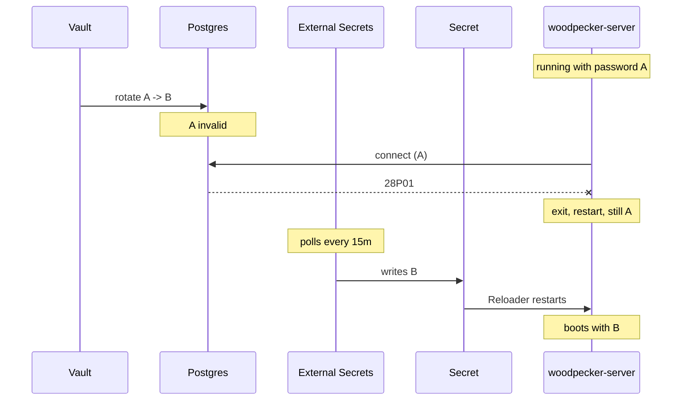

# Woodpecker CI down on a rotated Postgres credential

**Date of incident:** 2026-07-03, ~09:15 UTC
**Written:** 2026-09-02, from infra#45
**Severity:** SEV2 — all Woodpecker-driven deploys and infra applies unavailable
**Status of the class:** mitigated 2026-09-02; one verification outstanding

## What happened

`woodpecker-server-0` entered CrashLoopBackOff with
`pq: password authentication failed for user "woodpecker" (28P01)`, and both
agents error-looped with it. `ci.viktorbarzin.me` returned 503. GitHub Actions
builds were unaffected, being off-infra, but their deploy POSTs to Woodpecker
could not land.

The trigger was the weekly rotation of the `woodpecker` Postgres password by the
Vault database engine's static role `pg-woodpecker`.

## Why a rotation takes the service down

Three properties combine, and the outage length is the product of them rather
than a fault in any one:

1. Vault rotates the password in Postgres. The previous value stops working the
   instant it does.
2. `woodpecker-server` reads its datasource once, at boot, and exits when the
   store cannot be set up. It does not retry and it does not re-read.
3. The new value reaches the pod through an ExternalSecret, which **polls**
   Vault. `refreshInterval` was `15m`.

So between the rotation and the next poll, the pod holds a dead credential and
crash-loops. When the poll lands, Reloader sees the Secret change and restarts
the pod, which then boots healthy.

## What we got right, and what that rules out

The Reloader annotation pair was **already in place** before this incident:
`reloader.stakater.com/match` on the ExternalSecret target and
`reloader.stakater.com/search` on the workload, landed 2026-06-05 in
`b958935e`, a month earlier. It works — the live deployment carries a
`last-reloaded-from` annotation naming `woodpecker-db-creds` at
2026-08-28T09:20:30Z, one minute before the pod started.

So the reload half was never the problem, and adding it was not the fix. The
poll interval was the problem.

## The finding that made this worth writing

The failure never stopped. It stopped **sticking**, which is a different thing,
and it hid for two months.

Four consecutive windows, read from Loki:

| date | window | duration |
|---|---|---|
| 2026-08-07 | 09:17:07 → 09:21:48 | 4m 41s |
| 2026-08-14 | 09:16:00 → 09:23:12 | 7m 12s |
| 2026-08-21 | 09:15:57 → 09:23:09 | 7m 12s |
| 2026-08-28 | 09:15:57 → 09:19:57 | 4m 00s |

Every Friday, on the rotation clock (`rotation_period = 604800`). A pipeline
starting inside one of those windows fails.

It went unnoticed because `WoodpeckerDown` has `for: 15m`, which is longer than
the outage. That threshold is defensible for paging — a self-healing five-minute
blip should not wake anyone — but it means nothing recorded that the blip was
recurring. The signal existed in Loki and nobody had reason to look.

## What we changed

`pg-woodpecker` moves from `rotation_period = 604800` to
`rotation_schedule = "0 9 * * FRI"` with `rotation_window = 3600`, so the
rotation hour is known rather than drifting. A once-weekly CronJob in
`stacks/woodpecker` then force-syncs the ExternalSecret every 45s for 25
minutes inside that hour.

The alternative was dropping `refreshInterval` to `1m`, which would have cost
1,440 Vault reads a day to cover the one minute a week that matters. Push was
considered and is not available: External Secrets has no watch for the Vault
provider, and Vault 1.18.5 exposes no event stream covering database
static-role rotation. The only trigger is the `force-sync` annotation, so
something has to fire it, and pinning the schedule is what makes that possible.

`refreshInterval` deliberately stays at `15m`. The CronJob is an optimisation,
not a dependency — if it is suspended, broken, or drifts out of alignment, the
behaviour is exactly what it is today.

## What we do not know

Why 2026-07-03 **stuck** rather than self-healing in five minutes, as every
subsequent rotation has. The Reloader pair was already in place that day. The
day itself is outside Loki's 30-day retention and cannot be re-read.

One candidate, unverified: commit `e0db1054`, also dated 2026-07-03, added
`pg-tasks` to the postgresql connection's `allowed_roles`. Changing that list
is understood to rotate every static-role password out of band, which would
have produced a rotation the ExternalSecret was not expecting and possibly more
than one in quick succession. This is a hypothesis recorded so it is not lost,
not a conclusion.

## Fleet audit: the gap was much smaller than the count suggested

A previous note observed that 55 files under `stacks/` carry
`reloader.stakater.com/search` while only 35 carry `match`, and reasonably
asked whether ~20 services were exposed to the same class. Checked against live
state rather than filenames, they are not.

31 ExternalSecrets draw from a database store. 18 carry `match`. Of the 13
without it:

- **8 are reloading correctly anyway**, through a different Reloader mode, and
  we can see it: `affine`, `goldmane-edge-aggregator`, `health`, `monitoring`
  (`auto: true`), `nextcloud` (`secret.reloader.stakater.com/reload`),
  `phpipam`, `trading-bot`, `url` all carry a Reloader-written
  `last-reloaded-from` annotation with a recent timestamp.
- **3 have no rotating credential at all** — `hackmd`, `speedtest` and
  `realestate-crawler` have no `pg-*` static role, so nothing rotates for them
  to miss.
- **2 have a rotated role and no Reloader wiring**: `claude-memory` and
  `technitium`, both on a 7-day period. Neither has logged a single
  authentication failure in 30 days.

That last pair points at the general rule this incident actually teaches.
Postgres validates a password at **connection** time, so a rotation only bites
an application that opens a new connection afterwards **and** treats the
failure as fatal. `woodpecker-server` does both. An application holding a
pooled connection simply does not notice, and by the time it reconnects the
poll has usually landed.

So `match` is load-bearing for boot-read, fail-fast applications, not for
everything holding a rotated credential. The 55-vs-35 count was counting the
wrong thing, which is worth knowing before the next audit reaches for it.

## Outstanding

- The next scheduled rotation is Friday 2026-09-04, ~09:00 UTC. Whether the
  CronJob actually shortens the window is unverified until then. `rotation_window`
  permits Vault to rotate later than the cron minute, which is exactly why the
  Job sweeps 25 minutes rather than firing once.
- `claude-memory` and `technitium` are candidates for the `match` annotation on
  the reasoning above, but nothing observed argues for it yet.
