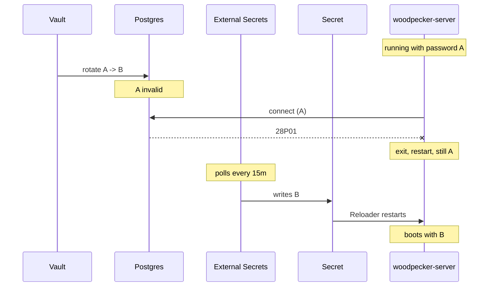

# Woodpecker CI down on a rotated Postgres credential

**Date of incident:** 2026-07-03, ~09:15 UTC
**Written:** 2026-09-02, from infra#45
**Severity:** SEV2 — all Woodpecker-driven deploys and infra applies unavailable
**Status of the class:** mitigated 2026-09-02; one verification outstanding.
A second case (`goodreads-sync`, 2026-09-21) turned out not to be covered by
the rule or the audit method below — see the follow-up at the end before
acting on either.

## What happened

`woodpecker-server-0` entered CrashLoopBackOff with
`pq: password authentication failed for user "woodpecker" (28P01)`, and both
agents error-looped with it. `ci.viktorbarzin.me` returned 503. GitHub Actions
builds were unaffected, being off-infra, but their deploy POSTs to Woodpecker
could not land.

The trigger was the weekly rotation of the `woodpecker` Postgres password by the
Vault database engine's static role `pg-woodpecker`.

## Why a rotation takes the service down

Three properties combine, and the outage length is the product of them rather
than a fault in any one:

1. Vault rotates the password in Postgres. The previous value stops working the
   instant it does.
2. `woodpecker-server` reads its datasource once, at boot, and exits when the
   store cannot be set up. It does not retry and it does not re-read.
3. The new value reaches the pod through an ExternalSecret, which **polls**
   Vault. `refreshInterval` was `15m`.

So between the rotation and the next poll, the pod holds a dead credential and
crash-loops. When the poll lands, Reloader sees the Secret change and restarts
the pod, which then boots healthy.

## What we got right, and what that rules out

The Reloader annotation pair was **already in place** before this incident:
`reloader.stakater.com/match` on the ExternalSecret target and
`reloader.stakater.com/search` on the workload, landed 2026-06-05 in
`b958935e`, a month earlier. It works — the live deployment carries a
`last-reloaded-from` annotation naming `woodpecker-db-creds` at
2026-08-28T09:20:30Z, one minute before the pod started.

So the reload half was never the problem, and adding it was not the fix. The
poll interval was the problem.

## The finding that made this worth writing

The failure never stopped. It stopped **sticking**, which is a different thing,
and it hid for two months.

Four consecutive windows, read from Loki:

| date | window | duration |
|---|---|---|
| 2026-08-07 | 09:17:07 → 09:21:48 | 4m 41s |
| 2026-08-14 | 09:16:00 → 09:23:12 | 7m 12s |
| 2026-08-21 | 09:15:57 → 09:23:09 | 7m 12s |
| 2026-08-28 | 09:15:57 → 09:19:57 | 4m 00s |

Every Friday, on the rotation clock (`rotation_period = 604800`). A pipeline
starting inside one of those windows fails.

It went unnoticed because `WoodpeckerDown` has `for: 15m`, which is longer than
the outage. That threshold is defensible for paging — a self-healing five-minute
blip should not wake anyone — but it means nothing recorded that the blip was
recurring. The signal existed in Loki and nobody had reason to look.

## What we changed

`pg-woodpecker` moves from `rotation_period = 604800` to
`rotation_schedule = "0 9 * * FRI"` with `rotation_window = 3600`, so the
rotation hour is known rather than drifting. A once-weekly CronJob in
`stacks/woodpecker` then force-syncs the ExternalSecret every 45s for 25
minutes inside that hour.

The alternative was dropping `refreshInterval` to `1m`, which would have cost
1,440 Vault reads a day to cover the one minute a week that matters. Push was
considered and is not available: External Secrets has no watch for the Vault
provider, and Vault 1.18.5 exposes no event stream covering database
static-role rotation. The only trigger is the `force-sync` annotation, so
something has to fire it, and pinning the schedule is what makes that possible.

`refreshInterval` deliberately stays at `15m`. The CronJob is an optimisation,
not a dependency — if it is suspended, broken, or drifts out of alignment, the
behaviour is exactly what it is today.

## What we do not know

Why 2026-07-03 **stuck** rather than self-healing in five minutes, as every
subsequent rotation has. The Reloader pair was already in place that day. The
day itself is outside Loki's 30-day retention and cannot be re-read.

One candidate, unverified: commit `e0db1054`, also dated 2026-07-03, added
`pg-tasks` to the postgresql connection's `allowed_roles`. Changing that list
is understood to rotate every static-role password out of band, which would
have produced a rotation the ExternalSecret was not expecting and possibly more
than one in quick succession. This is a hypothesis recorded so it is not lost,
not a conclusion.

## Fleet audit: the gap was much smaller than the count suggested

A previous note observed that 55 files under `stacks/` carry
`reloader.stakater.com/search` while only 35 carry `match`, and reasonably
asked whether ~20 services were exposed to the same class. Checked against live
state rather than filenames, they are not.

31 ExternalSecrets draw from a database store. 18 carry `match`. Of the 13
without it:

- **8 are reloading correctly anyway**, through a different Reloader mode, and
  we can see it: `affine`, `goldmane-edge-aggregator`, `health`, `monitoring`
  (`auto: true`), `nextcloud` (`secret.reloader.stakater.com/reload`),
  `phpipam`, `trading-bot`, `url` all carry a Reloader-written
  `last-reloaded-from` annotation with a recent timestamp.
- **3 have no rotating credential at all** — `hackmd`, `speedtest` and
  `realestate-crawler` have no `pg-*` static role, so nothing rotates for them
  to miss.
- **2 have a rotated role and no Reloader wiring**: `claude-memory` and
  `technitium`, both on a 7-day period. Neither has logged a single
  authentication failure in 30 days.

That last pair points at the general rule this incident actually teaches.
Postgres validates a password at **connection** time, so a rotation only bites
an application that opens a new connection afterwards **and** treats the
failure as fatal. `woodpecker-server` does both. An application holding a
pooled connection simply does not notice, and by the time it reconnects the
poll has usually landed.

So `match` is load-bearing for boot-read, fail-fast applications, not for
everything holding a rotated credential. The 55-vs-35 count was counting the
wrong thing, which is worth knowing before the next audit reaches for it.

## Outstanding

- The next scheduled rotation is Friday 2026-09-04, ~09:00 UTC. Whether the
  CronJob actually shortens the window is unverified until then. `rotation_window`
  permits Vault to rotate later than the cron minute, which is exactly why the
  Job sweeps 25 minutes rather than firing once.
- `claude-memory` and `technitium` are candidates for the `match` annotation on
  the reasoning above, but nothing observed argues for it yet.

## Follow-up, 2026-09-21: the general rule above needs one correction

`goodreads-sync` in the `ebooks` namespace failed the same way this class
describes, and it is a case the rule at the end of the fleet audit does not
cover. Recording it here because that rule is the part of this document a
future audit is most likely to act on.

What happened: Vault rotated `pg-goodreads-sync` on 2026-09-20 at 11:56 UTC.
Nothing happened for fourteen hours. The CNPG switchover at 02:31 on 09-21
moved the primary from `pg-cluster-2` to `pg-cluster-4` and closed the
poller's connection, the reconnect at 02:43 used the password the pod had
booted with, and every poll cycle after it failed with `password
authentication failed for user "goodreads_sync"`.

### Where the rule needs adjusting

The fleet audit concludes that an application holding a pooled connection
"simply does not notice, and by the time it reconnects the poll has usually
landed". The first half held here — the poller genuinely did not notice for
fourteen hours. The second half is where the case diverges. The poll had
landed nine hours before the reconnect, and the reconnect failed anyway,
because `backend/goodreads/store.py` receives its DSN through `envFrom` and
environment variables are fixed for the life of a process. The Secret being
correct does not help a process that will never read it again.

So the poll landing is what matters for an application that re-reads its
credential per connection, and a **restart** is what matters for one that
reads it once into memory. For the second kind, `match` on the Secret without
`search` or `auto` on the workload leaves the rotation unhandled no matter how
current the Secret is.

Restating the rule to cover both kinds:

| how the app gets its password | what a rotation needs |
|---|---|
| re-read per connection (or a real pooled re-auth) | the ESO poll to land |
| read once at boot, fail fast | the poll, then a restart, promptly |
| read once at boot, long-lived connection | a restart — the timing is set by whatever eventually drops the connection |

The third row is the one this incident adds. It is the least visible of the
three, because the gap between cause and symptom can be arbitrarily long and
the event that finally exposes it is unrelated to credentials.

### Where the audit method needs adjusting

`goodreads-sync` was inside the "18 carry `match`" group and so was not looked
at again. Carrying `match` on the Secret is only half the pairing: Reloader
also needs `search` or `auto` on the workload, and that deployment had
neither. An audit that checks the Secret side alone will keep passing a
workload that cannot be reloaded.

Two further things a re-audit should account for, both of which produced wrong
answers during this one:

- Reloader accepts its opt-in on **either** `metadata.annotations` or
  `spec.template.metadata.annotations`, and both are in use here. A first
  sweep read only the top level and reported `monitoring/grafana` and
  `woodpecker/woodpecker-server` as exposed; both opt in on the pod template
  and both carry `last-reloaded-from` showing Reloader reloading them. Counted
  across the cluster on 2026-09-21: 82 workloads opt in at the top level (28
  of them stamped) and 5 on the pod template (2 stamped), so top-level is the
  usual placement and the pod-template one is easy to miss.
- `last-reloaded-from` is good positive evidence, but its absence proves
  nothing, because Terraform strips the stamp on the next apply of a workload
  whose annotations it manages.

Checked both sides on 2026-09-21 — every workload referencing a
`match`-annotated Secret, against both annotation locations — `goodreads-sync`
was the only genuinely exposed one. Of the pair left open above, `claude-memory`
has since been wired (`reloader.stakater.com/auto` at the top level, with a
`last-reloaded-from` stamp naming `claude-memory-db-creds`), so only
`technitium` still has a rotated role and no Reloader wiring, and it has still
logged no authentication failure.

### What changed

`reloader.stakater.com/search = "true"` on
`kubernetes_deployment.goodreads_sync` in `stacks/ebooks/main.tf`, pairing with
the `match` the Secret already carried (`7ee64ddd`, comment corrected in
`cdd7cb63`).

Verified rather than assumed, by forcing a rotation and watching the whole
chain run unattended:

| time (UTC) | event |
|---|---|
| 09:08:27 | `vault write -f database/rotate-role/pg-goodreads-sync` |
| 09:22:28 | Reloader: `Changes detected in 'goodreads-sync-db-creds' of type 'SECRET' in namespace 'ebooks'; updated 'goodreads-sync' of type 'Deployment'` |
| 09:23:02 | replacement pod up, authenticated, new session in `pg_stat_activity` |
| 09:23:07 | previous pod gone |

14m35s from rotation to healed, with no authentication failure logged, and the
deployment now carries a `last-reloaded-from` stamp naming
`goodreads-sync-db-creds`.

That window is set by the `vault-database` `refreshInterval` of 15m, the same
one this incident's CronJob was built to shorten for Woodpecker. The poller is
deliberately left on the plain interval: it polls a feed every 120s and a book
shelved during the gap is picked up on the next cycle, so the downtime costs
nothing a user would see. A per-stack force-sync CronJob here would add moving
parts to save time that does not matter.
