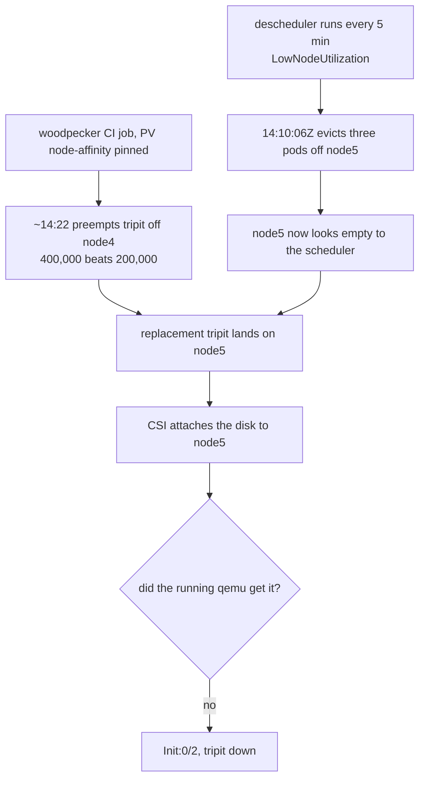

# tripit down twice in 70 minutes on a half-attached CSI disk

**Date of incident:** 2026-07-04, from ~14:22 UTC
**Written:** 2026-09-02, from infra#46
**Severity:** SEV2 — tripit.viktorbarzin.me unreachable
**Status:** recovered the same day; recovery now documented, prevention deliberately not taken on

## What happened

`tripit` was evicted from `k8s-node4`, rescheduled onto `k8s-node5`, and could
not start: the pod sat in `Init:0/2` because its RWO disk
(`tripit-personal-documents`, a 2 GiB `proxmox-lvm-encrypted` volume holding
identity documents) never appeared inside node5's guest kernel. Recovered by
hand, then it happened again within the same 70 minutes.

## The chain, which is the useful part

No single component failed. Four ordinary behaviours composed into an outage.

1. The **descheduler** (`ns descheduler`, every 5 minutes, LowNodeUtilization)
   evicted `woodpecker-agent-1`, `tasks` and `bot-block-proxy` off node5 at
   14:10:06Z, which made node5 the attractive target for anything scheduled
   next.
2. A **woodpecker CI job** pod, pinned by PV node-affinity, **preempted** tripit
   off node4 at ~14:22. This was correct: woodpecker is `tier-3-edge` (400,000),
   tripit is `tier-4-aux` (200,000).
3. The replacement tripit pod **landed on node5**, which was then carrying 22
   CSI disks — inside check 47's 20–24 warning band and near the ~28-LUN
   ceiling.
4. The attach **half-failed**. `qm set` wrote `scsi14` into VM 205's config and
   the LV existed, but the live qemu process never received the `device_add`.
   Kubernetes recorded `SuccessfulAttachVolume` and `attached=true` regardless,
   so every signal except the kubelet mount error said the disk was fine.

## Recovery

Getting the workload onto a different node. What does **not** work is deleting
and recreating the VolumeAttachment, which re-runs the same `qm set` against the
same wedged VM and fires another `SuccessfulAttachVolume`. The wedge belongs to
the VM, not the disk, and the VM stays wedged until it reboots — node5 was
finally cleared on 2026-07-13 by a kured reboot.

Full symptom, diagnosis and recovery are now in
[`runbooks/proxmox-csi-wedged-attach.md`](../runbooks/proxmox-csi-wedged-attach.md).
That document is the main deliverable of this write-up: the knowledge existed
only in memory entries, which nobody can consult during an incident.

## What we chose not to do, and why

Every precondition still holds. tripit is still a single-replica RWO app at
`tier-4-aux`, so anything at `tier-3-edge` or above can still preempt it, and
each preemption is a fresh draw on which node it lands.

The obvious prevention was a priority floor for single-replica RWO workloads —
preempting one is structurally more expensive than preempting a stateless pod,
since it forces a detach and reattach. The arithmetic argued against it. Only
priorities of 400,000 and above can preempt tripit, so a floor has to sit above
`tier-3-edge` to do anything at all. 51 namespaces hold an RWO Proxmox PVC and
32 of them are `tier-4-aux`, so the rule would lift `n8n`, `servarr`, `trek` and
29 others above the mail server, Nextcloud and Forgejo. That inverts the tier
ladder rather than adding a floor to it.

Narrower options were available and also declined for now: raising tripit's tier
alone (a patch for one app while roundcubemail and 49 others stay exposed), a
placement rule steering RWO pods away from LUN-heavy nodes, and extending
`csi-ghost-reconcile` to remediate wedges rather than only ghosts. The last is
the most durable and the most dangerous, since it means automatically detaching
disks.

The decision was to document the recovery and accept the risk, on this evidence:

| | |
|---|---|
| occurrences since 2026-07-13 | none |
| attach failures cluster-wide, last 30 days | none |
| busiest node's LUN count | 19, against a 20–24 warning band |
| recovery time when recognised | ~20–90 seconds |

## What would change that decision

Another occurrence, or a node climbing back into the warning band. The counts
are one command, in the runbook. If `csi-ghost-reconcile` is ever extended to
remediate wedges, none of the per-application options matter any more, which is
why that remains the preferred long-term fix rather than a priority change.

## Related

`#45` is the other 2026-07 SEV2 carrying `postmortem-required`, unrelated in
cause. Bead `code-oflt` tracks moving critical VM disks off the shared HDD,
which is the same node-loading problem seen from the IO side.
