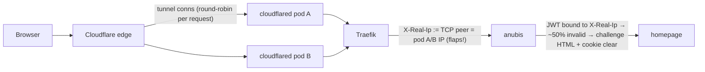

# 2026-07-14 — Anubis-fronted sites served blank pages (X-Real-Ip cookie flap)

**Status:** resolved (fix: `traefik-drop-x-real-ip` middleware on all Anubis-fronted ingresses)
**Severity:** SEV2 — home.viktorbarzin.me (the user-facing service directory) and, in principle, all 7 Anubis-fronted public sites broken for externally-routed (Cloudflare) users for ~2 days. Internal/VPN users unaffected. No data loss.
**Detected by:** user report ("home.viktorbarzin.me shows an empty page"). Monitoring was blind — see Lessons.

## Impact

- External users of `home.viktorbarzin.me` got the HTML shell + a random ~half of the
  JS/CSS assets; the app entry chunks (`main-*.js`, `index-*.js`, `custom.css`) received
  Anubis challenge HTML instead → the SPA never hydrated → blank/empty page.
- Every failed validation also **cleared** the user's `techaro.lol-anubis-auth` cookie, so
  the state never self-healed. All Anubis-fronted sites (blog, kms, f1, cc, json, home,
  wrongmove UI) shared the failure mode for CF-routed traffic.
- Anubis metrics over the ~3 days: ~900 challenges issued, **1** validated.

## Root cause — three interacting layers

1. **Anubis (v1.25.0) binds auth-cookie validity to the derived client IP** — the
   `X-Real-Ip` header when present, else the first public `X-Forwarded-For` entry after
   private-hop stripping (`XFF_STRIP_PRIVATE=true`; the derived value is what the stored
   challenge record's `{User-Agent, X-Real-Ip}` metadata carries). Characterized by
   controlled A/B against the live pods: a valid cookie passes with the original client
   IP and re-challenges when ONLY the IP changes (both via the X-Real-Ip header and via
   XFF with no X-Real-Ip at all); a UA change does NOT invalidate — the binding is
   IP-only. Note: an adversarial source-review disputed that the JWT claims embed an IP
   (they don't — claims are `{challenge, method, policyRule, action}`); the binding is
   enforced behaviorally regardless (likely via the challenge-record path), and the
   empirical A/B is the load-bearing evidence.
2. **Traefik stamps `X-Real-Ip` with its immediate TCP peer** when the header is absent —
   and cloudflared doesn't send it. So for CF-tunneled traffic, X-Real-Ip = a cloudflared
   **pod IP**, not the client.
3. **Cloudflare edge round-robins requests across tunnel connections** of multiple
   cloudflared replicas (3 deployed; the two holding SOF-PoP connections observed). One
   page-load's asset requests alternate between pod IPs (verified live: 4 consecutive
   probes = `.214, .253, .214, .253`).

JWT minted under pod A's IP → every request routed via pod B fails validation →
challenge HTML to subresources (which silently fail; challenge JS can only run on
document navigations) + auth cookie cleared.

## Why it broke on ~2026-07-12 and not before

The defect was **latent since Anubis went live (2026-05-10)** — cloudflared has run 3
replicas since March. It didn't bite because a given user's requests happened to ride a
single tunnel connection → single cloudflared pod → stable X-Real-Ip (verified: a
2026-07-11 17:02 session solved one challenge and everything flowed via one pod IP).
The cloudflared config rollouts on 2026-07-12/13 (ADR-0020/0021 work — outage-failover
Worker, wildcard DNS) restarted the pods and reshuffled tunnel-connection→edge-PoP
distribution; after that, two pods both held connections to the client-nearest PoP and
requests interleaved. Nothing about the homepage stack itself changed — the affinity
luck ran out.

Explicitly ruled out during diagnosis: signing-key split-brain (Vault `anubis_ed25519_key`
identical across all KV versions since v59; JWT validated on both pods), shared-store
failure (challenge records present in Redis DB 9 with correct TTL; the one observed
`store: key not found` was a malformed hand-rolled test missing the `id` param),
CSP/rate-limit/x402 middlewares, the CF-Worker header, gethomepage's
`HOMEPAGE_ALLOWED_HOSTS`, and the scale-to-zero rollout.

## Fix

`traefik-drop-x-real-ip` Middleware (headers.customRequestHeaders `X-Real-Ip: ""` =
delete) + `strip_x_real_ip = true` in `ingress_factory`, set on all 7 Anubis-fronted
stacks. With the header absent, Anubis derives the client from `X-Forwarded-For` with
private hops stripped = the **real, stable** client IP. The exact post-fix state was
verified end-to-end against the live pods before rollout: with no X-Real-Ip header and
only a public XFF, the full challenge → solve → pass → proxied-request flow works (no
500s — cloudflared/Traefik always supply XFF), the challenge binds the XFF-derived
client, and the same cookie keeps passing across repeated requests. Cost: each existing
user re-solves one instant (difficulty-2) challenge as their cookie re-binds; users
whose public IP genuinely changes (mobile roaming) re-solve silently too — upstream's
intended semantics.

Not chosen: cloudflared → 1 replica (loses tunnel HA), a Traefik real-ip rewrite plugin
(bigger surface; the vendored-plugin pattern exists but a builtin middleware suffices),
Anubis version bump (validation semantics unverified).

## Lessons / follow-ups

- **Monitoring was structurally blind**: Uptime-Kuma probes the ingress and received the
  Anubis challenge page — HTTP 200, monitor green — for the entire outage. The Anubis
  metrics (`anubis_challenges_issued` vs `anubis_challenges_validated`,
  `anubis_proxied_requests_total`) are exported on `:9090` but not scraped.
  **Action (open):** scrape Anubis metrics + alert on a sustained
  validated/issued ratio ≈ 0 while issued > baseline; consider a keyword monitor
  asserting real page content (e.g. `id="anubis_challenge"` absence) on one
  Anubis-fronted site.
- **X-Real-Ip is untrustworthy platform-wide for CF-tunneled traffic** (it's a cloudflared
  pod IP). Anything keying on it — logs, per-IP logic — should use XFF/CF-Connecting-IP
  instead. The global Traefik rate-limiter keys on RemoteAddr (also the tunnel pod for CF
  traffic), which collapses all external users into ~3 buckets; pre-existing, not fixed
  here.
- **Proxy-hop identity + identity-bound tokens don't mix**: any auth layer that
  fingerprints "the client IP" must be fed the real client IP end-to-end, or the binding
  breaks the moment a hop scales past 1 replica. The failure needed a pod restart to
  detonate, days after the enabling conditions landed.
