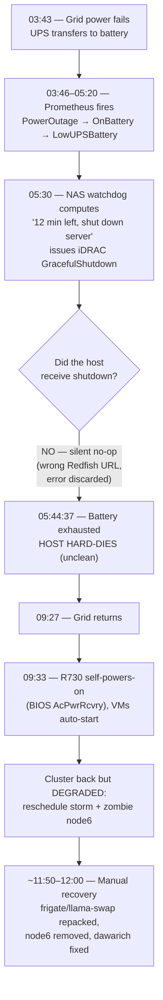

# 2026-07-18 — Sofia power outage → unclean cluster shutdown

- **Status:** resolved (cluster recovered); prevention items open (see §8)
- **Severity:** SEV-1 (full homelab outage — the single PVE host powers the entire stack)
- **Duration:** hard-down ~**3h49m** (03:43→09:33 EEST) + degraded recovery tail ~**2.5h**
- **Author:** Claude (opus-4.8), during live incident response with Viktor
- **Related:** design `docs/plans/2026-07-18-graceful-shutdown-on-power-loss.md`; beads `code-xgcg`, `code-j3tx`, `code-2xix`, `code-9d5p`, `code-avx0`, `code-tt6c`

All times **EEST (UTC+3), Sofia local**. Note the **iDRAC BMC clock is skewed +3h** vs wall-clock — its SEL timestamps were corrected throughout.

---

## 1. Impact

The Sofia homelab runs on a **single Dell R730 Proxmox host** (`192.168.1.127`) that hosts *everything*: all 7 k8s node VMs, pfSense (VM 101), Home Assistant (VM 103), and the devvm. A site power loss therefore takes down the **entire stack at once** — firewall, DNS, cluster, and every public service (the Cloudflare tunnel pods go with it).

| Window (EEST) | State | Impact |
|---|---|---|
| 03:43 → 09:33 | **Hard down** (~3h49m) | Total outage: all internal + public services, network, DNS, HA. |
| 09:33 → ~12:00 | **Degraded** (~2.5h) | Cluster booted but: `frigate` (NVR/cameras) + `llama-swap` (LLM inference) stuck **Pending**; `dawarich` down; `node6` CSI crashlooping; `nvidia-exporter` down. |
| ongoing | **Partial** | `rpi-sofia` (solar + camera feed monitor) still offline — needs physical intervention. |

**No data loss or corruption** despite the unclean shutdown: CNPG, etcd, and MySQL recovered clean; Immich smart-search verified healthy post-recovery. The async-NFS + UPS + block-storage-on-LVM design tolerated the hard cut as intended.

---

## 2. Timeline

| Time (EEST) | Event |
|---|---|
| ~03:43 | Mains fails. UPS (Huawei UPS2000) transfers to battery. |
| 03:46 | Prometheus `PowerOutage` fires. |
| 03:50 | NAS watchdog: "on battery, 90 min remaining — not shutting down yet." |
| ~04:13 | Prometheus `OnBattery` fires. |
| ~05:20 | Prometheus `LowUPSBattery` fires. |
| **05:30** | NAS watchdog: **"12 min remaining — turning off server. GracefulShutdown!"** → iDRAC reset issued **but ineffective** (see §3). |
| 05:40 | Watchdog fires again ("2 min") — still no effect. |
| **05:44:37** | Host + NAS lose power (battery exhausted). **Unclean hard death.** UPS held ~2h01m. |
| ~09:27 | Grid returns. |
| **09:33:49** | R730 self-powers-on (BIOS AC-recovery). VMs auto-start (`onboot=1`). |
| ~09:40+ | Cluster reconverges — but degraded (§4). |
| ~11:50–12:00 | Manual incident response: services recovered, node6 decommissioned. |

---

## 3. Root cause (primary + amplifier)

**Primary trigger:** a **grid power outage** at the Sofia site (~3h) — longer than the UPS runtime (~2h). External, not preventable in software.

**Critical amplifier — the outage should have been survived cleanly, and wasn't.** There *is* a low-battery graceful-shutdown watchdog (a Go binary `powercheck-armv8` on the Synology NAS, run every 10 min). It **correctly detected the outage and fired on schedule** at 05:30, 14 min before the battery died. But the shutdown was a **silent no-op**:

- `scripts/server_safe_poweroff/idrac_utils.go:99` POSTs the iDRAC Redfish reset to the **bare host URL `https://192.168.1.4`** instead of the action endpoint `…/redfish/v1/Systems/System.Embedded.1/Actions/ComputerSystem.Reset` (the correct URL is even built on line 27 for the GET, but not reused for the POST).
- `main.go:74` calls `performGracefulShutdown()` and **discards the error return** → the failure was invisible.

So the watchdog "fired" into the void — a path that has **essentially never worked** and had **zero observability**. Prior outages were brief flickers that never crossed the shutdown threshold, so the latent bug never surfaced. This turned a survivable ~3h outage into an **unclean hard crash**.

> Corrected during response: two early assumptions were wrong — NUT *is* installed on the PVE host (but dead: no `MONITOR` line, serial driver can't find `/dev/ttyUSB0`) and was a red herring; and the shutdown script exists on the NAS (not "missing"/"on the master"). Both corrected with live evidence.

---

## 4. The degraded cascade after auto-boot

The cluster came back but four things needed manual repair, all reschedule-storm fallout:

1. **`frigate` + `llama-swap` stuck Pending (~3h).** Both have hard affinity to the GPU node (`k8s-node1`). During the post-boot reschedule storm, **non-GPU workloads (incl. `immich-postgresql`, a CNPG replica) packed node1's memory *requests* to 97%**, leaving no room for the GPU pods. Root cause: node1's GPU taint is only `PreferNoSchedule` (soft), and `immich-worker` requests an oversized 7Gi. → **`code-j3tx`**.
2. **`node6` (VMID 206) zombie-rejoined.** node6 was *deliberately decommissioned 2026-07-01* (Node object deleted; VM left **stopped but not destroyed, with `onboot=1`**). The reboot auto-started it and it re-registered with **stale kubelet config — no `providerID`, no topology labels** → `proxmox-csi` crashloop + a brief NotReady flap (tigera hot-loop risk). This was the exact residual risk flagged at decommission time. → **`code-2xix`** (fixed this session: drained, deleted, VM destroyed).
3. **`dawarich` sidekiq crashed** — started before redis was ready and hard-failed with no retry, then wedged. → **`code-avx0`**.
4. **`nvidia-exporter` crashloop** — the standalone dcgm-exporter conflicts with the GPU-operator's own over DCGM's exclusive profiling module; the reboot changed init order. Monitoring-only. → **`code-9d5p`**.

Plus `rpi-sofia` did not return (§6), and `phpipam-dns-sync` logged Technitium login failures (→ `code-tt6c`).

---

## 5. Detection — what worked, what didn't

- **Worked:** Prometheus fired `PowerOutage`, `OnBattery`, and `LowUPSBattery` on schedule. Detection was never the problem.
- **Failed:** the shutdown **actuation** had no observability — a broken safety mechanism that silently failed for (likely) its entire existence. There was no "shutdown triggered but host still up" alert, no watchdog heartbeat metric.

---

## 6. rpi-sofia — still down (needs a human in Sofia)

`rpi-sofia` (the Pi carrying the solar/inverter feed + Frigate camera feeds) is **completely off the network** — 100% packet loss and `<incomplete>` ARP on *both* its interfaces (`.10` and `.16`), SSH closed. This is **worse than its 2026-06-16 outage** (where it was alive-but-routeless and remotely recoverable via a net-watchdog). Being L2-invisible means it is either **still unpowered** (plausibly it sits on the solar/inverter circuit that drained to ~1% and hasn't recovered) or suffered **SD-card/boot failure from the unclean power cut**. **Not remotely recoverable** — requires a physical power-cycle / SD check in Sofia. Its absence is also why HA's inverter/battery readings are stale (that "battery 1%" alert reads off this Pi).

---

## 7. Recovery actions taken (all transient / reversible)

- Freed node1 by cordoning it + evicting stateless squatters, then re-triggering the Pending GPU pods → `frigate`/`llama-swap` back 1/1.
- Restarted `dawarich` (redis reachable again) → 2/2.
- Labeled node6 to quiet CSI, then **decommissioned it properly** (drain → `kubectl delete node` → `qm destroy 206`).
- Swept leftover Failed CronJob pods.
- **Verified power stable before continuing:** UPS at 82%, `BatteryStatus=normal`, ~5.5h estimated runtime, on mains; grid steady on R730 PSU (230/236V) + ATS (236/237V); no new AC-loss.

---

## 8. Prevention plan

| # | Action | Owner item | Priority |
|---|---|---|---|
| 1 | **Fix graceful shutdown** — move the decision+action onto the PVE host (systemd, proven SNMP OIDs, explicit `qm shutdown`→`qm stop`→`poweroff`), add a watchdog-heartbeat metric + a "shutdown-triggered-but-host-up" alert so this can never silently fail again. Design published. | `code-xgcg` | **P1** |
| 2 | **Harden GPU-node scheduling** — taint `k8s-node1` `NoSchedule` with explicit tolerations for real GPU tenants (or anti-affinity keeping DBs off it); right-size `immich-worker`. Stops the frigate/llama-swap Pending recurrence on every reboot. | `code-j3tx` | **P1** |
| 3 | **node6 destroyed** — VM 206 removed so it can't zombie-rejoin. (Done this session.) | `code-2xix` | done |
| 4 | Verify the **UPS runtime discrepancy** — host died after ~2h but UPS now estimates ~5.5h; confirm which battery system actually feeds the R730 and the true runtime under full load. | `code-xgcg` | P1 |
| 5 | Harden `dawarich` redis startup dep; fix `phpipam`↔Technitium auth. (`nvidia-exporter` dcgm conflict — **DONE 2026-07-18**: consolidated into the GPU-operator's own exporter, `code-9d5p` closed.) | `code-avx0`, `code-tt6c` | P2 |
| 6 | **Backup-MX drain auto-recovery** — the pfSense WireGuard *package* regenerates `tun_wg0.conf` on boot, wiping the hand-added mx2 peer, so the outage reboot broke the drain (~16 emails deferred on mx2, not lost). **DONE 2026-07-18**: re-added the peer + drained the queue, and installed a boot-recovery `shellcmd` (baked into the reproducer script) that re-adds mx2 after the WG package sync on every boot. | `docs/runbooks/backup-mx.md` | done |
| 6 | **rpi-sofia resilience** — after the physical fix, address its power source (should it be on UPS/grid, not the drainable inverter circuit?) and boot reliability (read-only SD / watchdog). Recurring (see 2026-06-16). | new | P2 |

**The single highest-leverage fix is #1**: with a working graceful shutdown, a future ~3h outage ends in a *clean* shutdown well inside the ~2h battery window, and auto-recovery on grid return stays clean — turning a SEV-1 into a non-event.

---

## 9. Lessons

- **A safety mechanism with no observability is not a safety mechanism.** The shutdown path silently failed for its entire life; a heartbeat/actuation alert would have surfaced it long ago.
- **Single-host homelab = every power event is SEV-1.** There is no HA; the mitigation is a *reliable* graceful shutdown + fast clean auto-recovery, not redundancy.
- **Decommission means destroy.** A stopped-but-present VM with `onboot=1` is a landmine that re-arms on every host reboot.
- **`PreferNoSchedule` is too soft for a GPU node** — under memory pressure the scheduler packs it with non-GPU load and starves the pods that actually need it.
