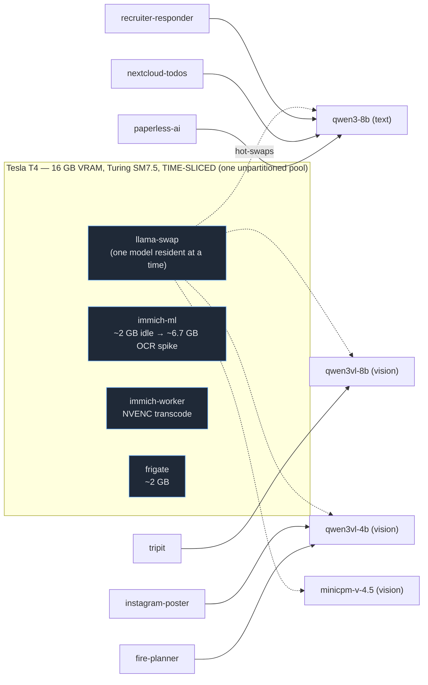
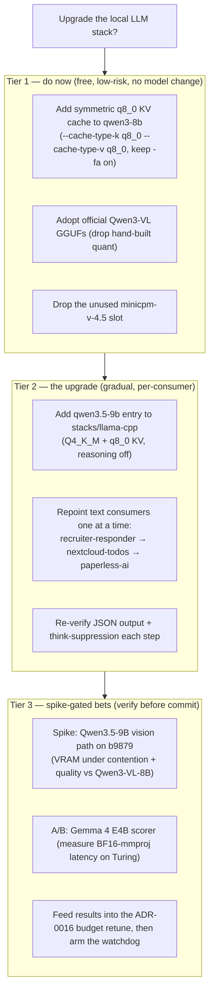

# Local LLM stack — state of the art & upgrade options (mid-2026)

**Status:** DONE 2026-07-16 — Viktor chose "Tier 1 + text upgrade", then "try Gemma 4". On-card verification REJECTED all THREE text-model upgrades (q8_0 KV, qwen3.5-9b, gemma-4) on our Turing T4; only the minicpm-v-4.5 cleanup stuck. qwen3-8b (33 tok/s) stays. **Read §0.1 first — it supersedes the optimistic claims below.**
**Date:** 2026-07-16
**Owner:** Viktor (decision) / Claude (research + synthesis)
**Scope:** the `llama-cpp` stack (`llama-swap` + `llama.cpp`) on the shared Tesla T4 — serving layer, the text model, and the vision models — and whether any of them can be usefully upgraded **on the hardware we already have**.
**Related:** `docs/architecture/llama-cpp.md`, `docs/adr/0016-gpu-vram-extended-resource-budget.md`, `docs/benchmarks/2026-05-10-vision-llm.md`, memories #6499 #7049 #7050 #7997 #9787.

---

## 0. TL;DR — the answer

**Yes, there is a worthwhile upgrade — but a modest one, and the biggest lever is efficiency, not a bigger model.** The single shared T4 is the binding constraint, not model availability.

Three findings, one per layer:

1. **Serving layer is already right and correctly configured.** No change needed. One *free, low-risk* win is available today: **symmetric `q8_0` KV-cache quantization** on the text model → frees ~1 GiB **or** buys ~32k context at today's footprint. (The popular "T4 can't do Flash Attention" claim is false — busted below.)
2. **Text slot — a real drop-in upgrade exists.** `qwen3-8b` is a generation behind; **Qwen3.5-9B** (Mar 2026, Apache-2.0, dense, llama.cpp-supported) is the natural successor. Slightly bigger, so the `q8_0` KV win is what makes it fit comfortably.
3. **Vision slot — keep what we have.** `Qwen3-VL-4B/8B` are *still* the current best small VLMs (and now have official GGUFs). Nothing cleanly beats them on the axis that matters to us (runs-on-llama.cpp × quality). Only cleanup: retire the weak `MiniCPM-V-4.5`; optionally A/B-test `Gemma 4 E4B`.

Plus one **strategic option**: Qwen3.5-9B is natively multimodal and its vision path *appears* to run on our stack, so it *could* collapse the text + vision-8B slots into one model — attractive but VRAM-tight and unproven on our exact build; gate it behind a spike.

Everything here is **free** (open-weight, self-hosted) and **reversible** (add-new-model-then-repoint-consumers, one at a time).

---

## 0.1 Execution outcome (2026-07-16) — all text-model upgrades REJECTED on-card

Viktor approved "Tier 1 + text upgrade," then "try Gemma 4," then a deep HF-survey workflow ("research in depth") that surfaced Granite-4.1-8b + Qwen3-4B-2507 for a final round. On empirical on-card verification (the gate *before* migrating any consumer), **all FIVE evaluated text-model upgrades — across two rounds — failed to beat qwen3-8b on our Turing T4**. **This section supersedes §0 points 1–2 and §3.2/§4 below — read it first.**

| Change tried | Result on the T4 (llama.cpp b9879) | Disposition |
|---|---|---|
| **q8_0 KV cache** (the §3.2 "free win") | qwen3-8b generation **0.58 tok/s** vs **33 tok/s** on f16 KV — **~40–70× slower**. Prefill stayed fine (~143 tok/s); only token *generation* cratered. | **REVERTED** (commit `b8c059cb`). KV stays f16. |
| **qwen3.5-9b** text upgrade (§4) | Loads, health-passes, runs — but generates **~0.5 tok/s regardless of KV type**; ~40× too slow to use. Not contention (GPU util 16%). | **REMOVED** (commit `9bcd3bc3`). qwen3-8b stays. |
| **gemma-4-12b** (§5 alt) | Cold prefill **0.08 tok/s**; ~7.7 GB → too big for the T4 alongside frigate (partial CPU offload). | **REMOVED** (commit `a07cce1c`). Too big. |
| **gemma-4-e4b** (§5 alt) | Warm **47 tok/s gen / 236 prefill** (faster than qwen3-8b!), ~3 GB VRAM, Apache-2.0 — BUT weaker on paperless-ai enrichment (put the *recipient* as correspondent, not the sender) and wraps JSON in ```fences. Tied qwen3-8b only on triage/RAG. | **REMOVED** (commit `a07cce1c`). Not a clean win. |
| **granite-4.1-8b** (round 2, deep survey top pick) | DENSE granite arch = FAST on Turing (35 tok/s gen, confirmed — not the 4.0-H Mamba hybrid). On a 5-doc real-paperless correspondent A/B (incl. Bulgarian) only **TIED** qwen3-8b (both correct; Granite marginally cleaner on 2/5), while still **fencing JSON even under `response_format=json_object`** + a ~64s cold-prefill warmup. | **REMOVED**. Not a clear win. |
| **qwen3-4b-2507** (round 2) | Fastest (48 tok/s gen, 1485 prefill, no warmup), ~5 GB (contention win), keeps Bulgarian — BUT mislabeled correspondent (recipient) in both EN + BG (the 4B regression). | **REMOVED**. Fine for simple jobs, not correspondent-critical enrichment. |
| **Drop minicpm-v-4.5** (§5) | Unused; freed ~11 GB on the models PVC. | **DONE** — the one change that stuck. |

**Root causes (verified on-card):**
- **q8_0 KV → slow on Turing:** on SM 7.5 the fused flash-attention kernel has **no quantized-KV path**, so even *symmetric* q8_0/q8_0 falls back to a crawl during generation. The research's "symmetric q8_0 is safe on the fused path" (§3.2) is true for Ampere+ in the cited sources but **NOT for Turing** — an over-generalization the on-card test caught.
- **qwen3.5-9b → slow on Turing:** the `qwen3_5` architecture *loads and runs* on b9879 but has **no performant CUDA path on SM 7.5** yet — exactly the "runnable but not performant" trap §5/§6 flagged for VLMs, here realized for the text model. KV-independent (same ~0.5 tok/s on f16 and q8_0). llama.cpp qwen3_5 support is functional, not fast.

**Net result:** `qwen3-8b` (Q4_K_M, f16 KV, 16k ctx, reasoning off) remains the text model at **33 tok/s** — empirically the *correct* config for this hardware. `minicpm-v-4.5` dropped. Serving stack otherwise confirmed optimal (llama.cpp + llama-swap, `-fa on`, f16 KV). **No consumer was migrated** — the verification gate held; blast radius was a ~15-min self-inflicted qwen3-8b slowdown, reverted.

**Final decision (Viktor, 2026-07-16): keep qwen3-8b; all candidates removed.** After testing all the way down — including a deep multi-agent HF-survey workflow and a real-document A/B — **no available model beats qwen3-8b on this hardware** for these jobs. Granite-4.1-8b (the survey's top pick) only *tied* it on real docs while adding JSON-fencing + cold-warmup costs.

**A free win the validation surfaced (no migration needed):** qwen3-8b's one-sample Bulgarian correspondent "miss" was PROMPT AMBIGUITY in *my synthetic test*, not a capability gap — with a clear "sender not recipient" prompt qwen3-8b got all 5 real docs right. Checked paperless-ai's live `SYSTEM_PROMPT`: it **already** states *"CORRESPONDENT: the sender or issuer … never use the recipient or an address,"* so correspondent extraction is already correct in prod — **no change required.** (Kept as a note for any future consumer whose correspondent prompt is vaguer.)

**Left for the future (not now):**
- **Revisit qwen3.5** when llama.cpp lands an optimized `qwen3_5` CUDA path (watch upstream) — genuinely better on paper; purely a support-maturity problem.
- **Re-try granite-4.1-8b or gemma-4-e4b** only if their operational costs stop mattering (bare-JSON via a GBNF grammar solved; for granite, its untested RAG/tool-calling edge on recruiter-responder; for gemma, the VRAM win under worse GPU contention).
- Vision slot: the §5 verdict stands (keep Qwen3-VL-4B/8B).

**Standing lesson:** on the Turing T4, treat any new model architecture or KV-quant change as guilty-until-proven — measure tokens/sec on-card BEFORE migrating consumers, and validate quality on REAL docs (a single synthetic sample gave a false "Granite beats qwen3-8b" signal that a 5-doc real A/B corrected to a tie). Five plausible, well-sourced upgrades — two rounds, including a deep multi-agent HF survey — all failed to beat the incumbent here, for hardware/support/prompt reasons no amount of desk research could have predicted without running them.

---

## 1. What we run today (verified live, 2026-07-16)

`llama-swap` (`ghcr.io/mostlygeek/llama-swap:cuda`, rolling tag) fronts `llama.cpp` `llama-server` subprocesses, hot-swapped on demand. Running build reported by `llama-server --version`: **b9879 (72874f559)** — mid-July 2026, very current.

| Model ID | HF source | Quant | Ctx | Role | Consumers (verified in-repo) |
|----------|-----------|-------|-----|------|------------------------------|
| `qwen3-8b` | `unsloth/Qwen3-8B-GGUF` | Q4_K_M | 16384, reasoning **off** | Text: triage / enrichment / RAG | `recruiter-responder`, `nextcloud-todos`, paperless-ai |
| `qwen3vl-8b` | `Qwen/Qwen3-VL-8B-Instruct-GGUF` | Q4_K_M | 3072 (+mmproj) | Vision: caption polish; text extraction (workaround) | `tripit` (`LLM_MODEL`), instagram-poster |
| `qwen3vl-4b` | `Qwen/Qwen3-VL-4B-Instruct-GGUF` | Q4_K_M | 3072 (+mmproj) | Vision: request-path scorer | `fire-planner`, `tripit` (`LLM_VISION_MODEL`), instagram-poster |
| `minicpm-v-4-5` | `openbmb/MiniCPM-V-4_5-gguf` | Q4_K_M | 3072 (+mmproj) | Vision: alternate | (none active — "nothing special" per our 2026-05-10 benchmark) |

Model list is declared in `stacks/llama-cpp/main.tf`; consumers reference model IDs as plain env-var strings (`LLM_MODEL`), so swaps are per-consumer and reversible.



---

## 2. The binding constraint: the shared T4 (read this before the model talk)

The honest framing: **model choice is not our bottleneck — the single shared card is.** The T4's 16 GB VRAM is one unpartitioned pool time-sliced across `llama-swap`, `immich-ml`, `immich-worker`, and `frigate`. Free VRAM swings from **~10.6 GiB (idle, measured today)** down to **~2 GiB** when immich-ml runs an OCR batch. Under *normal* immich+frigate contention there's historically been ~2.4 GiB free — enough that even `qwen3vl-4b` has returned HTTP 502 on load (memory #7997), and `qwen3-8b` "never fits" mid-spike.

Consequences that shape everything below:
- A model is only useful to us if it **loads in whatever VRAM is free at request time**, not in the nominal 16 GB. That caps us at ~4B–9B at Q4, and rewards keeping resident footprint *down*.
- We already carry scar tissue from this: `fire-planner` switches to the smaller `qwen3vl-4b` when immich is hogging the card, and `tripit`/`fire-planner` use *vision* models for *text* extraction (a leftover from a since-fixed `qwen3-8b` segfault, memory #6499 — that regression is **stale**; qwen3-8b loads fine on the current image).
- **ADR-0016 (GPU VRAM budget + watchdog) is the real dependency.** It's live but in `DRY_RUN`, and its budgets need a retune before arming (llama-swap budgeted 5000 MiB vs real ~7 GiB; immich-ml the biggest actual over-budget tenant). Any model change should feed that retune — and the `q8_0` KV win below *helps* it by shrinking the text model's footprint.

So: upgrading models is worth doing, but the highest-leverage moves are (a) **shrink footprint** (KV-quant), and (b) **finish the contention control** (ADR-0016). A genuinely bigger/better model is a *hardware* question (§9).

---

## 3. Serving layer — verdict: correct as-is, one free win

**Keep llama.cpp + llama-swap.** Re-confirmed against primary sources that the throughput servers are the wrong regime for us: vLLM's GGUF path is ["highly experimental and under-optimized"](https://docs.vllm.ai/en/stable/features/quantization/gguf/), reserves VRAM up front (poison for a shared pool), has no on-demand multi-model hot-swap, and [its Qwen3-VL vision backend doesn't support Turing](https://github.com/vllm-project/vllm/issues/29743); TabbyAPI/ExLlamaV2 is EXL2-not-GGUF and effectively no multimodal. llama-swap's default `group` engine (`swap: true, exclusive: true`) already gives us the "one model resident at a time" guarantee that protects us when immich spikes (llama-swap is **not** VRAM-aware, so that rule is what does the protecting).

### 3.1 Myth-buster: Flash Attention *is* supported on the T4

The widespread "the T4 doesn't support FlashAttention" claim refers to the Dao-AILab **`flash-attn` PyPI package** (Ampere SM8.0+), used by vLLM/HF — **not** llama.cpp. llama.cpp's own FA kernel is a from-scratch MMA/tensor-core implementation built for **Turing (SM7.5) and newer** — Volta (V100) is the arch left behind, not Turing:
- [PR #11583](https://github.com/ggml-org/llama.cpp/pull/11583) (merged 2025-02-02): *"I've restricted the implementation to features that are available with Turing."*
- [PR #15157](https://github.com/ggml-org/llama.cpp/pull/15157) (Aug 2025): attention-sink FA on "Turing or newer."
- CUDA 13 dropped Maxwell/Pascal/Volta but **retains Turing** — Turing is now the *oldest* first-class CUDA arch. (Our `:cuda` image is CUDA 12.9 anyway.)
- Our image is verified to compile `CMAKE_CUDA_ARCHITECTURES="60;61;75;86;89"` — **SM 75 = T4 explicitly built in** ([install-llama.sh](https://github.com/mostlygeek/llama-swap/blob/main/docker/unified/install-llama.sh)).

Our `-fa on` is correct; keep it (it's also *required* for KV-cache quantization).

### 3.2 The free win: symmetric `q8_0` KV cache

`q8_0` KV cache roughly halves KV VRAM for <~1% quality loss. Against our **measured** `qwen3-8b` baseline (6996 MiB resident @16k, f16 KV — memory #7049), this frees ~1 GiB, **or** lets us run ~32k context at roughly today's footprint.

**Critical caveat (verified from our image's build flags):** our `:cuda` image is built **without** `-DGGML_CUDA_FA_ALL_QUANTS=ON`, so only *matching* K/V quant types have a fused FA kernel. **Symmetric `q8_0`/`q8_0` is safe and fast; asymmetric** (e.g. `q4_0` K + `q8_0` V) silently falls off the fused path into a **25–45× slowdown** with no warning ([issue #24485](https://github.com/ggml-org/llama.cpp/issues/24485), open 2026-06-11; [discussion #22411](https://github.com/ggml-org/llama.cpp/discussions/22411)). **Rule: symmetric `q8_0/q8_0` only.**

Other serving notes:
- **Weight quant:** Q4_K_M is still a fine default. IQ4_XS saves only ~0.4 GiB on an 8B, with imatrix-quality risk and possibly slower prompt-processing on Turing — low priority, benchmark before switching (the one rigorous [Jan-2026 quant study, arXiv 2601.14277](https://arxiv.org/html/2601.14277v1), doesn't even test IQ4_XS — treat the IQ4_XS "edge" as **UNVERIFIED** community consensus).
- **Speculative decoding:** works, but adds resident VRAM (draft weights + KV) we don't have under contention — skip until we have steady headroom.
- **llama-swap** latest is v240 (2026-07-15); rapid cadence. Nothing forces an upgrade, but the newer `matrix` swap engine and `groups` are worth knowing if we ever co-resident models deliberately.
- **Reasoning-off gotcha:** our cmd builder injects literal `--reasoning off` for `qwen3-8b`. The canonical current flag is `--reasoning-budget 0` **with** `--jinja`, and there are reports that suppression can leak `<think>` after recent refactors ([discussion #21445](https://github.com/ggml-org/llama.cpp/discussions/21445)). It works in prod today, but if we bump the model, **re-verify think-suppression** on the new build.

---

## 4. Text slot — the real upgrade: Qwen3.5-9B

`qwen3-8b` (Qwen3, mid-2025) is now a generation behind. The successor:

**Qwen3.5-9B** — verified via the HF API: architecture `qwen3_5`, **Apache-2.0**, **~9.65 B params (dense)**, released **2 Mar 2026**, thinking-on-by-default (so we'd keep reasoning off, exactly as today). Canonical GGUFs exist from all three reputable quantizers — [bartowski](https://huggingface.co/bartowski/Qwen_Qwen3.5-9B-GGUF) (built at llama.cpp b9222; we're on b9879), [unsloth](https://huggingface.co/unsloth/Qwen3.5-9B-MTP-GGUF), lmstudio-community — so **llama.cpp text support is confirmed**.

Why it's the right pick for our three text jobs (recruiter triage, paperless enrichment/RAG, tripit extraction — all wanting reliable JSON, instruction-following, multilingual, *no* long CoT):
- Same family we've already tuned for (reasoning-off workflow, `--jinja` templates, GBNF structured output all carry over).
- Newer generation → better instruction-following/multilingual (Qwen3.5 trained on 201 languages).
- Apache-2.0, zero-cost, drop-in.

**What we checked and rejected:**
- **Qwen3.6** (Apr 2026) — only 27B-dense / 35B-MoE variants; **too big for the T4**, no small tier. Not relevant.
- **Gemma 4 12B** (Apr 2026, dense, multimodal, ships QAT-Q4 GGUFs) — a legitimate alternative and fits, but heavier than 9B and historically Gemma's strength is chat over strict structured extraction; worth a mention, not a lead recommendation.
- Llama 4 / Mistral Small 4 — MoE / ~24B class, too big for our contended card.

**Cost of the upgrade:** 9.65B vs 8.2B is ~+18% weights (~5.5–6 GiB Q4 vs 4.46 GiB). Resident @16k with f16 KV lands ~7.8–8+ GiB — right at our contention ceiling. **This is exactly why the `q8_0` KV win (§3.2) matters**: with it, Qwen3.5-9B @16k drops to ~6.8–7.2 GiB, back into "loads under normal contention" territory.

---

## 5. Vision slot — verdict: keep Qwen3-VL, minor cleanup

The vision research (verified against the actual llama.cpp `tools/mtmd/README.md` and `docs/multimodal.md` support matrices) is clear: **our incumbents are not stale, and nothing cleanly beats them on runnability × quality × decisiveness.**

- **Keep `Qwen3-VL-4B` (scorer) and `Qwen3-VL-8B` (captions).** They remain the *current* small Qwen VL line (Oct 2025, Apache-2.0); there is **no** small Qwen3.5/3.6-VL successor. Fully supported in llama.cpp ([PR #16780](https://github.com/ggml-org/llama.cpp/pull/16780), merged 2025-10-30), and — new since our setup — they now have **official GGUFs** ([4B](https://huggingface.co/Qwen/Qwen3-VL-4B-Instruct-GGUF) / [8B](https://huggingface.co/Qwen/Qwen3-VL-8B-Instruct-GGUF)), so we could drop our hand-built quant. If repetition ever appears, add Qwen's recommended `--presence-penalty 1.5` (we're already past the crash-fix build b9240).
- **Retire / repurpose `MiniCPM-V-4.5`.** Our own 2026-05-10 benchmark called it "nothing special." The current MiniCPM in llama.cpp is [**4.6**](https://huggingface.co/openbmb/MiniCPM-V-4.6) — but it's a **~1B** model ("Qwen3.5-2B-level"), a *speed/pre-filter* play, **not** a quality upgrade. Recommendation: drop the slot, or swap to 4.6 only if we want a sub-1.5 GiB fast tier.
- **Optional A/B: `Gemma 4 E4B`** (2 Apr 2026, **Apache-2.0** now, fully supported with ggml-org pre-quant GGUFs) — the only fresh, first-class-supported cross-family contender for the scorer. **Turing caveat:** the E-series ships a **BF16-only mmproj**, and the T4 has no native BF16, so the projector runs upcast/CPU-offloaded (`--no-mmproj-offload`) — a latency wrinkle to measure. Upgrade only if it wins our own decisiveness benchmark; no verified head-to-head vs Qwen3-VL-4B exists (**UNVERIFIED**).

**Traps — benchmark-tempting, NOT runnable on our llama.cpp** (do not chase): **InternVL3.5** (loads, converts, *can't see images* — use InternVL3 if wanted), **Ovis/Ovis2.5**, **Molmo**, **LFM2-VL**, **Qwen3.5/3.6 MoE vision** (unsupported CLIP ops), **Qwen3.6-27B** (too big), **Moondream 3** (unconfirmed). The lesson (again): leaderboard rank ≠ runnable for us.

---

## 6. Strategic option — consolidate text + vision into Qwen3.5-9B

Qwen3.5-9B is **natively multimodal** (early-fusion). The vision research found that the **dense 9B vision path appears to actually run on mainline llama.cpp + CUDA** (unsloth documents the `--mmproj mmproj-F16.gguf` run; a community VLM GGUF `jc-builds/Qwen3.5-9B-VLM-Q4_K_M-GGUF` exists). What's broken is the **MoE** variants (unsupported CLIP ops, [issue #21268](https://github.com/ggml-org/llama.cpp/issues/21268)) and Ollama's vendored fork — *not* our config. The exact upstream merge PR for Qwen3.5 vision was **not** pinned (**UNVERIFIED provenance**), but the runnability evidence is consistent.

If it holds, **one Qwen3.5-9B could replace both `qwen3-8b` (text) and `qwen3vl-8b` (vision captions)** — fewer models to swap, one thing to maintain/upgrade, consistent behavior. In llama-swap that's two entries pointing at the same weights (one text-only/no-mmproj/big-ctx, one +mmproj/small-ctx).

**Two hard gates before trusting it:**
1. **VRAM** — 9B Q4 weights + mmproj + KV sits in the same "only loads when the card is uncontended" bucket that already bites us. Consolidation trades operational simplicity for a *tighter* fit; the `q8_0` KV win offsets some but not all of it.
2. **Vision quality vs Qwen3-VL-8B is UNVERIFIED** — no head-to-head found. Qwen3-VL-8B is a *dedicated* VLM; a general multimodal 9B may be worse at photo scoring.

**Verdict:** promising, not a blind adopt. Gate behind a 20-image spike on our exact b9879 image (VRAM-under-contention + decisiveness vs the 2026-05-10 benchmark set) before committing.

---

## 7. VRAM fit analysis (T4 = 15360 MiB total)

Anchored on the **measured** `qwen3-8b` figure (6996 MiB @16k f16 KV); others are estimates — confirm from `llama-server` startup log lines (`model size`, `KV self size`, `compute buffer`) before relying on them.

| Config | Weights | Resident @16k | Loads under *normal* contention (~2–4 GiB free)? | Loads idle (~10 GiB free)? |
|--------|---------|---------------|:---:|:---:|
| `qwen3-8b` Q4_K_M, **f16 KV** (today) | 4.46 GiB | **~7.0 GiB (measured)** | Risky | Yes |
| `qwen3-8b` Q4_K_M, **q8_0 KV** | 4.46 GiB | ~6.0–6.4 GiB | Marginal | Yes |
| **Qwen3.5-9B** Q4_K_M, f16 KV | ~5.5–6 GiB | ~7.8–8+ GiB | No | Yes |
| **Qwen3.5-9B** Q4_K_M, **q8_0 KV** | ~5.5–6 GiB | ~6.8–7.2 GiB | Risky | Yes |
| `qwen3vl-4b` Q4 +mmproj @3k | ~2.5–3 GiB | ~3–4 GiB | Sometimes (502s seen) | Yes |
| `qwen3vl-8b` Q4 +mmproj @3k | ~5–6 GiB | ~6 GiB | No | Yes |
| Gemma 4 E4B Q4 +mmproj @3k | ~2–2.5 GiB | ~3.5 GiB | Yes | Yes |
| MiniCPM-V 4.6 (~1B) | <1.5 GiB | <1.5 GiB | Yes | Yes |

Reading: `q8_0` KV is what keeps a 9B model in the "loads" column. Vision KV @3k ctx is tiny — leave vision models on f16 KV (quantizing it saves nothing there).

---

## 8. Recommended actions (tiered, reversible)



- **Tier 1 (do now — free, no model swap):** (a) symmetric `q8_0` KV on `qwen3-8b`; (b) switch the Qwen3-VL models to the now-official GGUFs; (c) delete the unused `minicpm-v-4.5` entry. All three are small `stacks/llama-cpp/main.tf` edits, applied via Terraform, individually revertible.
- **Tier 2 (the actual upgrade):** add a `qwen3.5-9b` entry alongside `qwen3-8b` (non-destructive), then migrate text consumers **one at a time** — `recruiter-responder`, `nextcloud-todos`, paperless-ai — re-verifying structured-output correctness and think-suppression at each step. Roll back a consumer by flipping its `LLM_MODEL` string. Only remove `qwen3-8b` once all consumers are migrated and stable.
- **Tier 3 (spike-gated):** the consolidation bet (§6) and the Gemma-4-E4B A/B (§5) — each needs an empirical spike before adoption, and the outcomes should feed the pending **ADR-0016 budget retune** (which must happen before the VRAM watchdog is armed regardless).

**Blast radius:** text-consumer changes touch `recruiter-responder`, `nextcloud-todos`, paperless-ai, and (if we clean up the workaround) `tripit`/`fire-planner`. All are env-var string swaps against a stable OpenAI-compatible endpoint — no code changes, no schema, no data migration. The `tripit`/`fire-planner` "vision-model-for-text" workaround can be retired now that the qwen3-8b segfault is confirmed stale — but mind `fire-planner`'s deliberate VRAM-adaptive downshift.

---

## 9. What *more* hardware would unlock (zero-cost note — not a proposal)

Per the zero-cost rule this is context only, **not** a spend proposal. The T4 is the ceiling: every "step-change" model (Qwen3.6-27B, Gemma-4 dense 31B, any 24B+ MoE, dedicated non-time-sliced serving) needs materially more VRAM than 16 GB shared four ways. If VRAM contention ever becomes worth spending on, the highest-leverage move is **more/dedicated VRAM** (a second GPU, or moving immich-ml/frigate off the T4), not a different small model. Flag for a future decision only.

---

## 10. Open questions & UNVERIFIED items (for Viktor to weigh)

- **Which tier(s) to pursue?** Tier 1 is a clear yes (free). Tier 2 (text upgrade) is the substantive answer to "can we upgrade." Tier 3 is optional and needs spikes.
- **UNVERIFIED, carried honestly (not laundered into certainty):**
  - Qwen3.5-9B vision-quality vs Qwen3-VL-8B (no head-to-head) and exact llama.cpp merge provenance for its vision path.
  - Gemma-4-E4B vs Qwen3-VL-4B decisiveness (no head-to-head); real BF16-mmproj latency on the T4.
  - IQ4_XS quality/speed edge on Turing specifically.
  - All VRAM figures except the measured `qwen3-8b@16k` are estimates — confirm from live `llama-server` logs before capacity-planning (memory #7049: never plan from cudaMalloc/idle snapshots).
- **Interaction with ADR-0016:** the budget retune + watchdog-arming is a prerequisite that any model change should be reconciled with, not bypassed.

---

## 11. Sources (primary)

**Serving / llama.cpp:** FA on Turing [PR #11583](https://github.com/ggml-org/llama.cpp/pull/11583), [PR #15157](https://github.com/ggml-org/llama.cpp/pull/15157); FA-default [discussion #15650](https://github.com/ggml-org/llama.cpp/discussions/15650); KV-quant fused-path [issue #24485](https://github.com/ggml-org/llama.cpp/issues/24485), [discussion #22411](https://github.com/ggml-org/llama.cpp/discussions/22411); quant study [arXiv 2601.14277](https://arxiv.org/html/2601.14277v1); reasoning-budget [discussion #21445](https://github.com/ggml-org/llama.cpp/discussions/21445); Qwen llama.cpp guide [qwen.readthedocs](https://qwen.readthedocs.io/en/latest/run_locally/llama.cpp.html).
**llama-swap:** [releases](https://github.com/mostlygeek/llama-swap/releases), [config.example.yaml](https://github.com/mostlygeek/llama-swap/blob/main/config.example.yaml), image build [install-llama.sh](https://github.com/mostlygeek/llama-swap/blob/main/docker/unified/install-llama.sh).
**Serving alternatives:** [vLLM GGUF](https://docs.vllm.ai/en/stable/features/quantization/gguf/), [vLLM Turing Qwen3-VL #29743](https://github.com/vllm-project/vllm/issues/29743).
**Text:** Qwen3.5-9B (HF API `Qwen/Qwen3.5-9B`), GGUFs [bartowski](https://huggingface.co/bartowski/Qwen_Qwen3.5-9B-GGUF) / [unsloth](https://huggingface.co/unsloth/Qwen3.5-9B-MTP-GGUF); [Gemma 4 model card](https://ai.google.dev/gemma/docs/core/model_card_4).
**Vision:** llama.cpp [mtmd README](https://github.com/ggml-org/llama.cpp/blob/master/tools/mtmd/README.md) + [docs/multimodal.md](https://github.com/ggml-org/llama.cpp/blob/master/docs/multimodal.md); Qwen3-VL [PR #16780](https://github.com/ggml-org/llama.cpp/pull/16780), official GGUFs [8B](https://huggingface.co/Qwen/Qwen3-VL-8B-Instruct-GGUF); [MiniCPM-V 4.6](https://huggingface.co/openbmb/MiniCPM-V-4.6); Qwen3.5 vision [unsloth docs](https://unsloth.ai/docs/models/qwen3.5), MoE-broken [issue #21268](https://github.com/ggml-org/llama.cpp/issues/21268); InternVL3.5-broken [HF discussion](https://huggingface.co/OpenGVLab/InternVL3_5-GPT-OSS-20B-A4B-Preview/discussions/3).

*Internal: `docs/architecture/llama-cpp.md`, `docs/adr/0016-*`, `docs/benchmarks/2026-05-10-vision-llm.md`; memories #6499 #7049 #7050 #7997 #9787.*
