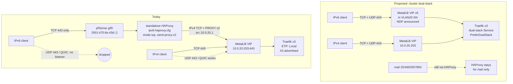
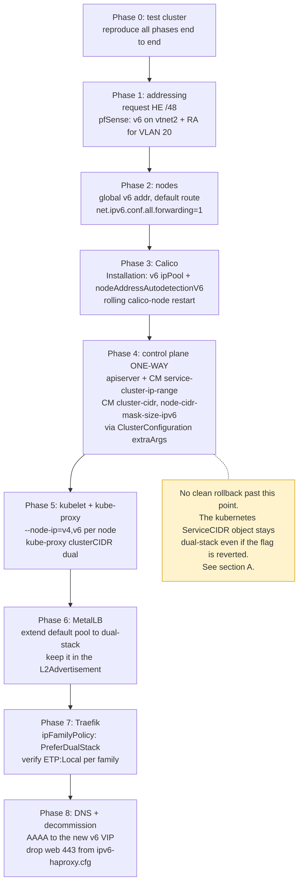

# Converting the homelab cluster to dual-stack IPv4/IPv6

Research note, 2026-08-31. Read-only investigation; nothing was changed.

## Verdict

**Technically feasible in place on v1.35, and I do not think it is worth doing right now.**

The conversion is a supported operation on this Kubernetes version, and every
component we run has a documented path to dual-stack. What it buys us is small
and measurable, and the one concrete defect it would fix has a cheaper fix.

Two facts carry most of the weight:

1. **Non-crawler IPv6 traffic is 0.34% of requests.** In the last 24 hours
   Traefik logged 1,264,769 access-log lines. 184,286 came from IPv6 clients,
   and 179,994 of those (97.7%) came from `2a03:2880::/29`, which RIPE whois
   returns as `netname: IE-FACEBOOK-201100822`, `org-name: Meta Platforms
   Ireland Limited`. That leaves 4,292 requests/day from all other IPv6
   clients, mostly hosting-network prefixes (Hetzner, OVH, Linode) with a small
   residential share. Measured via `homelab logs query` over `{namespace="traefik"}`.
2. **The real defect is a broken HTTP/3 advertisement, and it is fixable without
   touching the cluster.** Over IPv6 the origin returns
   `alt-svc: h3=":443"; ma=2592000`, the same header it returns over IPv4, but
   pfSense has no UDP/443 listener on the tunnel endpoint. Of 22,261 HTTP/3
   requests in 24 hours, every one arrived over IPv4 and none over IPv6. Every
   IPv6 client is told to try QUIC at an address where QUIC does not answer.
   Dual-stack fixes this by making the advertisement true; so does the much
   smaller change of putting a UDP proxy or a hostNetwork listener in front of
   the tunnel endpoint, or removing the AAAA records.

There is a third fact that pulls the other way and deserves its weight: the
IPv6 bridge on pfSense binds all six of its frontends or none, so a port
conflict on web takes IPv6 mail down with it. That happened, and it went
unnoticed for 29 days in July and August 2026. Dual-stack would move web off
that config. It does not remove the config (mail still needs PROXY v2), and the
specific guard bug has since been fixed, so this improves the odds rather than
closing the failure mode.

Recommendation: **Option F1 (hostNetwork QUIC listener) if the HTTP/3 gap is
worth closing, otherwise do nothing.** Full reasoning in
[Alternatives](#f-alternatives). If dual-stack is wanted for its own sake as a
learning exercise, the plan in [Phased plan](#phased-plan-if-we-do-it) is the
safe ordering, and it is genuinely lower risk on v1.35 than it was two releases
ago.

---

## Measured starting state

| | Value | How verified |
|---|---|---|
| Kubernetes | v1.35.7, kubeadm, 6 nodes | `kubectl version` |
| Service CIDR | `10.96.0.0/12`, IPv4 only | apiserver + controller-manager `--service-cluster-ip-range` |
| Pod CIDR | `10.10.0.0/16`, IPv4 only | controller-manager `--cluster-cidr` |
| `ServiceCIDR` API | GA, `kubernetes = [10.96.0.0/12]`, 256d | `kubectl get servicecidrs` |
| `MultiCIDRServiceAllocator` | enabled | `kubernetes_feature_enabled{name="MultiCIDRServiceAllocator"} 1` |
| `DisableAllocatorDualWrite` | enabled | `kubernetes_feature_enabled{name="DisableAllocatorDualWrite"} 1` |
| Node `--node-ip` | not set on any node | no `alpha.kubernetes.io/provided-node-ip` annotation |
| kube-proxy | `clusterCIDR: 10.10.0.0/16`, `detectLocalMode: ""` | `cm/kube-proxy` |
| Calico | **Tigera operator v1.38.13**, calico/node v3.30.7, `calico-system` | `kubectl get installation default` |
| Calico IPv6 state | `IP6=none`, `FELIX_IPV6SUPPORT=false`, CNI `assign_ipv6: "false"` | `ds/calico-node` env, `cm/cni-config` |
| MetalLB | v0.15.3, L2, one pool `default = 10.0.20.200-10.0.20.220` | `kubectl get ipaddresspool` |
| L2Advertisement | selects `ipAddressPools: [default]` explicitly | `kubectl get l2advertisement -o yaml` |
| Traefik svc | `SingleStack`, `[IPv4]`, `externalTrafficPolicy: Local`, HTTP/3 on | `svc/traefik`, deploy args |
| HE tunnel | `2001:470:6e:43d::2/128` endpoint, routed `2001:470:6f:43d::/64` | given; devvm holds `2001:470:6f:43d:20c:29ff:fec0:89ec/64` |

One correction to the starting brief worth flagging: **Calico here is
operator-managed, not manifest-managed.** The absence of `FELIX_IPV6SUPPORT` on
the DaemonSet is the operator rendering `FELIX_IPV6SUPPORT=false` because
`nodeAddressAutodetectionV6` is unset, not a missing manual setting. That
changes the whole of section B: we would edit the `Installation` CR, never the
DaemonSet.

A second observation: the routed `/64` is already consumed. The devvm on
VLAN 10 holds an address from `2001:470:6f:43d::/64` by SLAAC, so that prefix is
the management-VLAN prefix. The k8s VLAN has no global IPv6 today, which matches
the brief's finding that `vtnet2` carries only a link-local address.

---

## A. Feasibility

### Is in-place conversion supported on v1.35?

**Yes, for single-stack to dual-stack specifically.** The clearest primary
statement is from the Kubernetes issue that drove the current behaviour,
[kubernetes#131261](https://github.com/kubernetes/kubernetes/issues/131261),
"ServiceCIDR breaks conversion from Single to DualStack":

> When converting a cluster form single to dual stack, operators change the
> configured `--service-cluster-ip-range string` to add a new range, per example
> `--service-cluster-ip-range 10.96.0.0/24` will be updated to
> `--service-cluster-ip-range 10.96.0.0/24,2001:10:96::/112`.
>
> Moving from single to dual stack is a fully supported operation, since is
> adding a new range to the cluster
>
> Moving from IPv4 to IPv6 or from dual to single it is "allowed" by the system,
> but it is not supported, since there is no guarantee that the services that you
> have working will keep working

The fix, [PR #131263](https://github.com/kubernetes/kubernetes/pull/131263)
(merged 2025-04-14, milestone v1.33), carries this release note:

> kube-apiserver: Fixes an issue updating the default ServiceCIDR API object and
> creating dual-stack Service API objects when `--service-cluster-ip-range` flag
> passed to kube-apiserver is changed from single-stack to dual-stack

The Kubernetes concept page describes the same scenario as normal operation
rather than an unsupported one. [Dual-stack, "Dual-stack defaults on existing
Services"](https://kubernetes.io/docs/concepts/services-networking/dual-stack/):

> These examples demonstrate the default behavior when dual-stack is newly
> enabled on a cluster where Services already exist.
>
> When dual-stack is enabled on a cluster, existing Services (whether `IPv4` or
> `IPv6`) are configured by the control plane to set `.spec.ipFamilyPolicy` to
> `SingleStack` and set `.spec.ipFamilies` to the address family of the existing
> Service.

The one statement that reads as a prohibition is in the kubeadm guide, and it
is narrower than it looks.
[Dual-stack support with kubeadm](https://kubernetes.io/docs/setup/production-environment/tools/kubeadm/dual-stack-support/):

> If you are upgrading an existing cluster with the `kubeadm upgrade` command,
> `kubeadm` does not support making modifications to the pod IP address range
> ("cluster CIDR") nor to the cluster's Service address range ("Service CIDR").

That is a limitation of the `kubeadm upgrade` code path, not a statement that
the cluster cannot become dual-stack. It matters operationally: we cannot get
there by editing `ClusterConfiguration.networking.serviceSubnet` and running
`kubeadm upgrade`. The route that does survive upgrades is `extraArgs`, covered
below. **The Kubernetes docs do not spell out a full in-place conversion
procedure**; the authoritative descriptions of the mechanism are the issue, the
PR, and the source.

### Does `--service-cluster-ip-range` accept a second family on a running cluster?

Yes, and the apiserver reconciles the `ServiceCIDR` object automatically. From
[`pkg/controlplane/controller/defaultservicecidr/default_servicecidr_controller.go`](https://github.com/kubernetes/kubernetes/blob/release-1.35/pkg/controlplane/controller/defaultservicecidr/default_servicecidr_controller.go)
(v1.35):

```go
// single to dual stack upgrade
if len(c.cidrs) == 2 && len(serviceCIDR.Spec.CIDRs) == 1 && c.cidrs[0] == serviceCIDR.Spec.CIDRs[0] {
    klog.Infof("Updating default ServiceCIDR from single-stack (%v) to dual-stack (%v)", serviceCIDR.Spec.CIDRs, c.cidrs)
    serviceCIDRcopy := serviceCIDR.DeepCopy()
    serviceCIDRcopy.Spec.CIDRs = c.cidrs
    _, err := c.client.NetworkingV1().ServiceCIDRs().Update(...)
```

The matching API validation, in
[`pkg/apis/networking/validation/validation.go`](https://github.com/kubernetes/kubernetes/blob/release-1.35/pkg/apis/networking/validation/validation.go),
permits exactly this one transition and nothing else:

```go
// added a new CIDR is allowed to convert to Dual Stack
// ref: https://issues.k8s.io/131261
case len(old.Spec.CIDRs) == 1 && len(update.Spec.CIDRs) == 2:
    // existing CIDR can not change
    if update.Spec.CIDRs[0] != old.Spec.CIDRs[0] { ... FieldImmutableErrorMsg ... }
```

Existing Services are untouched by this. They keep their IPv4 ClusterIP and
gain `ipFamilyPolicy: SingleStack`, `ipFamilies: [IPv4]`. Converting one is a
per-Service edit, and it is reversible in one direction only. From the
dual-stack concept page:

> The `.spec.ipFamilies` field is conditionally mutable: you can add or remove a
> secondary IP address family, but you cannot change the primary IP address
> family of an existing Service.

### Does the GA ServiceCIDR API let us add a different family on its own?

**No, not on its own.** Adding a `ServiceCIDR` object of a new family without
changing the apiserver flag will not make dual-stack Services work. The
apiserver builds its per-family allocator map at startup from
`--service-cluster-ip-range`, in
[`pkg/registry/core/rest/storage_core.go`](https://github.com/kubernetes/kubernetes/blob/release-1.35/pkg/registry/core/rest/storage_core.go)
(`newServiceIPAllocators`, primary from `c.Services.ClusterIPRange` and
secondary from `c.Services.SecondaryClusterIPRange`). Requests for a family that
is not in that map are rejected in
[`pkg/registry/core/service/storage/alloc.go`](https://github.com/kubernetes/kubernetes/blob/release-1.35/pkg/registry/core/service/storage/alloc.go):

```go
if _, found := al.serviceIPAllocatorsByFamily[fam]; !found {
    el = append(el, field.Invalid(..., fmt.Sprintf("%s is not configured on this cluster", fam)))
```

```go
if getIPFamilyPolicy(service) == api.IPFamilyPolicyRequireDualStack {
    if len(al.serviceIPAllocatorsByFamily) < 2 {
        el = append(el, field.Invalid(..., "this cluster is not configured for dual-stack services"))
```

The source carries an explicit note that this coupling is known and unresolved:

> `// TODO(aojea) Revisit the initialization of the allocators since right now it
> depends on the service-cidr flags and sets the default IPFamily that may not be
> coherent with the existing default ServiceCIDR`

So the ServiceCIDR API changes *how much space* is available and removes the old
size ceiling. It does not change *which families* the apiserver serves. That
still comes from the flag.

What the ServiceCIDR API does contribute: the historical IPv6 service-range size
limit is gone on this cluster.
[`cmd/kube-apiserver/app/options/validation.go`](https://github.com/kubernetes/kubernetes/blob/release-1.35/cmd/kube-apiserver/app/options/validation.go)
applies `maxCIDRBits := 20` (so IPv6 masks had to be `>= /108`) only when one of
the two gates is off:

```go
if !utilfeature.DefaultFeatureGate.Enabled(features.MultiCIDRServiceAllocator) ||
    !utilfeature.DefaultFeatureGate.Enabled(features.DisableAllocatorDualWrite) {
    if err := validateMaxCIDRRange(options.PrimaryServiceClusterIPRange, maxCIDRBits, "--service-cluster-ip-range"); err != nil {
```

Both gates are GA and `LockToDefault: true` in v1.35
([`pkg/features/kube_features.go`](https://github.com/kubernetes/kubernetes/blob/release-1.35/pkg/features/kube_features.go)),
and both report `1` on our apiserver, so the check is skipped. The motivating
complaint in [KEP-1880](https://github.com/kubernetes/enhancements/tree/master/keps/sig-network/1880-multiple-service-cidrs)
was exactly this:

> the size of the Service Cluster CIDR, for IPv4 the prefix size is limited to
> /12, however, for IPv6 it is limited to /112 or fewer. This restriction is
> causing issues for IPv6 users, since /64 is the standard and minimum
> recommended prefix length

(The KEP says `/112`; the code computes `128 - 20 = /108`. The KEP text appears
to be approximate. Either way the limit no longer applies here.)

### What must change, and in what order

| # | Component | Change | Restart / disruption |
|---|---|---|---|
| 1 | Nodes (OS) | Global IPv6 address on the k8s VLAN, `net.ipv6.conf.all.forwarding=1`, default IPv6 route | None (host config) |
| 2 | pfSense | Global IPv6 on `vtnet2`, RA or static addressing for VLAN 20 | None to k8s |
| 3 | Calico | `Installation.spec.calicoNetwork`: add IPv6 `ipPools` entry + `nodeAddressAutodetectionV6` | Rolling `calico-node` restart, `maxUnavailable: 1` |
| 4 | kube-apiserver | `--service-cluster-ip-range=10.96.0.0/12,<v6>/112` | Static-pod restart per control-plane node |
| 5 | kube-controller-manager | `--cluster-cidr`, `--service-cluster-ip-range` both dual, `--node-cidr-mask-size-ipv6` | Static-pod restart |
| 6 | kubelet | `--node-ip=<v4>,<v6>` on every node | kubelet restart per node |
| 7 | kube-proxy | `clusterCIDR: <v4>,<v6>` in the ConfigMap | DaemonSet rollout |
| 8 | MetalLB | IPv6 `IPAddressPool` + add it to the `L2Advertisement` | None |
| 9 | Services | Per-Service `ipFamilyPolicy: PreferDualStack` | Per-Service |

Flag names are from the
[dual-stack concept page](https://kubernetes.io/docs/concepts/services-networking/dual-stack/):

> * kube-apiserver: `--service-cluster-ip-range=<IPv4 CIDR>,<IPv6 CIDR>`
> * kube-controller-manager: `--cluster-cidr=<IPv4 CIDR>,<IPv6 CIDR>`,
>   `--service-cluster-ip-range=<IPv4 CIDR>,<IPv6 CIDR>`,
>   `--node-cidr-mask-size-ipv4|--node-cidr-mask-size-ipv6` defaults to /24 for
>   IPv4 and /64 for IPv6
> * kube-proxy: `--cluster-cidr=<IPv4 CIDR>,<IPv6 CIDR>`
> * kubelet: `--node-ip=<IPv4 IP>,<IPv6 IP>` — This option is required for bare
>   metal dual-stack nodes

Ordering rationale: the network underlay and the CNI must be ready before the
control plane starts handing out IPv6, or Services get addresses that nothing
can route. Calico before the apiserver, and the apiserver before any Service is
converted.

Two implementation details specific to us:

- **Put the flags in `ClusterConfiguration.*.extraArgs`, not in the static-pod
  manifest by hand.** kubeadm builds `service-cluster-ip-range` from
  `cfg.Networking.ServiceSubnet` and then lets extraArgs replace it
  ([`cmd/kubeadm/app/phases/controlplane/manifests.go`](https://github.com/kubernetes/kubernetes/blob/release-1.35/cmd/kubeadm/app/phases/controlplane/manifests.go),
  `getAPIServerCommand` → `ArgumentsToCommand(defaultArguments, cfg.APIServer.ExtraArgs)`).
  `ArgumentsToCommand`
  ([`cmd/kubeadm/app/util/arguments.go`](https://github.com/kubernetes/kubernetes/blob/release-1.35/cmd/kubeadm/app/util/arguments.go))
  drops any base arg whose name appears in the overrides, so the flag is
  replaced cleanly rather than duplicated. The v1beta4 reference agrees:
  "Extra arguments will override existing default arguments." A hand-edited
  manifest would be reverted by the next `kubeadm upgrade`.
- **kube-proxy's `clusterCIDR` is live for us.** The kube-proxy config reference
  says clusterCIDR is used "When DetectLocalMode is set to ClusterCIDR ...
  (Otherwise it is not used.)", and our ConfigMap has `detectLocalMode: ""`.
  The type documentation states `detectLocalMode` "defaults to
  LocalModeClusterCIDR"
  ([`pkg/proxy/apis/config/types.go`](https://github.com/kubernetes/kubernetes/blob/release-1.35/pkg/proxy/apis/config/types.go)),
  so the empty value means ClusterCIDR and the field does need updating.

### Rollback

This is the weakest part of the story, and it is worth being blunt about it.

| Step | Rollback | Confidence |
|---|---|---|
| Node OS / pfSense addressing | Remove the addresses | Clean |
| Calico IPv6 pool | Remove the pool from `Installation`; the operator's IP pool controller then **deletes** the IPPool | Works, but see caveat |
| kube-proxy ConfigMap | Revert and roll the DaemonSet | Clean |
| kubelet `--node-ip` | Revert and restart kubelet | Clean |
| Per-Service `ipFamilyPolicy` | Set back to `SingleStack`; docs state the secondary family can be removed | Clean |
| **apiserver / CM `--service-cluster-ip-range`** | **Reverting the flag does not revert the `ServiceCIDR` object** | Ratchet |

That last row is the one to plan around. Once the apiserver has updated the
`kubernetes` ServiceCIDR to dual-stack, `ValidateServiceCIDRUpdate` rejects
going back to one CIDR (`FieldImmutableErrorMsg`), and the default-ServiceCIDR
controller only logs the mismatch:

> `Inconsistent ServiceCIDR status for %s, controller configuration: %v,
> ServiceCIDR configuration: %v. Configure the flags to match current ServiceCIDR
> or manually delete it.`

plus a `KubernetesDefaultServiceCIDRInconsistent` warning event. Getting back to
a genuinely single-stack `ServiceCIDR` means deleting and recreating the
`kubernetes` object, which is gated by a finalizer:

> The ServiceCIDRs are protected with finalizers, to avoid leaving Service
> ClusterIPs orphans; the finalizer is only removed if there is another subnet
> that contains the existing IPAddresses or there are no IPAddresses belonging to
> the subnet.
> — [Extend Service IP Ranges](https://kubernetes.io/docs/tasks/network/extend-service-ip-ranges/)

The documented procedure for that is the integration test the maintainers
pointed at,
[`test/integration/servicecidr/migration_test.go`](https://github.com/kubernetes/kubernetes/blob/release-1.35/test/integration/servicecidr/migration_test.go):

```
// 1. start apiserver with --service-cluster-ip-range 192.168.0.0/29"
// 2. create services to use some addresses on the cidr
// 3. create a temporary new ServiceCIDR 10.168.0.0/24 to migrate the cluster to it
// 4. delete the default service CIDR so the allocators ignore it (it will be pending because of the finalizer and having still IPs)
// 5. recreate the services, the allocator should pick the temporary ServiceCIDR
// 6. start the new apiserver with the new ServiceCIDRs on the flags and shutdown the old one
// 7. delete the kubernetes.default service, the new apiserver will recreate it within the new ServiceCIDR
```

Step 5, "recreate the services", is the disruptive part. In practice: **treat
the ServiceCIDR flag change as one-way.** Leaving the object dual-stack while
the flag says single-stack is cosmetically untidy (a recurring warning event)
but not obviously harmful, since the IPv4 range and its allocator are unchanged.
Whether any IPv6 `IPAddress` objects left behind cause trouble in that state is
listed under open questions; I did not find a primary source that settles it.

---

## B. Calico

Everything here is driven by the `Installation` CR, because this cluster is
operator-managed (`operator.tigera.io/v1`, `tigera-operator:v1.38.13`).

### What to change

Calico's own guide,
[Configure dual stack or IPv6 only](https://docs.tigera.io/calico/latest/networking/ipam/ipv6),
gives the operator form:

> To configure dual-stack cluster using the operator, edit your default
> Installation at install time to include both an IPv4 and IPv6 pool.

```yaml
apiVersion: operator.tigera.io/v1
kind: Installation
metadata:
  name: default
spec:
  calicoNetwork:
    ipPools:
      - blockSize: 26
        cidr: 10.48.0.0/21
        encapsulation: IPIP
        natOutgoing: Enabled
        nodeSelector: all()
      - blockSize: 122
        cidr: 2001::00/64
        encapsulation: None
        natOutgoing: Enabled
        nodeSelector: all()
```

For us that means adding a second entry to the existing `ipPools` list and
adding `nodeAddressAutodetectionV6`. The autodetection field is what actually
turns IPv6 on in the DaemonSet. From
[`pkg/render/node.go`](https://github.com/tigera/operator/blob/v1.38.13/pkg/render/node.go)
in the operator:

```go
if v6Method != "" {
    // IPv6 Auto-detection is enabled.
    nodeEnv = append(nodeEnv, corev1.EnvVar{Name: "IP6", Value: "autodetect"})
    nodeEnv = append(nodeEnv, corev1.EnvVar{Name: "IP6_AUTODETECTION_METHOD", Value: v6Method})
    nodeEnv = append(nodeEnv, corev1.EnvVar{Name: "FELIX_IPV6SUPPORT", Value: "true"})
    ...
} else {
    nodeEnv = append(nodeEnv, corev1.EnvVar{Name: "IP6", Value: "none"})
    nodeEnv = append(nodeEnv, corev1.EnvVar{Name: "FELIX_IPV6SUPPORT", Value: "false"})
}
```

So `FELIX_IPV6SUPPORT` and `CALICO_IPV6POOL_CIDR` are not things we set. They
are outputs. Setting them by hand on the DaemonSet would be reverted by the
operator.

### Encapsulation for the IPv6 pool

`VXLANCrossSubnet` is accepted for IPv6 pools; `IPIP` and `IPIPCrossSubnet` are
not. From
[`pkg/controller/installation/validation.go`](https://github.com/tigera/operator/blob/v1.38.13/pkg/controller/installation/validation.go):

```go
// This is an IPv6 pool.
if pool.Encapsulation == operatorv1.EncapsulationIPIP || pool.Encapsulation == operatorv1.EncapsulationIPIPCrossSubnet {
    return fmt.Errorf("IPIP encapsulation is not supported by IPv6 pools, but it is set for %s", pool.CIDR)
}
```

Mirroring the IPv4 pool with `VXLANCrossSubnet` is therefore valid. Because all
six nodes sit in one subnet, CrossSubnet means no encapsulation between them in
practice, same as today on IPv4. `blockSize` defaults to 122 for IPv6
([Installation API reference](https://docs.tigera.io/calico/latest/reference/installation/api)):
"BlockSize specifies the CIDR prefex length to use when allocating per-node IP
blocks from the main IP pool CIDR. Default: 26 (IPv4), 122 (IPv6)".

### Can this be done on an existing cluster?

Calico's guide says no, in a note above both procedures:

> The following tasks are only for new clusters.

and the operator instructions say to edit the Installation "at install time".

That is Calico's stated position and we should respect it as the documented
one. It also sits alongside two facts that point the other way, which is worth
naming rather than glossing:

- The Installation API reference describes `ipPools` as a managed, reconciled
  list rather than an install-time snapshot: "IPPools contains a list of IP
  pools to manage. ... IP pools in this list will be reconciled by the operator
  and should not be modified out-of-band."
- The operator ships a dedicated IP pool controller
  ([`pkg/controller/ippool/pool_controller.go`](https://github.com/tigera/operator/blob/v1.38.13/pkg/controller/ippool/pool_controller.go))
  that creates, updates and deletes IPPools continuously to match the
  Installation.

**My reading, marked as inference:** adding a pool post-install is mechanically
supported by the operator; the "new clusters only" note most likely reflects
that the surrounding prerequisites (node IPv6 addressing, control-plane flags,
CNI `assign_ipv6`) are not things Calico can retrofit for you, and that the
combination is not what Calico tests. I did not find a Calico document that
either blesses or forbids the post-install path explicitly. If we proceed, this
is the single biggest "unvalidated by the vendor" step, and it deserves a test
cluster first.

### Prerequisites Calico states

> Kubernetes IPv6 host requirements: An IPv6 address that is reachable from the
> other hosts. The sysctl setting, `net.ipv6.conf.all.forwarding`, is set to 1.
> ... A default IPv6 route

All three are currently missing on the k8s nodes.

### Restart behaviour

Changing `nodeAddressAutodetectionV6` changes the calico-node pod template
(three env vars, plus `FELIX_VXLANMTUV6` / `FELIX_WIREGUARDMTUV6` when MTU is
set), so the DaemonSet rolls. Our `Installation` has
`nodeUpdateStrategy.rollingUpdate.maxUnavailable: 1`, so nodes restart one at a
time.

**Calico's docs do not state what happens to pod networking during a calico-node
restart**, so this note does not put a number on it. The reasonable expectation
is that established flows keep working, because forwarding lives in the kernel
dataplane while Felix programs it rather than carrying traffic, and that new
policy and new endpoints stall until Felix is back. That is reasoning about the
architecture, not a measurement; confirm it on a test node before doing it on
all six.

---

## C. MetalLB

### What v0.15.3 needs

Two things: an `IPAddressPool` containing IPv6 addresses, and that pool
referenced by an advertisement. Our `L2Advertisement` names its pools explicitly
(`ipAddressPools: [default]`), so a new pool must be added to that list or given
its own advertisement, otherwise it will never be announced.

L2 announcement for IPv6 is NDP, and MetalLB says so plainly in
[MetalLB in layer 2 mode](https://metallb.io/concepts/layer2/):

> Under the hood, MetalLB responds to ARP requests for IPv4 services, and NDP
> requests for IPv6.

### Can MetalLB give an IPv6 LB address to a single-stack IPv4 Service?

**No.** This confirms the brief's suspicion, and the mechanism is unambiguous in
MetalLB's source. The family is derived from the Service's ClusterIPs, not
chosen by MetalLB. From
[`internal/ipfamily/ipfamily.go`](https://github.com/metallb/metallb/blob/v0.15.3/internal/ipfamily/ipfamily.go):

```go
// ForService returns the address family of a given service.
func ForService(svc *v1.Service) (Family, error) {
	if len(svc.Spec.ClusterIPs) > 0 {
		return ForAddresses(svc.Spec.ClusterIPs)
	}
	// fallback to clusterip if clusterips are not set
	addresses := []string{svc.Spec.ClusterIP}
	return ForAddresses(addresses)
}
```

[`controller/service.go`](https://github.com/metallb/metallb/blob/v0.15.3/controller/service.go)
then allocates against that family only, and explicitly refuses a mismatched
manual request:

```go
serviceIPFamily, err := ipfamily.ForService(svc)
...
if serviceIPFamily != desiredLbIPFamily {
    return nil, fmt.Errorf("requested loadBalancer IP(s) %q does not match the ipFamily of the service", desiredLbIPs)
}
```

and [`internal/allocator/allocator.go`](https://github.com/metallb/metallb/blob/v0.15.3/internal/allocator/allocator.go)
ends with `no suitable pool for %s IPFamily` when nothing matches.

So the Service must be dual-stack at the Kubernetes level first, which requires
the apiserver flag. There is no MetalLB-only shortcut.

### Service configuration

MetalLB documents `PreferDualStack` at
[Advanced AddressPool configuration](https://metallb.io/configuration/_advanced_ipaddresspool_configuration/):

> MetalLB supports `PreferDualStack` ip policy, which allows services to prefer
> dual-stack IP allocations while gracefully falling back to single-stack if
> dual-stack is unavailable.
>
> The above Service will be assigned 1 ipv4 and 1 ipv6 from the dualstack-pool.
>
> - If an svc was assigned with an ip from a single-stack pool, and the said pool
>   is extended to be dualstack, the originally assigned ip will stay assigned,
>   and the svc will be assigned an additional ip from the newly available stack.

That last bullet is the one that matters for Traefik: extending the existing
`default` pool to hold both families keeps `10.0.20.203` and adds an IPv6
address alongside it, rather than reshuffling the IPv4 VIP. Using a separate
pool would also work but risks the documented "the svc will keep its current
pool" behaviour leaving it single-stack.

**Where the IPv6 LB addresses must live:** MetalLB's docs do not state a subnet
requirement. *Inference:* since L2 mode works by answering NDP on the local
segment, the pool needs to be inside the k8s VLAN's IPv6 prefix, exactly as the
IPv4 pool `10.0.20.200-220` sits inside `10.0.20.0/24`. Anything else would need
a static route on pfSense pointing at one specific node, which would defeat
MetalLB's failover.

---

## D. Addressing

### Is the /48 free, and how do we get it?

Yes. From [tunnelbroker.net](https://tunnelbroker.net/) itself:

> Welcome to the Hurricane Electric IPv6 Tunnel Broker! Our **free tunnel broker
> service** enables you to reach the IPv6 Internet by tunneling over existing
> IPv4 connections...
>
> Advantages of using our tunnel service over others include: ... **Ability to
> get your own /48 prefix once your tunnel is up**

HE's public pages do not document the request mechanics beyond that sentence
(there is no public tunnelbroker FAQ; the "FAQ" link on the front page goes to
the IPv6 certification FAQ). The allocation is requested from the tunnel's own
details page after login. **Unverified from a public HE source:** whether the
/48 is issued instantly, and whether it is routed to the same tunnel endpoint.

### Do we need the /48, or can the existing /64 be subnetted?

We need a second prefix, and the /48 is the obvious one.

The routed `2001:470:6f:43d::/64` is already the management-VLAN prefix (the
devvm holds `2001:470:6f:43d:20c:29ff:fec0:89ec/64` from SLAAC). Reusing it for
VLAN 20 would mean one prefix spanning two isolated VLANs, which conflicts with
the segmentation the network is built on.

Subnetting a single /64 is *technically* possible for the pod range. The binding
Kubernetes constraint is in
[`pkg/controller/nodeipam/ipam/cidrset/cidr_set.go`](https://github.com/kubernetes/kubernetes/blob/release-1.35/pkg/controller/nodeipam/ipam/cidrset/cidr_set.go):

```go
// The subnet mask size cannot be greater than 16 more than the cluster mask size
// clusterSubnetMaxDiff limited to 16 due to the uncompressed bitmap
// Due to this limitation the subnet mask for IPv6 cluster cidr needs to be >= 48
// as default mask size for IPv6 is 64.
clusterSubnetMaxDiff = 16
```

With the default `/64` node mask that forces a pod CIDR of `/48` or larger,
which a `/64` cannot supply. You could work around it by shrinking node blocks
(a `/80` pod CIDR with `/96` node blocks satisfies the 16-bit rule), but that
trades a free, correctly-sized allocation for a permanent oddity. Given the /48
costs nothing, take the /48.

### Proposed allocation, from a new `2001:470:XXXX::/48`

| Purpose | Prefix | Notes |
|---|---|---|
| k8s VLAN 20 node addresses | `2001:470:XXXX:20::/64` | /64 needed for SLAAC; MetalLB pool carved from here |
| MetalLB L2 pool | `2001:470:XXXX:20:ffff::/112` (or a small range) | must be on-link with the nodes |
| Pod CIDR | `2001:470:XXXX:2100::/56` | /56 with default /64 node blocks = 256 nodes, diff 8 ≤ 16 |
| Service CIDR | `2001:470:XXXX:2200::/112` | 65,534 usable; matches the kubeadm doc example |

Notes on the sizes:

- **Service CIDR.** The old `/108` ceiling no longer applies (see section A), so
  a larger range would validate. `/112` is what the
  [kubeadm dual-stack guide](https://kubernetes.io/docs/setup/production-environment/tools/kubeadm/dual-stack-support/)
  uses in its own example (`--service-cidr=10.96.0.0/16,2001:db8:42:1::/112`),
  and keeps the allocator state small. It is 65,534 addresses against roughly a
  few hundred Services today.
- **Pod CIDR.** kubeadm's example uses `/56` for pods
  (`--pod-network-cidr=10.244.0.0/16,2001:db8:42:0::/56`), which matches.
- **Calico pool.** Calico allocates `/122` blocks by default, independent of the
  node podCIDRs, because we use Calico IPAM (`cni.ipam.type: Calico`). Keeping
  the Calico IPv6 pool identical to the controller-manager `--cluster-cidr`
  IPv6 range keeps the two views consistent even though Calico does not require
  it.

Kubernetes' guidance on picking the range, from the kubeadm guide:

> For IPv6, a cluster operator typically chooses a global unicast address block
> from within `2000::/3`, using a range that is assigned to the operator. You
> don't have to route the cluster's IP address ranges to the public internet.

The HE /48 is a global unicast assignment, so this fits. Only the MetalLB pool
needs to be reachable from outside.

---

## E. Benefits and costs

### The ingress path, now and proposed



Note that the HAProxy bridge does not disappear either way. It also carries
ports 25/465/587/993 to NodePorts 30125-30128, and mail needs PROXY v2 for
CrowdSec and Postfix rate-limiting regardless of address family. Dual-stack
removes the web half of one config file, not the file.

### What it actually buys us

| Claimed benefit | Honest assessment | Evidence |
|---|---|---|
| HTTP/3 over IPv6 for the origin-direct hosts | **The one real defect, but tiny in volume.** The origin advertises `alt-svc: h3=":443"; ma=2592000` identically on both families, and `sockstat -6 -l` shows no UDP/443 listener. Every IPv6 client is told to try QUIC where it cannot work, wastes a probe, and falls back to TCP. In the last 24 hours Traefik served 22,261 HTTP/3 requests, **every one of them from an IPv4 client and none from IPv6**, while the same IPv6 client filter matched 184,282 requests over TCP. | measured: `curl -sSI --resolve ...[2001:470:6e:43d::2]` returns the alt-svc header; `sum(count_over_time({namespace="traefik"} \|= "HTTP/3" [24h]))` split by client family |
| Removing the web half of the HAProxy bridge | **Better than "partial", and this is the strongest non-HTTP/3 argument.** HAProxy binds all six frontends or none, so one unavailable port takes web *and* mail down together. That is not hypothetical: pfSense's nginx held wildcard `*:80` after the 2026-07-18 reboot, `bind [2001:470:6e:43d::2]:80` could not start, and the whole IPv6 bridge was dark for **29 days** unnoticed. Moving web 80/443 out of that config removes the port that collided, and decouples mail from anything nginx does on the web ports. Ports 25/465/587/993 still need the bridge for PROXY v2, so the file and service remain. | `docs/architecture/networking.md` → "IPv6 Ingress", gotcha dated 2026-08-16 |
| Real IPv6 client IPs natively | **No gain.** `send-proxy-v2` already delivers them. Traefik trusts `10.0.20.1` (`--entryPoints.websecure.proxyProtocol.trustedIPs=10.0.20.1`) and real client IPv6 addresses appear in the access log today. | Traefik deploy args; 184,286 IPv6 source addresses logged in 24h |
| CrowdSec sees and blocks IPv6 clients | **No gain — this already works.** Since the 2026-08-18 rework, HTTP enforcement is the in-process `crowdsec` Traefik plugin on the `websecure` entrypoint, and it judges `req.RemoteAddr`, which PROXY v2 has already rewritten to the real client. Its own source says so: "The peer IS the client (direct WAN, or pfSense PROXY-v2 having rewritten RemoteAddr)." Live config has `dryRun: false`. The node-level nftables bouncer cannot see IPv6 clients, but that layer covers non-HTTP ports, which the bridge carries anyway. | `stacks/traefik/modules/traefik/crowdsec-bouncer-plugin/main.go` (`clientIP`); `kubectl -n traefik get middleware crowdsec` |
| Pod-level IPv6, IPv6-only clients | No demand found. 97.7% of IPv6 requests are Meta's crawler; the rest are mostly hosting networks. No IPv6-only client population is visible in the logs. | `2a03:2880::/29` = 179,994 of 184,286 |
| NAT reduction | Minimal. Pods would still be `natOutgoing: Enabled` unless we route the pod prefix, which we would not want to do over a tunnel. | `Installation` spec |

### Costs

| Cost | Detail |
|---|---|
| Risk to a live cluster | Six nodes, one apiserver, static-pod restart, full calico-node roll. The ServiceCIDR flag change is effectively one-way (section A). Calico's own docs say the dual-stack procedure is for new clusters. |
| Every Service becomes a decision | 9 components' flags change once; every Service that should be dual-stack needs an individual `ipFamilyPolicy` edit, and the primary family can never change afterwards. |
| NetworkPolicy | Calico policies with IPv4 literals silently stop covering the v6 path. Any policy expressed as CIDRs needs a v6 twin. |
| Firewall and CrowdSec rules double | pfSense rules for VLAN 20, nftables sets, any allowlist expressed as an IPv4 CIDR. |
| Monitoring | Dashboards and alerts keyed on IPv4 CIDRs or on a single node address per node. |
| Ongoing dependency on the HE tunnel | Cluster-wide external IPv6 would ride a 6in4 tunnel. Tunnel down means the IPv6 half of ingress is down, on top of what it already affects. |
| Skill and time | A conversion, a test cluster to validate the Calico step, and a rollback plan we cannot fully exercise. |

### What could break

- Loss of quorum or apiserver availability during the static-pod restart if the
  new flags are malformed. The apiserver refuses to start on a bad
  `--service-cluster-ip-range` (`--service-cluster-ip-range must not contain more
  than two entries`, family mismatch errors) rather than starting degraded,
  which is the good failure mode, but it is still an outage until fixed.
- Pod networking disruption during the calico-node roll, extent unverified.
- kube-proxy programming both families where the nodes are not consistently
  addressed, if `--node-ip` is not applied uniformly before kube-proxy is
  switched.
- Traefik with `externalTrafficPolicy: Local` on a dual-stack Service: the
  source-IP preservation and endpoint-locality logic now runs per family. Worth
  testing rather than assuming.

---

## F. Alternatives

### F1. hostNetwork QUIC listener for IPv6, no cluster dual-stack

Give Traefik a way to receive UDP/443 on the node's own IPv6 address, without
the cluster knowing about IPv6 at all.

**hostPort will not work.** The portmap CNI plugin DNATs a host port to the
pod's IP, and without cluster IPv6 the pod has no IPv6 address to DNAT to. The
[portmap documentation](https://www.cni.dev/plugins/current/meta/portmap/)
states the dependency directly: "If you need port forwarding from localhost,
your container must have an ipv4 address", and describes `conditionsV6` rules
that presuppose a v6 container address.

**hostNetwork does work,** by inference from how hostNetwork is defined: the pod
shares the host network namespace, so it binds the node's own addresses and
needs no pod IP of either family. A Traefik replica (or a small dedicated QUIC
frontend) with `hostNetwork: true` binding `[::]:443/udp` on nodes that have a
global IPv6 would serve HTTP/3 over IPv6. **I have not found a Kubernetes
document that states this for the IPv6 case specifically**, so treat it as
reasoning from the mechanism, and prove it on one node before relying on it.

What is lost: no MetalLB VIP for the IPv6 side, so DNS points at a node address
or a small set of them, and node failover becomes a DNS problem rather than an
NDP one. For a service whose IPv6 QUIC traffic is currently 1 request per week,
that is an acceptable trade.

A variant worth considering: **terminate QUIC on pfSense**. The existing HAProxy
is TCP-only, but a UDP forwarder from `[2001:470:6e:43d::2]:443` to
`10.0.20.203:443/udp` would make the alt-svc advertisement true with no cluster
change at all. Two things weigh against it, though:

- QUIC carries the client IP inside an encrypted transport, so a plain UDP relay
  loses the real client IP that PROXY protocol currently preserves for TCP.
  CrowdSec would stop seeing QUIC clients on the IPv6 path.
- It adds to the bespoke pfSense surface rather than shrinking it, and that
  surface is where the 29-day silent outage came from
  (`docs/architecture/networking.md` → "IPv6 Ingress"). A new listener is one
  more thing that has to keep binding across reboots.

On that second point, the in-cluster hostNetwork listener is the better shape
even though it has more moving parts: it lives somewhere that is monitored,
declared and rolled back the same way everything else is.

### F2. Remove the origin-direct AAAA records

Clients fall back to IPv4, where HTTP/3 already works from the public internet
(external IPv4 clients account for thousands of HTTP/3 requests in the last 7
days, so UDP/443 is forwarded correctly on the v4 path).

Side benefit worth counting: the Cloudflare zone stands at 185/200 records on
the free plan, and each non-proxied host costs two records (A + AAAA)
(`docs/architecture/dns.md`). Removing the AAAAs takes the zone to roughly
157/200 and defers the next cleanup. (Exact count to confirm before acting:
today's measurement found 28 origin-direct hostnames carrying AAAA, while
`docs/architecture/dns.md` records 33 non-proxied AAAA. One of the two has
drifted.)

Cost: origin-direct hosts stop being reachable over IPv6 entirely. For 4,292
non-Meta IPv6 requests a day, most from hosting networks, that is a small but
real regression, and it is a step backwards on a protocol that is only going one
way. Meta's crawler would move to IPv4, which is fine.

### F3. Do nothing

The current state works. IPv6 clients get HTTP/2 with real client IPs preserved
through PROXY v2. The only cost is the false HTTP/3 advertisement, which costs
each IPv6 client one failed QUIC probe and no correctness.

### Recommendation

**Fix the advertisement, do not convert the cluster.**

In order of preference:

1. **hostNetwork QUIC listener** (F1). Makes `alt-svc` honest, keeps the change
   inside the cluster where it is declared, monitored and revertible, and does
   not grow the pfSense surface. Prove the IPv6 bind on one node first.
2. **Do nothing** (F3) is a defensible answer, and a better one than it sounds.
   The defect costs one wasted round trip for 0.34% of traffic. A third option
   in the same spirit: stop advertising `alt-svc` on the IPv6 path, so clients
   are told the truth rather than given a working QUIC route.
3. **UDP relay on pfSense** (variant of F1) if the in-cluster route turns out
   not to work. Smallest change by line count, but it loses the client IP on
   QUIC and adds to the config that was silently down for 29 days.
4. **Full dual-stack** only if the goal is the capability itself rather than the
   HTTP/3 symptom. It is feasible, the primary sources support it, the
   sequencing below is sound, and it would also decouple IPv6 mail from the web
   ports on pfSense. It is still not justified by the measured traffic alone.

F2 (removing AAAAs) trades a real capability for tidiness. The zone-record
saving is genuine but there are cheaper ways to free that many records.

---

## Phased plan (if we do it)

Only if dual-stack is wanted as a capability. Each phase is independently
revertible except phase 4.



Gate on phase 0. The Calico step is the one the vendor documents as
new-clusters-only, and the control-plane step is the one that does not roll
back; both should be exercised somewhere disposable first.

Everything in phases 1-2 is pfSense and node OS work, so it goes through
`infra/playbooks/devvm.yml`-equivalent automation for the nodes and through the
pfSense change process, not by hand on the boxes. Phase 4 goes into
`ClusterConfiguration.apiServer.extraArgs` and
`ClusterConfiguration.controllerManager.extraArgs` so `kubeadm upgrade` does not
revert it.

---

## Open questions

Things this note could not settle from primary sources.

1. **Does a calico-node restart interrupt pod networking, and for how long?**
   Calico's docs do not say. Needs measurement on a test node.
2. **Is the post-install Calico dual-stack path supported in practice?** The
   operator's IP pool controller reconciles pool changes continuously, but
   Calico's guide says the procedure is for new clusters. The two statements are
   not contradictory but they do not settle the question either.
3. **What happens to leftover IPv6 `IPAddress` objects if the apiserver flag is
   reverted?** The ServiceCIDR object stays dual-stack and the controller warns.
   Whether the repair loop garbage-collects, errors, or ignores v6 IPAddresses
   with no allocator is not documented, and I did not read enough of the repair
   loop to assert it.
4. *(Answered while writing this note — kept for the record.)* IPv6 CrowdSec
   bans **are** enforced today, by the Traefik entrypoint plugin reading the
   PROXY-v2-rewritten `RemoteAddr`. Dual-stack adds nothing here. Note the
   Cloudflare edge channel was retired on 2026-08-18, so the plugin plus the
   node-level nftables bouncer are the whole enforcement story.
5. **HE /48 mechanics.** Instant or reviewed, and routed to the same tunnel
   endpoint? Not documented publicly by HE.
6. **Can pfSense relay UDP/443 with an existing package?** This determines
   whether the recommended option is trivial or needs a small custom service.
7. **Does `externalTrafficPolicy: Local` behave per-family as expected on a
   dual-stack MetalLB Service?** Not something the docs address directly for
   this combination.
8. **What does the 47-request `10.0.20.1` HTTP/3 client in the logs represent?**
   The IPv6 HAProxy is TCP-only, so these arrive some other way. Minor, but it
   means the picture of who reaches Traefik over QUIC is not complete.

---

## Sources

Kubernetes documentation:

- [IPv4/IPv6 dual-stack](https://kubernetes.io/docs/concepts/services-networking/dual-stack/)
- [Dual-stack support with kubeadm](https://kubernetes.io/docs/setup/production-environment/tools/kubeadm/dual-stack-support/)
- [Extend Service IP Ranges](https://kubernetes.io/docs/tasks/network/extend-service-ip-ranges/)
- [Service ClusterIP allocation](https://kubernetes.io/docs/concepts/services-networking/cluster-ip-allocation/)
- [kubeadm v1beta4 configuration reference](https://kubernetes.io/docs/reference/config-api/kubeadm-config.v1beta4/)
- [kube-proxy configuration reference](https://kubernetes.io/docs/reference/config-api/kube-proxy-config.v1alpha1/)

Kubernetes enhancements and issues:

- [KEP-1880, Multiple Service CIDRs](https://github.com/kubernetes/enhancements/tree/master/keps/sig-network/1880-multiple-service-cidrs)
- [kubernetes#131261, ServiceCIDR breaks conversion from Single to DualStack](https://github.com/kubernetes/kubernetes/issues/131261)
- [kubernetes#131263, Allow to convert clusters Service CIDRs from single to dual stack](https://github.com/kubernetes/kubernetes/pull/131263)

Kubernetes source, `release-1.35`:

- [`pkg/controlplane/controller/defaultservicecidr/default_servicecidr_controller.go`](https://github.com/kubernetes/kubernetes/blob/release-1.35/pkg/controlplane/controller/defaultservicecidr/default_servicecidr_controller.go)
- [`pkg/apis/networking/validation/validation.go`](https://github.com/kubernetes/kubernetes/blob/release-1.35/pkg/apis/networking/validation/validation.go)
- [`pkg/registry/core/service/storage/alloc.go`](https://github.com/kubernetes/kubernetes/blob/release-1.35/pkg/registry/core/service/storage/alloc.go)
- [`pkg/registry/core/rest/storage_core.go`](https://github.com/kubernetes/kubernetes/blob/release-1.35/pkg/registry/core/rest/storage_core.go)
- [`cmd/kube-apiserver/app/options/validation.go`](https://github.com/kubernetes/kubernetes/blob/release-1.35/cmd/kube-apiserver/app/options/validation.go)
- [`pkg/features/kube_features.go`](https://github.com/kubernetes/kubernetes/blob/release-1.35/pkg/features/kube_features.go)
- [`pkg/controller/nodeipam/ipam/cidrset/cidr_set.go`](https://github.com/kubernetes/kubernetes/blob/release-1.35/pkg/controller/nodeipam/ipam/cidrset/cidr_set.go)
- [`cmd/kube-controller-manager/app/core.go`](https://github.com/kubernetes/kubernetes/blob/release-1.35/cmd/kube-controller-manager/app/core.go)
- [`cmd/kubeadm/app/phases/controlplane/manifests.go`](https://github.com/kubernetes/kubernetes/blob/release-1.35/cmd/kubeadm/app/phases/controlplane/manifests.go)
- [`cmd/kubeadm/app/util/arguments.go`](https://github.com/kubernetes/kubernetes/blob/release-1.35/cmd/kubeadm/app/util/arguments.go)
- [`pkg/kubelet/nodestatus/setters.go`](https://github.com/kubernetes/kubernetes/blob/release-1.35/pkg/kubelet/nodestatus/setters.go)
- [`pkg/proxy/apis/config/types.go`](https://github.com/kubernetes/kubernetes/blob/release-1.35/pkg/proxy/apis/config/types.go)
- [`test/integration/servicecidr/migration_test.go`](https://github.com/kubernetes/kubernetes/blob/release-1.35/test/integration/servicecidr/migration_test.go)

Calico:

- [Configure dual stack or IPv6 only](https://docs.tigera.io/calico/latest/networking/ipam/ipv6)
- [Configure Kubernetes control plane to operate over IPv6](https://docs.tigera.io/calico/latest/networking/ipam/ipv6-control-plane)
- [Installation API reference](https://docs.tigera.io/calico/latest/reference/installation/api)
- [`tigera/operator` v1.38.13 `pkg/render/node.go`](https://github.com/tigera/operator/blob/v1.38.13/pkg/render/node.go)
- [`tigera/operator` v1.38.13 `pkg/controller/installation/validation.go`](https://github.com/tigera/operator/blob/v1.38.13/pkg/controller/installation/validation.go)
- [`tigera/operator` v1.38.13 `pkg/controller/ippool/pool_controller.go`](https://github.com/tigera/operator/blob/v1.38.13/pkg/controller/ippool/pool_controller.go)

MetalLB:

- [MetalLB in layer 2 mode](https://metallb.io/concepts/layer2/)
- [Advanced AddressPool configuration](https://metallb.io/configuration/_advanced_ipaddresspool_configuration/)
- [`metallb/metallb` v0.15.3 `internal/ipfamily/ipfamily.go`](https://github.com/metallb/metallb/blob/v0.15.3/internal/ipfamily/ipfamily.go)
- [`metallb/metallb` v0.15.3 `controller/service.go`](https://github.com/metallb/metallb/blob/v0.15.3/controller/service.go)
- [`metallb/metallb` v0.15.3 `internal/allocator/allocator.go`](https://github.com/metallb/metallb/blob/v0.15.3/internal/allocator/allocator.go)

Other:

- [Hurricane Electric Free IPv6 Tunnel Broker](https://tunnelbroker.net/)
- [CNI portmap plugin](https://www.cni.dev/plugins/current/meta/portmap/)

Internal, this repo:

- `docs/architecture/networking.md` (→ "IPv6 Ingress", incl. the 2026-08-16
  all-or-nothing bind gotcha and the 29-day silent outage)
- `docs/architecture/dns.md` (record types, zone budget)
- `docs/architecture/security.md` (CrowdSec enforcement surfaces since 2026-08-18)
- `docs/runbooks/mailserver-pfsense-haproxy.md`
- `stacks/traefik/modules/traefik/crowdsec-bouncer-plugin/main.go`

Live cluster measurements were taken read-only on 2026-08-31 with `kubectl get`,
`kubectl get --raw /metrics`, `dig`, `curl`, `homelab logs query` and
`homelab metrics query`.
