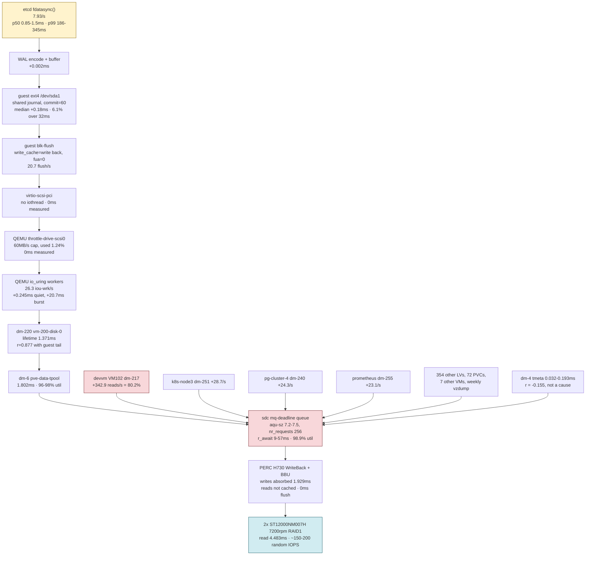

# Why etcd's fsync is slow on k8s-master

Research, 2026-09-06. Read-only throughout, nothing was changed to produce it.

Produced by a 15-agent workflow: five probes covering each layer between etcd's
`fdatasync()` and the platter, one adversarial refuter per probe, two impact
agents, two remedy agents and a synthesist. 2.09M tokens, 73 minutes.

## What I re-verified by hand

The workflow's claims are a subagent's report, so the load-bearing ones were
re-measured directly before publishing.

| Claim | Re-measured | Result |
|---|---|---|
| kube-scheduler / kube-controller-manager restarts | `kubectl get pods -n kube-system -o json` | 202 and 200 exactly. apiserver 10, etcd 1 |
| WAL fsync mean 11.05-11.94 ms | `increase(..._sum)/increase(..._count)` | 12.08 ms |
| etcd metric history is only 2.17 days | `time() - min_over_time(timestamp(...)[30d:1h])` | 189,064 s = 2.19 days, confirmed |
| dm-217 is devvm | `dmsetup info -c -j 252 -m 217` | `pve-vm--102--disk--0`, confirmed. dm-251 is VM 203 (k8s-node3) |
| etcd's own VM barely reads | 7d mean on dm-220 | 0.28 reads/s. etcd is a victim, it reads almost nothing |

## One correction to the attribution

The 80.2% share assigned to devvm is a conditional attribution over the windows
where etcd stalls, and it is not the share of the baseline. Over 7 days of host
metrics the read load on sdc spreads across four neighbours, and every one of
them can peak high enough to stall etcd on its own:

| LV | what it is | 7d mean reads/s | 7d peak reads/s |
|---|---|---|---|
| dm-8 `pve-nfs-data` | `/srv/nfs`, the 72 shared PVCs | 75.0 | 1,517 |
| dm-217 | devvm (VM 102) | 66.9 | 1,123 |
| dm-240 | a Kubernetes PVC | 44.3 | 786 |
| dm-251 | k8s-node3 (VM 203) | 20.3 | 1,508 |
| dm-255 | prometheus-data PVC | 4.3 | 492 |
| dm-220 | **k8s-master, etcd's own disk** | **0.28** | 72 |

sdc averages 305 reads/s over the same 7 days. While this document was being
written sdc was at 760 reads/s with `/srv/nfs` holding 96.5% utilisation and
devvm contributing 60 reads/s, so the top contributor is whoever happens to be
busy, not always devvm.

That changes the ordering of the fixes below. Capping devvm alone leaves three
neighbours that each reach 786 to 1,517 reads/s, so the per-VM cap treats one
instance of the problem. The cgroup `io.latency` guarantee treats the class,
because it protects etcd from whichever neighbour is loud at the time. The
ordering in "Do these three" has been changed to put it first. Also note dm-1
(`backup-data`) appears in a naive `topk` of busy devices but lives on sda, a
different physical disk, so it does not contend with etcd.

## The answer, in five sentences

etcd's fsync waits behind other people's **reads**, not behind its own writes. The 0.124 ms figure in the brief is sdc's *write* service time, and writes are absorbed by the PERC's battery-backed cache in 1.929 ms lifetime average across 1.32 billion writes, so they never touch a platter synchronously; reads are not cached, cost 4.483 ms lifetime average across 736 million of them, and they queue seven deep in front of etcd's next write. One neighbour VM supplies most of that queue: conditioning 14 days of etcd fsync on devvm's read rate, the 11.35% of time when devvm exceeds 150 reads/s carries fsync mean 71.08 ms against 4.36 ms the rest of the time, which is **73% of the entire mean fsync burden bought in 11% of the wall clock**. Apportioning the read surge in the windows where etcd stalls, devvm (VM 102, dm-217) is 80.2%, k8s-node3 6.7%, pg-cluster-4 5.7%, prometheus-data 5.4%, and etcd's own VM 1.6%. The causes are additive at p50 (every layer contributes a fraction of a millisecond and they sum to the measured 0.85-1.5 ms) but **not** additive at p99, where a single shared queue in front of a 7200 rpm spindle dominates everything above it, and each layer's apparent "tax" turned out on re-measurement to be that queue showing through.

**Correct the baseline before reading anything else.** The brief's "p99 WAL fsync 29.8 ms" is a single instant and every prior sizing against it was 6-10x too small. Measured from raw buckets:

| quantity | value |
|---|---|
| WAL fsync p50 | 0.85 - 1.5 ms |
| WAL fsync mean | 11.94 ms (14d: 11.05 ms) |
| WAL fsync p99 | 186 - 345 ms |
| backend commit mean | 22.28 ms |
| backend commit p99 | 492 - 508 ms |
| fsync rate | 7.93/s |
| distribution | 92.78% under 8 ms, 8.1-8.65% of 5-min windows "bad" |
| inside a bad window | mean 207 ms, p99 2,497 ms |

The distribution is bimodal. There is no typical fsync, there is a fast mode and a stalled mode, and the whole problem is how much time is spent in the stalled mode.

---

## The latency budget

Walking from `fdatasync()` to the platter. Every row is measured unless the confidence column says otherwise. p50 adds sum to the measured 0.85-1.5 ms; p99 adds do not sum, and the reason is row 6.

| # | Layer | p50 add | p99 add | Confidence | Evidence |
|---|---|---|---|---|---|
| 1 | etcd above the syscall (WAL encode, buffered writer) | 0.002 ms | not measurable | measured | `walWriteSec` sum 6.3304 s / 2,907,542 obs = 2.18 us/op. Lowest histogram bucket is `le=0.001`, so no p99 exists for this metric. 56% of WAL Save calls never fsync at all (2,907,542 writes vs 1,285,818 fsyncs) |
| 2 | MVCC compaction write-blocking lock | ~0 | 15.14 s/hour aggregate | measured | 34,239.8 pause observations over 48 h, sum 726,766.7 ms. That is 4.5% of the 337 s/hour of WAL fsync wall clock. Pause p50 2.258 ms, p99 484.1 ms |
| 3 | Guest ext4 journal + blk-flush batching | +0.18 ms | +8.3 ms paired, tail to 512 ms | measured | 180 s block tracepoints: 1,898 flushes, median in [128,256) us, mean 8.37 ms, 115 (6.1%) at ≥32 ms. etcd issues 16.56 `ext4_sync_file`/s; every other process on the box combined issues 0.5/s (3.0%). Single ext4 on /dev/sda1, no `--wal-dir` |
| 4 | virtio-scsi + QEMU (throttle group, main loop, io_uring) | +0.245 ms | +20.7 ms avg over a burst window, +202 ms worst 10 s bucket | measured | Quiet 61 s: dm-220 0.676 ms vs QEMU weighted write+flush 0.921 ms. Burst, 24 consecutive 10 s buckets: QEMU flush mean 29.933 ms vs dm-220 mean 9.283 ms; worst bucket dm-220 38.847 → QEMU 241.261 ms. Byte throttle contributes **0 ms** (1 Hz peak 782,336 B/s = 1.243% of the 62,914,560 B/s cap). No-iothread contributes **0 ms** (main kvm thread at 0.7% CPU, 7.5 us mean scheduler wait, fsync runs on `iou-wrk` workers) |
| 5 | dm-thin volume, pool, metadata device | −0.035 to +0.2 ms | +3.0 ms paired, r=0.877 with the guest tail | measured | Lifetime count-weighted write service: dm-220 1.371 ms, dm-6 tpool 1.802 ms, sdc 1.929 ms. **The thin volume is faster than the pool and faster than the raw disk**, so there is no additive dm-thin tax. tmeta answers in 0.032-0.193 ms and correlates with the tail at **r = −0.155**. Pool transaction id unchanged (28006 → 28006) over 60 s at ~7.9 fsync/s, so zero pool metadata commits happen on etcd's steady-state path |
| 6 | **sdc queue wait behind neighbour reads** | **+0.1 ms** | **+30 to +55 ms, and this row absorbs the rest** | measured | Live 60 s host delta: sdc3 at 537.4 r/s, **r_await 57.03 ms**, 98.9% util, while dm-220 does 32.2 w/s and pays 21.50 ms. Earlier window: aqu-sz 7.2-7.5 at r_await 9-11 ms, %util 67-71. Conditioned on etcd's own tail (4w): sdc reads 457.87/s bad vs 112.44/s good (4.07x), writes 384.09/s vs 194.43/s (1.98x). Host `/proc/pressure/io` some avg300 = 19.10% |
| 7 | PERC H730 cache | 0 ms | 0 ms | measured | Lifetime write service 2,553,880,817 ms / 1,323,817,373 writes = **1.929 ms**, below the 4.2 ms average rotational latency of a 7200 rpm platter, which is only possible with a cache absorbing the majority. BBU status stddev exactly 0 across 250,228 iDRAC samples over 26 weeks. Host flush counters read **0** on sdc, dm-6, dm-4, dm-220 over 163 s while etcd fsynced ~1,140 times, because `write_cache` = "write through" elides `REQ_PREFLUSH` |
| 8 | Platters, 2x ST12000NM007H 7200 rpm RAID1 | +0.117 ms (write, cached) | +4.5 ms per read | measured | smartctl -d megaraid confirms 7200 rpm 12 TB Seagates. Lifetime read service 4.483 ms across 736,029,594 reads. Random capacity roughly 150-200 IOPS |

### Reading the table

The guest submits the **same** write load in bad windows as in good ones and gets a 48x worse answer. Measured on /dev/sda inside VM 200 over 48 h, split by fsync health:

| metric (guest sda) | good windows | bad windows | ratio |
|---|---|---|---|
| io_time (fraction busy) | 1.70% | 63.24% | 37.2x |
| writes completed | 50.45/s | 36.31/s | 0.72x |
| bytes written | 247 kB/s | 306 kB/s | 1.24x |
| reads completed | 0.0053/s | 2.296/s | 435x |
| implied per-IO service | 0.34 ms | 16.4 ms | **48x** |

Offered load did not rise. Service time did. That localises the injection to below the guest block layer, and rows 4 through 6 are the candidates. Row 4's mechanisms were tested and disproved (the byte cap is 205x oversized, the main loop is 0.7% busy, io_uring workers carry the fsync, and busy-queue writes are 41% *faster* than idle-queue writes, which no serializer can produce). Row 5's mechanism was tested and disproved (tmeta is fast, negatively correlated, and no pool commits occur). Row 6 is what is left, and it is directly measured at 57.03 ms r_await under a 98.9% busy spindle.

Three things the brief listed as suspects contribute **exactly zero measured milliseconds**: the QEMU byte throttle, the missing iothread, and the dm-thin metadata commit path.

---

## The IO path

The contended resource is one node in that graph. Everything above `sdc mq-deadline queue` adds under a millisecond at p50 and is measured at or near zero contribution at p99. Everything below it is a battery-backed cache doing its job and a pair of enterprise SAS drives running at their rated speed.

---

## What the slow fsync costs

### Measurably hurting now

| Impact | Number | Source |
|---|---|---|
| kube-scheduler restarts | 202 in 44 days of pod age; 145 in 30 days; 17 in the last 24 h | `kube_pod_container_status_restarts_total` |
| kube-controller-manager restarts | 200 in 44 days; 144 in 30 days; 17 in the last 24 h | same |
| Cause of every one | `Put .../leases/<name>?timeout=5s: context deadline exceeded` then "leaderelection lost" | container logs, `--previous` |
| fsync p99 in windows with a scheduler restart | 3,438 ms, against 197.9 ms in the other 564 windows (17.4x) | 575 five-minute windows over 48 h |
| Lease PUTs over the 5 s client timeout | 380 of 143,631 (0.265%, 60/hour) | apiserver `/metrics` direct scrape, 6.30 h |
| Lease PUTs over 1 s | 7,645 (5.323%, 1,213/hour) | same |
| kube-apiserver restarts | 10 in 44 days, 2 in the last 24 h, last one SIGKILL exit 137 after 5 min 59 s for failing /livez | `lastState.terminated` |
| apiserver 500+504 rate, bad vs good fsync windows | 0.461/s vs 0.000368/s (**1,254x**) | 48 h conditioned |
| Pods stuck Pending, bad vs good windows | 2.094 vs 0.163 (12.8x) | 48 h conditioned |
| etcd slow-apply warnings | 13,358/hour measured today, against 3,157/hour recorded on 2026-06-28 (4.2x) | 2,412 warnings in a 650 s log window |
| etcd proposals failed | 1,181 in 45.88 h = 25.7/hour | `etcd_server_proposals_failed_total` |
| Vault raft fsync, same spindle | 122.21 ms in bad sdc windows vs 8.31 ms in good (14.7x), max 1,183.8 ms | 30 d conditioned |
| apiserver unreachable, 26 weeks | 319 minutes across 23 days; 275 of them (86%) on days with a documented sdc IO event | `up{job="kubernetes-apiservers"} == 0`, per-day |

Three post-mortems name etcd IO starvation as the direct cause of a control-plane outage: 2026-06-01 (64 min measured, Immich duplicate-detection storm), 2026-06-16 (28 min, apiserver crash-loop), 2026-06-24 (the 1.34→1.35 upgrade auto-rolled back, 1,180 slow applies in 16 minutes).

**Today, 2026-09-06, is the worst day in the visible record.** apiserver→etcd mean request latency peaked at 3.4486 s against a 0.9106 s worst case three days ago and a 4.0-4.5 ms quiet baseline. WAL fsync p99 saturated the top 8.192 s histogram bucket at 17 UTC. The apiserver was down 5 minutes at 13 UTC in the same hour fsync p99 read 5.72 s. All three of bead code-oflt's named reopen conditions have been met within three days of the risk being accepted.

### Latent risk

Zero Raft redundancy. One member, so a wedged etcd is a full control-plane stop with no failover. The recovery path is worse than the runbook states: `backup-etcd` runs `0 1 * * 0`, **weekly**, five snapshots kept, so RPO reaches 6.9 days. `docs/runbooks/restore-etcd.md` claims "Daily at 00:00", 30-day retention, and a backup path the CronJob does not use. A restore rolls 151 namespaces, 336 pods, 226 deployments and 158 PVCs back to the snapshot.

Host RAM is committed at 264 of 267 GB across running VMs, which is what blocks adding etcd members for HA.

### Honest negatives

- **The control plane copes 94% of the time.** 32 of 575 five-minute windows over 48 h (5.6%) had fsync p99 above 1 s; 306 (53.2%) were under 50 ms. 99.735% of lease PUTs finish inside the 5 s timeout.
- **Admission webhooks show zero timeouts** and zero calls over 1 s across all four registered webhooks in a 6.30 h window.
- **Kubelet node leases never come close.** Renewal every 10 s against a 40 s grace period, so a 5 s stall is invisible. Two Ready transitions on k8s-master over 2 days.
- **The external user path barely moves.** The blackbox HTTPS probe of status.viktorbarzin.me took 102.4 ms in bad windows against 98.1 ms in good, +4.3 ms.
- **etcd has never wedged or lost data.** Zero leader changes, zero health failures over 2 days, clean recovery from the 2026-07-18 unclean shutdown. Every documented failure is the apiserver giving up on a slow etcd.
- **The write side is shrinking, not growing.** sdc weekly average write IOPS fell from 596-697/s in March to 289/s this week, while reads climbed from 54-90/s to 304/s. Any framing that puts the regression on writes is measuring the wrong half.
- **t3 Code websocket drops are not this.** Measured 2026-06-26: the human-visible class is one user's cellular last mile, 92 force-closes in 14 days, 100% one user across 19 rotating UK cellular IPs. Moving etcd will not fix them.
- **The nightly PVC snapshot and the nfs-mirror rsync are not the systematic cause.** 00 UTC averages 0.2519 s and 03 UTC 0.2891 s of apiserver→etcd latency; the worst hour is 17 UTC at 0.5103 s. Evening human and agent activity, not the backup window.

---

## Fixes, ranked

Free and zero-downtime first. The SSD move for etcd sits last as the comparison baseline.

| # | Change | Cause it targets | Expected gain | Downtime | Cost | Effort |
|---|---|---|---|---|---|---|
| 1 | Read-IOPS cap on devvm. Extend `TARGETS` in `infra/scripts/apply-mbps-caps.sh` with `iops_rd=120,iops_rd_max=400,iops_rd_max_length=10` for VM 102. Leave VM 200 uncapped | 80.2% of the read surge. The live cap is bytes only (`iops-read 0` per QMP), and devvm uses 4.1% of it at 17 kB/read | mean 11.05 → **5.0-6.0 ms**; p99 345 → **120-180 ms**; p50 → ~1.0 ms | none, live `qm set` | free | minutes |
| 2 | cgroup v2 io.latency guarantee for etcd. `echo +io > /sys/fs/cgroup/qemu.slice/cgroup.subtree_control`, then `echo '8:32 target=10000' > .../200.scope/io.latency` | Every neighbour at once, work-conserving. Squeezes siblings only when etcd misses 10 ms | p99 → **100-200 ms** (medium-low confidence on magnitude, high on mechanism). Composes with row 1 | none | free | hours |
| 3 | Slow leader-election renewal on kube-controller-manager and kube-scheduler. `--leader-elect-lease-duration=60s --leader-elect-renew-deadline=45s --leader-elect-retry-period=15s`, via a new `null_resource` modelled on `stacks/rbac/modules/rbac/etcd-tuning.tf` | The trigger. Two static pods renew every 2.2 s = 0.912 writes/s to hold a lock against nobody on a single-node control plane | 0.912 → 0.203 writes/s, **7.8% fewer fsyncs**. No change to per-op latency | 5-15 s per pod, staggered. No apiserver impact | free | minutes |
| 4 | Same for the six CSI sidecar leases (nfs-csi, proxmox-csi Helm values) | 1.16 writes/s from six single-replica sidecars | 1.16 → 0.40 writes/s, **8.4% fewer fsyncs**. With row 3, 16% off the fsync rate | 20-40 s per controller pod. Existing mounts unaffected | free | minutes |
| 5 | Move devvm's disk to the SSD. `qm move-disk 102 scsi0 ssd --delete 1` (475 G free, 228 G needed) | Removes devvm from sdc entirely rather than slowing it. Strictly better than row 1 with no penalty to devvm | mean → **3.5-5.0 ms**; p99 → **70-150 ms**; p50 → ~0.8 ms | none for k8s, sub-second pivot. The mirror itself reads 228 G off sdc, so run it quiet | free | hours |
| 6 | Read-IOPS caps on dm-251 (k8s-node3), dm-240 (pg-cluster-4), dm-255 (prometheus-data) | The 19.8% of the surge that is not devvm | another **0.5-1.0 ms** off the mean once devvm stops masking it | none | free | minutes |
| 7 | Cut Kyverno ephemeral reports. `reportsController.enabled=false`, or narrow `resourceFilters` plus a shorter TTL, in `stacks/kyverno/modules/kyverno/main.tf`. Add `--leaderElectionRetryPeriod=15s` | 45,301 of etcd's 56,877 keys (79.6%) and 215 MB of 442 MB. A 121 MB LIST every 6m20s. Kyverno leases add 1.37 writes/s | Compaction pause 15.14 → **4-5 s/hour**; 1.07 fewer writes/s (11.8%); db 442 → ~225 MB. **Little disk gain** (96.6% of served bytes never reach a platter) | none if webhook failurePolicy allows a rolling restart | free | hours |
| 8 | `--bwlimit 40000` on `vzdump-vms` | Host-side unthrottled LV reads that bypass the QEMU cap. dm-217 hits 103.9 MB/s sustained against a 62.9 MB/s guest cap in 1.27% of samples | Removes one recurring cliff, 1-3 h/week. **Does not move the weekly p99** | none | free | minutes |
| 9 | `--backend-batch-interval=500ms` in `etcd-tuning.tf` | Backend commit wall clock, 280 s/hour, p99 507.6 ms | Commit count −40%, wall clock **40-70 s/hour** (15-25%). **No crash-loss window**, the WAL covers durability; the cost is buffer memory and serializable-read staleness | 30-90 s etcd static pod restart, full apiserver datastore outage | free | minutes |
| 10 | `--wal-dir` on the 10k SAS pair (VG backup, 2x ST1200MM0099). Needs an 8 G `lvreduce` of the backup LV first | The shared guest ext4 journal *and* the shared spindle. Takes ~9.2 fsync/s off sdc | p50 → **0.4-0.8 ms**; p99 → **20-50 ms**. Backend commit unchanged | backups paused 30-60 min for the shrink; one etcd restart. Bundle with row 9 | free (8 G of backup capacity) | hours |
| 11 | sdc queue tuning: `writes_starved` 2→1, `nr_requests` 256→64, `read_expire` 500→250; ionice the QEMU scopes | The queue itself. mq-deadline dispatches two read batches per write batch, backwards when the writes are a control plane | **2-5 ms** off the mean, unquantified at p99. Capped by dm-220's own queue depth of 0.10-0.29 | none, live sysfs | free | minutes |
| 12 | `IOSchedulingClass=idle` on the maintenance units; move `defrag-etcd` off `0 3 * * 0` UTC | Scheduled host IO. **Weak lever** and the evidence says so: the worst hour is 17 UTC with nothing scheduled | under **0.5 ms** off the mean | none | free | minutes |
| — | **LAST RESORT, the user's stated veto.** etcd on SSD. Full: `qm move-disk 200 scsi0 ssd`. WAL-only: 4 G LV in VG ssd + `--wal-dir` | Everything below the guest at once. The only remedy that does not depend on predicting another workload | p50 → **0.3-0.8 ms**; mean → **~0.5 ms** (20x); p99 → **2-10 ms** (30-100x). Best non-SSD outcome (rows 1+2+5) reaches mean 3.5-5.0, p99 70-150, so the SSD is worth another ~7x on the mean and 10-20x on the tail | full: none for the move. WAL-only: 10-30 s etcd restart | free with present hardware; **a mirror is not** | hours |

### Rejected, with the measurement that killed each

| Change | Why not |
|---|---|
| Remove or raise VM 200's byte throttle | 0 ms. 1 Hz peak is 1.243% of the cap, worst windows reach 306 kB/s against 60 MB/s (205x oversized), no burst bucket to drain. Poking it live is a pinned contributor to the 90-minute VM 102 wedge of 2026-06-11 |
| Add iothread to VM 200 | 0 ms on latency. Main kvm thread 0.7% CPU, 7.5 us mean scheduler wait, io_uring workers already carry the fsync, and busy-queue writes are 41% *faster* than idle-queue. Worth doing as a resilience change in a planned window, at 3-5 minutes of full control-plane outage |
| `etcdctl defrag` | Reclaims 67.4 MB of a db using 11.9% of its quota, buys 0 ms (bbolt commits only dirty pages), and costs 20-90 s of complete etcd unavailability on a single member |
| Thick LV for etcd outside the thin pool on sdc | Impossible. `vgs pve -o vg_free` = 16.25 GiB against a 64 G disk, and LVM cannot shrink a thin pool |
| PERC cache policy change | Already WriteBack with a healthy BBU. Lifetime write service 1.929 ms is below the 4.2 ms rotational floor, which cannot happen otherwise |
| Host RAM | All VM disks run `cache=none`, so guest reads are O_DIRECT and bypass the host page cache. Adding RAM cannot remove one sdc read. Also `/proc/pressure/memory` reads 0.00 on every field and 29,553 MB is available |
| Move swap off sdc | dm-2 does 2.52 r/s and 2.38 w/s lifetime and did not clear 1 IOP/s in a live sample |
| `--backend-batch-limit`, higher `--snapshot-count`, moving containerd off etcd's filesystem, guest mount options, `write_expire` | Each checked. Containerd, kube-apiserver, rsyslogd, svlogd and journald issued **zero** fsyncs on that filesystem in 180 s. `commit=60` is already set. dm-220's queue depth of 0.10-0.29 means `write_expire` cannot fire |

### Do these three, in this order

**1. Enable cgroup v2 `io.latency` on `200.scope`.** Promoted from second place. It is the only remedy that protects etcd from whichever neighbour is loud at the time, and the 7-day table above shows four of them can each reach 786 to 1,517 reads/s. Work-conserving, so nobody pays while etcd is fine.

*Proof it worked:* `cat /sys/fs/cgroup/qemu.slice/200.scope/io.stat` starts reporting per-device counters (it is empty today, because `io` is not delegated into `qemu.slice`), and `/sys/fs/cgroup/qemu.slice/102.scope/io.pressure` "some" rises during etcd's bad windows, which is the throttle proving it engaged. Then `quantile_over_time(0.99, (histogram_quantile(0.99,sum by (le)(rate(etcd_disk_wal_fsync_duration_seconds_bucket[5m])))*1000)[2d:5m])`.

**2. Cap devvm's read IOPS.** Reversible in seconds and costs nothing. It is the largest single contributor inside the stall windows, though not the largest over a 7-day baseline.

*Proof it worked:* `ssh root@192.168.1.127 'qm monitor 102 <<<"qom-get /objects/throttle-drive-scsi0 limits"'` shows `iops-read 120` rather than 0. Then after 48 h, `homelab metrics query 'sum(increase(etcd_disk_wal_fsync_duration_seconds_sum[2d]))/sum(increase(etcd_disk_wal_fsync_duration_seconds_count[2d]))*1000'` reads 5-6 ms against today's 11.05 ms, and the conditioned query on dm-217 above 150 r/s returns an almost empty window set.

**3. Slow the leader-election leases on the two static pods and the six CSI sidecars.** Cuts the trigger by 16% for free, and the flapping it stops is the largest measured consequence (289 restarts in 30 days).

*Proof it worked:* sample `kubectl get leases -A -o json` at 0.6 s for 24 s and count distinct `spec.renewTime` per lease. kube-system/kube-controller-manager and kube-system/kube-scheduler must fall from 0.456/s each to ~0.10/s, and the six CSI leases from 0.207/0.166 to ~0.07. Then `rate(etcd_disk_wal_fsync_duration_seconds_count[30m])` falls from 7.93 toward 6.7. Exercise the CSI path for real afterwards: create a throwaway PVC against each StorageClass, watch it bind, delete it, because a bad flag name shows up as a sidecar CrashLoopBackOff.

Reassess after those three before spending an etcd restart on row 9 or a backup shrink on row 10.

---

## What we could not measure

| Unknown | Exact command that would settle it |
|---|---|
| PERC VD cache policy read directly rather than inferred | Install the vendor tool, then `perccli64 /c0/v2 show all`. `perccli`, `storcli` and `megacli` are all absent from the host, and iDRAC's SNMP export carries only `r730_idrac_globalStorageStatus`, `physicalDisk` and power/thermal series, with no VD, cache-policy or BBU metric |
| Samsung 850 EVO wear level, which gates rows 5 and the SSD baseline | `smartctl -d megaraid,N -a /dev/sdb`, iterating N over the PERC device ids until the Samsung answers |
| Whether a `REQ_PREFLUSH` costs anything passing dm-220 → dm-6 → dm-5 → sdc | `bpftrace` on `__send_empty_flush` / `thin_bio_map` filtered on `REQ_PREFLUSH`, or `blktrace -a flush -d /dev/dm-220`. Device-mapper does not account flush-only bios (`flush_ios` and `flush_ticks` are 0,0 on every device), so no counter can answer this |
| A real per-request latency distribution at any layer, rather than quantiles of 5-minute averages | `bpftrace` biolatency histograms per device, run simultaneously on dm-220, dm-6 and sdc. node_exporter exports no per-disk latency histogram, which is why every host-side percentile in this document is either a quantile of window averages (marked) or a count-weighted lifetime mean from `/sys/block` |
| etcd metric history before 2026-09-04 15:00 UTC | Nothing settles this retroactively. `time() - min_over_time(timestamp(etcd_disk_wal_fsync_duration_seconds_count)[30d:1h])` = 187,553.975 s = **2.17 days**. Every `[30d]` and `[26w]` etcd-metric figure in every probe report, including some in this one, is bounded by 2.17 days of real samples, because PromQL truncates a range to whatever exists inside it without warning |
| etcd log history for the May and June incidents | Nothing. etcd's logs are not in Loki (no `etcd` job label) and the container log rotates every ~11 minutes at the current warning volume. `kubectl logs --since=720h` returned 9,108 lines spanning 650 seconds |
| apiserver-side `etcd_request_duration_seconds` between 2026-04-19 and 2026-07-19 | Nothing. There is a hole in the series covering the entire May/June incident period, so those incidents are quantified from post-mortems plus `up{job="kubernetes-apiservers"}` |
| Whether io_uring worker IO is charged to the right cgroup scope on kernel 6.14.11-4-pve, which gates row 2 | Enable the controller, then compare `cat /sys/fs/cgroup/qemu.slice/200.scope/io.stat` against a simultaneous `/proc/diskstats` delta for dm-220 |
| devvm's 436 w/s and 16 MB/s write burst in one 60 s host window, against ~100 kB/s from guest pidstat in a different window | `pidstat -d 1 60` inside devvm run simultaneously with the host `/proc/diskstats` delta, same wall clock. The two measurements do not reconcile and nobody has chased it |
| Whether etcd's read amplification lengthens anything | Already settled and worth recording as a negative: 0.427 guest read IOPS and 32.8 kB/s against 972 kB/s served, so 96.6% of served bytes never touch a disk. The 442 MB db sits inside 5.45 GB of guest page cache |

---

## Open questions

1. **How much of the fsync tail survives after rows 1, 2 and 3?** The estimate of mean 5-6 ms rests on the 14-day conditional split, which is a strong measurement but not an A/B. If the mean does not fall below 8 ms, the model is wrong and the next place to look is the host queue tuning in row 11 rather than more capping.

2. **What is the Samsung 850's wear level?** This gates two separate decisions. It gates row 5 (moving devvm's 228 G plus its write stream onto an unmirrored consumer SATA drive) and it gates the SSD baseline (putting a zero-redundancy control plane's only copy on the same drive). Until the drive can be read, both should be treated as unpriced.

3. **Should `backup-etcd` move from weekly to daily before anything touches etcd's storage?** Present RPO is up to 6.9 days and the runbook documents a schedule and a path that do not match the CronJob. That is worth fixing independently of this investigation, and it is a prerequisite for any change that puts etcd's data on a less redundant device.

4. **Is devvm's read storm actually necessary?** Nobody has looked at what generates 354 reads/s at 17 kB each. Its filesystem is 97% full (205 G of 223 G, 7.9 G free), which plausibly makes its IO smaller and more random than it needs to be, but no fragmentation measurement exists. `e4defrag -c` on the hot directories is read-only and would answer it.

5. **What explains the residual 17.8 ms between sdc's per-request accounting and dm-220's in the slow windows?** The dm-thin metadata-commit story is refuted (zero flushes, zero pool commits, tmeta at 0.032-0.193 ms and negatively correlated). Queue wait at the dm/tpool layer under a saturated sdc is the plausible remainder, but the mechanism is unmeasured and would need blktrace.

6. **Do we want a second SSD?** iDRAC reports exactly five physical disks and one of them is the Samsung, so an SSD mirror is not possible with the hardware present. That is the only item in this whole investigation that costs money, and it is the difference between "etcd on an SSD" being a reasonable end state and being a single point of failure with a weekly backup behind it.