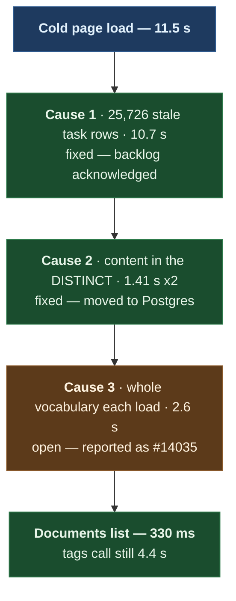

# Why Paperless-ngx feels slow, and why tag search is hard to find

Date: 2026-09-07, with the tags root cause added 2026-09-08
Scope: `pdf.viktorbarzin.me`, ns `paperless-ngx`. Investigated on 2.20.15; the
installation now runs 3.1.3 on the shared CNPG Postgres.
Status: done. All six recommendations were carried out, including the Postgres
migration. One cause is upstream and is reported as #14035. See "What was
done" at the end.

## Summary

```stats
11.5 s | cold load, before
330 ms | documents list, after
21x | faster
1 of 3 | causes left, and it is upstream
```

A cold load of the documents list settles after **11.5 s**. Three separate causes
stack up, and all three scale with corpus size, so Viktor's hunch that emo's
import is behind it is right. emo owns **10,951 of 11,331 documents (96.6%)**.

Ranked by measured contribution to that 11.5 s:

| # | cause | measured | fix cost |
|---|---|---|---|
| 1 | 25,726 unacknowledged task rows returned on every page load | 8.9 MB payload, 10.7 s of the 11.5 s | one command |
| 2 | The document `content` column dragged into a MySQL temp table | 1.41 s per query, twice per list load | config or migration |
| 3 | Whole tag/correspondent/type vocabulary fetched every load | 5,781 objects, ~2.6 s | needs upstream change |

All three were addressed. Causes 1 and 2 are fixed — the documents list went
from 6,971 ms to **330 ms**. Cause 3 was root-caused to a serializer bug in
paperless itself and filed as
[paperless-ngx#14034](https://github.com/paperless-ngx/paperless-ngx/issues/14034);
it is unfixed here by choice, because patching the image would cost us stock
upgrades.

One web worker (`GRANIAN_WORKERS=1`) means cause 1 also blocks causes 2 and 3
rather than overlapping with them.

Each cause was independent of the others. Reading down the diagram is reading
down the ranked list above, not a chain of causation.



## Cause 1 — the task backlog (the big one)

Every full page load calls
`/api/tasks/?task_name=consume_file&acknowledged=false`. That endpoint currently
returns **8,878,465 bytes** and takes 3.6–4.0 s server-side, 10.7 s in the
browser once queueing is counted.

```
total PaperlessTask rows    26,028
unacknowledged              25,726
  consume_file              19,603
  train_classifier           6,084
  check_sanity                  39
of the unacknowledged, FAILURE   9,579
oldest unacknowledged       2025-11-30
```

18,971 of the 19,603 unacknowledged `consume_file` rows were created in June
2026 — the emo bulk import. Paperless keeps these rows until someone
acknowledges them, and the UI asks for the full unacknowledged set with no
pagination.

Checked before recommending a clear: **failures stop at 2026-07-14**, and none
of the 558 July failures mention payslips. So acknowledging the backlog hides
nothing current, and it does not explain bead `code-oqyb` (no payslip since
2026-05-29) — nothing has attempted to consume a payslip at all.

## Cause 2 — `content` in the DISTINCT

`documents/views.py:788` builds the list queryset as
`Document.objects.distinct().annotate(num_notes=Count("notes"))`. Django emits a
`SELECT DISTINCT` over every column, `content` included, and MySQL materialises
that as a temp table before it can count or paginate.

The corpus holds **319 MB of `content`** across 11,331 rows: average 29.5 KB,
1,323 documents over 50 KB, and one at 5.9 MB. `tmp_table_size` is 16 MB, so it
spills to disk — `Created_tmp_disk_tables` increments once per query.

Same query, same rows, only the column list changed:

| query | time |
|---|---|
| `SELECT DISTINCT id, content, title, … COUNT(notes)` | **1.77 s** |
| the same without `content` | **0.05 s** |

The list view runs this twice per load, once for the count and once for the
page.

### The upstream fix does not help us

Upstream PR #13205 (merged 2026-07-23, first shipped in v3.0.1) removes exactly
this `.distinct()`, and reports 3.2 s → 1.8 s for a superuser on a 400k-document
corpus. Measured against our data, it makes no difference:

| variant | our timing |
|---|---|
| COUNT with `.distinct()` (2.20.15 today) | 1.407 s |
| COUNT without it (the v3.0.1 fix) | 1.496 s |
| PAGE50 with `.distinct()` | 1.480 s |
| PAGE50 without it | 1.436 s |

The `GROUP BY` from `annotate(Count("notes"))` materialises `content` whether or
not `DISTINCT` is present. The column is the cost, not the deduplication. An
upgrade is still worth doing for other reasons; it does not address this
particular cost.

### Postgres does avoid the cliff

Benchmarked on `pg-cluster` (PG 16.9, `work_mem` 16 MB, `shared_buffers` 2 GB)
against a shape-matched table — 11,331 rows, 261 MB of text, same 5.9 MB
outlier, same query:

| query | MySQL 8.4.8 | Postgres 16.9 |
|---|---|---|
| COUNT with DISTINCT | 1.407 s | **0.213 s** |
| PAGE50 with DISTINCT | 1.480 s | **0.208 s** |
| COUNT scoped to owner=root | 0.019 s | 0.020 s |

Roughly 6.6x, because Postgres TOASTs large text out of line and carries
pointers through the aggregate rather than 261 MB of inline value. Paperless-ngx
documents Postgres as the recommended backend; this is a concrete reason why.
The scratch database was dropped after measuring.

## Cause 3 — the whole vocabulary, every load

The Angular frontend fetches every tag, correspondent, document type, storage
path and custom field with `page_size=100000` to populate the filter dropdowns.

| object | count | owner |
|---|---|---|
| tags | 1,448 | all ownerless |
| correspondents | 2,470 | 2,419 owned by the `paperless-ai` service account |
| document types | 1,863 | 1,845 owned by `paperless-ai` |

The tags call alone takes 3.9 s cold. There is no pagination or lazy-load option
for these in 2.20.

Two things worth noting about the ownership column. All 1,448 tags are
ownerless, so every user sees the whole vocabulary — the dropdown lists every
tag in the system rather than emo's tags being private. And the enrichment
service, not emo, ended up owning the correspondents and types it created during
the import.

### Root cause found, and it is upstream

Traced on 2026-09-08, after the Postgres move. The tags call is **4.78 s wall
against 0.34 s of SQL**, so the database was never the constraint here.

`TagViewSet` prefetches the whole tag tree into `_children_map` and puts it in
the serializer context, so there is no N+1 query. But
`TagSerializer.get_children` then constructs a fresh nested
`TagSerializer(children, many=True, …)` for **every** tag, including the ones
with no children. Each construction runs DRF's `get_fields()`, which deep-copies
all 15 declared fields, at 2.19 ms a time.

All 1,448 tags here are flat. Not one has a parent or a child. So all 1,448
nested serializers are built to render an empty list.

cProfile over the serialization of the full list:

```
4530302 function calls (4311212 primitive calls) in 7.154 seconds

ncalls  tottime  cumtime  filename:lineno(function)
  1448    0.027    6.637  documents/serialisers.py:641(get_children)
  1449    0.193    6.127  rest_framework/serializers.py:1068(get_fields)
 10143    0.101    3.640  rest_framework/serializers.py:1280(build_standard_field)
```

`get_fields` runs 1,449 times: once for the list serializer, then once per tag.
The cost is linear in tag count, so it grows with the library rather than with
the tree.

| `page_size` | wall time |
|---|---|
| 10 | 1.31 s |
| 100 | 1.42 s |
| 400 | 2.11 s |
| 800 | 3.42 s |
| 1448 (all) | 4.78 s |

An early return when a tag has no children takes the serialization step from
**3.23 s to 0.09 s**, measured in isolation against the same 1,448 tags. We are
not carrying a local patch for it — the image stays stock, which is what keeps
Keel `major` safe.

Reported upstream as
[paperless-ngx#14035](https://github.com/paperless-ngx/paperless-ngx/issues/14035).

**Filing it took two attempts, and the reason is worth knowing before anyone
tries again.** The first ([#14034](https://github.com/paperless-ngx/paperless-ngx/issues/14034))
was created through the REST API and their issue bot closed it four minutes
later. The bot checks for the `bug`/`unconfirmed` labels that GitHub applies a
second or two after a form submission, and an outside contributor's `labels`
field is silently dropped by the API, so no API-created issue can ever pass. The
form has to be submitted in a browser; #14035 went through the cluster's headful
Chrome and kept both labels.

Two rules in their `CONTRIBUTING.md` also shape what such a report may contain:
anything written in whole or part by an AI tool must say so, and a report
written that way must describe observed behaviour only, without code analysis,
root-cause reasoning or a suggested fix. The live form carries a fifth
confirmation checkbox for exactly this that the copy on `main` does not. So the
analysis above stays in this document, and the upstream report carries the
timings, the scaling curve and the reproduction.

## Why tag search is hard to find

The filter exists and works. The **Tags** dropdown sits in the second filter row
on `/documents`, it has All/Any toggles and a "Filter tags" text box, and it
renders all 1,452 options in 835 ms. Full-text syntax works too:
`tag:invoice` in the search box returns 1,002 documents, and `type:` and
`correspondent:` behave the same way. (That count reads 1,313 later in this
document; the two were measured a day apart, either side of the search-index
rebuild the upgrade triggered.)

What makes it feel absent is the content of the list. It opens alphanumerically
on `2P+E Socket`, `4-spenlow-apartments`, `6-orchard`, `26.05.2025`,
`37-spenlow-apartments` — none of them Viktor's, and there is no owner scope on
the dropdown.

Of the 1,448 tags:

| tags used on | count |
|---|---|
| Viktor's documents | 216 |
| emo's documents | 1,357 |
| both | 125 |
| no document at all | 0 |

So 216 of 1,448 entries are relevant to Viktor, mixed in with the rest and
sorted together.

Some tag names also show mojibake — `A1 Áúëãàðèÿ` is Bulgarian read as Latin-1
instead of UTF-8 — which makes them hard to find by typing. Not measured further
here.

## A fourth thing, found along the way

22 of emo's documents carry OCR-misread creation dates in the future, up to the
year **2524**. The default documents view sorts by created descending, so those
22 occupy the top of the list. Page 1 is entirely emo's documents dated 2524,
2414, 2226, 2077 and 2076. Viktor's own recent documents are not visible on the
first page of his own default view.

## What actually helps, in order

| action | measured effect | risk |
|---|---|---|
| Acknowledge the 25,726 stale tasks | removes an 8.9 MB, ~4 s call from every page load | low — failures are all pre-2026-07-15 and already triaged |
| Save a view filtered to owner = Viktor, set it as the default | documents query 1.41 s → **0.019 s** (74x) | none, it is a UI setting |
| Raise `GRANIAN_WORKERS` above 1 | slow calls stop blocking the rest of the load | low, one env var; costs memory |
| Fix the 22 future-dated documents | Viktor's own documents return to page 1 | low, data edit |
| Move the database to the existing `pg-cluster` | list queries 1.41 s → 0.21 s | real migration, needs downtime and a plan |
| Upgrade 2.20.15 → 3.1.3 | no measured effect on this problem; Keel `policy=patch` will never offer it | major version jump, needs its own plan |

The first two are free and together address most of the 11.5 s. The rest are
judgement calls.

## Open questions

- Whether the `paperless-ai` service account owning 2,419 correspondents and
  1,845 document types is intentional, or should have been emo.
- How many tag names carry mojibake, and whether they are worth repairing or
  retiring. The vocabulary is deliberately frozen
  (`restrictToExistingTags=yes`), so this needs a decision rather than a script.
- Whether task rows should be acknowledged on a schedule, or whether the
  retention setting in 3.x covers it.

## How this was measured

- API timings: `curl` from the devvm against `pdf.viktorbarzin.me`, warm, best
  of three.
- Page load: Playwright against the real URL with a `root` session, Navigation
  and Resource Timing.
- View profiling: `cProfile` around Django's test client inside the pod.
- SQL: `connection.queries` with `DEBUG=True`, then the statements re-run
  directly, best of three.
- Postgres comparison: throwaway `paperless_bench` database on `pg-cluster`,
  shape-matched to the real content distribution, dropped afterwards. Presence
  claimed and released for the duration.

## What was done

Carried out on 2026-09-07, in this order. Each step was verified before the
next.

| # | change | how | evidence |
|---|---|---|---|
| 1 | Acknowledged the stale task backlog | Viktor, from the UI | `/api/tasks/?task_name=consume_file&acknowledged=false` went from 8,878,465 bytes to 2. Page payload fell 1,397 KB to 298 KB. |
| 2 | `PAPERLESS_WEBSERVER_WORKERS=3` | `stacks/paperless-ngx/main.tf`, commit `338edcd8`, CI #1598 | 5 granian processes in the pod, 820 Mi against an 8 Gi limit. |
| 3 | Repaired the 22 future creation dates | one-off script in the pod | 0 documents dated in the future. The list now opens on Viktor's own recent documents. |
| 4 | Saved view "My documents", owner-scoped | `/api/saved_views/`, id 1 | 381 documents, in the sidebar and on the dashboard. 0.376 s against 2.825 s for the unscoped list. |
| 5 | Keel policy `patch` → `major` | `stacks/paperless-ngx/main.tf`, commit `6214cc01`, CI #1599 | Keel log: `resource updated … previous=2.20.15 new=3.1.3`. |
| 6 | `PAPERLESS_SECRET_KEY` + startup/readiness probes | Vault `secret/paperless-ngx`, commit `454a2383` | 3.1.3 could not start without the key; see below. |
| 7 | Migrated MySQL → shared CNPG Postgres | `document_exporter`/`document_importer --data-only`, driven by a workflow; declared in commit `b04fdda9` | 11,334 documents, all 22 must-match tables exactly equal, `tag:invoice` returns 1313 on both sides. |

**The 3.1.3 rollout failed on the first attempt.** Detail below. It went forward
on the second and the installation now runs 3.1.3 on Postgres.

### Where it ended up

| endpoint | before | after |
|---|---|---|
| documents list | 6,971 ms | **330 ms** |
| statistics | 1,609 ms | 178 ms |
| tags, full vocabulary | 4,430 ms | 4,430 ms (unchanged — upstream, see Cause 3) |

The documents list is the one Viktor actually waits on, and it is 21x faster.
The tags call is untouched because its cost is serializer construction rather
than query time, so no database change could have moved it.

Credentials come from Vault via the `vault-database` ExternalSecret store, with
the usual 7-day static-role rotation and a Reloader annotation so the pod
restarts when the password changes. The stale 924 MB MySQL database is left in
place for a week as a rollback path; bead `code-lile` drops it on 2026-09-15.

### What the failed upgrade taught us

> [!WARNING]
> **3.x will not start without `PAPERLESS_SECRET_KEY`, and the breaking-change
> list does not mention it.** Anyone upgrading a 2.x install that never set one
> hits this, and the symptom is a total outage rather than a warning.

**3.x requires `PAPERLESS_SECRET_KEY`, and that is not in the release notes.**
2.20 accepted the literal `change-me` with a warning; 3.x raises
`ImproperlyConfigured` at settings import. The container died during
`init-migrations`, never started a web server, and every request returned 502.
The checks run beforehand covered the documented breaking changes (`mariadb` is
still a valid backend, we use no document encryption, no consume scripts, no
pybzar) and none of them named this. A newly-required setting and a removed one
are different categories, and the list covered the second.

**The database was never modified.** The failure is upstream of migrations, which
the rollback confirmed by reporting `No migrations to apply`. A full `mysqldump`
was taken first regardless: 142 MB gzipped from the 968 MB database, via a
one-off run of the existing `mysql-backup-per-db` CronJob.

> [!IMPORTANT]
> **A deployment with no probes cannot report a failed upgrade.** Keel recorded
> this rollout as a success while every request returned 502, because the only
> health signal was the s6 supervisor, which keeps running when everything under
> it has died.

**A dead container reported `Ready=true` for several minutes.** The deployment
carried no liveness, readiness or startup probe, so the only health signal was
the s6 supervisor still running, which it does even when every service under it
has failed. Keel recorded the rollout as a success. Probes were added in the same
fix.

**Recovery took one `kubectl set image` back to 2.20.15**, which is the
documented path for a bad Keel roll here since the image is Keel-owned and in
`ignore_changes`.

**The 2.20 to 3.x migration re-reads every document.** Migration
`0016_sha256_checksums` rehashes all 11,334 files from MD5 to SHA-256 off the
encrypted volume, logging progress every 500. Cold, that ran at about 7
documents per second (roughly 19 minutes); on a second attempt with the page
cache warm it managed 500 in 18 seconds. Nine further migrations and the search
index rebuild follow it, and several of the earlier ones (`version_index`,
`checksum`, `archive_checksum`) are full table copies of `documents_document`,
which carries the 319 MB of OCR text.

> [!CAUTION]
> **Set the startup probe budget before you start, not during.** A probe cannot
> be edited on a running pod, so a budget you discover is too short costs the
> whole migration and it restarts from zero. A 10-minute budget killed the first
> attempt at 8%. The value is now 240 x 10s, 40 minutes.

Budget the startup probe for that.

Two of those migrations bear on the findings above and are worth re-measuring
rather than assuming: `0022_add_perf_indexes` adds indexes, and
`0006`/`0009` add a `content_length` column to `documents_document`. The
"upstream fix does not help us" result was measured by hand-modifying the 2.20
query, not by running whatever 3.1.3 emits.

### Notes for whoever picks this up next

**The date repair guessed where it had to.** 6 of the 22 documents carried an
unambiguous date in their filename and were set to it (for example
`Тест ЗБУТ Емил Барзин 28.10.2024.pdf`, which had OCR'd as 2524-10-28). The
other 16 had no date in the filename and were set to their import date, which is
truthful rather than accurate. The full before/after map, all 22 rows with the
method used for each, is committed alongside this file as
`2026-09-07-paperless-date-repair-rollback.json`; the documents are emo's, so a
better date is his to supply.

**The upgrade needed care in two places.** The Keel policy annotation had to come
out of `ignore_changes` for Terraform to own it, because Kyverno's
`inject-keel-annotations` only fills the value in when it is absent (`+()`
syntax). And the policy must be `major`, never `force`: force ignores semver
ordering and rolled this same deployment from 2.20.15 back to 1.5.0 on
2026-07-14.

**A `Recreate` rollout on an RWO volume moves nodes.** The new pod was scheduled
to node4 while the volume was still attached to node2, which produced a
`Multi-Attach error` for about 25 seconds before the detach completed. Expected
rather than broken, but it means every paperless restart carries a short window
where the pod cannot start.

**A saved view cannot be a landing page.** Neither 2.20 nor 3.1.3 has a
default-view or start-page setting, so "My documents" is one click from the
sidebar rather than what `/documents` opens on.
