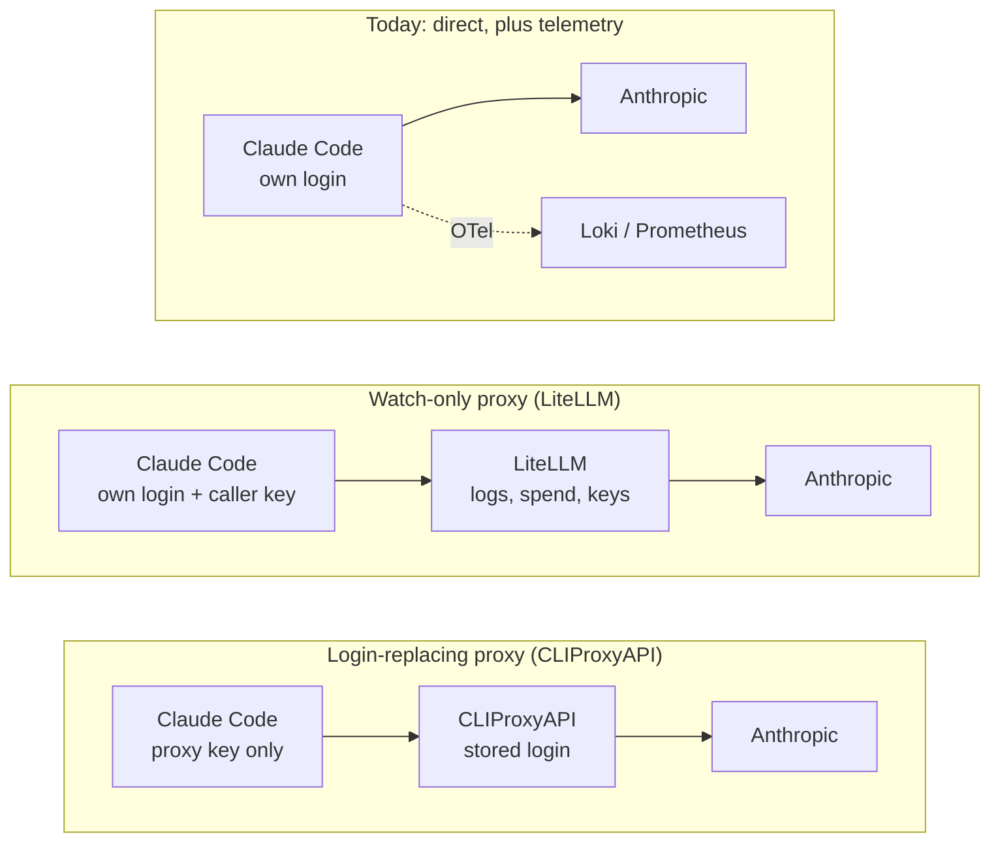

# A single view of AI sessions: LLM proxy research

Researched 2026-09-25 in a grill-with-docs interview with Viktor, plus two
research passes (one on CLIProxyAPI and Anthropic's terms, one inventorying the
AI clients on the devvm and in the cluster). Parked 2026-09-27.

**Status: parked.** Decision on 2026-09-27: keep individual keys per user and per
service, as today. This document is the starting point if key management becomes
a problem and the question comes back.

## The question

Could something like [CLIProxyAPI](https://github.com/router-for-me/CLIProxyAPI)
give us a single view of all AI sessions, first on the devvm and then across the
cluster?

## What the view would need to do

These are Viktor's answers from the interview.

| Question | Answer |
|---|---|
| What should it let you do | See every running agent session in one list; open any session and read its full transcript; see spend per person and per service; hold credentials centrally, with a key per caller and one place for logins |
| Which sessions | Agent CLIs on the devvm (Claude Code and Codex, every user, every entry point) and agents running in the cluster |
| Who sees what | Everyone sees their own sessions; administrators see everyone's. Cluster agents are visible to administrators only |
| What one row is | One agent session (defined below) |
| Where it lives | A dedicated UI for sessions, cost and auth. The proxy's own UI if it has a suitable one, integrated with Terminal Lobby where possible |
| Transcript depth | Full: prompts, replies, tool calls and their output |
| Retention | 1 year |

### Proposed vocabulary

These terms were drafted for Terminal Lobby's `CONTEXT.md` during the interview
and held back when the work was parked. In Terminal Lobby, **Session** already
means a tmux session, and agent-api's **Conversation** is also a tmux session
(`agent-api/conversations.go`), so the unit needed its own name.

**Agent session**: one conversation an agent holds with a model, identified by
the id the agent itself assigns (a Claude Code session id, a Codex thread, a
cluster agent's run). The id decides everything: `/clear` mints a new one and so
starts a new agent session, `--resume` carries the same one into a new process
and so continues it, and subagents and teammates carry their parent's and so
belong to it. A tmux Session can host several over its life; a cluster agent's
agent sessions have no tmux Session at all.
_Avoid_: AI session, conversation, session on its own, thread.

**Cluster agent**: an agent that runs in the Kubernetes cluster rather than on
the devvm, driven by a service, a bot or a pipeline instead of a person at a
terminal. Its agent sessions belong to no OS user, so only an administrator
sees them.
_Avoid_: bot, service agent, headless agent (a devvm `claude -p` is headless too).

## What exists today

Measured 2026-09-25. Figures marked "inventory pass" come from the research pass
and were not re-measured; the rest were checked directly.

### AI clients

| Client | Where | Credential | Telemetry today |
|---|---|---|---|
| Claude Code, wizard | devvm: lobby, SSH, t3, agent-api | own setup-token, `secret/workstation/claude-users/wizard`, loaded by `/etc/profile.d/25-claude-oauth-token.sh` | OTel to Loki and Prometheus (ADR-0025) |
| Claude Code, emo | devvm | own setup-token, `secret/workstation/claude-users/emo`. Its telemetry carries the same organization and account ids as wizard's | OTel |
| Codex CLI | devvm; wizard ran 20 rollouts in 30 days, other users none | one shared ChatGPT login, `/opt/codex-shared/auth.json` | none; the lobby's spend panel reads wizard's rollout files |
| claude-agent-service, with the fixer CronJob and 8 app callers | ns `claude-agent` | OAuth token, `secret/claude-agent-service` | app logs, including one `fixer-run` line per job with `cost_usd`; no OTel |
| claude-breakglass | ns `claude-breakglass` | the same token as claude-agent-service (inventory pass) | app logs |
| trading-bot | ns `trading-bot` | wizard's devvm token, used through the Anthropic Python SDK (inventory pass) | app logs |
| llama-swap consumers: lesson-harvester, nextcloud-todos, tripit, paperless-ai | cluster | none, local models | llama-swap access logs |
| OpenClaw, hermes-agent, executor | OpenClaw at 0 replicas since 2026-09-04; hermes-agent and executor retired 2026-09-02 | Vault paths remain | n/a |

No Woodpecker pipeline calls an LLM directly.

### Volume, 30 days to 2026-09-25

| Scope | Sessions or runs | Cost, Claude Code's own list-price estimate |
|---|---|---|
| wizard, devvm | 530 sessions | $45,739 |
| emo, devvm | 37 sessions | $1,214 |
| devvm sessions with no `os_user` label (t3 and non-login launches) | 51 sessions | $174 |
| claude-agent-service | 35 job runs (inventory pass) | about $101 |
| llama-swap | 1,856 requests (inventory pass) | $0 |

Cost comes from `sum by (os_user) (increase(claude_code_cost_usage_USD_total[30d]))`.
These are Claude Code's estimates at list price, not the Enterprise invoice.

### Today's views

- **Loki and Prometheus (ADR-0025)** cover every devvm Claude surface. t3 sessions
  arrive without `os_user`, because the t3 unit does not source profile.d.
- **`sudo homelab claude-usage`** reads devvm transcripts for wizard and emo. It
  has no cost, no Codex and nothing from the cluster.
- **Terminal Lobby** shows one user's sessions at a time, and an administrator
  can open a Lens onto one other user. The Claude half of the Agent spend panel
  is empty (see the findings at the end).
- **`claude agents --json`** lists the calling user's live sessions only.
- **Not covered by any of them:** claude-agent-service and its callers, the
  fixer, breakglass, trading-bot, and Codex beyond wizard's own files.

### Network path

devvm Claude and Codex processes go straight to Anthropic and OpenAI, with no
proxy variables set. The cluster namespaces that call LLMs have only the Calico
policy `wave1-egress-observe-tier34` (log, then allow). No LLM gateway is
deployed: no LiteLLM, CLIProxyAPI, Portkey, Helicone or Langfuse appears under
`stacks/`.

## Options researched

### CLIProxyAPI

A Go server (MIT). It logs in to subscription accounts with OAuth, or takes API
keys, stores those credentials, and serves OpenAI-, Anthropic- and
Gemini-compatible endpoints, spreading load across accounts. The research pass
found 53.2k stars, v7.3.17 released on 2026-09-24, about 1.4 releases a day over
the previous ten weeks, and one main maintainer.

- **Usage view.** Release v6.10.0 (2026-05-01) removed it: "chore: remove usage
  tracking and logging functionality". The Management Center's pages are
  Dashboard, Config Panel, AI Providers, Auth Files, OAuth, Quota Management,
  Logs and System, with no usage, request-history or session page.
- **What remains** (research pass): an opt-in in-memory usage queue. Records are
  kept 60 seconds by default and carry the caller's proxy key, the upstream
  account, model, tokens and, since 2026-09-04, a `session_id`. There is no
  Prometheus or OTel export.
- **Request path** (research pass): clients authenticate with a proxy key, and
  the proxy substitutes one of its stored credentials. The pass found no mode
  that forwards the caller's own Anthropic token. Its "cloaking" rewrites
  requests from non-Claude-Code clients to look like Claude Code; since v7.3.17,
  Anthropic-format requests pass through unchanged unless cloaking is configured.

Three community add-ons, listed in its README, restore a usage view:

| Add-on | What it shows | Notes |
|---|---|---|
| [CPA-Manager-Plus](https://github.com/seakee/CPA-Manager-Plus) | request history, cost per model, account and key, account health and quotas | 3.6k stars, MIT, SQLite, reads the usage queue. Its README does not mention session grouping |
| [CPA Usage Keeper](https://github.com/Willxup/cpa-usage-keeper) | usage and cost dashboards, request events | 1.2k stars, MIT, SQLite, 90-day hot window |
| [cliproxyapi-dashboard](https://github.com/itsmylife44/cliproxyapi-dashboard) | key management with per-user ownership, usage analytics | 263 stars, MIT, Postgres, multi-user login |

### Anthropic's terms for subscription credentials

From [Claude Code's legal and compliance page](https://code.claude.com/docs/en/legal-and-compliance),
fetched 2026-09-25:

> OAuth authentication is intended exclusively for purchasers of Claude Free,
> Pro, Max, Team, and Enterprise subscription plans and is designed to support
> ordinary use of Claude Code and other native Anthropic applications.

> Anthropic does not permit third-party developers to offer Claude.ai login into
> their own applications, or to route requests through Free, Pro, or Max plan
> credentials on behalf of their users. Moreover, developers may not collect,
> store, or intermediate Claude.ai credentials or session tokens — sign-in to a
> Claude account must complete through Anthropic's own flow.

> Anthropic reserves the right to take measures to enforce these restrictions
> and may do so without prior notice.

How this applies here is not settled. The routing sentence names Free, Pro and
Max plans. The storing sentence names no plan and is addressed to developers
building products; a homelab relaying its owner's own Claude Code traffic is not
clearly covered either way. In the interview we agreed the practical risk is low
for genuine Claude Code traffic passing through a proxy. Anthropic's January 2026
enforcement targeted clients that spoofed the Claude Code harness, and Anthropic
described the automatic account bans in that rollout as an error it was
reversing ([VentureBeat, 2026-01-09](https://venturebeat.com/technology/anthropic-cracks-down-on-unauthorized-claude-usage-by-third-party-harnesses)).

wizard's and emo's sessions report the same organization and account ids, and
trading-bot uses wizard's token, so an enforcement action on that account would
reach all of them at once. Which account claude-agent-service's token belongs to
was not checked.

### Anthropic's own gateway (Claude apps gateway)

[Claude apps gateway](https://code.claude.com/docs/en/claude-apps-gateway) is
built into the `claude` binary (`claude gateway --config gateway.yaml`) and runs
with Postgres. Developers sign in through the organisation's identity provider,
and the gateway holds one upstream credential: "Amazon Bedrock credentials,
Claude Platform on AWS credentials, Google Cloud credentials, a Microsoft Foundry
resource, or an Anthropic API key".

- Usage is billed per token to that upstream account; claude.ai subscriptions
  are not used. At list price, the last 30 days here would have been about $47k.
- Per-user and per-group spend caps are set through an admin API
  (`/v1/organizations/spend_limits`). There is no built-in web UI; telemetry goes
  to your own OTLP collector.
- "There is no service-token flow for unattended pipelines", so pods and CI
  cannot sign in.

### Watch-only gateways: LiteLLM

Anthropic documents a gateway that observes without holding the login
([Other LLM gateways](https://code.claude.com/docs/en/llm-gateway#subscriptions-and-gateways)):

> Setting only that variable, without a gateway credential, doesn't replace the
> subscription. Requests still route through the gateway, but a saved claude.ai
> login remains the active credential, so its usage limits and billing apply.
> Gateways that pass this traffic on to Anthropic must forward the OAuth
> capability in `anthropic-beta`.

LiteLLM supports this mode, and its
[tutorial](https://docs.litellm.ai/docs/tutorials/claude_code_max_subscription)
describes it: the proxy sets `forward_client_headers_to_llm_api: true`, and each
client sets `ANTHROPIC_CUSTOM_HEADERS="x-litellm-api-key: Bearer <key>"`. Each
caller then has its own LiteLLM key while its own login authenticates upstream.

- **Sessions.** LiteLLM reads `x-claude-code-session-id` as the session id when
  its own session headers are absent, stores it in its spend logs, and the Admin
  UI logs page groups requests by it ([request headers](https://docs.litellm.ai/docs/proxy/request_headers)).
- **UI.** Usage (spend per key, user, team and model), Logs (one row per request;
  bodies only when `store_prompts_in_spend_logs` is on), Session Logs, and Keys
  with optional budgets. It can also hold the OpenRouter, NVIDIA and OpenAI keys
  centrally and give each service its own LiteLLM key.
- **Licensing.** The admin UI, virtual keys, users, teams, logging and Prometheus
  metrics are free. SSO beyond 5 users, audit logs and delegated admin roles are
  paid.
- **Not covered.** Session titles and live state, and readable transcripts: the
  stored bodies are raw API calls, each carrying the conversation so far.

### Langfuse

From the research pass, not re-checked: Langfuse ingests OpenTelemetry traces and
shows sessions and cost, with no keys or auth view. Claude Code's trace export is
in beta. Self-hosting Langfuse v3 runs Postgres, ClickHouse, Redis and
S3-compatible storage.

### What any proxy changes in Claude Code

From Anthropic's [feature availability](https://code.claude.com/docs/en/feature-availability)
page and the 2.1.282 binary:

- "Whenever `ANTHROPIC_BASE_URL` points at a host other than `api.anthropic.com`,
  Claude Code turns off features such as Remote Control and server-managed
  settings, whatever the gateway forwards."
- MCP tool search turns off behind a non-first-party base URL. The binary's own
  message: "Set ENABLE_TOOL_SEARCH=true (or auto / auto:N) if your proxy forwards
  tool_reference blocks."
- A proxy whose key replaces the claude.ai login (CLIProxyAPI, Claude apps
  gateway) also loses the features that require a Claude subscription: cloud
  sessions, Routines (`/schedule`), Ultrareview, Code Review, the Chrome
  extension, Artifacts, voice dictation and claude.ai MCP connectors. A
  watch-only proxy keeps the login, so it does not lose these for that reason.
  Whether each one still works behind a custom base URL was not tested: the docs
  name Remote Control and server-managed settings as examples ("such as"), not as
  a complete list.
- Routing hint headers (request class, agent type, compaction) are off by default
  behind a custom base URL; `CLAUDE_CODE_GATEWAY_HINT_HEADERS=1` turns them on.

### What Claude Code telemetry can already carry

Checked in the installed 2.1.282 binary:

- Log switches: `OTEL_LOG_USER_PROMPTS` (on here since ADR-0025),
  `OTEL_LOG_ASSISTANT_RESPONSES`, `OTEL_LOG_TOOL_CONTENT`, `OTEL_LOG_TOOL_DETAILS`
  and `OTEL_LOG_RAW_API_BODIES` (inline, or `file:<dir>` with an `index.jsonl`).
  A full transcript can therefore travel over the pipeline ADR-0025 already runs,
  from every Claude Code instance, including cluster agents that run the harness.
- On the wire, every request carries `X-Claude-Code-Session-Id`, and requests from
  subagents add `x-claude-code-agent-id` and `x-claude-code-parent-agent-id`
  ([gateway compatibility guide](https://code.claude.com/docs/en/llm-gateway-protocol)).

## Comparison

| Option | Sessions | Cost | Auth | In the request path | Claude Code features lost |
|---|---|---|---|---|---|
| CLIProxyAPI + CPA-Manager-Plus | request history, not grouped by session | per model, account, key | stored logins, keys, quotas | yes | Remote Control, server-managed settings, and everything tied to the claude.ai login |
| LiteLLM, watch-only | request logs grouped by Claude's session id | per key, user, model, with budgets | a key per caller | yes | Remote Control, server-managed settings, possibly others (untested) |
| Claude apps gateway | none built in | per user via the admin API | SSO, spend caps | yes | as CLIProxyAPI, plus per-token billing (about $47k for the last 30 days) |
| Langfuse fed by telemetry | sessions and traces | per session and user | none | no | none |
| Terminal Lobby page on telemetry and Vault (build) | live list with state, full transcripts | per person and service | inventory of every login and key | no | none |

None of the off-the-shelf options shows live state (working, or waiting for a
person). Only Terminal Lobby knows that, through Claude Code's hooks.

## Where the discussion stopped

LiteLLM in watch-only mode was the leading off-the-shelf candidate: it is the one
option that covers sessions, cost and auth while leaving each tool's claude.ai
login in place. The build alternative was an Agents page in Terminal Lobby on top
of telemetry and Vault. A throwaway LiteLLM trial on the devvm was proposed, to
see the UI with a real session and to confirm the Enterprise seat works through
watch-only mode. It was not run.

## Open questions

- Does LiteLLM's watch-only mode work with this Enterprise seat's setup-tokens?
  A trial would settle it.
- Does CLIProxyAPI's Claude login work with an Enterprise SSO seat?
- Can Codex's ChatGPT login go through LiteLLM?
- Does the Enterprise organisation push server-managed settings to this seat? Any
  proxy would turn them off.
- trading-bot calls the Anthropic Messages API with an OAuth token through the
  Python SDK (inventory pass). Memory #9654 recorded that path as rejected in
  July; whether it succeeds today was not checked.

## Findings along the way

Differences between the docs and the live system, noticed during the research:

- Terminal Lobby ADR-0023 says the spend recorder is wired through managed
  settings. Neither the live `/etc/claude-code/managed-settings.json` nor its
  source in `scripts/workstation/managed-settings.json` has a `statusLine`, and
  `/var/lib/tmux-api/spend/` is empty.
- ADR-0025 says leaving `OTEL_METRICS_INCLUDE_SESSION_ID` unset keeps `session_id`
  out of metrics. Live, the `claude_code_*` series carry `session_id`:
  `claude_code_token_usage_tokens_total` had 34 distinct values on 2026-09-27.
- The profile.d comment says "NEVER a shared token", but trading-bot,
  orchestrator-sandbox and claude-agent-service's spare-1 hold wizard's personal
  devvm token (inventory pass, by fingerprint).
- hermes-agent and executor were retired on 2026-09-02; their Vault paths remain.
- `secret/openclaw` holds an OpenAI `sk-svcacct` key, which is pay-per-token
  (inventory pass).
- The bake-off plan says orchestrator-sandbox is removed after the sprint. The
  sprint stopped on 2026-09-24; the namespace and its `claude-oauth` secret still
  exist (inventory pass).

## Sources

- CLIProxyAPI: [repository](https://github.com/router-for-me/CLIProxyAPI),
  [v6.10.0 release](https://github.com/router-for-me/CLIProxyAPI/releases/tag/v6.10.0),
  [Management Center](https://github.com/router-for-me/Cli-Proxy-API-Management-Center)
- Anthropic: [legal and compliance](https://code.claude.com/docs/en/legal-and-compliance),
  [gateways](https://code.claude.com/docs/en/gateways),
  [Claude apps gateway](https://code.claude.com/docs/en/claude-apps-gateway),
  [spend limits](https://code.claude.com/docs/en/claude-apps-gateway-spend-limits),
  [other LLM gateways](https://code.claude.com/docs/en/llm-gateway),
  [gateway compatibility guide](https://code.claude.com/docs/en/llm-gateway-protocol),
  [feature availability](https://code.claude.com/docs/en/feature-availability)
- LiteLLM: [Claude Code with a subscription](https://docs.litellm.ai/docs/tutorials/claude_code_max_subscription),
  [request headers](https://docs.litellm.ai/docs/proxy/request_headers),
  [UI logs](https://docs.litellm.ai/docs/proxy/ui_logs),
  [enterprise features](https://docs.litellm.ai/docs/enterprise)
- Related here: [ADR-0025, Claude session telemetry](../adr/0025-claude-session-telemetry.md);
  Terminal Lobby `CONTEXT.md` and ADR-0023 (agent spend)
