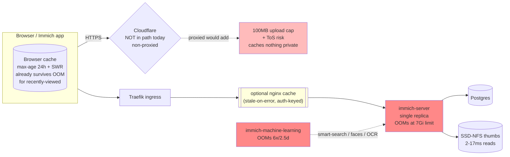

# Should we put a cache in front of Immich?

**Status:** research / recommendation — 2026-07-12
**Author:** research agent (for Viktor)
**Scope:** reliability + perceived-speed of photo viewing/downloading on
`immich.viktorbarzin.me` (Immich v3.0.2, ns `immich`).
**Note on location:** no `docs/research/` dir existed before this; created it to
match the `architecture/ runbooks/ plans/ post-mortems/` sibling convention.

---

## TL;DR

**Do not add a fronting cache as the first move. Fix the OOMs instead — that is
the only intervention that touches the failure the request actually hits.**

- The reliability pain (dropped requests → 502s) comes from **`immich-server`
  getting OOMKilled**, not from a missing cache. Live 7-day peak working set is
  **6.90 GiB against a 7 GiB limit** (server) and **3.49 GiB against a 3.5 GiB
  limit** (machine-learning, pegged → 6 restarts in 2.5 days). Raising those
  limits is a **risk-free, one-line Terraform change** (limits don't reserve host
  RAM — [[6705]]) and is the highest impact/effort fix by a wide margin.
- A shared fronting cache is **structurally hard to do safely** here: every hot
  path (`/api/assets/{id}/thumbnail|original|video/playback`) returns
  `Cache-Control: private`. A shared cache must be explicitly told to **ignore
  `private`**, and the moment it does, the cache key becomes the *only* thing
  standing between one user's photos and another's. That is the load-bearing
  security risk, and it is the same risk on Cloudflare, Souin, and nginx.
- **Cloudflare free tier cannot help the authenticated paths at all** — and would
  actively hurt: enabling the proxy adds a 100 MB upload cap and a ToS problem for
  serving a media library, while caching *nothing* on the hot paths (custom cache
  key = Enterprise-only). Immich is deliberately `non-proxied` today; keep it that
  way.
- Browser-side caching is **already good** and needs no change: immutable web
  assets are cached for a year; asset media is `max-age=86400` + ETag, so any
  photo viewed in the last 24 h already survives an origin OOM from the browser
  cache without a fronting cache existing.
- **If** stale-on-error resilience is still wanted *after* the OOM fix, the only
  defensible build is a small **nginx caching sidecar** in front of the
  `immich-server` Service, with an auth-scoped `proxy_cache_key`. It is a real
  security surface and should be a deliberate second step, not a reflex.

**Single recommended next step:** raise `immich-server` memory limit 7 Gi → 10 Gi
and `immich-machine-learning` 3584 Mi → 4608 Mi in `stacks/immich/main.tf`, apply,
and watch OOM/restart counts for a week before considering any cache.

---

## 1. Current-state findings (all verified live or in source)

### 1.1 Cloudflare is NOT in Immich's request path today

`stacks/immich/main.tf:1071` sets `dns_type = "non-proxied"`, i.e. a direct
A/AAAA record, not the Cloudflare `*` wildcard proxy.

Verified live (2026-07-12):

```
$ dig +short immich.viktorbarzin.me      → 10.0.20.203 (internal split-horizon;
                                            public non-proxied A = SOFIA WAN IP)
$ curl -I https://immich.viktorbarzin.me/ → no cf-ray, no "server: cloudflare",
                                            x-powered-by: Express (origin direct)
```

So "add a cache at Cloudflare" is not a tweak — it requires **flipping Immich to
proxied (orange-cloud)**, which has its own costs (§3a). This corrects the framing
in the task brief ("public DNS goes through Cloudflare"): the *zone* does, but this
*record* is a deliberate bypass.

### 1.2 Cache headers Immich v3 actually sends

Source of truth: `CacheControl` enum + `sendFile()` in immich-app/immich
`server/src/utils/file.ts` (verified against the tag running here), cross-checked
with live `curl` through the public Traefik path using a real API key.

| Path | `Cache-Control` (live) | Other |
|------|------------------------|-------|
| `/` (web shell) | `no-store` | `etag` |
| `/_app/immutable/*.js,.css` | `public,max-age=31536000,immutable` | `etag`, `last-modified` |
| `/api/assets/{id}/thumbnail` (`?size=thumbnail\|preview`) | `private, max-age=86400, no-transform, stale-while-revalidate=2592000, stale-if-error=2592000` | `etag`, `last-modified`, `accept-ranges: bytes` |
| `/api/assets/{id}/original` | *(same as thumbnail)* | ditto; `Range` → **206** confirmed |
| `/api/assets/{id}/video/playback` | *(same — `CacheControl.PrivateWithCache`)* | range/206 |
| `/api/server/*` | *(none)* | — |

In source these are two enum values:
`PrivateWithCache = "private, max-age=86400, no-transform, stale-while-revalidate=2592000, stale-if-error=2592000"`
and `PrivateWithoutCache = "private, no-cache, no-transform"`.

**Three consequences that drive everything below:**

1. **The web shell is `no-store`** (not the header-less origin that bit us with
   ImmichFrame in [[7088]]). A naive fronting cache will **not** cause a
   stale-black-shell SPA bug here, because Immich explicitly forbids storing the
   shell. Good.
2. **Static web assets are already perfectly cacheable** by the browser
   (`immutable`, 1 year) — no cache layer needed for them.
3. **Every photo/video byte is `private`.** Per RFC 9111 §5.2.2.7 / MDN, `private`
   means *"can be stored only in a private cache (e.g. browsers)"* — a shared
   cache (CDN, Traefik plugin, nginx) **must not store it** unless explicitly
   configured to ignore the directive. This is the crux of the whole question.

### 1.3 What the browser cache already buys (reliability, for free)

- `max-age=86400`: a photo viewed in the last 24 h is served from the **browser**
  cache without touching the origin — so it already survives an `immich-server`
  OOM. This is the single biggest existing reliability cushion and it needs no
  infrastructure.
- `stale-while-revalidate=2592000`: Chromium serves the stale copy while
  refreshing in the background (nice for perceived speed on revisit).
- `stale-if-error=2592000`: **do not count on this in the browser.** `stale-if-error`
  (RFC 5861) is a directive that *shared caches* honor; it is essentially
  unimplemented in browser HTTP caches (Chromium ships `stale-while-revalidate`
  but not `stale-if-error`). It only produces a reliability win if a **shared
  cache in the path** honors it — which brings us back to the `private` problem.

### 1.4 Auth model (the security frame)

Per [[7902]] and `main.tf:1067-1070`: the ingress is `auth = "app"` — Authentik
forward-auth was deliberately removed from `/api/*` because it 302'd native
clients. The gate is Immich's own auth, presented four ways:

- session **cookie** (`immich_access_token`), `Authorization: Bearer <jwt>`,
  `x-api-key: <key>` header, or `?key=<token>` for **public shared links**.

Immich enforces per-asset authorization **at the origin on every request**. A
shared-cache HIT is served **before** the request reaches the origin, so a cached
URL bypasses that check entirely. Hence: any shared cache must key on the auth
identity, or it leaks (§4).

### 1.5 Live resource + traffic reality

| Container | requests | limit | 7-day peak WSS | verdict |
|-----------|----------|-------|----------------|---------|
| `immich-server` | 7 Gi | 7 Gi | **6.90 GiB** | OOMs on spikes (limit ≈ peak); OOMKilled 01:07 today |
| `immich-machine-learning` | 3584 Mi | 3584 Mi | **3.49 GiB** | **pegged at limit**, 6 restarts / 2.5 d |
| `immich-postgresql` | 4 Gi | 4 Gi | 2.39 GiB | healthy |

Namespace quota (`kubernetes_resource_quota.immich`): `limits.memory 16896Mi / 40Gi`,
`requests.memory 16896Mi / 24Gi` — **ample headroom** to raise limits.

Traffic last hour (from brief): ~11k req, 663× 499 (client-cancelled, ~5.6 %),
141× 206 (video/range), **0× 5xx** in that window; ~4× 502 over 6 h coincide with
server restarts. The 499s are users scrolling faster than **first-view** thumbnail
delivery — a cache miss still hits the origin, so a fronting cache does **not**
fix first-scroll 499s; it only helps the second view, which the browser already
caches.

---

## 2. What a fronting cache would and wouldn't fix



**A fronting cache helps:** serving *already-viewed* thumbnails/originals during
the ~30–60 s `immich-server` restart window (stale-on-error), and shaving repeat
thumbnail reads. That is the entire upside.

**A fronting cache does nothing for:**

- **The `immich-machine-learning` OOMs** — ML serves smart-search / face detection
  / OCR, not the photo-viewing hot path ([[8942]]). 6 of the ~7 recent OOMs are ML
  and are **irrelevant to photo-viewing reliability**. A cache cannot touch them.
- **Uploads, mutations, Postgres, the server-OOM root cause.**
- **First-view latency / the 499s** — a miss goes to origin anyway. Thumbnails
  already serve from SSD-NFS in 2–17 ms ([[8163]], [[8942]]); the origin is not
  slow, the network path + request fan-out is.

This is why the honest ranking (§5) puts the memory fix first: it addresses the
thing that actually drops requests; the cache addresses a 30–60 s window that the
memory fix should largely eliminate.

---

## 3. Option ladder

Legend: ✅ yes / ⚠️ conditional / ❌ no.

| Option | Caches auth'd hot paths? | Serve stale on origin error? | 206 ranges | Uses shared Redis? | Cost | GitOps fit | Verdict |
|--------|:---:|:---:|:---:|:---:|:---:|:---:|--------|
| **3a. Cloudflare free** | ❌ (private → BYPASS; force-cache = leak) | ⚠️ only if force-cached (unsafe) | ✅ edge | n/a | "free" but adds 100MB cap + ToS risk | TF (cloudflare provider) | **Reject** |
| **3b. Souin Traefik (Yaegi) plugin** | ⚠️ (must ignore `private`) | ⚠️ transport-error only | ⚠️ **buffers whole object in RAM** | ❌ plugin = in-heap only | free | Traefik plugin | **Reject** (ingress-OOM risk) |
| **3b′. Souin standalone + Redis** | ⚠️ | ✅ (`stale-if-error`) | ⚠️ full-object buffer | ✅ | free | new Deployment | Possible but heavy |
| **3c. nginx caching sidecar** | ⚠️ (must ignore `private`) | ✅ `proxy_cache_use_stale` (dead pod + 5xx) | ✅ `slice` module | ❌ local disk (PVC) | free | plain Deployment | **Best-if-building** |
| **3d. Immich-native / browser** | ✅ (already `max-age`+immutable) | ⚠️ browser has no stale-if-error | ✅ | n/a | free | already deployed | **Already optimal — no action** |

### 3a. Cloudflare free tier — reject

Primary-source findings (Cloudflare docs):

- A `private` response is **not cached**; a proxied request returns
  `cf-cache-status: BYPASS`
  (`developers.cloudflare.com/cache/concepts/default-cache-behavior/`,
  `.../cache-responses/`).
- The Enterprise-only "Origin Cache Control off" lever that would let CF ignore
  `private` is **explicitly unavailable on Free** — *"Free, Pro, and Business
  customers have this option enabled by default and cannot disable it"*
  (`developers.cloudflare.com/cache/concepts/cache-control/`).
- You *can* force-cache on Free via a Cache Rule ("Eligible for cache" + "Ignore
  cache-control header and use this TTL"), documented for `Set-Cookie`
  (`.../cache/concepts/cache-behavior/`) — **but** custom **Cache Key** (adding the
  auth token/cookie/header to the key) is **Enterprise-only**
  (`developers.cloudflare.com/cache/how-to/cache-keys/`). So a force-cached
  response is keyed on **URL only** → cross-user leak (§4).
- Flipping to proxied imposes a **100 MB request-body cap** on Free
  (`developers.cloudflare.com/support/troubleshooting/http-status-codes/4xx-client-error/error-413/`),
  which caps large photo/video uploads.
- **ToS:** the current Service-Specific Terms (eff. 2026-06-02, "Content Delivery
  Network (Free, Pro, or Business)") let Cloudflare disable CDN service if you use
  it *"to serve video or a disproportionate percentage of pictures, audio files,
  or other large files"* (`cloudflare.com/service-specific-terms-application-services/`).
  A photo/video library through the free CDN is the paradigm case.

Only **public shared-link (`?key=`) responses** are safely CF-cacheable, because
the query string is in the default cache key on all plans (each token = a distinct
entry, and possession of the token *is* the authorization). This is a niche win
(short edge-TTL to bound revocation lag) and only worth it if share-link traffic is
material.

This refines stored memory [[8163]] (which recorded a bare `Cache-Control: private`
and the Enterprise-key conclusion): the conclusion **still holds**, but Immich's
header has since grown `max-age`/SWR/`stale-if-error`, so browser caching is now
much stronger than that memory implies. Memory should be updated.

### 3b. Souin (`darkweak/souin`) — reject as a Traefik plugin

Primary-source findings (Souin source @ master; docs.souin.io):

- **The Traefik/Yaegi plugin hardcodes in-memory storage in Traefik's own heap**
  (`plugins/traefik/override/storage/cacheProvider.go` — `Factory()` always
  returns an `akyoto/cache` map; the redis/badger backends aren't vendored). So it
  **cannot use the cluster's shared Redis**, and the cache dies on every Traefik
  reload.
- Range support (v1.7.8) **fetches the full 200 object and buffers the whole body
  in an in-memory `bytes.Buffer`** before serving the range
  (`pkg/middleware/writer.go`). A multi-GB Immich video would balloon **Traefik's**
  RAM — turning an `immich-server` OOM into an *ingress* OOM (strictly worse blast
  radius).
- It's a **Yaegi interpreted plugin** — the exact class this homelab already lost
  (the CrowdSec bouncer plugin, dead on Traefik 3.7.5, removed).
- It *does* honor `stale-if-error`/`stale-while-revalidate`
  (`pkg/middleware/middleware.go`) and *can* key on headers, and by default
  refuses to cache `private`/`Authorization` responses (safe default) — but
  overriding that safe default (`ignored_headers: [Authorization]`) disables the
  gate **globally**, leaving safety entirely on `key.headers` covering **every**
  identity.

A **standalone Souin + Redis Deployment** (3b′) avoids the in-heap/ingress-OOM
problem and is a legitimate option, but it's a new service with more moving parts
than nginx for the same outcome.

### 3c. nginx caching sidecar — best option *if* we build a cache

Primary-source findings (nginx.org):

- **Stale-on-error is directive-driven and does not depend on the origin header:**
  `proxy_cache_use_stale error timeout updating http_500 http_502 http_503 http_504;`
  serves stale on a dead pod (connection refused → `error`) *and* a live 5xx
  (`ngx_http_proxy_module.html#proxy_cache_use_stale`). This is exactly the OOM/
  restart case.
- `proxy_cache_background_update on;` + `proxy_cache_lock on;` give
  stale-while-revalidate + herd protection.
- **Auth-scoped key** is one explicit string:
  `proxy_cache_key "$request_uri|$http_authorization|$http_x_api_key|$cookie_immich_access_token";`
  (share links covered by `$args`). Transparent to review — no implicit gate.
- Force-caching `private` needs **both** `proxy_ignore_headers Cache-Control
  Set-Cookie Expires;` **and** `proxy_cache_valid 200 206 24h;` — safe **only** with
  the key above.
- **Large video** uses `ngx_http_slice_module` (`slice 2m;` +
  `proxy_cache_key ...$slice_range`) — never buffers the whole file (unlike Souin).
- Cache is **local disk (PVC)**, not shared Redis — fine for "survive an
  immich-server OOM"; put it on a PVC so it survives nginx's own restarts.

Single biggest risk: the `private`-override is a manual, security-critical pairing.
Omit one identity from the key → cross-user leak. Mitigate with a reviewed key +
an explicit negative test.

### 3d. Immich-native / browser caching — already optimal

Nothing to change in Immich. The headers are already well-formed (immutable web
assets, `max-age`+ETag on media). Confirmed the headers pass through Traefik
**unmodified** (live curl on the public path shows the full `Cache-Control` +
`etag`; ModSecurity is disabled for Immich per the service catalog, which is also
why streaming works). The one thing Immich does **not** send that would help a
shared cache is `Vary: Authorization`; it isn't going to, so don't design around it.

---

## 4. Security analysis — the cross-user leak (load-bearing)

Immich's `private` on every asset response exists precisely to stop a shared cache
from storing per-user photos. Any shared cache (CF force-cache, Souin, nginx) only
becomes useful by **overriding `private`** — and at that instant the cache key is
the entire access-control boundary:

- **The leak mechanism:** a cache HIT is returned to the client **before the
  request reaches Immich**, so Immich's per-asset auth check never runs for a
  cached URL. If the key is URL-only, the first authorized fetch of
  `GET /api/assets/{uuid}/thumbnail` is stored and then served to **anyone** who
  requests that URL — a different user, or anyone who learns the asset UUID (logs,
  Referer, history). Authentication silently degrades to "possession of the URL."
- **The safe discipline (if building 3c):** the cache key MUST include every auth
  identity Immich accepts — `Authorization`, `x-api-key`, the session cookie — and
  `?key=` share tokens (covered by `$args`). Miss any one and two users
  authenticating that way collide. `Vary: Authorization` would be the clean fix but
  Immich doesn't emit it and it wouldn't cover `x-api-key`/cookie anyway.
- **Cloudflare specifically cannot do this on Free** (custom cache key =
  Enterprise), which is the decisive reason 3a is rejected for authenticated paths.
- **Blast-radius note:** with a single asset store shared across the family's
  accounts, a keying bug isn't abstract — it's one person's private photos shown to
  another. This argues for *not* introducing a shared cache unless the reliability
  need is proven and the key is tested.

---

## 5. Ranked recommendations (impact / effort)

1. **Raise memory limits — DO THIS FIRST.** `immich-server` 7 Gi → **10 Gi**
   (peak 6.9 Gi, want peak×~1.4 headroom); `immich-machine-learning`
   3584 Mi → **4608 Mi** (peak 3.49 Gi, pegged). Risk-free — limits don't reserve
   host RAM ([[6705]]); quota has room (16.9/40 Gi). One TF edit in
   `stacks/immich/main.tf`. **Directly fixes the failure that drops requests.**
   *Impact: high. Effort: trivial.* (Consistent with the standing right-sizing
   analysis [[6902]] which already flagged both as OOM-tight.)

2. **Watch for a week, then re-decide.** After (1), the server OOMs should largely
   stop and the 502s with them. Re-measure OOM/restart counts and 502 rate. If
   they're gone, **a fronting cache is unnecessary** and shouldn't be built.
   *Impact: high (avoids building a security surface for no reason). Effort: nil.*

3. **Investigate the `immich-machine-learning` RAM growth (not just the limit).**
   ML sits at its limit continuously; raising to 4.6 Gi buys headroom but the
   growth pattern (onnxruntime arena, model TTL) is worth confirming it plateaus —
   the GPU/VRAM story is already documented, this is the *system-RAM* axis.
   *Impact: medium. Effort: low-medium.*

4. **(Only if (2) still shows viewing-time 502s) nginx caching sidecar (3c).**
   Auth-keyed, thumbnails+originals cached, `proxy_cache_use_stale` for
   stale-on-error, slice for video, everything else passthrough. Ship with a
   negative test proving user A can't read user B's cached asset.
   *Impact: medium (30–60 s window). Effort: medium + ongoing security surface.*

5. **(Alternative to 4 for true HA) a second `immich-server` replica.** Eliminates
   the dropped-request window entirely rather than papering over it with stale
   content — but Immich-server here is pinned to GPU node1 (nodeSelector +
   `viktorbarzin.me/gpumem` budget) for NVENC transcoding, so a 2nd replica needs a
   GPU slice or a serving/transcoding split. More involved; flagged as the
   "proper" fix if OOM-raising proves insufficient. *Impact: high. Effort: high.*

6. **(Niche) Cloudflare Cache Rule for public `?key=` share links only.** Safe
   (query-string keyed), short edge-TTL. Only if share-link traffic is material and
   only via a narrow rule — never flip the whole Immich record to proxied.
   *Impact: low. Effort: low.*

**Explicitly do NOT:** flip Immich to Cloudflare-proxied (breaks uploads, ToS
risk, caches nothing on hot paths); deploy the Souin **Traefik plugin** (ingress
OOM risk).

---

## 6. Recommended implementation sketch

### 6.1 The fix (step 1) — memory limits, `stacks/immich/main.tf`

Decouple requests from limits per the right-sizing doctrine ([[6705]]: request =
baseline, limit = peak×~1.5, and raising limits is the risk-free half):

```hcl
# immich-server container (currently requests=limits=7Gi)
resources {
  requests = { cpu = "100m", memory = "7Gi" }   # ≈ observed baseline/peak
  limits   = { memory = "10Gi" }                 # was 7Gi — OOM headroom
}

# immich-machine-learning container (currently requests=limits=3584Mi)
resources {
  requests = { cpu = "100m", memory = "3584Mi" }
  limits   = { memory = "4608Mi" }               # was 3584Mi — was pegged
}
```

Apply from the **main checkout** (`scripts/tg apply immich`), commit + push same
session (CLAUDE.md rule), then confirm rollout + watch
`kube_pod_container_status_restarts_total{namespace="immich"}`.

### 6.2 The cache (only if step 2 still shows 502s) — nginx sidecar shape

A plain `kubernetes_deployment` "immich-cache" (nginx:alpine) between the Traefik
route and the `immich-server` Service; repoint `module.ingress-immich.service_name`
at it. Config (full form from primary-source research, condensed):

```nginx
proxy_cache_path /cache levels=1:2 keys_zone=immich:100m max_size=20g
                 inactive=30d use_temp_path=off;      # inactive high → survive long outages

# cacheable read paths — SECURITY-CRITICAL: key includes EVERY auth identity
location ~ ^/api/assets/[^/]+/(thumbnail|original)$ {
  proxy_pass http://immich-server:2283;
  proxy_cache immich;
  proxy_cache_key "$request_uri|$http_authorization|$http_x_api_key|$cookie_immich_access_token";
  proxy_ignore_headers Cache-Control Set-Cookie Expires Vary;   # override `private`
  proxy_cache_valid 200 206 24h;
  proxy_cache_use_stale error timeout updating http_500 http_502 http_503 http_504;
  proxy_cache_background_update on;
  proxy_cache_lock on;
  add_header X-Cache-Status $upstream_cache_status always;
}
location ~ ^/api/assets/[^/]+/video/playback$ {   # slice → no whole-file buffering
  slice 2m;
  proxy_pass http://immich-server:2283;
  proxy_cache immich;
  proxy_cache_key "$request_uri|$http_authorization|$http_x_api_key|$cookie_immich_access_token|$slice_range";
  proxy_set_header Range $slice_range;
  proxy_ignore_headers Cache-Control Set-Cookie Expires Vary;
  proxy_cache_valid 200 206 24h;
  proxy_cache_use_stale error timeout http_500 http_502 http_503 http_504;
}
location / {                                       # uploads, mutations, WS, auth — NEVER cached
  proxy_pass http://immich-server:2283;
  proxy_cache off;
  proxy_http_version 1.1;
  proxy_set_header Upgrade $http_upgrade;
  proxy_set_header Connection $connection_upgrade;
  proxy_request_buffering off;
}
```

- Cache on a `proxmox-lvm` PVC (regenerable, non-sensitive index — though the cached
  *bodies* are photos, so `proxmox-lvm-encrypted` is the safer call given the
  storage-class rule for user data).
- **Ship with a negative test:** two API keys, assert key-B cannot read a key-A
  asset URL from cache (`X-Cache-Status: HIT` must never cross identities).
- Adds a hop to every request — size it (~256 Mi is plenty) and give it a PDB if it
  becomes load-bearing.

---

## 7. Open questions

1. **After the memory fix, do viewing-time 502s actually persist?** This decides
   whether §6.2 is ever built. Needs a week of data.
2. **Why does `immich-server` peak at 6.9 Gi?** Is it transcoding, thumbnail
   fan-out, or a leak? If a specific job spikes it, capping that job (cf. the
   sdc-storm concurrency caps [[7539]]) may be cheaper than +3 Gi forever.
   **Partially answered (2026-07-12, post-research):** the limit itself is the
   regression — commit `43b74f1b` (2026-07-06, "right-size memory requests")
   lowered `immich-server` 8 Gi → 7 Gi req=lim sized off a **7-day** peak
   (5.65 Gi at the time), but the June **30-day** analysis ([[6706]]) had already
   measured the peak at **8118 Mi against the then-8192 Mi limit** — the 7 d
   window undersampled, the exact trap [[6705]] documents. The first spike after
   the cut OOMKilled the server (2026-07-12 01:07). The §5.1 recommendation
   (request 7 Gi / limit 10 Gi) restores spike headroom above the 30 d peak while
   **keeping** that commit's node-loss-headroom goal, since requests stay at 7 Gi.
   What the spike itself is (transcode vs job fan-out) remains open but is no
   longer the load-bearing question.
3. **Is share-link (`?key=`) traffic material?** The share-link analytics pipeline
   exists (traefik logs → Loki → Prometheus); a quick query tells us whether 3d/6
   (CF share-link caching) is worth anything.
4. **Would a GPU-aware 2nd server replica be feasible** (serving/transcoding split),
   making the cache moot for reliability? Larger design question if OOM-raising
   proves insufficient.

---

## 8. Sources

**Live commands (2026-07-12):** `dig +short immich.viktorbarzin.me`;
`curl -I https://immich.viktorbarzin.me/` and `/_app/immutable/...`;
`curl -D- -H 'x-api-key:…' …/api/assets/{id}/{thumbnail,original,video/playback}`
(+ `Range:` → 206); `kubectl -n immich get deploy … -o jsonpath=…resources`;
`homelab metrics query 'max_over_time(container_memory_working_set_bytes{namespace="immich"}[7d])'`;
`kubectl -n immich describe resourcequota`.

**Source code:** immich-app/immich `server/src/utils/file.ts` (`CacheControl` enum,
`sendFile`); `darkweak/souin` `pkg/middleware/{middleware,writer}.go`,
`plugins/traefik/override/storage/cacheProvider.go`.

**Docs:** MDN `Cache-Control` (private/immutable/SWR/SIE semantics);
nginx.org `ngx_http_proxy_module` (`proxy_cache_use_stale`, `proxy_cache_key`,
`proxy_ignore_headers`, `proxy_cache_background_update`) + `ngx_http_slice_module`;
Cloudflare `developers.cloudflare.com/cache/{concepts/default-cache-behavior,
concepts/cache-control,concepts/cache-responses,how-to/cache-keys,how-to/cache-rules}`,
`support/.../error-413`, `cloudflare.com/service-specific-terms-application-services/`;
varnishcache/varnish-cache docs (`beresp.do_stream`, grace, storage backends).

**Repo:** `stacks/immich/main.tf` (`dns_type`, resources, quota); infra
`.claude/CLAUDE.md` (Immich service notes, ingress `auth` tiers, right-sizing).

**Memory:** [[8163]] CDN-infeasible (now refined — headers richer than recorded),
[[3313]] no custom chunking proxy, [[8942]] thumbnails served from SSD-NFS not
Redis, [[7902]] API auth model, [[6902]]/[[6705]]/[[6706]] right-sizing +
OOM-tight list, [[7539]] job-concurrency caps, [[7088]] ImmichFrame stale-shell.
