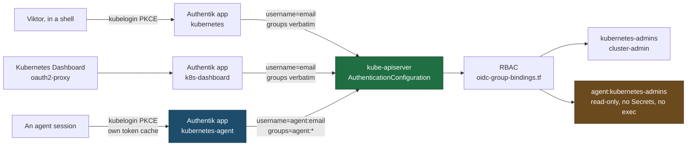

# Runbook: a separate apiserver identity for agent sessions

Step 4 of `docs/plans/2026-09-01-service-identity-and-request-attribution-design.md`.
Goal: make "a human did this" and "an agent did this" a recorded fact on the
Kubernetes API, instead of something inferred afterwards.

**Status:** the Terraform is landed and inert. The control-plane half has not
been performed. Everything below is written to be run by a person, in order,
with a rollback that takes one command.

## Where we start from

Measured on the live cluster, 2026-09-01.

| Fact | Value |
| --- | --- |
| Control-plane nodes | 1 (`k8s-master`, 10.0.20.100). `k8s-node1`-`node5` run no apiserver |
| Structured authn already wired | `--authentication-config=/etc/kubernetes/pki/auth-config.yaml`, 2 issuers |
| Legacy `--oidc-*` flags | none, and none wanted (one issuer per apiserver is the limit) |
| Terraform owns that file | yes, `stacks/rbac/modules/rbac/apiserver-oidc.tf` over SSH |
| Terraform matches the node | yes. Rendered sha256 `bdefc260…97e16` equals the node's file and the apiserver's own `apiserver_authentication_config_controller_last_config_info{hash=…}` |
| OIDC-authenticated audit events, last 24h | 0 |
| Mutating audit events from the shared admin cert, 1h sample | 116 |
| That cert's audit identity | `kubernetes-admin` / `kubeadm:cluster-admins`, `credential-id X509SHA256=7a03b1f4…0616`, expires 2027-04-17 |

The last three rows are the problem in one line. Every human, every agent
session and every cron job on the devvm reaches the API as the same
`kubernetes-admin` certificate, so the audit log records one credential-id for
all of them and nothing in it distinguishes who acted. OIDC login exists and
works, and in practice nobody uses it.

## The three issuers



The `agent:` prefix is the whole mechanism. `username.prefix` and
`groups.prefix` are per-issuer in `AuthenticationConfiguration`, and the audit
event records `user.username` and `user.groups` but not the issuer. So a second
client on the existing issuer would mint the same `vbarzin@gmail.com` and the
audit log could not tell the two apart; a separate issuer with a prefix lands
the distinction in every event.

Two consequences worth being explicit about:

- An agent inherits no human binding. Viktor's groups arrive as
  `agent:kubernetes-admins`, which matches only the `agent:*` rows in
  `stacks/rbac/modules/rbac/oidc-group-bindings.tf`. Enabling the issuer grants
  nothing by itself.
- Agent rows are bound read-only on purpose (`oidc-power-user-readonly`:
  cluster-wide get/list/watch, no Secrets, no `pods/exec`). The org-wide
  workstation policy already says an agent's kubectl is read-only and every
  infrastructure change goes through Terraform, so a write verb here would
  authorise a path we tell agents not to take. It is also the ceiling on what a
  leaked agent refresh token is worth.

## Preconditions

- You can SSH `wizard@10.0.20.100` with the key that authorises it
  (`~/.ssh/id_ed25519`).
- `vault login -method=oidc` is current, and you are in the **main checkout**
  (`~/code/infra`), not a worktree. `*.tfvars` and `secrets/*` come through a
  worktree as git-crypt ciphertext and an apply there reads garbage.
- A second shell open on the master, ready to run the rollback in step 6.

## Step 1: land the Authentik identities

This changes nothing about the cluster. It creates one Authentik application and
provider that no issuer list mentions yet, so a token it mints is rejected as an
untrusted issuer, plus six group-keyed ClusterRoleBindings.

```sh
cd ~/code/infra/stacks/rbac
homelab tf plan rbac
```

Expect exactly 8 creates and no changes or destroys:

| Object | What it is |
| --- | --- |
| `authentik_provider_oauth2.kubernetes_agent` | public PKCE client `kubernetes-agent` |
| `authentik_application.kubernetes_agent` | slug `kubernetes-agent`, which is the issuer path |
| `kubernetes_cluster_role_binding.oidc_groups` ×6 | `kubernetes-*` and `agent:kubernetes-*` group bindings |

The six bindings grant nobody anything new on the day they land. Checked against
live membership and live bindings on 2026-09-01:

| Group | Members | Already had |
| --- | --- | --- |
| `kubernetes-admins` | `akadmin` | cluster-admin via `oidc-admin-akadmin` |
| `kubernetes-power-users` | none | n/a |
| `kubernetes-namespace-owners` | `vabbit81@gmail.com` | `oidc-namespace-owner-readonly` via `oidc-ns-owner-readonly-vabbit81` |
| `agent:*` ×3 | nothing can carry these claims yet | n/a |

Re-check membership before trusting that table. From the moment it lands, a new
member of `kubernetes-admins` gets cluster-admin from group membership alone,
which is the point of the change.

Then apply, either locally or by pushing and letting CI do it:

```sh
homelab tf apply rbac
```

## Step 2: prove the token before touching the control plane

Do this while the apiserver still knows nothing about the new issuer. A rejected
token here is a configuration problem in Authentik, and it is much easier to
read as one now than mixed in with an apiserver change.

```sh
kubectl oidc-login get-token \
  --oidc-issuer-url=https://authentik.viktorbarzin.me/application/o/kubernetes-agent/ \
  --oidc-client-id=kubernetes-agent \
  --oidc-extra-scope=email \
  --oidc-extra-scope=profile \
  --oidc-extra-scope=groups \
  --token-cache-dir="$HOME/.kube/cache/oidc-login-agent" \
  | python3 -c 'import base64,json,sys; t=json.load(sys.stdin)["status"]["token"].split("."); print(json.dumps(json.loads(base64.urlsafe_b64decode(t[1]+"==")), indent=2))'
```

Four things have to be true in the decoded payload, and none of them involves
the cluster:

- `iss` is `https://authentik.viktorbarzin.me/application/o/kubernetes-agent/`,
  trailing slash included. The apiserver compares it as an exact string.
- `aud` contains `kubernetes-agent`.
- `email_verified` is `true`. The apiserver rejects an email username-claim when
  it is false, which is the default for every Authentik social user. The custom
  "Kubernetes Email (verified)" scope mapping is what forces it.
- `groups` lists the Authentik group names. It is only present because
  `--oidc-extra-scope=groups` was passed.

Keep the separate `--token-cache-dir`. It is what makes the agent's refresh
token revocable on its own, by deleting one directory.

## Step 3: enable the third issuer

### What actually changes on the node

One file, and no flag. `--authentication-config` is already on the apiserver, and
the apiserver reloads that file when it changes. Reading the remote script in
`apiserver-oidc.tf`: step 2 edits the static-pod manifest only when the flag is
missing, and it is present, so the manifest is not touched and the apiserver does
not restart.

| | Before | After |
| --- | --- | --- |
| `/etc/kubernetes/pki/auth-config.yaml` | 2 issuers, sha256 `bdefc2607d2789f57d3af6b1cda5d37300a07c421927be6f959a0d9992097e16` | 3 issuers, sha256 `0ff1db92bc3e58f0d9a54f3b7097f8bdfa1a7a7babfd0a0e96d202f5389a7be3` |
| `/etc/kubernetes/manifests/kube-apiserver.yaml` | unchanged | unchanged |
| apiserver process | not restarted | not restarted |
| `kubeadm-config` ConfigMap | already carries `authentication-config` | unchanged |

The appended block:

```yaml
  - issuer:
      url: "https://authentik.viktorbarzin.me/application/o/kubernetes-agent/"
      audiences:
        - "kubernetes-agent"
    claimMappings:
      username:
        claim: email
        prefix: "agent:"
      groups:
        claim: groups
        prefix: "agent:"
```

### Node order

There is one control-plane node, so there is no rolling order to get right and
no quorum to lean on either. The five worker nodes run no apiserver and need
nothing. The single-control-plane exposure is the standing one, sized in
`docs/plans/2026-05-21-ha-control-plane-design.md`; this change does not make it
worse, because it writes a file rather than replacing a pod.

### The apply

Locally, and **before** you push the flag flip. CI applies this stack with no
`ssh_private_key`, so a CI run would fail at the provisioner rather than reach
the node. `-replace` is required: the trigger is a content hash, so a plain
`-target` apply is a no-op.

```sh
cd ~/code/infra/stacks/rbac
TF_VAR_ssh_private_key="$(cat ~/.ssh/id_ed25519)" \
TF_VAR_agent_oidc_enabled=true \
  VAULT_ADDR=https://vault.viktorbarzin.me ../../scripts/tg apply \
  --non-interactive \
  -target=module.rbac.null_resource.apiserver_oidc_config \
  -replace=module.rbac.null_resource.apiserver_oidc_config
```

The provisioner writes the file, waits for `/livez`, and restores the previous
manifest from `/etc/kubernetes/apiserver-oidc-bak/` if the API does not come
back. Then set `agent_oidc_enabled = true` in the stack (a `default` change in
`stacks/rbac/main.tf`, or `agent_oidc_enabled = true` in the terragrunt inputs)
and push, so the repo matches the node and the next apply is a no-op.

Leaving it applied-but-uncommitted is the failure mode to avoid: the nightly
drift detection would report it and the next CI apply would revert the node to
two issuers.

## Step 4: verify with a real kubectl call

**The apiserver tells you which config it is serving.** No restart, no log
grepping:

```sh
kubectl get --raw /metrics \
  | grep apiserver_authentication_config_controller_last_config_info
```

The `hash=` label must read
`sha256:0ff1db92bc3e58f0d9a54f3b7097f8bdfa1a7a7babfd0a0e96d202f5389a7be3`. If it
still reads `sha256:bdefc260…`, the reload has not happened and the rest of this
section will fail for that reason and no other.

Then make a real authenticated call as the agent. Add a context:

```sh
kubectl config set-credentials agent \
  --exec-api-version=client.authentication.k8s.io/v1beta1 \
  --exec-command=kubectl \
  --exec-arg=oidc-login,get-token \
  --exec-arg=--oidc-issuer-url=https://authentik.viktorbarzin.me/application/o/kubernetes-agent/ \
  --exec-arg=--oidc-client-id=kubernetes-agent \
  --exec-arg=--oidc-extra-scope=email \
  --exec-arg=--oidc-extra-scope=profile \
  --exec-arg=--oidc-extra-scope=groups \
  --exec-arg=--token-cache-dir="$HOME/.kube/cache/oidc-login-agent"
kubectl config set-context agent@homelab --cluster=kubernetes --user=agent

kubectl --context agent@homelab auth whoami
```

Expected, for a member of `kubernetes-admins`:

```
ATTRIBUTE                                           VALUE
Username                                            agent:vbarzin@gmail.com
Groups                                              [agent:kubernetes-admins system:authenticated]
Extra: authentication.kubernetes.io/credential-id   [JTI=<uuid>]
```

Three separate things are proven by that output, and it is worth naming which is
which:

1. `Username` carries the `agent:` prefix, so the audit log will say an agent
   acted.
2. `Groups` carries `agent:kubernetes-admins`, so no human binding can match.
3. `credential-id` is `JTI=<uuid>`, one value per token, rather than the single
   `X509SHA256=7a03b1f4…` every cert user shares. That is the session
   granularity the design asks for.

Then confirm the authorisation actually landed both ways:

```sh
# should succeed (read)
kubectl --context agent@homelab get pods -A >/dev/null && echo "read: ok"

# should be forbidden (Secrets and writes are outside the agent role)
kubectl --context agent@homelab get secrets -A         # expect Forbidden
kubectl --context agent@homelab -n default delete pod x --dry-run=server  # expect Forbidden
```

Finally, check it reached the audit trail. Reads are not audited (see below), so
use a mutating call or search for the denial:

```sh
homelab logs query '{job="kubernetes-audit"} |= "agent:"' --since 15m --limit 5
```

## Step 5, optional: adopt the `kubernetes` app into Terraform

Independent of everything above. The live `kubernetes` OIDC provider and
application were created in the Authentik UI in February 2026 and Terraform does
not own them, which means the credential path every human's kubectl depends on is
described nowhere in the repo.

`stacks/rbac/authentik-kubernetes.tf` describes it field-for-field with `import`
blocks, gated off by `manage_kubernetes_oidc_app`. Adopt it as a two-step:

```sh
cd ~/code/infra/stacks/rbac
TF_VAR_manage_kubernetes_oidc_app=true homelab tf plan rbac
```

**The plan must read `2 to import, 0 to change`, and both imported resources must
show `no-op`.** Anything else means a field in the file no longer matches the
live provider, and applying it would write that difference back to the client
every human logs in with. Verified on 2026-09-01: the plan was
`2 to import, 0 to change, 0 to destroy`, both `no-op`.

Only then set the variable in the stack, apply, and delete both `import` blocks
per `AGENTS.md` → "Adopting Existing Resources".

## Step 6: rollback

One command, and it does not restart anything. The file goes back to two
issuers, the reload controller picks it up, and every agent token becomes an
untrusted-issuer rejection.

```sh
cd ~/code/infra/stacks/rbac
TF_VAR_ssh_private_key="$(cat ~/.ssh/id_ed25519)" \
TF_VAR_agent_oidc_enabled=false \
  VAULT_ADDR=https://vault.viktorbarzin.me ../../scripts/tg apply \
  --non-interactive \
  -target=module.rbac.null_resource.apiserver_oidc_config \
  -replace=module.rbac.null_resource.apiserver_oidc_config
```

Confirm with the same metric: `hash=` back to `sha256:bdefc260…`. Then revert the
committed flag so the repo and the node agree.

If the file is somehow malformed and the apiserver will not authenticate anyone,
the on-node path is:

```sh
ssh wizard@10.0.20.100
sudo cp /etc/kubernetes/apiserver-oidc-bak/kube-apiserver.yaml.<newest> \
        /etc/kubernetes/manifests/kube-apiserver.yaml   # only if the manifest was touched
sudo vi /etc/kubernetes/pki/auth-config.yaml             # delete the third `- issuer:` block
curl -sk https://localhost:6443/livez                    # expect: ok
```

Backups live **outside** `/etc/kubernetes/manifests/`, and they must stay there.
The kubelet runs every file in that directory as a static pod, and a
`kube-apiserver.yaml.bak` left inside it becomes a second apiserver that stalls
the next `kubeadm upgrade`. That cost days in June 2026; see
`docs/runbooks/apiserver-audit-logging.md` → "CRITICAL gotcha".

## Break-glass: Authentik is down

Authentik becoming the way into the cluster is an accepted risk in the design.
The break-glass credential is the one that exists today.

**The shared kubeadm admin certificate stays. It is for emergencies, not for
daily work.**

- `O=kubeadm:cluster-admins, CN=kubernetes-admin`, issued by the cluster CA,
  valid to 2027-04-17, cluster-admin through the built-in
  `kubeadm:cluster-admins` binding.
- Copies: `/etc/kubernetes/admin.conf` on `k8s-master`, and
  `/home/wizard/.kube/config` on the devvm.
- It authenticates against `--client-ca-file`, which is a separate mechanism
  from `--authentication-config`. An Authentik outage, a bad auth-config, or a
  revoked OIDC client cannot stop it working.
- Its audit identity is `kubernetes-admin` with
  `credential-id X509SHA256=7a03b1f4…0616`, one value shared by every user of
  it, which is exactly why it should not be the daily driver.

Using it: `KUBECONFIG=/home/wizard/.kube/config kubectl …`, or from the master
`sudo kubectl --kubeconfig /etc/kubernetes/admin.conf …`.

Two things to know before relying on it:

- `scripts/t3-provision-users.sh` reads this same kubeconfig as
  `ADMIN_KUBECONFIG` to provision every other user's credentials. Retiring or
  rotating it is a change to user provisioning as well as to break-glass, so it
  cannot be done in passing.
- Renewing it is `kubeadm certs renew admin.conf` on the master. That mints a
  new certificate, so the `credential-id` in the audit log changes and any
  attribution keyed on the old fingerprint stops matching.

There is also `docs/runbooks/breakglass-ssh.md` for the case where the cluster is
unreachable rather than the identity layer being broken.

## The audit read gap

Stated plainly, because it bounds what any of the above can answer.

**No Kubernetes read is recorded anywhere.** Not in the audit log, not in Loki,
not on the node. Measured over 6 hours on 2026-09-01:

| Audit events, 6h | Count |
| --- | --- |
| `update` | 40,353 |
| `create` | 21,368 |
| `delete` | 10,082 |
| `patch` | 2,257 |
| **`get` / `list` / `watch`** | **0** |
| Total | 74,060 |

Over the same window the apiserver served 276,381 GET, 40,472 LIST and 49,366
WATCH requests. All 366,219 of them are unrecorded. So "who read this Secret" has
no answer, and neither does "what did this agent look at".

### Two policy files, and only one is read

The path the apiserver reads and the path Terraform writes are different files.

| | Path | Contents |
| --- | --- | --- |
| apiserver reads | `/etc/kubernetes/audit-policy.yaml` | hand-deployed from `scripts/k8s-apiserver-audit-policy.yaml`. Rule 1 is `level: None` on `get, list, watch` |
| `stacks/rbac` writes | `/etc/kubernetes/policies/audit-policy.yaml` | would log `get`/`list` at Metadata and Secrets at Metadata. Never read by anything |

The log path disagrees too (`/var/log/kubernetes/audit/audit.log` live versus
`/var/log/kubernetes/audit.log` in Terraform), as do the rotation flags (live
`maxage=30 maxbackup=10`, Terraform `7`/`3`). The Terraform resource has a
`# THIS RESOURCE IS INERT` header as of this change. It was left inert rather
than fixed, because its `triggers` are content hashes: changing them re-runs the
provisioner, which rewrites the static-pod manifest and restarts the API on the
single control-plane node, and CI has no SSH key to do it with. Reconciling the
two is its own deliberate change.

Dropping reads was a deliberate write-volume decision, and the policy file says
so. It is worth re-deciding rather than treating as settled, because the cost
turns out to be small.

### What read auditing for Secrets would cost

It lands on the master's local disk and in Loki. **It does not touch etcd** at
all: audit events are appended to a file by the apiserver, and no audit path
writes to the datastore. Note also that etcd is not scraped by Prometheus
(`etcd_server_has_leader` has no series), so any claim about etcd cost here is
unmeasured either way.

Measured inputs: 102,922 Secret reads per day (GET 64,432, LIST 20,823, WATCH
17,667, 24h to 2026-09-01) and 1,431 bytes per audit line at Metadata level
(2,000-line sample of the live log).

| | Today | With Secret reads audited |
| --- | --- | --- |
| Audit lines/day | ~296,000 | ~399,000 |
| Audit bytes/day | ~415 MB | ~562 MB (+36%) |
| On-disk footprint | ~1.13 GB (10 × 100 MB backups + current) | ~1.13 GB, unchanged (size-capped) |
| On-disk history | **~2.8 days** | **~2.1 days** |
| `/` on k8s-master | 33 GB free of 59 GB, 42% used | unchanged |
| Loki ingest | 3.54 GB/day cluster-wide | +147 MB/day, **+4.2%** |
| Loki retention | 30 days | +4.4 GB raw over the window |

Two things fall out of that table that are easy to miss.

The on-disk retention is already **~2.8 days, not 30**. `--audit-log-maxage=30`
never bites because `--audit-log-maxsize=100` with `maxbackup=10` does: the log
rotates every 6 to 7 hours at current volume (9 rotations in the 55 hours to
2026-09-01). Loki holds 30 days, so the trail survives, but the on-node fallback
in `docs/runbooks/apiserver-audit-logging.md` covers about three days. Auditing
Secret reads shortens that to about two. Raising `--audit-log-maxbackup` is the
knob if node disk allows, and 33 GB free says it does.

**Metadata level answers less than it sounds like.** A `get` records the Secret's
name, so "who read `vault-root-token`" becomes answerable. A `list` records the
namespace and no names, so "who read every Secret in `dbaas`" comes back as one
line naming a namespace. Neither records values, which is correct. If the
question is really about specific Secrets, a rule scoped to
`resources: [secrets]` on `get` costs 64,432 lines/day (~92 MB) and skips the
LIST volume that carries the least information.

### The narrower change, if the full one is unwanted

Auditing reads for Secrets only, rather than reads generally, is a two-line edit
to `scripts/k8s-apiserver-audit-policy.yaml`: put a Metadata rule for
`group: "", resources: [secrets]` **above** the `level: None` read rule, since
audit rules are first-match-wins. That is the whole change. Deploying it is the
same control-plane step as any policy change and carries the same single-node
exposure, so it belongs in its own session rather than bolted onto this one.

## What this does not do

- **It does not make agent auth non-interactive.** A public PKCE client needs a
  browser once, then rides a 30-day refresh token from
  `~/.kube/cache/oidc-login-agent`. That is a standing credential for a month,
  bounded by the read-only RBAC. Genuinely short-lived per-session credentials
  are step 5 of the design, via the Vault Kubernetes engine. Authentik's
  `jwt_federation_sources` on the provider is the other route worth evaluating
  there: it would let a Kubernetes ServiceAccount token be exchanged for an
  agent id_token with no browser at all.
- **Provenance stays self-asserted.** An agent running as Viktor's OS user can
  simply use Viktor's human context instead. Nothing here prevents that; the
  design accepts it and says so.
- **It does not retire the per-email bindings.** `oidc-admin-viktor` still binds
  `viktor@viktorbarzin.me`, which no Authentik user holds, and
  `oidc-admin-vbarzin` and `oidc-admin-akadmin` are still hand-made
  (`kubectl create`, 2026-02-17) and absent from Terraform state. The group
  bindings make them redundant. Removing them is a separate change, and doing it
  in the same breath as enabling a new issuer would make a bad day hard to
  unpick.
- **It changes nothing for humans.** The `kubernetes` and `k8s-dashboard`
  issuers keep empty prefixes and their existing bindings.

## Related

- Design: `docs/plans/2026-09-01-service-identity-and-request-attribution-design.md`
- Audit logging as built: `docs/runbooks/apiserver-audit-logging.md`
- OIDC drift across a control-plane upgrade: `docs/runbooks/k8s-version-upgrade.md`
- Single control plane: `docs/plans/2026-05-21-ha-control-plane-design.md`
- Cluster access when the identity layer is not the problem: `docs/runbooks/breakglass-ssh.md`
