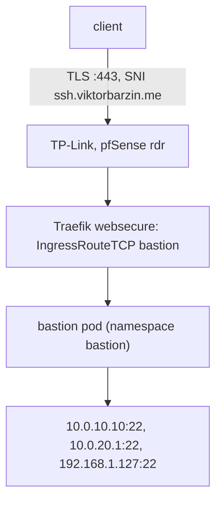

# Bastion: SSH on port 443

The Bastion is a jump-only sshd reachable at `ssh.viktorbarzin.me:443`, with SSH carried
inside TLS. It lets a client reach devvm, pfSense and the Proxmox host from networks that
only allow outbound HTTPS. It gives no shell; a client authenticates with its own key and then
hops to a target with `ProxyJump`.

- Stack: `stacks/bastion/`
- Design: [2026-09-28-ssh-bastion-443-design.md](../plans/2026-09-28-ssh-bastion-443-design.md)
- Client accounts and host key: Vault `secret/bastion`
- Host key fingerprint: `SHA256:F3sM117CXDAyTKYwbtoj0WxrYmF1NkMUSgRMxB0R6DA` (ED25519)

The Bastion runs in the cluster and is unavailable when the cluster is. For a cluster outage,
use [break-glass SSH](breakglass-ssh.md) (WAN 52222 to the Proxmox host) or WireGuard.

## Path



Other hostnames on 443 go to the HTTP routers as before. Public DNS answers the WAN address; internal DNS (Technitium) answers Traefik's LB `10.0.20.203` from `static_records.tf` in the technitium stack, because the ingress-to-DNS sync only sees Ingress objects. IPv6 arrives through the pfSense
HAProxy bridge (`2001:470:6e:43d::2:443`) and joins the same Traefik entrypoint.

## Client setup

The client needs its private key, a bastion account (see [Add a client](#add-a-client)), and
this ssh_config:

```sshconfig
Host bastion
  HostName ssh.viktorbarzin.me
  User <client>
  IdentityFile ~/.ssh/<key>
  IdentitiesOnly yes
  ProxyCommand openssl s_client -quiet -verify_quiet -verify_return_error -connect %h:443 -servername %h
  ServerAliveInterval 30

Host devvm-443
  HostName 10.0.10.10
  User <devvm user>
  ProxyJump bastion

Host pfsense-443
  HostName 10.0.20.1
  User admin
  ProxyJump bastion

Host pve-443
  HostName 192.168.1.127
  User root
  ProxyJump bastion
```

Then `ssh devvm-443`. The target authenticates the user exactly as it does on the LAN; the
Bastion only relays the connection. Pin the Bastion's host key on first connect by checking
the fingerprint above.

If `openssl` is missing on the client, either of these works as the ProxyCommand:

```sh
ncat --ssl --ssl-servername %h %h 443
socat - OPENSSL:%h:443,snihost=%h
```

## Add a client

Each client is one Vault field, `authorized_key_<client>`, holding one public key line. The
client name must match `[a-z0-9_-]+`; the entrypoint skips anything else and logs it.

```sh
vault kv patch secret/bastion authorized_key_<client>="$(cat client.pub)"
```

The ExternalSecret refreshes every 5 minutes and Reloader restarts the pod when the synced
secret changes. To apply it at once:

```sh
kubectl -n bastion annotate externalsecret bastion-keys force-sync=$(date +%s) --overwrite
```

Check the pod log for `bastion: client account '<client>' ready`.

## Remove a client

```sh
vault kv patch secret/bastion authorized_key_<client>=
```

`vault kv patch` cannot delete a field, so an empty value is the removal. The entrypoint writes
an empty `authorized_keys` file for that account, and sshd accepts no key for it. After the
restart, open connections from that client are closed.

## Add a target

Three places, which must agree:

1. `PermitOpen` in `stacks/bastion/files/sshd_config`
2. `local.targets` in `stacks/bastion/main.tf` (NetworkPolicy egress)
3. The client config table in this runbook

## What gets logged

- sshd logs to stdout, collected by Loki: `homelab logs query '{namespace="bastion"}' --since 24h`
- Every successful login posts once to Slack #alerts (Loki rule `BastionLogin`, event lane),
  naming the client account and key fingerprint.
- sshd sees Traefik's pod IP, not the client's, because Traefik forwards plain TCP and OpenSSH
  cannot read the PROXY protocol. The client IP is not recorded anywhere for this path.
- Denied hops log as `Received request ... to connect to host X port Y, but the request was denied`.

## Limits

- Traefik caps each client IP at 4 concurrent connections (`MiddlewareTCP bastion-inflight`).
  Traefik's TCP layer has no per-minute limiter.
- sshd `PerSourcePenalties no`: every client arrives from Traefik's pod IP, so OpenSSH's per-source
  penalties would let one client's failures lock out the rest.
- sshd: public keys only, `MaxAuthTries 2`, `LoginGraceTime 20`, no TTY, no shell
  (`ForceCommand /sbin/nologin`), forwarding only to the `PermitOpen` targets.
- NetworkPolicy: ingress only from the `traefik` namespace on 22; egress only to the three
  targets on 22.
- CrowdSec's Traefik plugin is HTTP middleware and does not apply to TCP routes.

## Troubleshooting

| Symptom | Check |
|---|---|
| `openssl` prints a certificate error | `ssh.viktorbarzin.me` must resolve to 176.12.22.76 / `2001:470:6e:43d::2`, not Cloudflare. Check `dig +short ssh.viktorbarzin.me` |
| TLS works, SSH hangs with no banner | `kubectl -n traefik logs deploy/traefik \| grep -i bastion`, and `kubectl get ingressroutetcp -n bastion` |
| `Permission denied (publickey)` | The client's key is not in Vault, or the pod has not restarted since. Check the pod log for the `ready` line |
| `administratively prohibited: open failed` | The target is not in `PermitOpen` |
| Hop opens but the target never answers | The NetworkPolicy egress list is missing the target |
