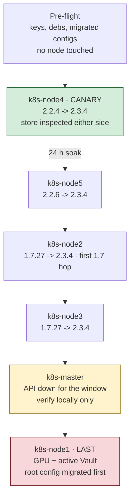

# containerd convergence to 2.3.4 LTS, and the registry cache VM prune

> **One window, both phases.** Viktor chose 2026-09-02 to run Phase 3 (node
> config) and Phase 4 (containerd) together, so each node reboots once. Step 5.2b
> applies Phase 3 while the node is drained. kured cannot deliver Phase 3 on its
> own: its alert filter was inverted to match-only on 2026-09-02 (`code-yr2i`),
> which restores kured generally, but node1's reboot gate stays permanently
> closed by the GPU mitigation's kernel holds.

**Status:** EXECUTED 2026-09-02/03 — all six nodes on containerd 2.3.4
**Prepared:** 2026-09-02
**Owner:** Viktor Barzin
**Plan:** `docs/plans/2026-09-02-node1-large-image-handling.md` (Phase 4), bead `code-g0va`
**Scope:** all six k8s nodes plus the registry cache VM (10.0.20.10, VMID 220)

This is a human-driven maintenance runbook. It stops containerd on one node at a
time.

Every command below was checked before being run: package indexes were read from
`download.docker.com` directly, the target `.deb` was downloaded and its binary
executed out of a scratch directory on the devvm, and node state was read over
read-only SSH. What that verification showed, and what it corrected in the plan,
is recorded inline.

## 0. What execution changed about this runbook

Two of the assumptions above are now measured, and both were wrong in the same
direction: the procedure is far less disruptive than written.

**0.1 A drain is not required, and stopping containerd does not stop containers.**
`containerd.service` ships `KillMode=process`, verified on all six nodes. systemd
stops only the daemon and leaves every `containerd-shim-runc-v2` child running;
containerd 2.3.4 then reattaches to them on start. Measured across the major hop:

| node | from | shim PIDs before / after | identical PIDs surviving | running containers before / after |
|---|---|---|---|---|
| k8s-node2 | 1.7.27 | 85 / 85 | 83 | 104 / 104 |
| k8s-node3 | 1.7.27 | 65 / 65 | **65** | 89 / 89 |
| k8s-master | 2.2.2 | 26 / 26 | 25 | 30 / 30 |

The oldest surviving shim on node2 had started **2026-08-30 09:00:55**, four days
before the upgrade. So containers genuinely carried through 1.7 → 2.3 untouched,
and this extends the same finding already recorded for a plain 1.7.x restart
(memory #10866, node1, 2026-08-12) to a major version change and a package swap.

Why it matters beyond convenience: **node2 and node3 cannot be drained at all.**
Only the four untainted nodes can absorb an eviction (master and node1 are
`NoSchedule`), and the arithmetic does not close — draining node2 needs 26.3 GiB
of evictable requests moved into 14.2 GiB, node3 needs 27.9 into 15.9. That is
bead `code-j3tx`. Read as "drain required", this runbook was unexecutable on
exactly the two nodes furthest below the compatibility floor. In place, capacity
is irrelevant, because nothing relocates.

Section 5.2 (cordon and drain) is therefore **optional**, and worth skipping on a
capacity-bound node. node1 was drained because it was done first, before this was
measured; nodes 2, 3 and master were not.

**0.2 The control-plane API does not go down.** The same mechanism: master's
etcd and kube-apiserver static-pod shims survive, so `pgrep etcd` and `pgrep
kube-apiserver` both answered 1 with containerd stopped, and `kubectl` kept
serving throughout. The header used to promise an API outage for master's window;
it did not happen. Section 5.8's `crictl`-only advice for master is still the
right fallback, but it was not needed.

This also makes the failure mode favourable rather than frightening: if 2.3.4
refuses to start, the running control plane is still up while you read the
journal, because its containers were never the thing being restarted.

**0.3 What the drain on node1 did cost.** Draining is not free here even where it
fits. The earlier node4/node5 pass drained two nodes whose evictable load does
not fit the remaining pool either, and that produced the 2026-09-02 evening
incident: redis evicted out from under trading-bot, `learning` (which serves
pages.viktorbarzin.me) in CrashLoopBackOff, all three traefik replicas OOMKilled,
roughly 20 services degraded for about 25 minutes. Prefer 0.1.

---

## 1. Three questions that gate this work, answered

### 1.1 node1 is in kured's DaemonSet and outside kured's reboot rotation

node1 runs a `kured` pod and a `kured-sentinel-gate` pod, both scheduled there by
the `nvidia.com/gpu Exists NoSchedule` toleration in `stacks/kured/main.tf`. It
still never reboots, and the mechanism is complete:

```
kured reboots only when the host has /var/run/gated-reboot-required
  <- the sentinel gate creates that file only when /var/run/reboot-required exists
      <- unattended-upgrades writes reboot-required only when it installs a kernel or libc
          <- node1 holds linux-generic, linux-image-generic, linux-image-6.8.0-117-generic,
             linux-modules-6.8.0-117-generic, linux-headers-* (the GRUB-pin mitigation)
              -> no kernel ever installs -> reboot-required never appears
```

Measured 2026-09-02:

| node | uptime since | `/var/run/reboot-required` | gate open |
|---|---|---|---|
| k8s-master | 2026-08-10 04:53 | yes (linux-image-7.0.0-30) | yes |
| **k8s-node1** | **2026-07-18 09:38 (46 d)** | **no** | **no** |
| k8s-node2 | 2026-07-18 09:39 | yes (libc6, linux-image-7.0.0-29/30) | yes |
| k8s-node3 | 2026-08-07 06:33 | yes | yes |
| k8s-node4 | 2026-08-09 01:41 | yes (linux-image-6.8.0-138) | yes |
| k8s-node5 | 2026-07-28 02:42 | no | no |

node1's own kured log says `Reboot not required` on every hourly tick across the
whole retained window (2026-08-27 to 2026-09-02), and its sentinel gate stops at
Check 1 each cycle with `No reboot required on this host`.

**A second finding, larger than the first.** On the four nodes whose gate *is*
open, kured is halted by its own alert filter:

```
$ kubectl logs -n kured kured-rlrph --tail=1      # k8s-master
"Reboot blocked: 7 active alerts: [DriftStackErrored DriftStacksMany
 HDDDailyReadVolume ImmichSmartSearchSlow JobFailed StrayWorkloadDetected
 T3AutoUpdateRolledBack]"
```

The same shape appears on node2 and node4 on every tick of 2026-09-01 and
2026-09-02. `alertFilterRegexp` ignores only
`^(Watchdog|RebootRequired|KuredNodeWasNotDrained|InfoInhibitor|KernelOOMKiller)$`,
and the standing alert floor is 5 to 7 names outside that set.

**What this changes.** Phase 3's "the config is written and the next kured reboot
applies it" does not hold on any node right now, not just node1. Two consequences
for this runbook:

1. Phase 3 and Phase 4 will otherwise activate in the same boot on every node,
   which makes a bad boot unattributable. Give each node a Phase 3 reboot of its
   own first, verify with `scripts/check-node-kubelet-tune`, and only then bring
   containerd 2.3.4 to it.
2. Either widen `alertFilterRegexp` to cover the standing floor, or accept that
   node reboots are a human action here. That is a separate decision and it is
   not part of this runbook; it is recorded so nobody plans around a rotation
   that is not turning.

### 1.2 The content store almost certainly survives, and we already have in-fleet evidence

Upstream, from `RELEASES.md` on the **release/2.3** branch (not the main-branch
copy, so this is the shipped document for the target version):

> Upgrades are supported for sequential minor releases. For example, an upgrade
> from 2.0 to 2.1 is supported, but an upgrade from 2.0 to 2.2 is not.

> Direct upgrades between sequential LTS (Long Term Stable) releases are also
> supported. For example, a direct upgrade from 1.7 (LTS) to 2.3 (LTS) will be
> tested and supported, but 1.7 (LTS) to 2.6 (LTS, tentatively) will not.

The "Not Covered" section does list File System layout, Storage formats and
Snapshot formats, with:

> Between upgrades of subsequent, minor versions, we may migrate these formats.
> Any outside processes relying on details of these file system layouts may break
> in that process.

Read closely, that paragraph is about format *migration* and about *outside*
processes that parse the layout. It does not say containerd discards image data,
and 1.7 to 2.3 is named as a tested, supported hop. So there is no byte-stability
guarantee, and no documented reformat either.

`docs/containerd-2.0.md` lists the 1.x-to-2.x breaking changes as: Docker Schema 1
disabled by default, runtime V1 shims removed in favour of `io.containerd.runc.v2`,
CRI v1alpha2 removed, AUFS snapshotter removed in favour of overlayfs. None of
those touch this fleet: all six nodes already run overlayfs, `io.containerd.runc.v2`
and CRI v1.

**In-fleet precedent, which the plan believed did not exist.** `k8s-master` has
already crossed a containerd major version in place:

```
$ ssh wizard@10.0.20.100 'sudo zgrep containerd /var/log/dpkg.log*'
2026-05-21 11:47:10 install containerd:amd64 <none> 2.2.2-0ubuntu1
$ dpkg -l containerd.io
rc  containerd.io  1.6.22-1
```

containerd.io 1.6.22 was removed and Ubuntu's containerd 2.2.2 installed fresh,
across a major version, on a node that also went noble to resolute. Its store
today:

```
oldest content blob mtime                              2021-01-04
blobs older than the 2026-05-21 install / total        190 / 508
overlayfs snapshotter directory ctime                  2022-08-29 23:58:17
ctr -n k8s.io content ls, AGE distribution             13 years, 298 months,
                                                       72 weeks, 16 days, 4 hours
                                                       (403 records)
```

The blobs, the snapshotter directory, and containerd's own bolt metadata records
all carried forward. **Limit, stated plainly:** that is 1.6 to 2.2, not 1.7 to
2.3, and an old blob proves the file and its record survived rather than that
every one is still referenced. It moves "forces a 73 GB cold re-pull" from unknown
to unlikely. It does not close the question, so the canary below still runs and
its before/after inspection is a required step, not a nicety.

### 1.3 2.3.x with kubelet 1.35 is a testing-coverage gap, not a compatibility wall

The matrix, verbatim from the same release/2.3 document:

| Kubernetes | containerd Version | CRI Version |
|---|---|---|
| 1.34 | 2.1.3+, 2.0.6+, 1.7.28+, 1.6.39+ | v1 |
| 1.35 | 2.2.0+, 2.1.5+, 1.7.28+ | v1 |
| 1.36 | 2.3.0+, 2.2.0+ | v1 |

and the text that governs it:

> Any actively supported version of containerd may receive patches to fix bugs
> encountered in any version of Kubernetes, however, our recommendation is based
> on which versions have been the most thoroughly tested.

> containerd will ensure there is always a supported version of containerd for
> every supported version of Kubernetes.

So the table is a recommendation ranked by test coverage, not a compatibility
boundary, and the 1.35 and 1.36 rows both name CRI v1, which is what kubelet 1.35
speaks. 2.3.0 simply had not shipped when the 1.35 row was written.

**Residual risk, named:** 2.3.x with kubelet 1.35 is not a combination upstream
claims to have tested. That is why node4 and node5 go first, why the 2.2.6 `.deb`
stays on disk, and why the rollback section exists.

---

## 2. Node order, and why



| step | node | VMID | OS | from | to | why here |
|---|---|---|---|---|---|---|
| 1 | k8s-node4 | 204 | 24.04 noble | containerd.io 2.2.4 | 2.3.4-1~ubuntu.24.04~noble | 2.2 to 2.3 is the sequential-minor case; repo already enabled; no GPU |
| 2 | k8s-node5 | 205 | 24.04 noble | containerd.io 2.2.6 | 2.3.4-1~ubuntu.24.04~noble | same, and it holds no runtime apt hold |
| 3 | k8s-node2 | 202 | 26.04 resolute | containerd.io 1.7.27 | 2.3.4-1~ubuntu.26.04~resolute | first LTS-to-LTS hop; needs the repo re-pointed |
| 4 | k8s-node3 | 203 | 26.04 resolute | containerd.io 1.7.27 | 2.3.4-1~ubuntu.26.04~resolute | same as node2 |
| 5 | k8s-master | 200 | 26.04 resolute | Ubuntu containerd 2.2.2 | containerd.io 2.3.4 resolute | single control plane; also a package swap |
| 6 | k8s-node1 | 201 | 26.04 resolute (os-release says 24.04) | Ubuntu containerd 1.7.24 | containerd.io 2.3.4 resolute | GPU, active Vault, the only drop-in config |

**Which package source, and why.** Docker's repo, on every node. Ubuntu's archive
tops out at `containerd 2.2.2-0ubuntu1.1` on resolute and `2.2.1-0ubuntu1~24.04.3`
on noble, both read live on 2026-09-02. 2.2 is not an LTS branch, so staying on
Ubuntu's package means landing on a branch with no long-term support and, for
node1/node2/node3, an unsupported hop from 1.7. Docker's repo is the only source
that reaches 2.3.4.

**The package swap this implies on node1 and master.** `containerd.io` declares
`Conflicts: containerd, runc` / `Replaces: containerd, runc` / `Provides:
containerd, runc`. node1 and master currently run Ubuntu's `containerd` plus
`runc`, both `hi` (held, installed), so the transaction **removes two packages**.
`apt-cache rdepends --installed runc` and `... containerd` on both nodes list
nothing outside `{containerd, containerd.io, runc, containerd-stable,
runc-stable}`, so the removal does not cascade. This also closes the runc spread:
node1's runc 1.1.12 (OCI spec 1.0.2-dev) and master's 1.4.0 both give way to the
runc bundled in the `containerd.io` deb.

---

## 3. Five constraints this runbook carries

### C1. node1's root config must be migrated in the same window as the binary

Reproduced against the real 2.3.4 binary, extracted from the target `.deb` and run
from a scratch directory (nothing installed):

```
$ ./x/usr/bin/containerd --version
containerd containerd v2.3.4 db8809540e1a7a9da5d518876894933ff55692ab

root version=2 + drop-in version=3  ->  exit 1
    containerd: drop-in config version 3 higher than root config version 2
root version=4 + drop-in version=3  ->  exit 0
root version=2 + drop-in version=2  ->  exit 0     <- node1 today
```

**Correction to the plan: `containerd config migrate` emits `version = 4`, not 3.**
`RELEASES.md` gives the minimum containerd for config version 4 as v2.3.0, so 4 is
the correct target at 2.3.4. The exact invocation, confirmed present:

```
$ ./x/usr/bin/containerd config --help
   default  See the output of the default config
   dump     See the output of the final main config with imported in subconfig files
   migrate  Migrate the current configuration file to the latest version (does not migrate subconfig files)
$ ./x/usr/bin/containerd --help | grep -- --config
   --config value, -c value     Path to the configuration file (default: "/etc/containerd/config.toml")
```

It writes to **stdout** and takes no output flag, and it does **not** migrate the
drop-ins. It is idempotent: re-running it on its own output is byte-identical.
Run against a copy of node1's live `config.toml`, it preserved
`snapshotter='overlayfs'`, `discard_unpacked_layers=false`,
`max_concurrent_downloads=5`, `config_path='/etc/containerd/certs.d'`,
`SystemdCgroup=true` and `runtime_type='io.containerd.runc.v2'`, and moved the
sandbox image to `[plugins.'io.containerd.cri.v1.images'.pinned_images] sandbox =
'k8s.gcr.io/pause:3.6'`. It dropped `plugin_dir`, CRI `disable_cgroup`, CRI
`systemd_cgroup`, `containerd no_pivot`, `default_runtime`,
`untrusted_workload_runtime`, and `runtimes.runc runtime_engine`/`runtime_root` as
unknown keys. All of those sit at their default or empty value on node1, so the
loss is cosmetic. Read the diff during the window and confirm that is still true.

**Today's node1 drop-in is `version = 2`, so nothing is broken yet.**
`/etc/containerd/conf.d/99-nvidia.toml` line 1 reads `version = 2`, and node1 is
the only node with a drop-in at all:

| node | root file | `config dump` | imports | drop-ins present |
|---|---|---|---|---|
| master | 2 | 3 | none | none |
| **node1** | **2** | **2** | `conf.d/*.toml` | **99-nvidia.toml (v2)** |
| node2 | 2 | 2 | none | none |
| node3 | 2 | 2 | none | none |
| node4 | 3 | 3 | `conf.d/*.toml` | none (empty dir) |
| node5 | 3 | 3 | `conf.d/*.toml` | none (empty dir) |

So the failure does not fire during the apt transaction. It fires at the
container-toolkit's **next** drop-in regeneration after the binary moves, because
the toolkit keys the drop-in's version off `containerd config dump` (the binary),
which goes from 2 to 4. Migrating the root to 4 in the same window makes any
drop-in version at or below 4 acceptable, which closes it permanently.

### C2. An apt transaction on node1 can take the GPU to zero, and the hazard is armed

`/etc/os-release` is a plain packaged file owned by `base-files` on all six nodes
(`dpkg -S /etc/os-release` -> `base-files: /etc/os-release`). It is not a conffile,
so dpkg overwrites it on upgrade without prompting. On node1 it is deliberately a
regular file carrying Noble content, with the backup at
`/etc/os-release.bak-pre-spoof-2026-05-17`, so NFD reports 24.04 and the GPU
operator picks a driver tag that exists. NVIDIA publishes no `ubuntu26.04` driver
images.

**This is not theoretical on node1 today:**

```
$ ssh wizard@10.0.20.101 'apt-cache policy base-files'
base-files:
  Installed: 14ubuntu6.1
  Candidate: 14ubuntu6.2      <- pending
```

Every other resolute node is already at `14ubuntu6.2`. node1 is one `full-upgrade`
away from the May 2026 SEV-3 recurring, on the node that also holds the active
Vault leader.

Mitigations, all of which appear as steps below:

- never `full-upgrade` or `dist-upgrade` on node1; always
  `apt-get install <exact package>=<exact version>`
- simulate with `-s` and confirm `base-files` is absent from the transaction
- `sha256sum /etc/os-release` before and after; expected value
  `01af466feb100306498c86aa6bad1815e33036019aa34d4362c20f374ea5c829` (400 bytes)
- re-check `nvidia.com/gpu` allocatable as the **first** verification after the
  node returns

Nothing in this runbook touches the kernel, the `linux-*` holds, the GRUB pin, or
the gpu-operator pin. Background:
`docs/post-mortems/2026-05-17-gpu-driver-ubuntu2604-mismatch.md`,
`docs/known-issues.md`, bead `code-8vr0`.

### C3. The conffile prompt, and the reason it matters more than it looks

`dpkg -V containerd.io` reports `??5?????? c /etc/containerd/config.toml` on
node2-5, so the file is locally modified against the package. On node1 the package
is in `rc` state and its recorded conffile md5 differs from what is on disk:

```
$ ssh wizard@10.0.20.101 'md5sum /etc/containerd/config.toml'
971a61f973ebfa9480fa44645ac1f018
$ ... awk '/^Package: containerd.io$/,/^$/' /var/lib/dpkg/status
Status: deinstall ok config-files
Version: 1.7.19-1
Conffiles:
 /etc/containerd/config.toml 1d862b12f2cb082816175b28ee501789
```

So a fresh install of `containerd.io` on node1 would prompt on that conffile too.
Pass `-o Dpkg::Options::=--force-confold` on every node.

Two extra facts that make this load-bearing rather than cosmetic:

- The **packaged** conffile ships `disabled_plugins = ["cri"]`, which is Docker's
  default for a dockerd host. Taking the package version of that file on a
  Kubernetes node disables CRI and the kubelet cannot talk to containerd.
- The postinst ends with
  `deb-systemd-invoke $_dh_action 'containerd.service' >/dev/null || true`. The
  `|| true` means a containerd that will not start does **not** fail the apt
  transaction. **apt's exit code is not evidence containerd came up.** Verify with
  `systemctl is-active containerd` and `ctr version`, every time.

### C4. The apt holds, and what they do and do not cover

The holds are codified at `modules/create-template-vm/cloud_init.yaml` lines
153-154 (the unattended-upgrades blacklist is 117-151), placed after a 26-hour
outage in March 2026. Live state on 2026-09-02:

| node | held runtime packages | state |
|---|---|---|
| master | containerd, runc | `hi` both, installed |
| node1 | containerd, runc | `hi` both, installed |
| node2 | containerd, containerd.io, runc | `hi` containerd.io; `hn` containerd, runc |
| node3 | containerd, containerd.io, runc | `hi` containerd.io; `hn` containerd, runc |
| node4 | containerd.io (+ kube*) | `hi` |
| node5 | kubeadm, kubectl, kubelet only | no runtime hold to lift |

Lift **all three names** (`containerd containerd.io runc`) on master and node1,
because the transaction removes two of them.

The runbook uses an explicit `=<version>` on the install line rather than writing
an `/etc/apt/preferences.d` pin at `Pin-Priority: 1001`. Both work; the explicit
version leaves no file on the node to forget to remove, and an undeclared file
under `/etc` is exactly the drift the devvm/Ansible rule exists to prevent. If you
prefer the pin, delete it in the same window you re-hold.

**Lifting the hold does not expose the node to an automatic upgrade during the
window,** for two independent reasons. `unattended-upgrades` blacklists the
packages by name, and its allowed origins are Ubuntu-only:

```
$ ssh wizard@10.0.20.101 'cat /etc/apt/apt.conf.d/52unattended-upgrades-k8s'
Unattended-Upgrade::Allowed-Origins { "${distro_id}:${distro_codename}"; ... };
Unattended-Upgrade::Package-Blacklist {
    "^containerd(\.io)?$"; "^runc$"; "^cri-tools$"; "^kubernetes-cni$";
    "^calico-.*"; "^cni-plugins-.*"; "^docker-ce$";
};
Unattended-Upgrade::Automatic-Reboot "false";
```

Re-hold anyway, at the end of each node's step, so the next person finds the state
the template describes.

### C5. Draining node1 evicts the active Vault leader

Certain on drain, and it self-heals: three replicas, the PDB allows one
disruption, and the cluster elects a new leader in seconds. It is a write outage
during the election, not quorum loss. CNPG PDBs read `disruptionsAllowed=0` by
design and drains still succeed.

Between nodes, wait on these conditions before starting the next one. Replica
re-join after a reboot takes 5 to 30 minutes, so this is the step that sets the
pace of the whole window:

```bash
# CNPG: readyInstances must equal instances
kubectl get cluster -n dbaas pg-cluster \
  -o jsonpath='{.status.instances}/{.status.readyInstances}{"\n"}'

# Vault: three pods 3/3, exactly one active, none sealed
kubectl get pods -n vault -l component=server -L vault-active,vault-sealed
for v in vault-0 vault-1 vault-2; do
  kubectl exec -n vault $v -c vault -- vault status 2>&1 \
    | grep -E 'Initialized|^Sealed|HA Mode'
done

# kyverno: 2/2
kubectl get deploy -n kyverno
```

---

## 4. Pre-flight, once, before any node is touched

Nothing here changes a node. Do it all on the devvm.

```bash
~/code/scripts/presence claim infra:containerd-2.3-convergence \
  --purpose "Phase 4 of code-g0va: containerd 1.7/2.2.x -> 2.3.4 across six nodes, one at a time"
```

**P1. Record the baseline.** The probe set from the plan's baseline capture is the
reference. At minimum, per node:

```bash
for ip in 100 101 102 103 104 105; do
  ssh wizard@10.0.20.$ip 'printf "%-12s containerd=%-10s runc=%-10s cfg=%s dump=%s\n" \
    "$(hostname)" "$(containerd --version | awk "{print \$3}")" \
    "$(runc --version | head -1 | awk "{print \$3}")" \
    "$(grep -m1 -E "^\s*version" /etc/containerd/config.toml | tr -d " ")" \
    "$(sudo containerd config dump | grep -m1 -E "^version" | tr -d " ")"'
done

# image inventory floor per node (the node object caps .status.images at 50)
for ip in 100 101 102 103 104 105; do
  ssh wizard@10.0.20.$ip 'printf "%-12s digests=%s refs=%s content_store=%s\n" "$(hostname)" \
    "$(sudo ctr -n k8s.io images ls | awk "NR>1{print \$3}" | sort -u | grep -c .)" \
    "$(sudo ctr -n k8s.io images ls -q | grep -c .)" \
    "$(sudo du -sh /var/lib/containerd/io.containerd.content.v1.content | cut -f1)"'
done
```

**P2. Stage the debs.** Downloading them now means the window does not depend on
`download.docker.com`, and it gives the rollback artefact.

```bash
mkdir -p ~/containerd-2.3.4 && cd ~/containerd-2.3.4
base=https://download.docker.com/linux/ubuntu/dists
curl -fLO $base/resolute/pool/stable/amd64/containerd.io_2.3.4-1~ubuntu.26.04~resolute_amd64.deb
curl -fLO $base/noble/pool/stable/amd64/containerd.io_2.3.4-1~ubuntu.24.04~noble_amd64.deb
# rollback artefacts, staged deliberately
curl -fLO $base/resolute/pool/stable/amd64/containerd.io_2.2.6-1~ubuntu.26.04~resolute_amd64.deb
curl -fLO $base/noble/pool/stable/amd64/containerd.io_2.2.6-1~ubuntu.24.04~noble_amd64.deb
sha256sum *.deb
```

Expected, verified 2026-09-02 against the repo index:

```
f5acfcb64f586e0e2d69c6e499d4481b86582b4c295b346f9916800def56ea61  containerd.io_2.3.4-1~ubuntu.26.04~resolute_amd64.deb
```

**Never cross-install the resolute deb on a noble node.** The resolute variant
depends on `libseccomp2 (>= 2.6.0)` and its bundled runc needs 2.6 symbols; the
noble variant needs only `>= 2.5.0`. Running the resolute deb's runc on a
libseccomp 2.5.5 host gives
`runc: symbol lookup error: undefined symbol: seccomp_transaction_reject`.
Dependencies as measured:

| node | libseccomp2 | libc6 | variant | satisfied |
|---|---|---|---|---|
| master | 2.6.0-2ubuntu5 | 2.43-2ubuntu2.3 | resolute | yes |
| node1 | 2.6.0-2ubuntu5 | 2.43-2ubuntu2 | resolute | yes |
| node2 | 2.6.0-2ubuntu5 | 2.43-2ubuntu2.3 | resolute | yes |
| node3 | 2.6.0-2ubuntu5 | 2.43-2ubuntu2.3 | resolute | yes |
| node4 | 2.5.5-1ubuntu3.1 | 2.39-0ubuntu8.8 | noble | yes |
| node5 | 2.5.5-1ubuntu3.1 | 2.39-0ubuntu8.7 | noble | yes |

**P3. Produce each node's migrated config, off-node, with the target binary.**
This is what removes the ordering hazard in C1 entirely: the v4 config is in place
*before* the package lands, so the postinst's restart finds a config it can read.

```bash
cd ~/containerd-2.3.4
dpkg-deb -x containerd.io_2.3.4-1~ubuntu.26.04~resolute_amd64.deb x-resolute
dpkg-deb -x containerd.io_2.3.4-1~ubuntu.24.04~noble_amd64.deb   x-noble
./x-resolute/usr/bin/containerd --version   # containerd v2.3.4 db8809540e...

for ip in 100 101 102 103 104 105; do
  n=$(ssh wizard@10.0.20.$ip hostname)
  ssh wizard@10.0.20.$ip 'sudo cat /etc/containerd/config.toml' > $n.config.toml.orig
  ./x-resolute/usr/bin/containerd --config $PWD/$n.config.toml.orig \
      config migrate > $n.config.toml.v4 2> $n.migrate.warnings
  echo "$n -> $(grep -m1 -E '^version' $n.config.toml.v4)"
done
```

Read every `*.migrate.warnings` file. `Ignoring unknown key` on a key whose value
is empty or default is fine; anything naming a non-default value is a stop.
Diff each `.orig` against its `.v4` and satisfy yourself that snapshotter,
`discard_unpacked_layers`, `max_concurrent_downloads`, the registry
`config_path`, `SystemdCgroup` and the sandbox image all survived.

**P4. Fix the apt source, on paper first.** master, node1, node2 and node3 all
carry the same do-release-upgrade residue:

```
/etc/apt/sources.list.d/download_docker_com_linux_ubuntu.sources
  Enabled: no
  Types: deb
  URIs: https://download.docker.com/linux/ubuntu
  Suites: jammy
  Components: stable
```

node4 and node5 instead have `/etc/apt/sources.list.d/docker.list` with
`deb https://download.docker.com/linux/ubuntu noble stable`, and on node5 that
line appears **twice** (apt warns about the duplicate; tidy it while you are
there).

None of the six carries `Signed-By:`. `/etc/apt/keyrings` holds only
`kubernetes-apt-keyring.gpg`, and the Docker key lives in the legacy
`/etc/apt/trusted.gpg`. apt on the resolute nodes is 3.2.0, where that keyring is
deprecated. Install the key explicitly rather than relying on it:

```bash
sudo install -m 0755 -d /etc/apt/keyrings
curl -fsSL https://download.docker.com/linux/ubuntu/gpg \
  | sudo tee /etc/apt/keyrings/docker.asc > /dev/null
sudo chmod a+r /etc/apt/keyrings/docker.asc
```

Then the source file each resolute node should hold:

```
Enabled: yes
Types: deb
URIs: https://download.docker.com/linux/ubuntu
Suites: resolute
Components: stable
Signed-By: /etc/apt/keyrings/docker.asc
Architectures: amd64
```

`2.3.4-1~ubuntu.26.04~resolute` is present in that suite's live index, read
2026-09-02, alongside 2.2.2 through 2.2.6 and 2.3.3.

This edit belongs in `playbooks/k8s-node-tuning.yml`, keyed off
`ansible_distribution_release`, so all six files converge and the next rebuild
carries the fix. Land the playbook change in the same session as the manual edit,
or the next `--check` reports drift.

**P5. Phase 3 first, separately.** Each node should take a Phase 3 reboot of its
own and pass `scripts/check-node-kubelet-tune` before it appears in this runbook,
for the attribution reason in 1.1. If that has not happened for a given node, note
it in the window log so a bad boot is at least known to have two candidate causes.

---

## 5. Per-node procedure

Substitute per the step table in section 2: `NODE`, `VMID`, `IP`, `DEB`
(resolute or noble variant), `VER` (`2.3.4-1~ubuntu.26.04~resolute` or
`2.3.4-1~ubuntu.24.04~noble`).

### 5.0 Claim presence

```bash
~/code/scripts/presence claim node:NODE \
  --purpose "containerd -> 2.3.4 (code-g0va Phase 4): snapshot, drain, upgrade, migrate config, verify"
```

If the label is already claimed by another session, release yours and stop. Do not
proceed without the other operator's explicit agreement.

### 5.1 Proxmox snapshot

On `pve-node-r730`:

```bash
qm snapshot VMID pre-containerd-234 --description "code-g0va Phase 4, $(date -u +%FT%TZ)"
qm listsnapshot VMID
```

The snapshot name carries no dots. Proxmox validates it as a configuration ID and
rejects `pre-containerd-2.3.4` with `400 Parameter verification failed. snapname:
invalid format`, which is why the name here is `pre-containerd-234`.

Two things the output tells you, both worth reading rather than skipping:

- The snapshot covers the node's **attached Proxmox CSI volumes** as well as its
  root disk, so `snap_vm-9999-pvc-*` logical volumes appear. That is expected.
- `pve/data` is thin and over-provisioned: the sum of thin volume sizes exceeds
  the volume group, `activation/thin_pool_autoextend_threshold` is unset, and
  `vg_free` is about 16 GiB, so the pool cannot be extended by much. Check there
  is real room before proceeding, and delete the snapshot as soon as 5.9 allows:

  ```bash
  lvs --noheadings -o lv_name,lv_size,data_percent,metadata_percent pve/data
  # 2026-09-02: data 10.54t, 73.18% data, 16.66% metadata -> ~2.8 TiB free, fine
  ```

A snapshot of a running VM leaves a lock. Delete the snapshot and clear the lock
as soon as the node is verified (5.9). A stale lock blocks Proxmox CSI attaches
for other workloads, so this is not tidiness.

### 5.2 Cordon and drain — OPTIONAL, see 0.1

Skip this on any node whose evictable load does not fit the untainted pool
(node2 and node3 today, per `code-j3tx`), and prefer skipping it generally: the
shims survive the runtime restart either way, so the drain buys nothing and costs
an eviction storm. Check the arithmetic before draining rather than after:

```bash
# which nodes can actually receive an eviction (no NoSchedule taint)
kubectl get nodes -o json \
  | jq -r '.items[] | select([.spec.taints // [] | .[].effect] | index("NoSchedule") | not)
           | .metadata.name'
```

Then compare the target's evictable requests (its pods excluding DaemonSets,
which `--ignore-daemonsets` never evicts) against the sum of free requests on the
rest of that list. On 2026-09-02 that was 2.4 + 0.7 + 5.0 + 8.6 = 16.6 GiB total,
against 26.3 GiB evictable on node2 and 27.9 GiB on node3.

If you do drain:

```bash
kubectl cordon NODE
kubectl drain NODE --ignore-daemonsets --delete-emptydir-data --force --grace-period=300 --timeout=30m
kubectl get pods -A -o wide --field-selector spec.nodeName=NODE
```

Expect DaemonSet pods to remain. On node1, expect the Vault leader to move
(section C5) and expect the seven GPU tenants to become Pending until the node
returns. On master, the control-plane static pods are not drained.

### 5.2b Apply Phase 3's node config, while the node is drained

Viktor's decision, 2026-09-02: Phases 3 and 4 run in ONE window, so each node
reboots once carrying both changes rather than twice carrying one each. This step
is what makes that true, and it goes here because Phase 3 writes config that only
takes effect when kubelet restarts, which 5.3 is about to do anyway.

The trade he accepted, stated plainly so nobody has to rediscover it: a bad boot
on a node now has two candidate causes instead of one. If a node does not come
back cleanly, revert the containerd binary first (5.7) before touching kubelet
config, because the runtime is the larger change and its rollback is already
staged.

```bash
cd ~/code/infra
# --check first. On a node not yet done this should show only the intended lines.
ansible-playbook -i playbooks/inventory.ini playbooks/k8s-node-tuning.yml \
  --limit NODE_IP --check --diff

# then for real
ansible-playbook -i playbooks/inventory.ini playbooks/k8s-node-tuning.yml \
  --limit NODE_IP
```

The playbook refuses a node whose kubelet does not report `NodeSwap`,
`ImageMaximumGCAge` and `GracefulNodeShutdownBasedOnPodPriority` as enabled. That
guard is deliberate and fails closed: a gated kubelet key whose gate is off fails
startup validation, and a kubelet that will not start is console-only recovery.
All six nodes reported all three enabled on 2026-09-02, read from each kubelet's
own `kubernetes_feature_enabled` metric. Do not override it with
`-e kubelet_require_gate_check=false` to make a node proceed.

What it writes, and what it deliberately does not:

| writes | leaves alone |
|---|---|
| `shutdownGracePeriodByPodPriority` (P1 `code-xgcg`) | `systemReserved` (P2 `code-eu6l`) |
| `memorySwap: LimitedSwap` | `kubeReserved` (same bead) |
| `serializeImagePulls: true`, asserted | `evictionSoft` (same bead) |
| a finite `imageMaximumGCAge` | `imageGCHighThresholdPercent` (never set by this repo) |
| containerd `discard_unpacked_layers = true` | `maxParallelImagePulls` (aggregate ceiling, no gain) |
| `pigz` on node1, node4, node5 | |
| `allowedUnsafeSysctls` union | |

The three reservations are excluded because they carve roughly 1,424 MiB out of
every node's allocatable and node2 has only about 1,455 MiB of schedulable
headroom, so applying them takes node2 to nearly zero and nothing can reschedule
onto it.

On node1 specifically, `apt` resolves against 26.04 suites, so simulate the pigz
install and confirm nothing else moves:

```bash
ssh wizard@10.0.20.101 'sudo apt-get -s install pigz'
# expect exactly: 0 upgraded, 1 newly installed, 0 to remove
# if base-files appears in that list, STOP — see constraint C2
```

`pigz` only takes effect once containerd restarts, because containerd probes for
`unpigz` at init. That restart is 5.3 and 5.6, so no separate action is needed.

### 5.3 Stop kubelet, then containerd

```bash
sudo systemctl stop kubelet
sudo systemctl stop containerd
sudo systemctl is-active kubelet containerd     # expect: inactive / inactive
```

Order matters: kubelet first, so it does not try to reconcile against a runtime
that is going away.

### 5.4 Put the migrated config in place, keeping the original

```bash
sudo cp -a /etc/containerd/config.toml /etc/containerd/config.toml.pre-2.3.4
sudo cp NODE.config.toml.v4 /etc/containerd/config.toml
grep -m1 -E '^version' /etc/containerd/config.toml     # expect: version = 4
```

**Keep `config.toml.pre-2.3.4`.** containerd 2.2.x cannot read a v4 file, so this
backup is the rollback path:

```
$ ./x226/usr/bin/containerd --config <migrated v4 file> config dump ; echo $?
containerd: failed to load TOML from ...: expected containerd config version
equal to or less than `3`, got `4`
1
```

If you would rather keep one config that both versions read, `version = 3` on the
migrated output loads clean under both: 2.3.4 exit 0 with 1 warning, 2.2.6 exit 0
with 8 "unknown key" warnings, measured. The runbook takes the supported v4 path
plus the backup; the v3 variant is recorded as the alternative.

### 5.5 Lift the holds and simulate

```bash
sudo apt-mark showhold
sudo apt-mark unhold containerd containerd.io runc     # names that are actually held
sudo apt-get update
sudo apt-get -s install containerd.io=VER | tee /tmp/apt-sim-NODE.txt
```

Read the simulation before installing. It must show:

- `containerd.io` being installed or upgraded to exactly `VER`
- on node1 and master: `containerd` and `runc` being **REMOVED**, and nothing else
- `base-files` **absent** (mandatory on node1, worth confirming everywhere)
- no kernel package, no `linux-*`, no `libc6`

```bash
grep -E '^(Inst|Remv|Conf) ' /tmp/apt-sim-NODE.txt
grep -c base-files /tmp/apt-sim-NODE.txt      # must be 0
```

If `base-files` appears in the transaction on node1, **stop**. That is the GPU-to-zero
path in C2 and there is nothing to gain by pushing through it.

An `apt-get -s` for the exact command could not be captured in advance on node1,
master, node2 or node3, because their Docker source is disabled and pointed at
`jammy`, so `containerd.io` has no candidate there until P4's source edit lands.
What was verified in advance for those four nodes instead: the target version and
its dependency set exist in the resolute index; `libseccomp2` and `libc6` satisfy
them; `base-files` has a pending candidate on node1 alone; and no installed package
outside the containerd/runc set reverse-depends on either. The `-s` capture on the
node is therefore a required step, not a formality.

For node4 and node5 the source is already live and the simulation runs today:

```bash
ssh wizard@10.0.20.104 'sudo apt-get -s install containerd.io=2.3.4-1~ubuntu.24.04~noble'
```

### 5.6 Install

```bash
sudo apt-get install -y \
  -o Dpkg::Options::=--force-confold \
  containerd.io=VER
```

Never `full-upgrade`, never `dist-upgrade`, never a bare `apt-get install
containerd.io` without the version.

If the network to `download.docker.com` is unavailable, install the staged deb
instead. `dpkg -i` is equivalent here because the dependencies are already
satisfied:

```bash
sudo dpkg --force-confold -i ~/containerd.io_VER_amd64.deb
```

### 5.7 Confirm containerd actually started

The postinst restarts containerd and swallows a failed start (C3), so this is the
step that catches a broken config:

```bash
systemctl is-active containerd                       # expect: active
containerd --version                                 # expect: v2.3.4
runc --version                                       # bundled runc
sudo containerd config dump | grep -m1 -E '^version' # expect: version = 4
sudo journalctl -u containerd --since "-10 min" --no-pager | tail -40
sudo ctr version
sudo ctr -n k8s.io images ls | tail -n +2 | awk '{print $3}' | sort -u | wc -l
```

The image count must be within a few of the P1 baseline for this node. On node1
the pinned sandbox image `k8s.gcr.io/pause:3.6` must still be present; it is
cached today and, once pinned, is not GC-eligible.

If containerd is not active, read the journal. `drop-in config version N higher
than root config version M` means step 5.4 did not take. `expected containerd
config version equal to or less than` means the binary is older than the config,
so the install did not land.

### 5.8 Start kubelet and let the node come back

```bash
sudo systemctl start kubelet
```

Then from the devvm:

```bash
kubectl get node NODE -o wide
kubectl wait --for=condition=Ready node/NODE --timeout=10m
homelab k8s status kube-system
```

**On node1, in this order, before anything else:**

```bash
sha256sum /etc/os-release
# expect 01af466feb100306498c86aa6bad1815e33036019aa34d4362c20f374ea5c829
kubectl get node k8s-node1 -o jsonpath='{.status.allocatable.nvidia\.com/gpu}{"\n"}'
# expect 100
kubectl get node k8s-node1 -o jsonpath='{.status.allocatable.viktorbarzin\.me/gpumem}{"\n"}'
# expect 14k
kubectl get node k8s-node1 -o jsonpath='{.status.nodeInfo.osImage}{" "}{.status.nodeInfo.kernelVersion}{"\n"}'
# expect Ubuntu 24.04.4 LTS 6.8.0-117-generic
```

A `nvidia.com/gpu` of 0 means NFD relabelled the node 26.04 and the GPU operator
computed a driver tag that does not exist. Restore `/etc/os-release` from
`/etc/os-release.bak-pre-spoof-2026-05-17` content (Noble values, not the backup's
own content if that differs) and let NFD re-label; the post-mortem carries the
detail.

Also on node1, once the toolkit has reconciled:

```bash
head -1 /etc/containerd/conf.d/99-nvidia.toml     # v2 today; v3 or v4 after regeneration
sudo containerd config dump > /dev/null && echo "root+dropin load OK"
kubectl get pods -n nvidia -o wide
```

Either drop-in version is fine under a v4 root. What must not happen is the root
sliding back below the drop-in.

**On master,** the API is down while containerd is stopped, so 5.7's local checks
are the only instrument until the static pods come back. Do not treat an
unreachable `kubectl` as a failure before you have read `crictl ps` locally:

```bash
sudo crictl --runtime-endpoint unix:///run/containerd/containerd.sock ps -a | head
sudo crictl pods | head
```

`crictl` is installed on master, node1, node2 and node3, and **absent on node4 and
node5** (`ctr` only). Use `ctr -n k8s.io containers ls` there.

### 5.9 Re-hold, uncordon, release the snapshot

```bash
sudo apt-mark hold containerd containerd.io runc    # the names this node held before
sudo apt-mark showhold
kubectl uncordon NODE
```

On `pve-node-r730`, immediately:

```bash
qm delsnapshot VMID pre-containerd-234
qm unlock VMID
qm config VMID | grep -i lock          # expect no output
```

`qm unlock` does not clear itself and a lingering lock blocks CSI attaches
elsewhere in the cluster.

### 5.10 Release presence and settle

```bash
~/code/scripts/presence release node:NODE
```

Then wait on the conditions in C5 (CNPG `readyInstances == instances`, Vault 3/3
with exactly one active and none sealed, kyverno 2/2) before starting the next
node. On the canary, wait 24 hours rather than minutes.

---

## 6. The canary's extra step: inspect the store either side

node4 is the canary. Take these readings before 5.2 and again after 5.8, and put
both in the window log. This is the measurement that answers 1.2 for real.

```bash
# before, and again after
ssh wizard@10.0.20.104 '
  echo "content store:"; sudo du -sB1 /var/lib/containerd/io.containerd.content.v1.content
  echo "blob count:";    sudo find /var/lib/containerd/io.containerd.content.v1.content/blobs/sha256 -maxdepth 1 -type f | wc -l
  echo "oldest blob:";   sudo find /var/lib/containerd/io.containerd.content.v1.content/blobs/sha256 -maxdepth 1 -type f -printf "%TY-%Tm-%Td\n" | sort | head -1
  echo "unique digests:"; sudo ctr -n k8s.io images ls | awk "NR>1{print \$3}" | sort -u | wc -l
  echo "content records:"; sudo ctr -n k8s.io content ls | tail -n +2 | wc -l
  echo "snapshots:";     sudo ctr -n k8s.io snapshot ls | tail -n +2 | wc -l
  echo "meta.db:";       sudo ls -l /var/lib/containerd/io.containerd.metadata.v1.bolt/meta.db
'
```

Pass condition: unique digests, content records and snapshot count are unchanged
within a handful, the oldest blob date does not move forward, and the content
store size does not collapse. Also confirm no pull storm followed:

```bash
kubectl get --raw "/api/v1/nodes/k8s-node4/proxy/metrics" \
  | grep -E '^kubelet_image_pull_duration_seconds_count'
```

Fail condition, and the moment to stop the whole phase: the digest count drops
materially, or images start re-pulling. That is question 1.2 answering "no", and
Phase 4's scope changes rather than continuing to node1.

---

## 7. Rollback

Per node, from inside its own window. Nothing here is cluster-wide.

```bash
sudo systemctl stop kubelet && sudo systemctl stop containerd
sudo apt-mark unhold containerd containerd.io runc
# restore the config FIRST: 2.2.x cannot read the v4 file
sudo cp -a /etc/containerd/config.toml.pre-2.3.4 /etc/containerd/config.toml
sudo dpkg --force-confold -i ~/containerd.io_2.2.6-1~ubuntu.XX.XX~SUITE_amd64.deb
sudo systemctl start containerd && systemctl is-active containerd
containerd --version
sudo systemctl start kubelet
sudo apt-mark hold containerd containerd.io runc
```

On node1 and master, going back to Ubuntu's `containerd` + `runc` instead is a
further step (`apt-get install containerd=<ver> runc=<ver>`), and `containerd.io`
must be removed first because of the Conflicts. Prefer 2.2.6 from Docker's repo
for a rollback under time pressure; it is one package and it is staged.

If the node will not boot or containerd will not start and the journal is not
enough, the Proxmox snapshot from 5.1 is the floor:

```bash
qm rollback VMID pre-containerd-234
qm unlock VMID
```

A rollback reverts the whole VM disk, so anything the node wrote during the window
is lost, including new image layers. Prefer the package-level rollback.

---

## 8. Registry cache VM prune, 10.0.20.10 (VMID 220)

Independent of the containerd work and safe to do first. It is the fix for a disk
that oscillates around zero free.

### 8.1 State, measured 2026-09-02 13:42 UTC

```
$ df -h /
/dev/sda1        61G   61G  497M 100% /
$ sudo docker system df
TYPE            TOTAL     ACTIVE    SIZE      RECLAIMABLE
Images          32        3         12.25GB   8.874GB (72%)
Containers      7         7         262.1kB   0B (0%)
Local Volumes   1         1         5.431GB   0B (0%)
Build Cache     140       0         11.55GB   4.066GB
$ sudo du -sh /opt/registry
33G  /opt/registry
```

The disk was completely full earlier the same day, with both live pull-through
caches returning HTTP 500 and `{"Op":"write",...,"Err":28}` (ENOSPC) in the body
while `/v2/` and `/healthz` both answered 200. So verify with a real manifest
fetch, never with `/v2/`.

**Reclaim available: 8.874 GB of images plus 11.55 GB of build cache, 20.4 GB.**

On the build-cache figure: `docker system df` shows `RECLAIMABLE 4.066GB`, which
is only the private portion. `docker builder du` is the authoritative reading and
it says all of it is reclaimable:

```
$ sudo docker builder du | tail -4
Shared:      7.483GB
Private:     4.066GB
Reclaimable: 11.55GB
Total:       11.55GB
```

`ACTIVE 0` on the Build Cache row, and no image builds have run on this VM since
builds moved to GitHub Actions (ADR-0002), so `-a` is right here.

### 8.2 Spare these, deliberately

| image | size | why |
|---|---|---|
| `ghcr.io/viktorbarzin/infra-ci:latest` | 1.11 GB | break-glass CI image; its own recovery path is a ghcr pull-and-save onto this same VM |
| `registry:2.8.3` and its `registry:2` alias | 37.4 MB (one image, `a3d8aaa63ed8`) | running: registry-dockerhub, -ghcr, -quay, -k8s, -kyverno |
| `nginx:alpine` | 93.5 MB | running: registry-nginx |
| `joxit/docker-registry-ui:latest` | 35.4 MB | running: registry-ui |
| `alpine:latest` | 13.1 MB | not running, kept as an ad-hoc debug base; shares its ID with the two `test:v1` tags below, so removing those frees nothing |
| `/opt/registry` (33 G of mirror data) | 33 GB | the cache itself; only weekly garbage-collect touches it |
| volume `registry_nginx-cache` | 5.431 GB | 0 B reclaimable, and the nginx tier stays for request collapsing |

**Do not run `docker image prune -a`.** Only 3 of the 32 images back a running
container, so `-a` deletes `infra-ci:latest` along with the residue.

### 8.3 Delete by explicit list

All of these are residue of the private registry decommissioned 2026-05-07
(`registry.viktorbarzin.me:5050`, `localhost:5050`, `localhost:5000`) plus stale
first-party builds that now live on ghcr. Sizes are docker's per-image totals and
include shared layers, so they do not sum to the reclaim figure; `docker system
df`'s 8.874 GB is the number to expect back.

```bash
sudo docker rmi \
  registry.viktorbarzin.me/freedify:yt-fallback \
  registry.viktorbarzin.me:5050/beadboard:17a38e43 \
  registry.viktorbarzin.me:5050/beadboard:latest \
  registry.viktorbarzin.me/claude-agent-service:382d6b14 \
  registry.viktorbarzin.me/freedify:latest \
  registry.viktorbarzin.me:5050/freedify:c803de02 \
  registry.viktorbarzin.me:5050/freedify:latest \
  registry.viktorbarzin.me/claude-agent-service:382d6b11 \
  registry.viktorbarzin.me/claude-agent-service:382d6b12 \
  registry.viktorbarzin.me/claude-agent-service:382d6b13 \
  registry.viktorbarzin.me/claude-agent-service:latest \
  viktorbarzin/webhook-handler:cf5d7ad0 \
  viktorbarzin/webhook-handler:latest \
  localhost:5050/priority-pass-backend:v1 \
  localhost:5050/priority-pass-backend:v2 \
  localhost:5050/priority-pass-backend:v3 \
  localhost:5050/priority-pass-backend:v4 \
  localhost:5050/priority-pass-backend:v5 \
  localhost:5050/priority-pass-backend:v6 \
  localhost:5050/priority-pass-backend:v7 \
  localhost:5050/priority-pass-backend:v8 \
  localhost:5050/priority-pass-frontend:v1 \
  localhost:5050/priority-pass-frontend:v2 \
  localhost:5050/priority-pass-frontend:v3 \
  localhost:5050/priority-pass-frontend:v4 \
  localhost:5050/priority-pass-frontend:v5 \
  localhost:5000/payslip-ingest:d91f34dd \
  localhost:5050/payslip-ingest:d91f34dd \
  registry.viktorbarzin.me/payslip-ingest:d91f34dd \
  registry.viktorbarzin.me/council-complaints:1c56f8f \
  localhost:5050/registry-auth-test:v1 \
  localhost:5050/test:v1 \
  registry.viktorbarzin.me:5050/test:v1
```

| what | distinct images | per-image size |
|---|---|---|
| `freedify:yt-fallback` | 1 | 2.41 GB |
| `beadboard` (`:17a38e43` + `:latest`, one image) | 1 | 1.85 GB |
| `claude-agent-service:382d6b14` | 1 | 1.69 GB |
| `freedify:latest` | 1 | 1.43 GB |
| `:5050/freedify` (`c803de02` + `latest`, one image) | 1 | 1.42 GB |
| `claude-agent-service` `382d6b11`/`latest`, `382d6b12`, `382d6b13` | 3 | 735 MB each |
| `webhook-handler` (`cf5d7ad0` + `latest`, one image) | 1 | 558 MB |
| `priority-pass-backend` v1-v8 | 8 | 563 MB each |
| `priority-pass-frontend` v1-v5 | 5 | 292 MB each |
| `payslip-ingest` (3 tags, one image) | 1 | 308 MB |
| `council-complaints:1c56f8f` | 1 | 71.3 MB |
| `registry-auth-test:v1` | 1 | 12.1 MB |
| `test:v1` x2 (tags on `alpine:latest`) | 0 | frees nothing |

There are also 2 dangling images (`docker images -f dangling=true -q | wc -l`
returned 2). `docker image prune -f` without `-a` removes only those and cannot
touch a tagged image, so it is safe alongside the list above.

### 8.4 Build cache

```bash
sudo docker builder du | tail -4          # before
sudo docker builder prune -a -f
sudo docker builder du | tail -4          # after
df -h /
```

### 8.5 Presence and verification

```bash
~/code/scripts/presence claim service:registry-cache \
  --purpose "code-g0va Phase 2: prune ~20 GB of decommissioned-registry residue by explicit list"
```

Verify with a real content request, twice, minutes apart, because a single 200 was
observed on a disk that later returned to zero free:

```bash
curl -s -o /dev/null -w 'ghcr :5010 -> %{http_code}\n' --max-time 30 \
  -H 'Accept: application/vnd.oci.image.index.v1+json' \
  http://10.0.20.10:5010/v2/immich-app/immich-machine-learning/manifests/v3.1.0-cuda
curl -s -o /dev/null -w 'hub  :5000 -> %{http_code}\n' --max-time 30 \
  -H 'Accept: application/vnd.oci.image.index.v1+json' \
  http://10.0.20.10:5000/v2/library/alpine/manifests/latest

ssh wizard@10.0.20.10 'df -B1 --output=avail / | tail -1; \
  for c in registry-dockerhub registry-ghcr registry-nginx; do \
    sudo docker inspect --format "{{.Name}} health={{.State.Health.Status}} streak={{.State.Health.FailingStreak}}" $c; done'
```

Pass: both fetches 200 on repeated attempts, avail in the tens of GB, all six
registry containers `healthy` with `streak=0`. Then:

```bash
~/code/scripts/presence release service:registry-cache
```

### 8.6 Two crontab lines that fail weekly

Noted here because the prune is when someone is looking at this VM. `sudo crontab -l`
carries two references to `registry-private`, the R/W registry decommissioned
2026-05-07:

```
25 3 * * 0 /usr/bin/docker exec registry-private registry garbage-collect ...
40 3 * * 0 /usr/bin/docker restart registry-dockerhub registry-ghcr registry-private ...
```

The second one matters more than it looks: `docker restart` with a missing
container name may abort before restarting the two live ones, and Sunday 03:40 is
exactly when that stale-descriptor-cache restart is needed after the weekly
garbage-collect. Whether it aborts or continues is unverified. Removing the two
references belongs with the plan's Phase 2 crontab re-sequencing
(`cleanup-tags -> garbage-collect -> fix-broken-blobs -> restart`) and with
declaring `/opt/registry` in Ansible, not with this prune.

---

## 9. Verification checklist for the whole phase

| what | command | expected |
|---|---|---|
| version uniform | `for ip in 100..105; ssh wizard@10.0.20.$ip 'containerd --version'` | `v2.3.4` on all six |
| runc uniform | same loop with `runc --version` | the containerd.io-bundled version on all six |
| config version | `sudo containerd config dump \| grep -m1 ^version` | `version = 4` on all six |
| root + drop-in load | `sudo containerd config dump > /dev/null; echo $?` | 0, node1 especially |
| store intact | unique digests per node vs the P1 baseline | within a handful, not a collapse |
| GPU back | `kubectl get node k8s-node1 -o jsonpath='{.status.allocatable.nvidia\.com/gpu}'` | `100` |
| gpumem back | same for `viktorbarzin\.me/gpumem` | `14k` |
| GPU workload running | `kubectl get pods -n nvidia -o wide`, `kubectl get pods -n frigate` | Ready, no new restarts |
| os-release untouched | `sha256sum /etc/os-release` on node1 | `01af466feb1003...ea5c829` |
| Vault healthy | section C5 block | 3/3, one active, none sealed |
| holds restored | `sudo apt-mark showhold` per node | the pre-window set |
| no locks left | `qm config <VMID> \| grep -i lock` for 200-205 | no output |
| alerts | `homelab metrics query 'ALERTS{alertstate="firing"}'` | no new alertname carrying `node="k8s-node1"` or a namespace we touched |

The plan's own bar for Phase 4 is: `containerd --version` uniform, the image store
intact rather than re-pulled, `nvidia.com/gpu` allocatable back at 100 on node1,
and a GPU workload actually running.

---

## 10. What was verified, and how

Everything in sections 1 to 3 was established without running any step of the
runbook. The method, so it can be repeated or disputed:

- **Node state**: read-only SSH to all six nodes plus the registry VM;
  `apt-cache policy`, `apt-mark showhold`, `dpkg -l`, `dpkg -V`, `dpkg -S`,
  `/var/lib/dpkg/status`, `cat` of config files, `docker system df`,
  `docker builder du`, `crontab -l`, `find -printf` on the content store,
  `ctr content ls`.
- **Package facts**: the `Packages` indexes for `dists/resolute/stable` and
  `dists/noble/stable` fetched from `download.docker.com` and parsed directly.
- **Binary facts**: the target `.deb` downloaded (SHA256 matched the index),
  extracted with `dpkg-deb -x` into a scratch directory on the devvm, and its
  `containerd` binary executed there. That is how `config migrate`'s existence,
  its `version = 4` output, its idempotency, the drop-in version error text, and
  the 2.2.6-cannot-read-v4 rollback constraint were all established rather than
  inferred from source.
- **Upstream text**: `RELEASES.md` on the `release/2.3` branch and
  `docs/containerd-2.0.md`, quoted verbatim above.
- **Not verified in advance, and flagged as such**: the `apt-get -s` output for
  the real install command on master, node1, node2 and node3 (their Docker source
  is disabled, so `containerd.io` has no candidate until P4 lands); whether the
  container-toolkit rewrites its drop-in immediately on a runtime change; and
  whether the registry VM's Sunday `docker restart` aborts on the missing
  `registry-private` container.

Full command-by-command evidence, including the outputs quoted here, is in the
session's working notes rather than in this repository.
