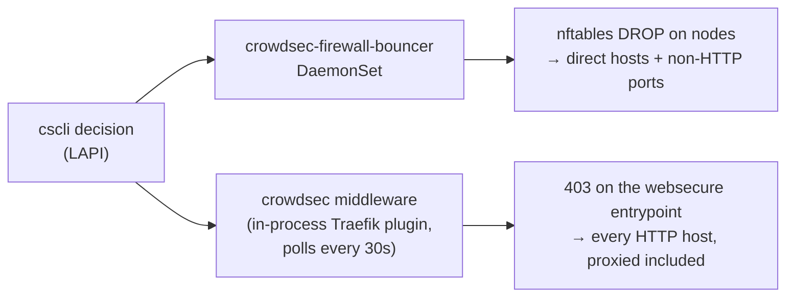

# Manual CrowdSec bans — runbook

How to block an address by hand, and why manual bans are capped at 7 days.

Use `homelab crowdsec ban` rather than `cscli decisions add` directly:

```bash
homelab crowdsec ban <ip|cidr> --reason "why" [--duration 24h]   # default 24h, cap 168h (7d)
homelab crowdsec unban <ip|cidr>
homelab crowdsec decisions [--all]                               # --all includes the CAPI blocklist
```

A reason is required, and hostnames are refused — only literal IPs and CIDRs
are accepted, so an address has to be resolved (and recognised) before it can
be banned.

All four address shapes work: an IPv4 or IPv6 address, and an IPv4 or IPv6
CIDR. `cscli` keeps those on two different flags (`--ip` for a single address,
`--range` for a CIDR) and refuses a CIDR handed to `--ip`; the CLI picks the
right one from the target, so a range reads the same as an address:

```bash
homelab crowdsec ban 2a03:2880::/32 --reason "Meta crawler swarm" --duration 168h
homelab crowdsec ban 192.0.2.1 --reason "credential stuffing"
```

Before 2026-09-02 the wrapper always passed `--ip`, so any CIDR failed with
`… is not a valid ip`.

## Where a ban is enforced

A LAPI decision reaches traffic by two independent paths, split by what can
identify the client:



- The **Traefik bouncer** picks up a change within one 30s poll. Measured
  2026-08-18: an unban took **33s** to take effect end to end.
- The **firewall bouncer** picks up changes within about a minute.

Both apply to *any* address, internal ones included — see "A ban on an internal
address" below, because that is the surprising case.

Until 2026-08-18 the proxied half of this was a Cloudflare IP List plus a zone WAF
rule, reconciled by a `crowdsec-cf-sync` CronJob. That path could lag for days
(the Lists API holds a hard ~72h floor between successful item writes), which is
why this runbook used to be mostly about edge staleness. It is gone; the history
is at the end, since the ban that motivated the cap was made under it.

## What the cap is for

On 2026-08-16 our own London WAN egress IP, `137.220.71.46`, was banned by hand
for `8717h` — 363 days. A Linkwarden `/api/v1/search` 401 retry loop (~2.7k
requests/day) had been traced to the address, and its reverse DNS,
`71.220.137.46.bcube.co.uk`, read as an unrelated external host rather than as
our own ISP's PTR domain. The traffic was our own Mac: the Nextcloud desktop
client and a browser session on `terminal.viktorbarzin.me`.

The lockout surfaced two days later, on 2026-08-18 at 05:45 UTC, when the one
list write that got through pushed the ban to the Cloudflare edge and every
proxied host began returning a block. The node bouncer had been dropping the
same address since 08-16, so non-proxied hosts were affected earlier.

Two things turned a misread into a multi-day outage: the 363-day expiry meant
nothing would clear it on its own, and the edge list could not be corrected on
demand. The 7-day cap addresses the first. The second no longer applies —
enforcement moved into Traefik on 2026-08-18 and an unban now lands in ~33s.

The cap is still worth keeping, because the expensive part of that incident was
not only the slow unwind. The address was misread as a third party from its
reverse DNS, and a bounded expiry is what limits the damage of a misread: it costs
little when the ban is correct and clears itself when it is not.

## If a host still blocks after an unban

1. Confirm LAPI no longer holds the decision:
   `kubectl -n crowdsec exec deploy/crowdsec-lapi -- cscli decisions list --ip <addr>`
   should print `No active decisions`. For a range, the flag is `--range <cidr>`
   — `--ip` does not match a range-scoped decision.
2. Wait one poll. The Traefik bouncer refreshes every 30s; anything under ~35s is
   simply not yet picked up.
3. Check what the bouncer decided, which is logged per blocked request:

   ```bash
   homelab logs query '{namespace="traefik"} |= "crowdsec-bouncer"' --since 15m
   ```

   `action=block ip=… host=…` means it is still enforcing — check the `ip=` value,
   since that is the address it actually judged (the real client from
   `Cf-Connecting-Ip` for proxied traffic, the TCP peer otherwise), and it may not
   be the one you unbanned. `action=dry-run-block` means the middleware is in dry
   run and is not the cause of a block at all.
4. Confirm the bouncer is polling at all — if it is not, it is serving a frozen
   set and `CrowdSecL7BouncerNotPolling` should be firing:

   ```bash
   kubectl -n crowdsec exec deploy/crowdsec-lapi -- cscli bouncers list
   ```

   The `traefik` row's `last pull` should be within the last minute.
5. For a direct host or a non-HTTP port, check the node bouncer instead (it logs
   `N decision(s) deleted`):
   `kubectl logs -n crowdsec ds/crowdsec-firewall-bouncer --tail=20`.
6. If it still blocks, rule out a different gate — rate-limit (429),
   Authentik (302), Anubis, or an `ipAllowList` middleware. Only CrowdSec logs a
   `[crowdsec-bouncer]` line.

## A ban on an internal address

The `crowdsec-whitelist` configmap covers RFC1918, the tailnet and internal CIDRs,
which makes it tempting to assume internal addresses cannot be banned. It is a
**parser-stage** whitelist: it stops scenarios from *generating* a decision, and
does nothing about one added by hand.

`cscli decisions add --ip 10.0.10.10` is enforced in-kernel on every node, in both
the `input` and `forward` hooks. Done on 2026-08-18 while testing, that blackholed
the devvm's traffic to the cluster — including its DNS to Technitium, so the
symptom was `Could not resolve host`, not a 403. `cscli decisions delete` restored
it within ~3s.

If you need to test enforcement, ban an address you are not routing through:
`192.0.2.1` (TEST-NET-1) is reserved for exactly this.

## History: the Cloudflare Lists write quota

Kept because it is the measurement that retired the edge channel on 2026-08-18,
and because the numbers took several passes to get right. None of this is on the
enforcement path any more.

Measured 2026-08-18:

- Writes return HTTP 429 with `code 10040` and `retry-after: 60`, while the
  advertised bucket in the response headers (`"default";r=1199;q=1200;w=300`)
  is almost untouched. The rejecting limiter is not the one advertised, and
  waiting the advertised 60s is not sufficient.
- The limiter is **per account, not per token**: a least-privilege token and the
  global API key were both rejected within seconds of each other.
- Reads are unaffected (`read_segments_list_items`, 1200 per 300s).
- List-**level** operations are not gated at all: creating a list returns the
  max-lists quota error (`10019`), not a 429. Only item writes are limited.

**The allowance is a hard ~72-hour floor between successful writes.** Reading the
audit log over the list's complete history (22 events, 16 intervals) rather than a
45-day window: 8 of 16 intervals fall in `[72h, 72h+120s)`, **three land on
exactly 259,200s**, and no interval anywhere sits between 4.5h and 72h. Longer
gaps are explained by there being no drift when a window opened, so the floor —
not the mean — is the statistic that describes the limiter. An earlier reading in
this file gave "about one change every three days, mean ~3.4"; that is the same
data with the floor averaged away.

Rejected attempts do not consume the budget: `08-01 01:12:03 → 08-04 01:12:03` is
exactly 72h 0s with ~1,900 refusals in between. But every window in which drift
existed was fully consumed — **the edge list disagreed with CrowdSec for 107 of
216 observed hours over 30 days.**

The interval did not move across a ~100x change in how hard the job pushed:
the first ten landed while the CronJob ran `*/2` (up to ~720 write attempts a
day) and the last three under `*/15` plus the backoff ladder (a handful a day).
On that evidence **rejected attempts do not consume the allowance** — it refills
on a timer. An earlier reading, that a fixed retry cadence held the budget open,
does not hold up, and neither does the idea that we were exhausting it: nothing
else in the account competes for it either (the only other writes in the window
were ~250 Worker route operations on 08-16 and occasional ACME DNS records, and
the 08-18 list write still landed on time).

One earlier figure in circulation is worth flagging as an artifact: "one
successful write in ten days" came from grepping the job logs for `replaced
list`, a message that only exists in the code deployed on 2026-08-16. Writes on
08-10 and 08-15 succeeded too and logged differently. The audit log
(`/accounts/{id}/audit_logs`, `resource.type=iplists`) is the reliable source —
it records successes only, so it is also the honest way to measure the interval.

The backoff ladder (2h/6h/12h) and the hourly schedule bought quiet, not quota:
fewer pointless attempts and less log noise. Both are gone with the job. Worth
recording for next time: a **deadline at `last_success + 72h`** would have been
the correct tuning, and the ladder cost about 4h 25m of avoidable staleness on its
last cycle.

**Design consequence, and what was done about it.** A 72h mutation floor is not
usable for a live ban channel: a ban created just after a window closes waits for
the next one, and lifting it waits the same. Enforcement moved in-process into
Traefik instead (`stacks/traefik/modules/traefik/crowdsec-bouncer-plugin/`), where
the decision set is polled every 30s and nothing is rate-limited. An inline IP set
in the WAF rule expression was the other option considered — `rulesets_update` is
not throttled — but it keeps enforcement at the edge, where the client IP is all
Cloudflare can offer and every change is still a zone-config write.
