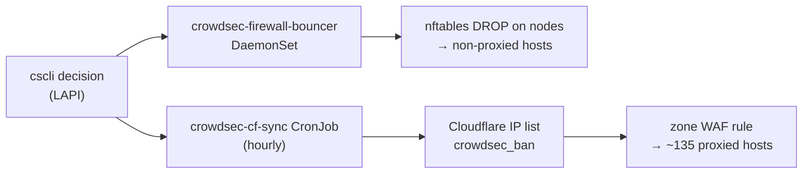

# Manual CrowdSec bans — runbook

How to block an address by hand, and why manual bans are capped at 7 days.

Use `homelab crowdsec ban` rather than `cscli decisions add` directly:

```bash
homelab crowdsec ban <ip|cidr> --reason "why" [--duration 24h]   # default 24h, cap 168h (7d)
homelab crowdsec unban <ip|cidr>
homelab crowdsec decisions [--all]                               # --all includes the CAPI blocklist
```

A reason is required, and hostnames are refused — only literal IPs and CIDRs
are accepted, so an address has to be resolved (and recognised) before it can
be banned.

## Where a ban is enforced

A LAPI decision reaches traffic by two independent paths, which is what makes a
mistaken ban wide-reaching and slow to unwind:



- The **firewall bouncer** picks up changes within about a minute.
- The **Cloudflare edge list** is reconciled by `crowdsec-cf-sync`, and that
  path can lag badly: Cloudflare answers Lists writes with HTTP 429 / code
  10040, and in the ten days to 2026-08-18 the list took exactly **one**
  successful write. Removing an address from LAPI does not promptly remove it
  from the edge.

Because of that asymmetry, a short expiry is the cheap option: it costs little
when the ban is correct, and clears itself when it is not.

Blocks intended to be long-lived belong in the external blocklist import in
`stacks/crowdsec`, where they are visible in git and reviewable, rather than in
an ad-hoc decision no one can find later.

## What the cap is for

On 2026-08-16 our own London WAN egress IP, `137.220.71.46`, was banned by hand
for `8717h` — 363 days. A Linkwarden `/api/v1/search` 401 retry loop (~2.7k
requests/day) had been traced to the address, and its reverse DNS,
`71.220.137.46.bcube.co.uk`, read as an unrelated external host rather than as
our own ISP's PTR domain. The traffic was our own Mac: the Nextcloud desktop
client and a browser session on `terminal.viktorbarzin.me`.

The lockout surfaced two days later, on 2026-08-18 at 05:45 UTC, when the one
list write that got through pushed the ban to the Cloudflare edge and every
proxied host began returning a block. The node bouncer had been dropping the
same address since 08-16, so non-proxied hosts were affected earlier.

Two things turned a misread into a multi-day outage: the 363-day expiry meant
nothing would clear it on its own, and the edge list could not be corrected on
demand. The 7-day cap addresses the first. The second is a property of the
Cloudflare Lists quota — see below.

## If a proxied host still blocks after an unban

1. Confirm LAPI no longer holds the decision: `homelab crowdsec decisions`.
2. Confirm the node bouncer dropped it (it logs `N decision(s) deleted`):
   `kubectl logs -n crowdsec ds/crowdsec-firewall-bouncer --tail=20`.
3. Check the edge list directly — this is usually where a stale entry survives:
   `kubectl logs -n rybbit job/<latest crowdsec-cf-sync>` shows the intended
   `drift` and whether the write was rate-limited.

If the edge list cannot be written and someone is locked out, the WAF rule in
`stacks/rybbit/crowdsec_edge.tf` can carry an explicit `ip.src ne <addr>`
carve-out; the Rulesets API is not gated by the Lists limiter. That is a
stopgap — remove the clause once the list drains.

## Cloudflare Lists write quota — what is known

Measured 2026-08-18:

- Writes return HTTP 429 with `code 10040` and `retry-after: 60`, while the
  advertised bucket in the response headers (`"default";r=1199;q=1200;w=300`)
  is almost untouched. The rejecting limiter is not the one advertised, and
  waiting the advertised 60s is not sufficient.
- The limiter is **per account, not per token**: a least-privilege token and the
  global API key were both rejected within seconds of each other.
- Successful writes are very rare. Over 240h there were **1,852** rate-limited
  attempts and **1** success. Three attempts spaced ~6h apart on 08-17/08-18
  produced two rejections and then one success, so ~6h of quiet is not on its
  own enough.
- Reads are unaffected (`read_segments_list_items`, 1200 per 300s).

Not established: whether rejected attempts themselves consume budget. The
pattern is consistent with a slowly-refilling quota that the pre-2026-08-16
cadence (a write attempt every 2 minutes whenever the list drifted) had drawn
down, but that has not been proven. `lapi_kv_sync.py` now backs off
exponentially (2h/6h/12h since 2026-08-18, persisted in Pushgateway) and the
CronJob runs hourly, which keeps write attempts to a couple a day. The run
cadence itself is not the lever — Cloudflare counts list changes, not requests —
so runs stay frequent enough to keep the drift gauge fresh for the 6h
`CrowdSecEdgeListDrifted` alert.
