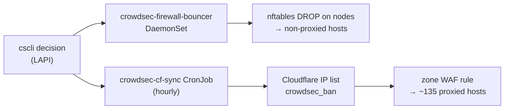

# Manual CrowdSec bans — runbook

How to block an address by hand, and why manual bans are capped at 7 days.

Use `homelab crowdsec ban` rather than `cscli decisions add` directly:

```bash
homelab crowdsec ban <ip|cidr> --reason "why" [--duration 24h]   # default 24h, cap 168h (7d)
homelab crowdsec unban <ip|cidr>
homelab crowdsec decisions [--all]                               # --all includes the CAPI blocklist
```

A reason is required, and hostnames are refused — only literal IPs and CIDRs
are accepted, so an address has to be resolved (and recognised) before it can
be banned.

## Where a ban is enforced

A LAPI decision reaches traffic by two independent paths, which is what makes a
mistaken ban wide-reaching and slow to unwind:



- The **firewall bouncer** picks up changes within about a minute.
- The **Cloudflare edge list** is reconciled by `crowdsec-cf-sync`, and that
  path can lag badly: Cloudflare answers Lists writes with HTTP 429 / code
  10040, and in the ten days to 2026-08-18 the list took exactly **one**
  successful write. Removing an address from LAPI does not promptly remove it
  from the edge.

Because of that asymmetry, a short expiry is the cheap option: it costs little
when the ban is correct, and clears itself when it is not.

Blocks intended to be long-lived belong in the external blocklist import in
`stacks/crowdsec`, where they are visible in git and reviewable, rather than in
an ad-hoc decision no one can find later.

## What the cap is for

On 2026-08-16 our own London WAN egress IP, `137.220.71.46`, was banned by hand
for `8717h` — 363 days. A Linkwarden `/api/v1/search` 401 retry loop (~2.7k
requests/day) had been traced to the address, and its reverse DNS,
`71.220.137.46.bcube.co.uk`, read as an unrelated external host rather than as
our own ISP's PTR domain. The traffic was our own Mac: the Nextcloud desktop
client and a browser session on `terminal.viktorbarzin.me`.

The lockout surfaced two days later, on 2026-08-18 at 05:45 UTC, when the one
list write that got through pushed the ban to the Cloudflare edge and every
proxied host began returning a block. The node bouncer had been dropping the
same address since 08-16, so non-proxied hosts were affected earlier.

Two things turned a misread into a multi-day outage: the 363-day expiry meant
nothing would clear it on its own, and the edge list could not be corrected on
demand. The 7-day cap addresses the first. The second is a property of the
Cloudflare Lists quota — see below.

## If a proxied host still blocks after an unban

1. Confirm LAPI no longer holds the decision: `homelab crowdsec decisions`.
2. Confirm the node bouncer dropped it (it logs `N decision(s) deleted`):
   `kubectl logs -n crowdsec ds/crowdsec-firewall-bouncer --tail=20`.
3. Check the edge list directly — this is usually where a stale entry survives:
   `kubectl logs -n rybbit job/<latest crowdsec-cf-sync>` shows the intended
   `drift` and whether the write was rate-limited.

If the edge list cannot be written and someone is locked out, the WAF rule in
`stacks/rybbit/crowdsec_edge.tf` can carry an explicit `ip.src ne <addr>`
carve-out; the Rulesets API is not gated by the Lists limiter. That is a
stopgap — remove the clause once the list drains.

## Cloudflare Lists write quota — what is known

Measured 2026-08-18:

- Writes return HTTP 429 with `code 10040` and `retry-after: 60`, while the
  advertised bucket in the response headers (`"default";r=1199;q=1200;w=300`)
  is almost untouched. The rejecting limiter is not the one advertised, and
  waiting the advertised 60s is not sufficient.
- The limiter is **per account, not per token**: a least-privilege token and the
  global API key were both rejected within seconds of each other.
- Reads are unaffected (`read_segments_list_items`, 1200 per 300s).
- List-**level** operations are not gated at all: creating a list returns the
  max-lists quota error (`10019`), not a 429. Only item writes are limited.

**The allowance is about one change every three days.** From the Cloudflare
account audit log over 45 days (n=13 successful writes), the intervals were
3.0, 3.3, 3.2, 3.0, 3.8, 3.0, 4.0, 3.0, 3.1, 3.0, 4.9 and 3.2 days — mean ~3.4.

That interval did not move across a ~100x change in how hard the job pushed:
the first ten landed while the CronJob ran `*/2` (up to ~720 write attempts a
day) and the last three under `*/15` plus the backoff ladder (a handful a day).
On that evidence **rejected attempts do not consume the allowance** — it refills
on a timer. An earlier reading, that a fixed retry cadence held the budget open,
does not hold up, and neither does the idea that we were exhausting it: nothing
else in the account competes for it either (the only other writes in the window
were ~250 Worker route operations on 08-16 and occasional ACME DNS records, and
the 08-18 list write still landed on time).

One earlier figure in circulation is worth flagging as an artifact: "one
successful write in ten days" came from grepping the job logs for `replaced
list`, a message that only exists in the code deployed on 2026-08-16. Writes on
08-10 and 08-15 succeeded too and logged differently. The audit log
(`/accounts/{id}/audit_logs`, `resource.type=iplists`) is the reliable source —
it records successes only, so it is also the honest way to measure the interval.

The backoff ladder (2h/6h/12h since 2026-08-18, persisted in Pushgateway) and
the hourly schedule therefore buy quiet, not quota: fewer pointless attempts and
less log noise. Runs stay frequent enough to keep the drift gauge fresh for the
6h `CrowdSecEdgeListDrifted` alert.

**Design consequence.** A ~3-day mutation budget is a poor fit for a live ban
channel: a ban created just after a window closes is not enforced at the edge
until the next one, and lifting it waits the same. If edge bans need to be
timely, the enforcement set is better expressed somewhere that is not
quota-limited — the zone WAF rule expression itself accepts an inline IP set and
`rulesets_update` calls are not throttled, which suits a set this small (~5
entries, since CAPI is excluded and enforced in-kernel instead).
