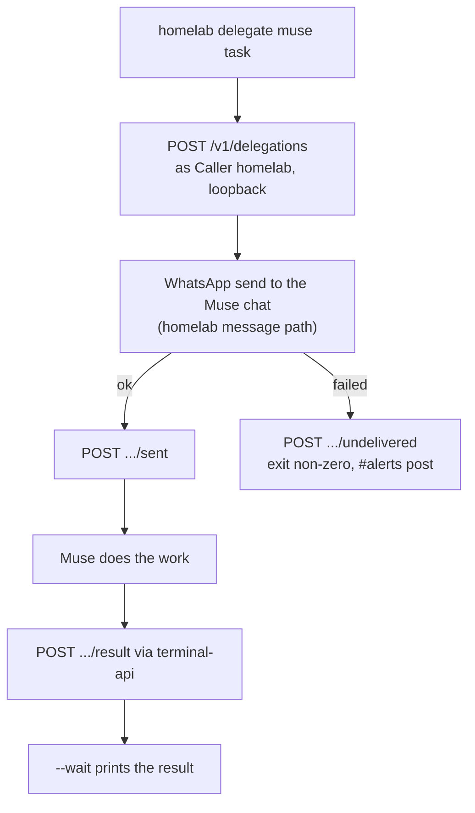

# Delegations: homelab sessions handing work to Muse

A **Delegation** is work a homelab session hands to another **Caller** of agent-api, Muse
first: something only Muse can do, such as reaching Viktor on WhatsApp, acting through its own
connectors, or a multi-day errand. Design:
[2026-10-02-muse-homelab-integration-design.md](../plans/2026-10-02-muse-homelab-integration-design.md),
phase 5.

- CLI: `homelab delegate`, source `cli/delegate.go`, `cli/cmd_delegate.go`
- Store and API: agent-api `/v1/delegations` (Terminal Lobby), persisted in agent-api's state dir
- Config: `playbooks/devvm.yml` (`devvm_external_agents` entry `homelab`)
- Alert: `AgentApiDelegationUndelivered` (Slack #alerts, event lane)



## Using it

```sh
homelab delegate muse "Check whether my BA flight on 14 Oct still shows seat 32A" --wait
homelab delegate status d_01... --wait
homelab delegate list --status sent
```

`--expires` takes `90m`, `24h`, `3d` and so on; the default is 24 hours and the maximum 14 days.
`--wait` long-polls until the delegation is `done`, `failed`, `expired` or `undelivered`, and
exits zero only for `done`.

## Setup

Each of these is needed once. The CLI refuses with a message naming whichever is missing.

1. Vault field `agent_api_homelab_token` in `secret/terminal-lobby`, 32 or more random URL-safe
   characters, then the devvm playbook. That writes the digest into `/etc/terminal-lobby-tokens`,
   sets `TL_DELEGATION_CREATORS=homelab` and `TL_AGENT_PUBLIC_URL` in
   `/etc/terminal-lobby.local.conf`, restarts the lobby services, and installs the token at
   `~wizard/.config/homelab/agent-api-token` (0600).
2. WhatsApp Web linked in the shared chrome-service browser: noVNC at `chrome.viktorbarzin.me`,
   open `web.whatsapp.com`, scan the QR code from the phone.
3. The Muse chat named in two files, by its exact title in the WhatsApp chat list
   (`homelab message contacts --search muse` prints it):
   - `~/.config/homelab/delegate-contacts`: a line `muse=<chat name>`
   - `~/.config/homelab/message-allowlist`: the same name on its own line

The two-file pin replaces the confirm prompt `homelab message send` shows. Delegations are the
one unattended send that path makes, so the recipient is fixed in advance by files a person
wrote, and matched exactly rather than fuzzily. The send itself is the same code: the chat is
verified on screen before typing, and every send is appended to
`~/.local/state/homelab/message-audit.jsonl` with action `delegate`.

## Limits

- 20 delegations per target Caller per rolling hour, 100 per rolling day. Over the cap, agent-api
  answers 429 and the CLI prints when to retry.
- Task text up to 8,000 characters, result up to 32,000.
- A delegation past `expires_at` becomes `expired` (on read, and by a periodic sweep). A late
  result gets 410, telling Muse to drop the work.
- Typing is human-paced, under 10 characters a second, so a long task takes minutes to send.

## When the alert fires

`AgentApiDelegationUndelivered` posts once per delegation whose send failed, with the reason.

It fires only on the trace line for an accepted mark (`event: delegation.undelivered`, HTTP 200), which only the delegation's creator can produce. A refused request to the same route, from any Caller, does not post.

| Reason starts with | What to do |
|---|---|
| WhatsApp Web is logged out | Re-link at `chrome.viktorbarzin.me` (step 2 above), then delegate again |
| chat "..." not found in WhatsApp | The name in `delegate-contacts` does not match a chat title; correct it in both files |
| recipient verification failed | The chat that opened was not the configured one, so nothing was typed. Check for two chats with similar names |
| the shared browser (chrome-service) is unreachable | `homelab k8s status chrome-service`; the browser pod is down or restarting |
| WhatsApp send failed | Something else in the automation; run `homelab message read --to "<chat>"` to see whether WhatsApp Web works at all |

An undelivered delegation is closed; delegating again creates a new one. To see recent ones:

```sh
homelab delegate list --status undelivered
homelab logs query '{job="agent-api-trace"} | json | delegation_id!=""' --since 7d
```

## Revoking

Remove the `homelab` entry from `devvm_external_agents` (or `scripts/agent-api-kill homelab`)
and run the playbook. Muse's own access is a separate entry and is unaffected.

## Open questions

- Whether WhatsApp tolerates automated messages into the Muse chat at the capped volume. The
  August 2026 restriction came from cold messages to strangers, a different pattern; the caps are
  the starting point and get revisited if a warning appears.
