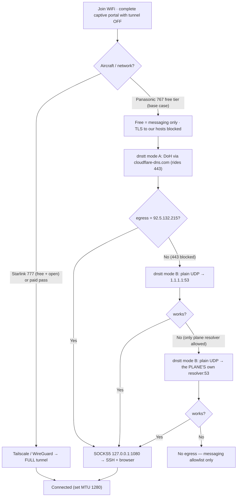

# Hostile-WiFi Tunnel Readiness

**Status:** Approved (grilled 2026-07-26) · **Owner:** Viktor (wizard) · **Owning repo:** `infra`
**Worked example:** United **UA 941** LHR→EWR, 2026-07-27 (return UA 14, 08-02), economy · scheduled equipment **Boeing 767-300ER**.

Reusable runbook for getting a device online through a locked-down captive network
(airline / hotel / conference) using the homelab tunnel arsenal. The UA 941 flight is
the concrete worked example; the method generalises.

---

## Decisions (from the grilling session)

| # | Decision | Choice |
|---|----------|--------|
| 1 | Goal | **Full-tunnel everything** when the network allows it; degrades to selective per-app on a locked tier. |
| 2 | Devices | **Laptop (macOS, Apple Silicon) = primary lifeline; iPhone secondary.** |
| 3 | Strategy | **Easy-first, OCI-anchored** — but see the pruning below. |
| 4 | Free vs pay | **Free only — ride the dnstt DNS-tunnel floor.** No paid pass. |
| 5 | Must-haves over the floor | **SSH to homelab + light web/dashboards.** (Not email/messaging — messaging is likely free on the airline allowlist anyway.) |

**The pruning that matters (Viktor's own point, corroborated by research):** an airline
*free* tier typically allows only DNS + ICMP outbound (or an L7 messaging-SNI allowlist).
Either way **arbitrary TLS to our endpoints is blocked on the free tier**, which kills
*every* TLS rung — Tailscale/DERP-443, CF-xray :443, OCI-REALITY :8443, OCI-SS :8388.
On the **free** tier the only survivor is **dnstt over DNS**. The TLS ladder only revives
if you (a) pay, or (b) get a Starlink 777 (free + open).

---

## Verified tonight (2026-07-26, from the devvm)

The floor this whole plan rests on is **proven working end-to-end**, both transports:

```
built dnstt-client, ran real traffic through the tunnel:
  DoH  via cloudflare-dns.com  → egress 92.5.132.215 ✅  (warm rtt 0.40s)
  plain UDP via 1.1.1.1:53      → egress 92.5.132.215 ✅  (warm rtt 0.43s)
```

- **Delegation intact:** `t.viktorbarzin.me → NS mx2.viktorbarzin.me → 92.5.132.215`; OCI box answers authoritatively on UDP/53.
- **dnstt-server** forwards to a loopback **SOCKS5** (xray "freedom") egressing on the OCI IP.
- **OCI REALITY :8443 + SS :8388 live** (cert camo `www.cloudflare.com`); **:443 also open** on OCI (a future "REALITY-on-443" upgrade — but it won't help a DNS-only free tier, so not pursued now).
- RTT above is on a clean line; **over GEO satellite expect ~600 ms and tens of kbps.** The *path* is proven; the *speed* will be rough — fine for SSH + text dashboards, useless for video/large transfers.

---

## Connection ladder



---

## ✈️ OFFLINE CARD — keep this ON THE LAPTOP

Everything below is home-independent. **Vault and the config portal die with your home
ISP**, so nothing here may be looked up en route — it must already be on the laptop.

**Client binary** (macOS arm64, built + verified 2026-07-26):
```
# scp avoids Gatekeeper quarantine (a browser download would need: xattr -d com.apple.quarantine dnstt-client)
scp <devvm>:~/dnstt-client-darwin-arm64 ~/Downloads/dnstt-client
chmod +x ~/Downloads/dnstt-client
shasum -a 256 ~/Downloads/dnstt-client   # expect: 7d8b6de509e497f290dde289ce6791fc2f34f0a203ab15d62e853d3ca7971258
# self-build fallback (needs Go): go install www.bamsoftware.com/git/dnstt.git/dnstt-client@latest
```

**Constants:**
- Server pubkey: `baef1a676114aaa63e6197df0165b6a0645543523d55ba2adc4e6ca311dc7609`
- Tunnel domain: `t.viktorbarzin.me`  ·  Local SOCKS5: `127.0.0.1:1080`  ·  Expected egress: `92.5.132.215`

**Bring the tunnel up — try modes in this order:**
```
# A) DoH (try first — rides TCP/443 to a public resolver)
./dnstt-client -doh https://cloudflare-dns.com/dns-query \
  -pubkey baef1a676114aaa63e6197df0165b6a0645543523d55ba2adc4e6ca311dc7609 \
  t.viktorbarzin.me 127.0.0.1:1080

# B) plain DNS/UDP-53 (if 443 is blocked but DNS flows)
./dnstt-client -udp 1.1.1.1:53 -pubkey baef1a67…dc7609 t.viktorbarzin.me 127.0.0.1:1080

# B') if 1.1.1.1:53 is blocked, use the PLANE'S OWN resolver:
scutil --dns | awk '/nameserver\[0\]/{print $3; exit}'    # get the plane's resolver IP
./dnstt-client -udp <that-ip>:53 -pubkey baef1a67…dc7609 t.viktorbarzin.me 127.0.0.1:1080
```

**Prove it, then use it:**
```
# egress check (expect 92.5.132.215)
curl --socks5-hostname 127.0.0.1:1080 https://api.ipify.org ; echo

# SSH over the tunnel (BSD nc SOCKS5 + keepalive; run tmux on the far end for resilience)
ssh -o ProxyCommand='/usr/bin/nc -X 5 -x 127.0.0.1:1080 %h %p' \
    -o ServerAliveInterval=30 -o ServerAliveCountMax=4  <user>@<your-public-host>

# browser for dashboards (SOCKS5 also proxies DNS remotely)
open -na "Google Chrome" --args --user-data-dir=/tmp/plane \
  --proxy-server="socks5://127.0.0.1:1080"
```

---

## Tonight pre-flight checklist (macOS, do while home is UP)

1. **Grab + verify the binary** (scp + `shasum` above). scp keeps it un-quarantined.
2. **Essential test — run BOTH dnstt modes from your Mac** and confirm `curl --socks5-hostname 127.0.0.1:1080 https://api.ipify.org` → `92.5.132.215`. This validates the binary (arch/Gatekeeper), your network path, and the recipe. *(No local firewall sim needed — both transports are already proven end-to-end; a macOS `pf` egress sim risks locking yourself out for little gain.)*
3. **Prove your real use-cases** through the SOCKS: SSH to your public host; open a homelab dashboard in the SOCKS Chrome profile.
4. **Save this card locally** on the laptop (and a copy on the phone as a photo/note) — pubkey, domain, the three modes, the "use the plane's resolver" fallback.
5. **Starlink upside — enroll the laptop in Tailscale** (iPhone already enrolled, node valid to 2026-10-12): portal `POST /api/tailscale/enroll` → `tailscale up --login-server https://headscale.viktorbarzin.me --authkey <key>` → `tailscale status`. On a Starlink 777 this gives you a proper full tunnel; on the locked Panasonic tier it won't connect (TLS blocked) — that's expected.
6. *(optional, low priority)* Import the Hiddify subscription for REALITY/SS — only useful if you end up paying or on a 443-but-not-DNS-only network. Skippable given the free-only choice.
7. If you'll use Tailscale/WireGuard (Starlink case), remember **MTU 1280** on satellite.

## On the plane

0. Join the SSID, **complete the captive portal with the tunnel OFF**; note aircraft + wifi type.
1. **Starlink 777 (free open):** Tailscale/WireGuard up → full tunnel. Done.
2. **Panasonic 767 (free = messaging):** start dnstt (mode A → B → B'), verify egress `92.5.132.215`, then SSH + dashboards over SOCKS `127.0.0.1:1080`. Use tmux on the far end.
3. **iPhone:** messaging apps only on the locked tier.

---

## Remaining gaps (accepted)

| Gap | Severity | Note |
|-----|----------|------|
| **iPhone has no dnstt client** | medium | On the locked tier the phone is messaging-only. The laptop is the lifeline. |
| **dnstt is slow** (~tens of kbps, ~600 ms GEO) | medium | SSH / text / dashboards only. No video or large transfers. Accepted (free-only). |
| **Home-ISP single point of failure** | high | If home drops: Tailscale/WG and any `*.viktorbarzin.me` home service die. The **OCI dnstt SOCKS egress still works** but reaches the *general internet*, not home services. |
| **Aircraft may swap 767↔777** | low-med | Re-check onboard; a 777 could mean free open Starlink. |

## Confidence

- **HIGH:** dnstt floor works (both transports verified tonight, real egress); delegation; OCI liveness; home-ISP topology.
- **MED:** aircraft type (tracker says 767, day-of swaps happen); Starlink-vs-Panasonic for this tail.
- **LOW-MED:** exact in-flight firewall port/UDP/DPI rules (unpublished) — the ladder is "what to try, in order," not a guarantee.
