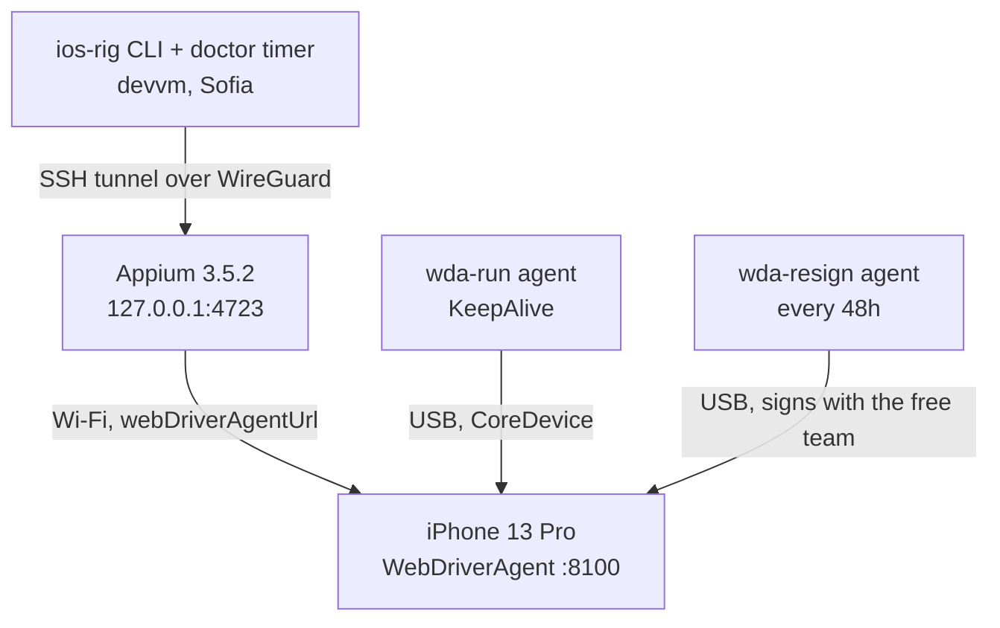

# Runbook: iOS test rig

A personal iPhone, permanently cabled to the London MacBook, driven from the
devvm over the WireGuard tunnel. Sideloads and drives custom builds with a free
Apple ID, no paid Apple Developer Program membership.

Built 2026-09-12. Every number and error message here was measured on the real
rig that day.

## At a glance

| Component | Where | What |
|---|---|---|
| iPhone 13 Pro `00008110-001614D03442801E` | London, on the cable | the device under test, iOS 26.5.2 at setup |
| `me.viktorbarzin.appium` | Mac LaunchAgent | Appium 3.5.2 + `xcuitest` 11.17.1, bound to `127.0.0.1:4723` |
| `me.viktorbarzin.wda-run` | Mac LaunchAgent, KeepAlive | keeps WebDriverAgent running, publishes its URL to `~/.ios-rig-wda-url` |
| `me.viktorbarzin.wda-resign` | Mac LaunchAgent, every 48h | re-signs WebDriverAgent before its 7-day certificate lapses |
| `ios-rig-tunnel.service` | devvm, `systemd --user` | SSH tunnel carrying Appium 4723 |
| `ios-rig-doctor.timer` | devvm, `systemd --user`, 6-hourly | checks every link, posts to Slack when degraded |
| `scripts/ios-rig/` | this repo | the whole rig, including the Mac bootstrap |



```stats
7 | days a free certificate lasts
48 | hours between re-signs
3 | sideloaded apps at once
2 | slots left after WebDriverAgent
```

The USB cable carries signing, installs and device state through CoreDevice.
Automation itself goes over **Wi-Fi** to WebDriverAgent. That split is forced
rather than chosen, and the next section explains what forces it.

## Constraints that shape everything else

> [!IMPORTANT]
> The rig deliberately does not use usbmuxd. Everything below follows from
> that, and it is the first thing to understand before changing anything.

**The lockdown pairing cannot be established on this phone.** Stolen Device
Protection gates "Trust This Computer" behind Face ID with no passcode
fallback, and the enrolled face belongs to the phone's previous owner, who is
not present. Every `idevicepair pair` returns `user denied the trust dialog`.
Turning Stolen Device Protection off is itself Face-ID gated, with a one-hour
delay away from familiar locations, so there is no way round it from here.

What that costs, measured: `idevicesyslog` device logs, `ideviceinstaller`,
`idevicescreenshot` and `iproxy`. What it does **not** cost: taps, gestures,
screenshots, page source and `mobile: deepLink`. Installing builds goes through
`devicectl device install app` instead of `ideviceinstaller`.

> [!NOTE]
> A **default** Appium session does need that pairing and fails with `Could
> not find a pair record for device`. This rig never takes that path. It
> passes `appium:webDriverAgentUrl`, which makes the driver proxy straight to
> a WebDriverAgent already running on the device and skip the usbmux attach
> entirely.

**iOS 17+ keeps two independent pairing records.** CoreDevice has its own
RemoteXPC pairing, created by `devicectl manage pair`, alongside the classic
lockdown pairing that usbmuxd uses. They break independently, so `devicectl`
can report `pairingState: paired` with a live tunnel while `idevicepair
validate` fails. Everything that has to work unattended goes through
CoreDevice, because that record is the one we can actually keep.

**Signing has to happen in the Aqua GUI session.** `xcodebuild` over SSH fails
at `CodeSign ... errSecInternalComponent`, because the login keychain holding
the signing key is not reachable from a Background session. `launchctl
managername` prints `Background` in an SSH session and `Aqua` in a login
session. That is why both Xcode-touching jobs are LaunchAgents with
`LimitLoadToSessionType: Aqua` rather than things the devvm runs over SSH. To
run one on demand:

```sh
launchctl kickstart gui/$(id -u)/me.viktorbarzin.wda-resign
```

**The phone cannot be wiped.** Activation Lock is held by a different Apple ID
than the one that signs the builds. Erase All Content and Settings would need
that account's password to reactivate, so "wipe and start over" is not
available as a recovery step, and nothing below assumes it.

**Free personal team limits.** Certificates last 7 days, at most 3 sideloaded
apps are installed at once, and at most 10 App IDs can be registered per week.
WebDriverAgent permanently occupies one of the 3 slots, leaving 2 for apps
under test. A free team also cannot sign push notifications, App Groups, Live
Activities, Wallet, HealthKit, iCloud or associated domains; builds needing
those install and run but lose the feature.

**The build host is a corporate machine, and it travels.** It is DEP-enrolled
and MDM-managed, runs an internally packaged Xcode, and `xcode-select` points
at CommandLineTools. Changing that needs sudo we do not have, so every Xcode
call sets `DEVELOPER_DIR` explicitly. When the laptop leaves, the rig stops.
That is expected rather than a fault.

**Signing cannot move to Linux.** Investigated 2026-09-12, no working path for
iOS 26: exporting a free-team P12 and profile as files is an open upstream
issue, `AltServer-Linux` has been unmaintained since 2022, and
nested-framework signing fails on the `.xctrunner` shape WebDriverAgent has.
If that changes, the re-sign job is the only piece that would move.

## Normal operation

```sh
scripts/ios-rig/ios-rig doctor          # check every link in the chain
scripts/ios-rig/ios-rig wda-url         # where WebDriverAgent is listening now
scripts/ios-rig/ios-rig screenshot /tmp/shot.png
scripts/ios-rig/ios-rig screenshot /tmp/shot.png --url https://example.com
scripts/ios-rig/ios-rig screenshot /tmp/shot.png --tap 200,400
```

`doctor` is the first thing to run for any symptom. It reports each link
separately, so it distinguishes "the laptop is away" from "the certificate
expired". A healthy run is **9 ok, 0 failing**, with two standing warnings:
`pairing-lockdown` unavailable, and the current iOS version.

The phone takes a DHCP lease and WebDriverAgent rebinds on every restart, so
its address is never hardcoded. The runner writes whatever WDA actually bound
to into `~/.ios-rig-wda-url`, and the CLI reads it from there.

## Rebuilding from nothing

```sh
scripts/ios-rig/bootstrap-mac.sh --dry-run   # see what would change
scripts/ios-rig/bootstrap-mac.sh             # tooling and all three LaunchAgents
systemctl --user enable --now ios-rig-tunnel.service ios-rig-doctor.timer
```

Three steps need a human holding the phone, because Apple requires physical
confirmation:

1. **Pair.** `devicectl manage pair --device <udid>`, then tap Trust and enter
   the passcode. This is the CoreDevice pairing, and it is the one that works.
2. **Developer Mode**, in Settings, Privacy and Security. The device restarts,
   then asks for the passcode again.
3. **Trust the developer certificate**, in Settings, General, VPN and Device
   Management, under Developer App. Passcode, not Face ID. Until this is done
   WebDriverAgent installs but will not launch.

## Symptoms

### WebDriverAgent will not launch

```
Unable to launch me.viktorbarzin.wda.xctrunner because it has an invalid code
signature, inadequate entitlements or its profile has not been explicitly
trusted by the user
```

Step 3 above. Settings, General, VPN and Device Management, tap the
`Apple Development: vbarzin@gmail.com` certificate, Trust. The phone needs
internet access to verify it.

### `doctor` says `wda-reachable` failed, or a session dies with `EHOSTUNREACH`

Usually the phone's Wi-Fi is asleep. An idle iPhone shows this as spiky
latency: 8.9ms to 79.7ms with 35ms stddev on a two-packet ping. Wake the
screen and retry. Guest-network client isolation would look the same, so if it
persists, check `uci show wireless | grep isolate` on the Flint, where `0`
means isolation is off.

### `doctor` says `wda-running` has no published URL

The runner could not start WebDriverAgent. Look at the reason:

```sh
ssh mac 'tail -30 /tmp/wda-run.log'
launchctl kickstart -k gui/$(id -u)/me.viktorbarzin.wda-run
```

### Sessions fail after about a week

The 7-day certificate lapsed and the 48-hour re-sign job has not run, usually
because the laptop was closed. On the Mac:

```sh
launchctl kickstart gui/$(id -u)/me.viktorbarzin.wda-resign
tail -40 /tmp/wda-resign.log
```

### A screenshot after `--url` comes back blurred

That is the iOS app-switch animation, caught mid-transition. The client polls
`mobile: activeAppInfo` until the target app is frontmost before capturing, so
a blurred frame means the poll was skipped or timed out. It prints
`warning: <bundle> never came to the front` when that happens.

### `doctor` says `ssh` failed

The Mac roams between the Flint LAN `192.168.8.0/24` and the Hyperoptic guest
network `192.168.9.0/24`, taking a new DHCP address each time.

```sh
scripts/ios-rig/ios-rig discover
```

Then set `IOS_RIG_MAC_HOST`, or update `scripts/ios-rig/rig.env`.

### Re-running `bootstrap-mac.sh` left nothing loaded

`launchctl bootout` is asynchronous. Bootstrapping before the old job has
finished unloading fails with `Bootstrap failed: 5: Input/output error` and
leaves the agent unloaded, which took Appium down once on 2026-09-12. The
script now waits for the label to disappear and retries, so a plain re-run
fixes it.

### A value read over SSH is empty when the file clearly has content

The Mac's login shell sources iTerm2 shell integration, which emits OSC escape
sequences (`ESC ] 1337 ; SetUserVar=...`) into command output. They are
invisible in a terminal and silently break anchored matches. `ios-rig` strips
them in `on_mac`; anything new that parses SSH output should do the same.

### iOS updated itself and something broke

The device tracks iOS updates by choice rather than being pinned, so this is
expected occasionally, and it is the likeliest cause of a sudden break.
`doctor` reports the current version on every run. Check that the Appium
`xcuitest` driver supports the new version before debugging anything else.

## Security notes

Appium listens on `127.0.0.1` only. It bound to `0.0.0.0` until 2026-09-12,
which exposed full device control to anyone on the shared guest network the
laptop sits on. The devvm reaches it through SSH forwarding rather than an
exposed port, so the rig adds no open listener to a machine on an untrusted
network.

> [!WARNING]
> WebDriverAgent listens on the phone's Wi-Fi address on port 8100 with no
> authentication, which the pairing constraint leaves no way around. While the
> rig is up, anyone on the London LAN can drive the phone. That is a
> reasonable trade for a dedicated test device holding nothing we care about,
> and worth re-examining before applying the same pattern to a phone that
> holds real data.
