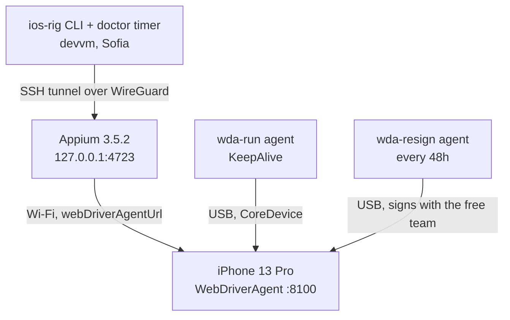

# Runbook: iOS test rig

A personal iPhone, permanently cabled to the London MacBook, driven from the
devvm over the WireGuard tunnel. Sideloads and drives custom builds with a free
Apple ID, no paid Apple Developer Program membership.

Built 2026-09-12. Every number and error message here was measured on the real
rig that day.

## At a glance

| Component | Where | What |
|---|---|---|
| iPhone 13 Pro `00008110-001614D03442801E` | London, on the cable | the device under test, iOS 26.5.2 at setup |
| `me.viktorbarzin.appium` | Mac LaunchAgent | Appium 3.5.2 + `xcuitest` 11.17.1, bound to `127.0.0.1:4723` |
| `me.viktorbarzin.wda-run` | Mac LaunchAgent, KeepAlive | keeps WebDriverAgent running, publishes its URL to `~/.ios-rig-wda-url` |
| `me.viktorbarzin.wda-resign` | Mac LaunchAgent, every 48h | re-signs WebDriverAgent before its 7-day certificate lapses |
| `me.viktorbarzin.ios-rig-build` | Mac LaunchAgent, on demand | builds an Xcode project with the free team and installs it |
| `me.viktorbarzin.ios-rig-awake` | Mac LaunchAgent, KeepAlive | `caffeinate -s`, stops the laptop sleeping the rig away |
| `ios-rig-tunnel.service` | devvm, `systemd --user` | SSH tunnel carrying Appium 4723 |
| `ios-rig-doctor.timer` | devvm, `systemd --user`, 6-hourly | checks every link; reports by exit code, see below |
| `homelab ios` | this repo, `cli/` | every verb; the Mac-side assets are embedded in the binary |



```stats
7 | days a free certificate lasts
48 | hours between re-signs
3 | sideloaded apps at once
2 | slots left after WebDriverAgent
```

The USB cable carries signing, installs and device state through CoreDevice.
Automation itself goes over **Wi-Fi** to WebDriverAgent. That split is forced
rather than chosen, and the next section explains what forces it.

## Constraints that shape everything else

> [!IMPORTANT]
> The rig deliberately does not use usbmuxd. Everything below follows from
> that, and it is the first thing to understand before changing anything.

**The lockdown pairing could not be established when the rig was built, and
the design still assumes it is absent.** On 2026-09-12 Stolen Device
Protection gated "Trust This Computer" behind Face ID with no passcode
fallback, the enrolled face belonged to the phone's previous owner, and every
`idevicepair pair` returned `user denied the trust dialog`. Turning Stolen
Device Protection off is itself Face-ID gated, with a one-hour delay away from
familiar locations.

**On 2026-09-19 that pairing was present**: `idevicepair validate` returned
`SUCCESS`, `idevice_id -l` listed the device and `idevicename` answered. It
appeared during a session where the phone was re-cabled and a passcode was
entered to trust a developer certificate. Which of those established it was
not isolated, and nothing has confirmed it survives a reboot or an unpair, so
treat it as present rather than dependable.

Nothing in the rig was changed to use it, and that is deliberate: everything
load-bearing goes through CoreDevice, which is the record we have kept
continuously. While the lockdown pairing holds it additionally makes
`idevicesyslog` device logs, `ideviceinstaller`, `idevicescreenshot` and
`iproxy` available, which are useful for debugging by hand. Taps, gestures,
screenshots, page source and `mobile: deepLink` never needed it. Installing
builds still goes through `devicectl device install app`.

> [!NOTE]
> A **default** Appium session does need that pairing and fails with `Could
> not find a pair record for device`. This rig never takes that path. It
> passes `appium:webDriverAgentUrl`, which makes the driver proxy straight to
> a WebDriverAgent already running on the device and skip the usbmux attach
> entirely.

**iOS 17+ keeps two independent pairing records.** CoreDevice has its own
RemoteXPC pairing, created by `devicectl manage pair`, alongside the classic
lockdown pairing that usbmuxd uses. They break independently, so `devicectl`
can report `pairingState: paired` with a live tunnel while `idevicepair
validate` fails. Everything that has to work unattended goes through
CoreDevice, because that record is the one we can actually keep.

**Signing has to happen in the Aqua GUI session.** `xcodebuild` over SSH fails
at `CodeSign ... errSecInternalComponent`, because the login keychain holding
the signing key is not reachable from a Background session. `launchctl
managername` prints `Background` in an SSH session and `Aqua` in a login
session. That is why both Xcode-touching jobs are LaunchAgents with
`LimitLoadToSessionType: Aqua` rather than things the devvm runs over SSH. To
run one on demand:

```sh
launchctl kickstart gui/$(id -u)/me.viktorbarzin.wda-resign
```

**The phone cannot be wiped.** Activation Lock is held by a different Apple ID
than the one that signs the builds. Erase All Content and Settings would need
that account's password to reactivate, so "wipe and start over" is not
available as a recovery step, and nothing below assumes it.

**Free personal team limits.** Certificates last 7 days, at most 3 sideloaded
apps are installed at once, and at most 10 App IDs can be registered per week.
WebDriverAgent permanently occupies one of the 3 slots, leaving 2 for apps
under test. A free team also cannot sign push notifications, App Groups, Live
Activities, Wallet, HealthKit, iCloud or associated domains; builds needing
those install and run but lose the feature.

**The build host is a corporate machine, and it travels.** It is DEP-enrolled
and MDM-managed, runs an internally packaged Xcode, and `xcode-select` points
at CommandLineTools. Changing that needs sudo we do not have, so every Xcode
call sets `DEVELOPER_DIR` explicitly. When the laptop leaves, the rig stops.
That is expected rather than a fault.

**Signing cannot move to Linux.** Investigated 2026-09-12, no working path for
iOS 26: exporting a free-team P12 and profile as files is an open upstream
issue, `AltServer-Linux` has been unmaintained since 2022, and
nested-framework signing fails on the `.xctrunner` shape WebDriverAgent has.
If that changes, the re-sign job is the only piece that would move.

## Where the code lives

Everything is `homelab ios`. The Go half (`cli/ios.go`, `cli/cmd_iosrig.go`)
owns the devvm side; the Mac side stays shell and plists in `cli/ios_assets/`
because it has to run under `launchd`, and it is embedded in the binary so
`bootstrap` works without a checkout.

> [!NOTE]
> The command file is `cmd_iosrig.go`, not `cmd_ios.go`. Go reads a trailing
> `_<GOOS>` in a file name as an implicit build constraint and `ios` is a real
> GOOS, so the obvious name excluded the file from every build here while
> compiling cleanly on its own. The symptom is `undefined: iosCommands` with no
> error reported in the file itself.

The capability catalog (`homelab how`) knows about the rig, and a test asserts
that no entry still claims no iOS instrument exists — that claim was what kept
agents from reaching for it.

## What autonomous operation needs

Everything below was measured on 2026-09-12. The rig runs unattended only
while all of it holds, and two of them are human-dependent by design.

| Link | Held by | Fails when |
|---|---|---|
| WireGuard Sofia to London | pfSense and the Flint | tunnel down |
| Mac reachable | Flint static lease, Technitium record | it leaves the London LAN |
| Mac **awake** | `me.viktorbarzin.ios-rig-awake` running `caffeinate -s` | on battery, where the assertion deliberately does not apply |
| Mac **logged in** | a human, once per boot | **any reboot**, see below |
| Phone cabled and booted | the cable | unplugged |
| Phone **unlocked** | Auto-Lock setting | **the screen locks**, see below |
| Developer Mode on | survives reboots | a factory reset |
| Certificate under 7 days old | `me.viktorbarzin.wda-resign` for WDA only, and only while the phone is attached | your own apps, which need a reinstall; or the phone spends 7 days off the cable, after which WDA needs a re-sign **and** a trust tap |

### The phone must stay unlocked

A locked phone can still be screenshotted, and nothing else. Measured: a
`deepLink` on a locked device fails with
`FBSOpenApplicationServiceErrorDomain Code=1`, WebDriverAgent's listener on
port 8100 stops answering, and `POST /wda/unlock` times out without unlocking,
because WebDriverAgent cannot get past a passcode.

So **set Auto-Lock to Never**, in Settings, Display & Brightness, Auto-Lock.
The phone is permanently on the cable, so there is no battery cost. Without
it the rig stops the first time the screen times out and stays stopped until
someone picks the phone up.

`doctor` checks this first and fails in about 10 seconds rather than spending
the WebDriverAgent retry window on something no restart can fix.

### FileVault means a reboot needs a human

FileVault is on, so after any reboot the Mac sits at the pre-boot login screen
with the disk still encrypted. No SSH, no Aqua session, no LaunchAgents. There
is no unattended path through that, and disabling FileVault on a
corporate-managed laptop is not the answer. A Mac reboot simply ends autonomous
operation until someone types the password.

### Sleep

The Mac is configured to sleep one minute after the display sleeps, and the
display sleeps at ten, even on AC. Left alone, it would take the rig down about
eleven minutes after the last keypress. `caffeinate -s` holds
`PreventSystemSleep` for as long as the agent runs, which needs no `sudo` and
still lets the laptop sleep normally on battery. `doctor` reports whether the
assertion is actually held rather than whether the agent is merely loaded.

## Normal operation

```sh
homelab ios doctor          # check every link in the chain
homelab ios wda-url         # where WebDriverAgent is listening now
homelab ios apps            # what is installed, against the 3-app cap
homelab ios shot /tmp/shot.png
homelab ios shot /tmp/shot.png --url https://example.com
homelab ios shot /tmp/shot.png --tap 200,400
```

## Sideloading an app

```sh
homelab ios install <project-dir> [--scheme S] [--bundle-id B] [--no-launch]
```

It copies the project to the Mac, builds it there in the Aqua session with the
free team, installs with `devicectl device install app`, and launches it.
`--scheme` defaults to the directory name and `--bundle-id` to
`me.viktorbarzin.<dirname>` lowercased.

The project can carry its own `.xcodeproj`, or a `project.yml` for xcodegen,
which is regenerated on every build so no generated file has to live in git.
`cli/ios_assets/testapp/` is a minimal app that exists to verify this path
works; it is not a template to copy.

> [!IMPORTANT]
> Each **new** bundle identifier consumes one of the 10 App IDs a free account
> may register per week, and each installed app one of the 3 slots, of which
> WebDriverAgent permanently holds one. Reusing a bundle id costs neither.
> `homelab ios apps` shows what is currently taking up space.

Builds go through `devicectl`, not `ideviceinstaller`, because the lockdown
pairing `ideviceinstaller` needs is blocked on this phone.

> [!IMPORTANT]
> **Nothing notifies you when the rig breaks.** The timer runs `homelab ios
> doctor` at 02:17, 08:17, 14:17 and 20:17, and a degraded rig makes it exit
> non-zero and stop there. systemd does not notify on unit failure by default,
> so the result reaches a person only when someone looks.
>
> Until 2026-09-19 the unit said "alerts Slack when degraded" and passed an
> `--alert` flag. `iosDoctor` reads its arguments only for `--help`, so the
> flag was accepted and discarded and no message was ever sent. The claim is
> removed rather than implemented: Viktor decided on 2026-09-19 that the rig
> does not need alerting, since it is driven on demand rather than relied on
> continuously.
>
> This is worth knowing because it is half of why the rig sat broken from
> 2026-09-12 to 2026-09-19. The other half, `ios-rig-doctor.service` failing
> at exec before the check could run, is fixed. If alerting is wanted later,
> `secret/viktor` in Vault already holds `slack_bot_token`, and
> `scripts/cluster_healthcheck.sh` has the established pattern.
>
> Checking the last run, which is less obvious than it should be: the devvm
> user journal is not persisted and Loki's `devvm-journal` job does not carry
> user-slice units, so `journalctl --user` and a Loki query both come back
> empty. Use `systemctl --user show ios-rig-doctor.service -p Result -p
> ExecMainStatus` instead.

`doctor` is the first thing to run for any symptom. It reports each link
separately, so it distinguishes "the laptop is away" from "the certificate
expired". A healthy run is **13 ok, 0 failing**, with one standing warning for
the current iOS version. It was 11 ok with two warnings when the rig was built:
`appium-tunnel` was added on 2026-09-19, and `pairing-lockdown` moved from a
standing warning to ok when that pairing appeared.

`doctor` reports Appium twice, because there are two separate things to know.
The `appium` check curls the Mac's own loopback over SSH, which says the server
is running. The `appium-tunnel` check dials `127.0.0.1:4723` on the devvm, which
says this box can actually reach it. Appium binds loopback on the Mac, so only
`ios-rig-tunnel.service` connects the two, and a green `appium` alongside a red
`appium-tunnel` means the server is fine and the forward is not.

The phone takes a DHCP lease and WebDriverAgent rebinds on every restart, so
its address is never hardcoded. The runner writes whatever WDA actually bound
to into `~/.ios-rig-wda-url`, and the CLI reads it from there.

WebDriverAgent reports that address only once, at launch, so a new lease leaves
it listening on a socket while the published URL points somewhere nobody
answers. The CLI checks the published URL before using it and restarts the
runner when it does not answer, so a stale address heals without anyone
noticing it went stale.

## Rebuilding from nothing

```sh
homelab ios bootstrap --dry-run     # see what would change
homelab ios bootstrap               # tooling, all five LaunchAgents, devvm units
homelab ios bootstrap --units-only  # this box's systemd units alone, no Mac needed
systemctl --user enable --now ios-rig-tunnel.service ios-rig-doctor.timer
```

A full `bootstrap` starts by checking it can SSH to the Mac and stops there if
it cannot, since almost everything it does happens on the Mac. The devvm units
are the exception: they are written locally from the embedded assets and the
Mac plays no part, so `--units-only` writes them, reloads systemd and enables
both units while the laptop is away.

Three steps need a human holding the phone, because Apple requires physical
confirmation:

1. **Pair.** `devicectl manage pair --device <udid>`, then tap Trust and enter
   the passcode. This is the CoreDevice pairing, and it is the one that works.
2. **Developer Mode**, in Settings, Privacy and Security. The device restarts,
   then asks for the passcode again.
3. **Trust the developer certificate**, in Settings, General, VPN and Device
   Management, under Developer App. Passcode, not Face ID. Until this is done
   WebDriverAgent installs but will not launch.

## What it cannot do yet

**Reach anything behind Authentik forward-auth.** `homelab ios shot --url` opens
a URL and taps; it cannot set a request header or run JavaScript, so it cannot
plant a bearer token the way the Playwright-based tooling does. A blind agent
sent to reproduce a logged-in bug on `tripit.viktorbarzin.me` on 2026-09-12 got
the landing page and correctly reported "reproduced the platform, not the bug".
Most of what we host is gated, so this is the limitation most likely to stop a
real task.

Two ways round it, neither built:

- type the credentials on the phone once through the real login flow, and let
  the session cookie persist, or
- drive Appium directly (it is already up on the Mac at `127.0.0.1:4723`) and
  use a script that plants the token before the page loads, rather than the
  `shot` verb.

**Read device logs.** `idevicesyslog` needs the lockdown pairing that Stolen
Device Protection blocks. There is no workaround while that holds.

## Symptoms

### WebDriverAgent will not launch

```
Unable to launch me.viktorbarzin.wda.xctrunner because it has an invalid code
signature, inadequate entitlements or its profile has not been explicitly
trusted by the user
```

Step 3 above. Settings, General, VPN and Device Management, tap the
`Apple Development: vbarzin@gmail.com` certificate, Trust. The phone needs
internet access to verify it.

### `doctor` says `wda-reachable` failed, or a session dies with `EHOSTUNREACH`

Usually the phone's Wi-Fi is asleep. An idle iPhone shows this as spiky
latency: 8.9ms to 79.7ms with 35ms stddev on a two-packet ping. Wake the
screen and retry. Guest-network client isolation would look the same, so if it
persists, check `uci show wireless | grep isolate` on the Flint, where `0`
means isolation is off.

### `doctor` says `wda-running` has no published URL

The runner could not start WebDriverAgent. Look at the reason:

```sh
ssh mac 'tail -30 /tmp/wda-run.log'
launchctl kickstart -k gui/$(id -u)/me.viktorbarzin.wda-run
```

### `0xe8008011 This provisioning profile has expired`

The free-team certificate lapsed rather than rolling over, and the phone now
needs a human. Measured on 2026-09-19, seven days after the rig was built.

`me.viktorbarzin.wda-resign` runs every 48 hours and re-signs inside the
7-day window, which normally means the identity is never new and nothing has
to be trusted again. That only holds while the phone is attached. The run at
2026-09-18T23:29:51Z recorded
`{"ok":false,"stage":"device-absent"}` because the phone was unplugged, no
later run fell inside the window, and the certificate expired.

Recovering takes two steps, the second of which no automation can do:

```sh
ssh <mac> 'launchctl kickstart -k gui/$(id -u)/me.viktorbarzin.wda-resign'
```

Then, **on the phone**, Settings, General, VPN & Device Management, Developer
App, the `Apple Development: <appleid>` entry, Trust. Passcode, not Face ID.
A re-sign inside the window reuses an identity the device already trusts; once
the certificate has fully lapsed the replacement is a new identity, and iOS
refuses to launch it until someone confirms it:

```
Unable to launch me.viktorbarzin.wda.xctrunner because it has an invalid code
signature, inadequate entitlements or its profile has not been explicitly
trusted by the user
```

Then `launchctl kickstart -k gui/$(id -u)/me.viktorbarzin.wda-run` and the
runner publishes its URL again.

`doctor`'s `last-resign` check reports this the moment it happens, reading
`~/.ios-rig-status.json` on the Mac. In this instance nobody saw it, because
`ios-rig-doctor.service` was itself failing at exec for the whole week.
Leaving the phone attached is what prevents it; the re-sign job cannot sign a
device that is not there.

### Sessions fail after about a week

The 7-day certificate lapsed and the 48-hour re-sign job has not run, usually
because the laptop was closed. On the Mac:

```sh
launchctl kickstart gui/$(id -u)/me.viktorbarzin.wda-resign
tail -40 /tmp/wda-resign.log
```

### A screenshot after `--url` comes back blurred

That is the iOS app-switch animation, caught mid-transition. The client polls
`mobile: activeAppInfo` until the target app is frontmost before capturing, so
a blurred frame means the poll was skipped or timed out. It prints
`warning: <bundle> never came to the front` when that happens.

### `doctor` says `ssh` failed

The Mac is addressed as `mbp-london.viktorbarzin.lan`, which resolves through
Technitium to its Flint static lease at `192.168.8.168`. If both go stale,
point the rig somewhere else without touching code:

```sh
IOS_RIG_MAC_HOST=192.168.8.42 homelab ios doctor
```

Every field has an `IOS_RIG_*` override: `MAC_HOST`, `MAC_USER`, `UDID`,
`TEAM_ID`, `WDA_BUNDLE_ID`, `DEVELOPER_DIR`, `APPIUM_PORT`, plus `SSH_PORT`,
`MAC_SUBNET`, `MAC_HW_ADDR` and `DISCOVERY_COOLDOWN` for the discovery
described next. A second phone needs no code change.

### The rig finds the Mac when the name stops answering

Since 2026-09-19 an override is a convenience rather than the only way
through. When the configured name does not answer on port 22, the rig sweeps
`MAC_SUBNET`, asks every host with SSH open for `networksetup -getmacaddress
en0`, and uses the one whose **hardware** address matches `MAC_HW_ADDR`. The
hardware address is the single identifier a private-address rotation cannot
change, which is what makes the match trustworthy: an open port 22 on the LAN
is not on its own a reason to start driving a machine.

Measured on the stranded Mac that prompted it: 14s for a cold sweep of a /24,
then 4s once the result is cached in `~/.ios-rig-mac-host`. The cache is only
ever a hint, re-checked on every read, and the configured name always wins
when it answers, so a healthy rig never pays for any of this.

A failed sweep is remembered for five minutes in
`~/.ios-rig-discovery-failed`, and a sweep inside that window is skipped.
Without it a Mac that is genuinely away turns the tunnel unit into a scanner:
measured on 2026-09-19, 137 restarts in the hour after the laptop left, each
sweeping all 254 addresses, about 35,000 connection attempts for a machine
that was not going to answer. The cooldown suppresses only the sweep, and the
two direct probes still run every cycle, so a Mac returning to either the
configured name or the cached address is picked up at once (14s falls to 6s
with the sweep skipped). Only a Mac appearing at a third address waits out the
window. `IOS_RIG_DISCOVERY_COOLDOWN` changes it, and a success deletes the
marker.

`doctor` reports a `mac-address` warning whenever discovery fired, naming both
addresses, so the underlying drift stays visible instead of being quietly
papered over. That warning is the cue to put the reservation right rather than
to leave discovery carrying it.

This mirrors what `wdaURL` already does for the phone, whose WebDriverAgent
address moves with its DHCP lease. The two failures have the same shape, and
now the same answer.

**Check which SSID it is on first.** The Flint's names are near-identical and
land on different networks, which is how both devices ended up isolated on
guest until 2026-09-12:

| SSID | network |
|---|---|
| `5G-Tower Admin` | lan, `192.168.8.0/24` |
| `5G-Tower` | guest, `192.168.9.0/24` |
| `2.4G-Tower` | lan |

The Mac belongs on `5G-Tower Admin`. The phone currently sits on guest, which
works: the Flint forwards LAN to guest, so Appium on the Mac reaches
WebDriverAgent on the phone across the two subnets, and so does the devvm.
Verified 2026-09-12, both returning 200.

**The private Wi-Fi address has now rotated twice, so do not treat it as
stable.** macOS was expected to keep a per-SSID private address, and the
`mbp-london` reservation carries both the hardware MAC `84:2f:57:39:9a:d9` and
the private address recorded for that network. It went stale once before
2026-09-12, and again by 2026-09-19, when the card was using
`a6:80:43:81:93:8e` and DHCP handed it `192.168.8.201` out of the pool while
`.168` stayed dark.

The symptom is the whole rig looking absent: `mbp-london.viktorbarzin.lan`
resolves to `.168`, nothing answers there, and it is easy to read that as the
laptop being away. `networksetup -getmacaddress en0` reports the **hardware**
address and `ifconfig en0 | awk '/ether/{print $2}'` reports the one actually
in use, so comparing the two names the cause in one command.

Setting Private Wi-Fi Address to Off for that SSID, in Settings, Wi-Fi, the
network's info button, puts the card back on the hardware MAC the reservation
already carries. The setting takes effect on the next association rather than
immediately, so the Mac has to rejoin the network before `.168` returns.

To find the Mac when it has moved, `ha-london` sits on the same LAN and can be
asked from here, which avoids guessing across the tunnel:

```sh
homelab ha ssh --instance london -- 'ip neigh show dev wlan0 | grep -v FAILED'
homelab ha ssh --instance london -- 'for i in 1 108 201 228; do nc -z -w2 192.168.8.$i 22 && echo "$i open"; done'
```

A locally-administered address, meaning the second hex digit of the first
octet is 2, 6, A or E, is a randomised one, so that plus an open port 22 is
almost certainly the Mac.

### `ios shot` cannot connect, but `doctor` says Appium is ready

The forward is down. `ios shot` and `ios install` dial `127.0.0.1:4723` on the
devvm, and only `ios-rig-tunnel.service` puts anything there.

```sh
systemctl --user status ios-rig-tunnel.service
homelab ios bootstrap --units-only     # rewrites both units, no Mac needed
```

`status=203/EXEC` means the unit is pointing at a binary that is not there.
That happened between 2026-09-12 and 2026-09-19: the units were installed
naming `scripts/ios-rig/ios-rig`, the commit that folded the rig into the CLI
deleted that script 84 minutes later, and the units on disk were never
rewritten. The running `ssh` survived long enough for that commit's own
verification to pass, so the break only surfaced the next time the laptop
roamed and systemd tried to restart it.

Two things now catch this rather than leaving it to be noticed by hand. The
`appium-tunnel` check reports the devvm end separately from the Mac end, and a
test asserts that every verb an embedded unit names is a verb the CLI
registers, which is what the original pair of unit files failed.

### Re-running `bootstrap-mac.sh` left nothing loaded

`launchctl bootout` is asynchronous. Bootstrapping before the old job has
finished unloading fails with `Bootstrap failed: 5: Input/output error` and
leaves the agent unloaded, which took Appium down once on 2026-09-12. The
script now waits for the label to disappear and retries, so a plain re-run
fixes it.

### A value read over SSH is empty when the file clearly has content

The Mac's login shell sources iTerm2 shell integration, which emits OSC escape
sequences (`ESC ] 1337 ; SetUserVar=...`) into command output. They are
invisible in a terminal and silently break anchored matches. `ios-rig` strips
them in `on_mac`; anything new that parses SSH output should do the same.

### iOS updated itself and something broke

The device tracks iOS updates by choice rather than being pinned, so this is
expected occasionally, and it is the likeliest cause of a sudden break.
`doctor` reports the current version on every run. Check that the Appium
`xcuitest` driver supports the new version before debugging anything else.

## Security notes

Appium listens on `127.0.0.1` only. It bound to `0.0.0.0` until 2026-09-12,
which exposed full device control to anyone on the shared guest network the
laptop sits on. The devvm reaches it through SSH forwarding rather than an
exposed port, so the rig adds no open listener to a machine on an untrusted
network.

> [!WARNING]
> WebDriverAgent listens on the phone's Wi-Fi address on port 8100 with no
> authentication, which the pairing constraint leaves no way around. While the
> rig is up, anyone on the London LAN can drive the phone. That is a
> reasonable trade for a dedicated test device holding nothing we care about,
> and worth re-examining before applying the same pattern to a phone that
> holds real data.
