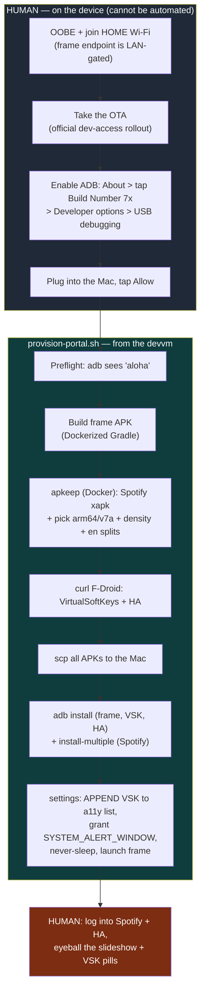

# Runbook: reprovision the London Meta Portal+ after a factory reset

**When to use:** the London Portal+ blinked **"Erasing"** / factory-reset itself
(it has done this before — an OTA colliding with a sideload-modified device), or
you have a fresh unit, and you need the kitchen-appliance setup back: the Immich
photo frame + Spotify + Home Assistant + the VirtualSoftKeys nav bar.

One command does the whole device side: **`infra/scripts/provision-portal.sh`**.

> Sofia's Portals (Emo Mini `192.168.1.104`, Office `192.168.1.149`) are a
> separate job — they were fully backed up to the NAS on 2026-07-26 and are on
> the older exploit toolkit. This runbook is **London only**.

## Nothing durable lives on the Portal

A wipe destroys no irreplaceable data — the device is a set of thin clients:

| Thing | Where it actually lives (survives a wipe) |
|---|---|
| The photos | Immich in-cluster (`immich` ns) → Synology `Viki/nfs/immich` offsite |
| Frame look (albums, interval, weather) | `infra/stacks/immich/frame.tf` + Vault (`frame_api_key`) |
| The frame APK | `portal-immich-frame` — one-command rebuild (`scripts/build-apk.sh`) |
| Frame signing key (for in-place `install -r`) | Vault `secret/portal-immich-frame` (`debug_keystore_b64`) |
| Spotify / HA content | your personal Spotify & Home Assistant accounts (cloud / `ha-*`) |

"Reprovision" therefore means **re-install from source, not recover device state.**

## The apps

| App | Package | Source | Notes |
|---|---|---|---|
| Immich frame | `me.viktorbarzin.portalframe` | built from source | thin WebView → `highlights-immich.viktorbarzin.me` (LAN-gated) |
| Spotify | `com.spotify.music` | apk-pure via apkeep, **latest** | split APK → `install-multiple` |
| VirtualSoftKeys | `tw.com.daxia.virtualsoftkeys` | F-Droid | floating Back/Home bar — the **only** way out of a fullscreen app |
| Home Assistant | `io.homeassistant.companion.android.minimal` | F-Droid | dashboards only; personal account |

## Flow



## The frame updates itself now (since 2026-08-15)

Getting a new frame build onto a Portal no longer needs this runbook. Since
`portal-immich-frame` v0.1.8 the app checks a published manifest **on startup**,
downloads a newer build, verifies its SHA-256 and offers it to the package
installer; Android then asks whoever is at the device to confirm. See that repo's
`docs/adr/0006-in-app-ota-updates.md`.

Three things that keeps depending on, all set by `provision-portal.sh`:

- **The install app-op**, settable at any time with no Portal UI:
  `adb shell appops set me.viktorbarzin.portalframe REQUEST_INSTALL_PACKAGES allow`.
  A device missing it downloads updates and then silently never prompts.
- **Package verification off**: `adb shell settings put global package_verifier_enable 0`.
  The Portal ships no Play/GMS, so nothing on the device can answer a
  verification request — the installer aborts with
  `INSTALL_FAILED_VERIFICATION_FAILURE` after the download, the checksum and the
  user tapping Install. Sideloads hide this (`verifier_verify_adb_installs` is
  already `0`); only app-initiated installs hit it. Verified on the London
  Portal+ 2026-08-15: with it on, every self-update failed; with it off, 0.1.8
  updated itself to 0.1.9.
- **The relaunch app-op**: `adb shell appops set me.viktorbarzin.portalframe SYSTEM_ALERT_WINDOW allow`.
  Android stops the app to replace it and never restarts it, so without this an
  update turns the display off until someone walks up to the Portal. Since
  v0.1.10 the frame relaunches itself from a `MY_PACKAGE_REPLACED` receiver,
  which is a background activity start and needs this app-op on Android 10 —
  required on the Sofia Portal Mini, belt-and-braces on the London Portal Plus
  (Android 9, verified 2026-08-16; the fleet is mixed despite what the app docs
  used to say).
- **The signing key**, Vault `secret/portal-immich-frame` (`debug_keystore_b64`).
  A build signed with anything else is refused as an update.

Since v0.1.10 the check also repeats every 6h while the frame runs, rather than
only at startup — a frame left open for weeks was otherwise only ever triggered
by a reboot. Declining an update backs that version off for 24h.

Silent, no-touch updating is not available: it needs device-owner provisioning,
which requires a factory reset with no accounts on the device — the opposite of
the signed-in official path this runbook follows. One tap per release is the
floor. This runbook remains the way a **wiped or new** device is brought up.

### Reaching a Portal over adb — USB vs network

Two different things, and only one of them survives a reboot.

**USB adb** is the durable path. It is how a Portal is provisioned, and it comes
back **by itself** after a device reboot — measured on the London Portal+ on
2026-08-16, back ~60s after `adb reboot`, no intervention. (An older note claimed
a Portal returns from a reboot enumerating as `0000:0000` with no adb function.
That was the Sofia **Mini** before Meta's official-ADB rollout; it does not
describe the Plus today, and has not been re-tested on the Mini.)

**Network adb** (`adb tcpip 5555`) is convenient and temporary. It sets only the
runtime `service.adb.tcp.port`; the persistent `persist.adb.tcp.port` cannot be
written — `setprop` is refused for the shell user and neither Portal is rooted.
**Every device reboot drops network adb**, and the only way back is a command
issued over USB:

```sh
ssh viktorbarzin@mbp-london.viktorbarzin.lan \
  '/Users/viktorbarzin/Library/Android/sdk/platform-tools/adb tcpip 5555'
adb connect 192.168.9.198:5555
```

A watchdog to re-issue that automatically was considered and **deliberately not
built** (Viktor, 2026-08-16): after a reboot someone is opening the frame app on
the device anyway, and the one-liner above is available remotely whenever network
access is actually wanted.

Treat network adb as **unauthenticated shell access** while it is up — any key
already trusted gets in, and the London Portal sits on the **guest** network
(`192.168.9.x`). Turn it off with `adb usb`, or just reboot the device.

### Which host holds which Portal's cable

| Portal | Cabled to | Network adb without a human? |
|---|---|---|
| London Portal+ `192.168.9.198` | Viktor's Mac (`mbp-london.viktorbarzin.lan`) | yes, while the Mac is home, awake and cabled |
| Sofia Portal Mini `192.168.1.104` | **nothing** — verified 2026-08-16 | no; needs Emo's laptop plugged in |
| Sofia office Portal `192.168.1.149` | **nothing** | no |

The Sofia entry is the surprising one. `rpi-sofia` carries a complete, working
re-enable mechanism — `/usr/local/bin/portal-adb-tcpip.sh`,
`portal-adb-tcpip.service`, `52-portal-adb-tcpip.rules`, `adb` installed — but
`lsusb` shows only network adapters and `adb devices` sees nothing. The
automation was built and the cable was never left in. Plugging the Mini into the
Pi would make Sofia self-restoring, since the Pi is always on; that is the single
highest-value change here if remote Sofia access ever matters again.

### What survives a Portal reboot

Verified on the London Portal+, 2026-08-16:

| | Survives? |
|---|---|
| USB adb | yes (~60s) |
| `appops` grants (`REQUEST_INSTALL_PACKAGES`, `SYSTEM_ALERT_WINDOW`) | yes |
| `settings put global package_verifier_enable 0` | yes |
| Installed app + its persisted frame URL | yes |
| `service.adb.tcp.port` / network adb | **no** |
| The frame app running | **no** — the Portal sits on its own launcher |

So a reboot costs exactly two things: someone opens Immich Frame, and network adb
needs re-issuing if wanted. Nothing needs reinstalling or re-granting.

### The USB host: `mbp-london.viktorbarzin.lan`

The Mac is pinned to `192.168.8.168` by a static lease on the London Flint, and
`mbp-london.viktorbarzin.lan` is declared for it in
`stacks/technitium/.../static_records.tf`.

> This name was invisible LAN-wide when it was first added, and the cause is worth
> knowing: pfSense does not forward `.lan` — it holds its own AXFR copy
> (`auth-zone`, master `10.0.20.201`, served `for-downstream`). That copy had been
> frozen since 2026-08-04 because the primary's SOA serial had regressed below the
> cached one (`64125` vs `684609`), which reads as "nothing new", so Unbound never
> re-transferred and every `.lan` record created after that date was missing.
> Fixed 2026-08-15 by switching the zone to Technitium's **date-based serial
> scheme** (`useSerialDateScheme`), which jumped the serial to `2026081500` and
> cannot regress the same way. If new `.lan` names ever stop appearing again,
> compare `dig +short @10.0.20.201 viktorbarzin.lan SOA` with what pfSense
> returns — a lower serial upstream is the signature.

The reservation lists **two** MACs — the hardware Wi-Fi address
`84:2f:57:39:9a:d9` and the macOS *private* Wi-Fi address currently in use. That
is deliberate: private Wi-Fi addresses rotate, and the previous reservation had
already gone stale that way, leaving the Mac on a DHCP-pool address under an old
entry pointing somewhere else. Covering both means the pin holds whichever the
Mac presents.

If the private address rotates again the pin will still be lost. The durable fix
is to turn **Private Wi-Fi Address off** for this SSID on the Mac (System
Settings → Wi-Fi → the network → Private Wi-Fi Address), after which it always
presents the hardware MAC.

## Human prerequisites (do these first, on the Portal)

The script starts from an **ADB-ready device**. It cannot do these:

1. Run OOBE, sign in, join the **home Wi-Fi** (the frame endpoint is source-IP
   LAN-gated since 2026-07-04 — it must be on the home LAN / London tunnel).
2. **Take the OTA update** (the ~June-2026 rollout that exposes Meta's official
   developer access). Do **not** re-apply the old `portal-toolkit` /
   CVE-2024-31317 exploit — that is what got the device wiped; the native ADB
   path below is the sanctioned one.
3. **Enable ADB (official path):** Settings → About → tap **Build Number** 7× →
   back out → **Developer options** → **USB debugging**. Plug into the Mac and
   tap **Allow** on the Portal screen.

## Run it

From the devvm (both `infra` and `portal-immich-frame` are checked out under
`~/code`):

```sh
~/code/infra/scripts/provision-portal.sh
```

Idempotent — safe to re-run. Useful env overrides:

| var | default | purpose |
|---|---|---|
| `MAC` | `viktorbarzin@192.168.8.168` | USB host on the Portal's LAN (pinned by a Flint reservation; the name `mbp-london.viktorbarzin.lan` is the intended value — see below) |
| `RADB` | `/Users/viktorbarzin/Library/Android/sdk/platform-tools/adb` | adb path on the Mac |
| `FRAME_REPO` | `$HOME/code/portal-immich-frame` | frame source for the build |
| `FRAME_URL` | *(build default = London)* | override to point the frame elsewhere |
| `NO_BUILD` | *(unset)* | `1` reuses an already-built frame APK |

## What it does (matches the script sections)

0. **Preflight** — confirms an authorized `aloha` device over adb.
1. **Build** the frame APK via the frame repo's Dockerized Gradle.
2. **apkeep** (containerized) fetches the latest Spotify `.xapk` from apk-pure,
   unzips it, and **dynamically selects** base + best ABI (arm64-v8a preferred,
   else armeabi-v7a — the Portal+ abilist includes 32-bit) + one density split +
   English. (apk-pure serves different variants over time, so the choice is not
   hard-coded.)
3. **curl** fetches VirtualSoftKeys + HA from **F-Droid's** stable
   `api/v1 + repo` URLs. (apkeep's own F-Droid index parser is broken in v1.0.0;
   the direct URLs are the durable path anyway.)
4. **scp** all APKs to the Mac.
5. **install** frame / VSK / HA, `install-multiple` for Spotify's splits.
6. **Appliance settings** (see below) and launch the frame.

## Appliance settings applied

- **VirtualSoftKeys accessibility bind — APPENDED, never replaced.** The script
  reads `secure enabled_accessibility_services` and appends
  `tw.com.daxia.virtualsoftkeys/…ServiceFloating`. **Critical:** the Portal's own
  `com.facebook.alohaservices.presence/…` and `…system.device/…` services must
  stay in that list — they drive presence detection and screen-on. Clobbering
  the list breaks the frame's wake behaviour.
- **`SYSTEM_ALERT_WINDOW = allow`** for VSK (its floating pills are an overlay).
- **Never-sleep:** `system screen_off_timeout = 2147483647`, `secure
  screensaver_enabled = 0`. The Portal+ is an always-mains LCD (no burn-in), and
  the frame also holds `FLAG_KEEP_SCREEN_ON` while foreground.

## Verify

The script prints the installed packages + the resumed activity. Most of the rest
can now be checked remotely:

```sh
ssh viktorbarzin@mbp-london.viktorbarzin.lan \
  '/Users/viktorbarzin/Library/Android/sdk/platform-tools/adb exec-out screencap -p' > /tmp/portal.png
```

`adb screencap` **does** capture the frame — verified 2026-08-15, a full-colour
photo with the clock overlay. It used to return black for the hardware WebView
surface, so a black image is the known older behaviour rather than proof of a
broken frame. Since `portal-immich-frame` v0.1.8 the reading is sharper: the
failure panel is a native view and always captures, so photos / panel / black are
three different answers rather than one ambiguous one.

Still by eye:

- Immich highlights slideshow is showing.
- VirtualSoftKeys Back/Home pills appear (test Back exits an app to the launcher).
- Open **Spotify** and **Home Assistant** and log in (personal accounts).

## Troubleshooting

- **Spotify won't install (`INSTALL_FAILED_*`)** — the xapk variant apk-pure
  served lacks a split the device needs, or a required split was skipped. Re-run
  (apk-pure may serve a different variant), or inspect
  `/dev/shm/portal-provision.*/spotify/` for the available `config.*` splits.
- **"always-latest" Spotify risk** — a future Spotify may drop Android-9 / API-28
  support and refuse to install or launch. If that happens, pin an older build:
  `apkeep -a com.spotify.music@<version>` (list with `apkeep -a com.spotify.music -l`).
- **F-Droid fetch fails** — check `https://f-droid.org/api/v1/packages/<pkg>`
  returns a `suggestedVersionCode`; the APK is then `…/repo/<pkg>_<vc>.apk`.
- **Mac SSH bridge dead** (ping OK but port 22 times out) — the Mac slept or the
  VPN rerouted; wake it / check VPN. `caffeinate` mitigates sleep, not VPN.
- **Frame installs but the icon is blank/missing in the Apps grid** — launcher
  icon gotcha; see `portal-immich-frame` (needs an opaque legacy PNG at all
  densities, `versionCode` bump to refresh the launcher cache).

## Related

- Frame build / signing-key restore details: `portal-immich-frame/docs/runbooks/reprovision-after-factory-reset.md`
- Spec + rationale (grilling output): `https://plans.viktorbarzin.me/2026-07-26-portal-reprovision-spec.html`
- Server-side frame config: `infra/stacks/immich/frame.tf`
