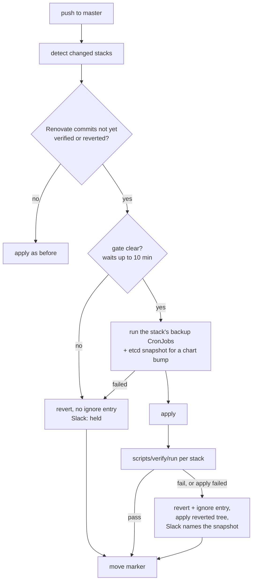

# Renovate

Renovate keeps third-party versions in this repo current: `helm_release` chart versions, image pins in `.tf` files, Helm values files, and pins annotated with a `# renovate:` comment. It runs as a CronJob in the `renovate` namespace (`stacks/renovate`), pushes one bump per run straight to `master` as the `renovate-bot` Forgejo account, and the Woodpecker pipeline applies it.

Design: `docs/plans/2026-10-09-software-currency-design.md` ("Phase 3"). Decision: ADR-0030.

## Where things are

| What | Where |
|---|---|
| Repo config (managers, package rules, holds) | `renovate.json5` at the repo root |
| Per-version ignore list (the rails append to it on a revert) | `renovate/ignored-versions.json`, pulled in as `local>viktor/infra//renovate/ignored-versions` |
| Runtime config (platform, token source, one commit per run) | `stacks/renovate/files/config.js` |
| Wrapper (Woodpecker-busy guard, Pushgateway metrics) | `stacks/renovate/files/run-renovate.sh` |
| Kill switch | `variable "suspended"` in `stacks/renovate/main.tf`, default `true` |
| Bot token | Vault `secret/renovate`, property `forgejo_token`, delivered by the `renovate-env` ExternalSecret |
| GitHub token (release notes, API rate limit) | Vault `secret/viktor`, property `ghcr_pull_token` (classic PAT, `read:packages` scope only) |
| Cache (repo clone, lookup cache) | PVC `renovate/renovate-cache`, `proxmox-lvm`, 5Gi with autoresize to 20Gi, no backup (rebuilt by the next run) |

## How a run works

1. The wrapper asks Woodpecker for the last 10 pipelines of repo 82 (`viktor/infra`). If any is `running`, `pending` or `blocked`, it records exit code 75 and stops, because a push now would cancel that pipeline. It also stops with 75 when the rails held a bump in the last 2 hours (`renovate_rails_hold_timestamp_seconds` in Pushgateway; `RAILS_HOLD_COOLDOWN` overrides the 7200 s), so a blocked gate does not receive the same bump every 30 minutes.
2. Renovate clones the repo, looks up every dependency, and sorts the pending updates (vulnerability, priority, then pin, digest, patch, minor, major, then title).
3. It commits the first update to `renovate/<stack>-<dep>` and fast-forwards `master` to it (`automergeType: branch`, `ignoreTests: true`). `prCommitsPerRunLimit: 1` stops every later branch in the same run, including the one Renovate's own post-automerge restart would otherwise land.
4. The wrapper pushes `renovate_last_run_timestamp_seconds`, `renovate_last_run_exit_code`, `renovate_last_run_duration_seconds`, and on exit 0 `renovate_last_success_timestamp_seconds` to Pushgateway (`job="renovate"`, `instance="infra"`).

Commit subjects read `<stack>: bump <dep> <old> -> <new>`. The body lists each pin and ends with `Renovate-Dep: <datasource> <package> <version>` trailers, which the rails use to write an ignore entry.

## Rails

The infra pipeline (`.woodpecker/default.yml`, apply step) runs `scripts/renovate-rails` around its usual apply loop. It acts on commits whose git author is `renovate-bot@viktorbarzin.me`, plus every commit of a push made by the `renovate-bot` account. For any other push it finds nothing to do and returns within a second.



| Stage | Command | What it does |
|---|---|---|
| prepare | `renovate-rails prepare`, after stack detection | Finds Renovate commits on master after the marker, minus ones a later commit reverted. Runs the gate, then the snapshot, and adds each commit's stack to the apply lists. |
| apply | the existing platform and app loops | Unchanged, except that a failed apply of a stack the rails are verifying no longer fails the step; the rails handle it. |
| finish | `renovate-rails finish`, before the state push | Runs `scripts/verify/run --since <time before apply> <stack>` for each stack. On a failed apply or verify it reverts the commit, applies the reverted tree, posts to Slack and writes Pushgateway metrics. |
| push | the existing state push | Pushes the revert commit with any state commits. |
| exit | `renovate-rails exit` | Turns the pipeline red when a bump was reverted or could not be handled. |

The gate is the same opt-in allowlist the other unattended upgraders use. `renovate-rails` reads `UPGRADE_GATE_ALERTS` from `stacks/k8s-version-upgrade/scripts/upgrade-step.sh` (firing alerts with severity critical) and `alertFilterRegexp` from `stacks/kured/main.tf` (any firing alert), so there is one list to edit. It queries Prometheus directly, so an Alertmanager silence does not open it. If Prometheus does not answer, the gate counts as blocked. If the chain's list cannot be parsed, every firing critical blocks, as in the chain itself.

The snapshot runs, once, every unsuspended CronJob whose name ends in `-backup` in the stack's namespaces (`VERIFY_NAMESPACES` in its `verify.sh`, else the stack name). `cnpg` also runs `dbaas/postgresql-backup`, and any Helm chart bump also runs `default/backup-etcd`, because a chart may change CRDs. The Jobs are named `rails-<cronjob>-<sha>-<n>` and kept for 24 hours. The Slack message and the revert commit name each Job and the NFS path it wrote to. No data is restored automatically.

A failed bump becomes one commit by `Woodpecker CI <ci@viktorbarzin.me>`: `Revert "<stack>: bump ..."`, with that exact version added to `renovate/ignored-versions.json`. For a digest-only pin the entry disables digest updates for the package instead (`matchUpdateTypes: ["digest"]`), and stays until someone removes it. The revert is pushed without `[CI SKIP]`, so the pipeline it starts applies the reverted tree a second time; that run is a no-op when the rollback apply in the rails already succeeded, and the retry when it did not.

A held bump (gate blocked, or the snapshot failed) is reverted the same way but without an ignore entry, so Renovate offers it again after the 2-hour cool-down. The pipeline stays green.

Cancellation: a push to master cancels the running pipeline, so a human push can stop the rails between apply and verify. The marker covers that. ConfigMap `woodpecker/renovate-rails`, key `last_handled`, holds the newest master commit up to which every Renovate commit was verified or reverted. The next pipeline, whoever pushed it, starts from the marker, finds the unverified Renovate commit, applies its stack again (a no-op if it was applied) and verifies it. The marker only moves forward along master, so a restarted older pipeline cannot move it back. If it is missing or not an ancestor of the commit being built, the rails fall back to the pipeline's diff base.

Metrics (Pushgateway, `job="renovate-rails"`): `renovate_rails_last_run_timestamp_seconds`, `renovate_rails_last_outcome` (0 verified, 1 reverted, 2 held, 3 not fully handled), `renovate_rails_last_revert_timestamp_seconds`, `renovate_rails_hold_timestamp_seconds`.

Working with the rails:

- Read what a run did: `homelab logs query '{namespace="woodpecker"} |= "[rails]"' --since 2h`.
- Retry a reverted version: delete its entry from `renovate/ignored-versions.json` and land that change.
- See or move the marker: `kubectl -n woodpecker get cm renovate-rails -o yaml`. Deleting it makes the next pipeline consider only its own diff.
- Unit tests: `bash scripts/renovate-rails.test.sh` (temporary git repos, no cluster access).

## Start, stop, run by hand

Unsuspend or suspend: change the `suspended` default in `stacks/renovate/main.tf` and land it. CI applies the stack.

Dry run from the CronJob template (pushes nothing; the `dryrun` instance label keeps it out of the liveness alert):

```sh
kubectl -n renovate create job renovate-dryrun --from=cronjob/renovate --dry-run=client -o json \
  | python3 -c 'import json,sys; j=json.load(sys.stdin); c=j["spec"]["template"]["spec"]["containers"][0]; c["args"]=c["args"]+["--dry-run=full"]; c["env"]=[e for e in c["env"] if e["name"]!="RENOVATE_INSTANCE"]+[{"name":"RENOVATE_INSTANCE","value":"dryrun"}]; print(json.dumps(j))' \
  | kubectl create -f -
kubectl -n renovate logs -f job/renovate-dryrun
kubectl -n renovate delete job renovate-dryrun
```

What a healthy dry run shows: `Processing N branches`, one `DRY-RUN: Would commit files to branch renovate/...` per branch, and no `WARN`/`ERROR` lines. Remove the `dryrun` group from Pushgateway afterwards: `curl -X DELETE http://prometheus-prometheus-pushgateway.monitoring:9091/metrics/job/renovate/instance/dryrun` (from inside the cluster).

A real run outside the schedule (lands one bump, only when the CronJob is unsuspended): `kubectl -n renovate create job renovate-manual --from=cronjob/renovate`.

## Holding a component

Two ways, both in the repo:

- A version that failed: add one rule to `renovate/ignored-versions.json` (the rails do this on a revert). The next upstream release is tried automatically.

  ```json
  { "matchDatasources": ["helm"], "matchPackageNames": ["traefik"], "matchNewValue": "41.8.0", "enabled": false }
  ```

- A component that waits for a supervised session: a `HELD:` package rule in `renovate.json5` with `enabled: false` and a description saying why. Held today: metallb, the CNPG operator chart, Nextcloud, Calico/tigera-operator, MySQL majors (9.x and 26.x), Woodpecker, Postgres majors, NVIDIA driver majors, the Loki chart, Kyverno chart 3.10 and later, Forgejo (every update), Technitium majors. Remove the rule to release the component.

Not managed by Renovate at all: `modules/**` (a change there re-applies every platform stack), `.woodpecker/**` (CI images), our own images (`viktorbarzin/*`, `ghcr.io/viktorbarzin/*`, `forgejo.viktorbarzin.me/*`), Terraform providers, and `:latest` or untagged refs.

## Alert

`RenovateNotSucceeding` fires when `instance="infra"` has not pushed a success timestamp for 2 hours, unless the CronJob is suspended (`kube_cronjob_spec_suspend`). Check, in order:

1. `renovate_last_run_exit_code{job="renovate",instance="infra"}`: 75 means every recent run found Woodpecker busy; 1 means Renovate logged an ERROR.
2. `kubectl -n renovate get jobs` and `kubectl -n renovate logs job/<latest>`.
3. A token problem shows as HTTP 401 against `forgejo.viktorbarzin.me`. Mint a new PAT for `renovate-bot` (scopes `write:repository`, `read:user`, `write:issue`, `read:organization`) and write it to `secret/renovate` `forgejo_token`; ESO refreshes the Secret within an hour.

## Bot account

Created through the Forgejo admin API on 2026-10-10, outside Terraform (the `infra-agent` bot is managed the same way):

- user `renovate-bot` (id 8), full name "Renovate", email `renovate-bot@viktorbarzin.me`, private visibility
- write collaborator on `viktor/infra`
- on the `master` branch protection push whitelist, next to `ebarzin`, `infra-agent`, `viktor`
- PAT `renovate-infra` with `write:repository`, `read:user`, `write:issue`, `read:organization`; the token and the account password are in `secret/renovate`

## Known limits

- Docker Hub: about 240 Docker lookups per run, and manifest reads count against the anonymous limit (100 per hour per IP). The cache PVC keeps repeat lookups down. If runs start failing with 429s, set `DOCKERHUB_USERNAME`/`DOCKERHUB_TOKEN` in the ExternalSecret; `config.js` already reads them.
- Renovate bumps its own image at most once a week (Mondays 00:00-03:59 UTC).
- The Woodpecker guard keeps Renovate from cancelling other pipelines. A human or agent push can still cancel a Renovate pipeline; the next pipeline then verifies that bump (see "Rails").
- The infra repo's Woodpecker timeout is 60 minutes. A rails run takes the gate wait (up to 10 minutes), the snapshot, the apply and the verify (about 10 minutes for most stacks, 28 for `dbaas`, up to an hour for `descheduler`). A bump to `dbaas` or `descheduler` can therefore run past the timeout; the next pipeline then verifies it again from the marker. Raising the repo timeout in Woodpecker's settings would remove that loop.
- Pins under `modules/` and in `.woodpecker/*.yml` are outside Renovate (see "Holding a component").
