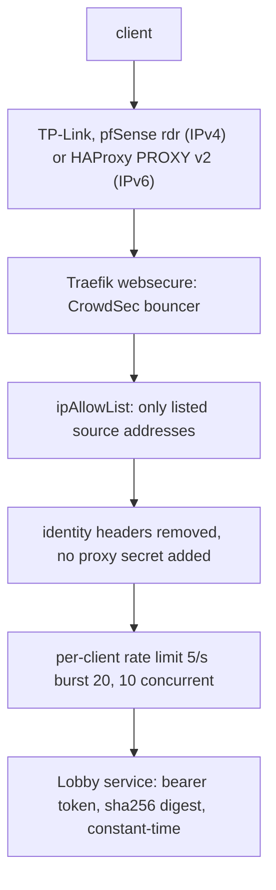

# terminal-api: Terminal Lobby's public machine API

`https://terminal-api.viktorbarzin.me` exposes Terminal Lobby's HTTP APIs to programs on the
internet that cannot use a VPN or a browser login. The first caller is Meta Muse, which runs in
Meta's cloud. The browser host `terminal.viktorbarzin.me` is separate and unchanged.

This is agent-api's only way in from outside the devvm. The earlier Headscale tailnet path
(node `koda`, the devvm's `tailscaled-agent` and its `tailscale serve` of `:8710`, and the `tag:muse`
grant to `devvm-tailnet:8710` in `stacks/headscale/acl.hujson`) was retired on 2026-10-02
([design](../plans/2026-10-02-muse-homelab-integration-design.md)).

- Config: `stacks/terminal/terminal_api.tf`, plus `playbooks/devvm.yml` (agent-api bind, nftables)
- Ban scenario: `viktor/terminal-api-auth-bf` in `stacks/crowdsec`
- Alerts: `TerminalApiAuthFailure`, `TerminalApiBlockedSurge` (Slack #alerts, security lane); `AgentApiDelegationUndelivered` (event lane, see [delegations.md](delegations.md))

## How a request is checked



A valid bearer token is the only credential. The host deliberately sends no `X-TL-Proxy-Secret`
and strips `X-Authentik-Username`, `X-Forwarded-User` and `X-TL-Proxy-Secret` from requests, so
the Lobby header login path cannot succeed here. Never add the `tl-proxy-secret` middleware to
these routes: with it, a forged identity header would be accepted as that user.

A token acts as the OS user its entry maps to. `muse` maps to `wizard`, which has sudo, a
cluster-admin kubeconfig and a Vault token on the devvm (Viktor's decision, 2026-10-02).

## What is exposed

| Path | Backend | Notes |
|---|---|---|
| `/v1/*` | agent-api `10.0.10.10:8710` | conversations, messages, transcripts, tasks, delegation results |
| `/openapi.json` (exact path) | agent-api `10.0.10.10:8710` | the API description; served without a token, holds routes and no data |
| `/api/sessions/*` | tmux-api `:7684` (prefix stripped) | except `/metrics`, `/health`, `/push*`, `/internal/*`, which need no login |
| `/events/` `/prompt/` `/cancel/` `/earlier/` `/result/` `/pane/` `/keys/` `/commands/` `/search/` `/answer-text/` `/answer/` `/model/` | session-events `:7685` | `/keys/` and `/pane/` type into tmux panes |
| `/files/*` | file-api `:7686` | |
| `/skills`, `/skills/*` | skills-api `:7688` | |

Not exposed: ttyd (`/`, `/ws`, `/token`, an interactive shell), clipboard-upload (it parses the
upload body before checking auth), static assets, build stamps and agent-api `/health`.
Unmatched paths get Traefik's catch-all error page.

## Calling it

```sh
curl https://terminal-api.viktorbarzin.me/openapi.json   # from an allowlisted address, no token
curl -H "Authorization: Bearer $TOKEN" https://terminal-api.viktorbarzin.me/v1/conversations
curl -H "Authorization: Bearer $TOKEN" https://terminal-api.viktorbarzin.me/api/sessions/whoami
```

Muse's token: `vault kv get -field=agent_api_muse_token secret/terminal-lobby`.

A client generated from `/openapi.json` takes its base URL from the document's first `servers`
entry, which is `https://terminal-api.viktorbarzin.me` (the second is loopback on the devvm). Check
it with `curl -s https://terminal-api.viktorbarzin.me/openapi.json | jq -r '.servers[0].url'`; an
older terminal-lobby build still answers `http://{host}:8710`, the retired tailnet address.

Long waits: agent-api's `?wait=N` (send-and-wait on messages, long-poll on tasks, N up to 300 s)
holds the request open. The `/v1/` route therefore uses the ServersTransport
`terminal-api-longpoll` (response-header timeout 330 s); the cluster-wide default is 30 s and
would turn every longer wait into a 504. Held requests count against the in-flight cap (10 per
client address).

## Source addresses

`local.api_allowed_sources` in `stacks/terminal/terminal_api.tf` lists who reaches the token check
at all: Cloudflare WARP's IPv6 block `2a09:bac0::/29` and mx2 (`92.5.132.215`, for testing).

Muse egresses through Cloudflare WARP, a shared range used by everyone running the free WARP app,
and its address changes on nearly every request. So the allowlist filters out non-WARP traffic but
cannot single Muse out, and the per-address defences (the 401 ban, the rate limit) cannot stop a
caller who also rotates through WARP. The bearer token, about 288 bits, is what identifies Muse.

To add a source, edit the list and apply the terminal stack. An address in Meta's space would also
hit CrowdSec's static Meta ban (`meta-asn.txt` in `stacks/crowdsec/modules/crowdsec/main.tf`) and
needs carving out there too. Muse's WARP addresses are not in that list.

## Add, rotate or revoke a caller

Callers are `devvm_external_agents` in `playbooks/devvm.yml`; each token is Vault
`secret/terminal-lobby` field `agent_api_<name>_token`.

- Add: add the entry, write a token of at least 32 random URL-safe characters to Vault, run the
  playbook. Give the token to the caller out of band.
- Rotate: write a new token to Vault and run the playbook. The old token stops working when the
  tokens file is rewritten.
- Revoke now: remove the entry (or `scripts/agent-api-kill <name>`) and run the playbook.
- If the token may have leaked: revoke first, then check `homelab logs query '{namespace="traefik"} |= "terminal-api"' --since 24h`
  and the agent-api trace in Loki for what it was used for.

Two optional keys on an entry: `delegation_creator: true` lets that Caller create Delegations
(it feeds `TL_DELEGATION_CREATORS`), and `token_file` installs the plaintext token for `os_user`
at 0600, for a Caller that runs on the devvm itself. The `homelab` entry uses both: it is the
homelab CLI's own credential for `homelab delegate`, used over loopback rather than through this
endpoint.

## Delegations

Muse also receives work from the homelab: `homelab delegate muse "<task>"` sends it a WhatsApp
message carrying the task and a callback address on this endpoint,
`POST /v1/delegations/{id}/result`, which Muse calls with its usual token.
`TL_AGENT_PUBLIC_URL` in `/etc/terminal-lobby.local.conf` sets the base URL written into that
message. Setup, caps, expiry and the `AgentApiDelegationUndelivered` alert:
[delegations.md](delegations.md).

## When the alerts fire

| Alert | Meaning | First checks |
|---|---|---|
| `TerminalApiAuthFailure` | an allowlisted address sent a wrong or stale token | Was the token rotated without updating the caller? Source address and path in the Traefik access log |
| `TerminalApiBlockedSurge` | sustained 403s: the allowlist or CrowdSec is refusing someone in volume | Sources in the access log; `cscli decisions list` in the crowdsec LAPI pod |

A caller that sends 5 bad tokens within about a minute is banned by CrowdSec for the default
duration. To lift a ban on a legitimate caller:
`kubectl -n crowdsec exec deploy/crowdsec-lapi -- cscli decisions delete --ip <addr>`.

## Defence in depth around the devvm ports

- devvm nftables: `7681` and `8710` accept only the Traefik node addresses and loopback; the
  Lobby ports are dropped on IPv6.
- AdminNetworkPolicy `devvm-lobby-ports` (priority 10): no namespace except `traefik` may reach
  `10.0.10.10` on 7681, 7683-7688 or 8710. `devvm-lobby-ports-observers` (priority 11) lets
  `monitoring` reach only 7684 (tmux-api metrics) and `headscale` only 7681 (subnet-router probe).
  Needed because Calico SNATs pod egress to the node address, which the nftables rules admit.
