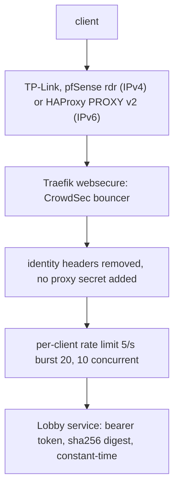

# terminal-api: Terminal Lobby's public machine API

`https://terminal-api.viktorbarzin.me` exposes Terminal Lobby's HTTP APIs to programs on the
internet that cannot use a VPN or a browser login. The first caller is Meta Muse, which runs in
Meta's cloud. The browser host `terminal.viktorbarzin.me` is separate and unchanged.

This is agent-api's only way in from outside the devvm. The earlier Headscale tailnet path
(node `koda`, the devvm's `tailscaled-agent` and its `tailscale serve` of `:8710`, and the `tag:muse`
grant to `devvm-tailnet:8710` in `stacks/headscale/acl.hujson`) was retired on 2026-10-02
([design](../plans/2026-10-02-muse-homelab-integration-design.md)).

- Config: `stacks/terminal/terminal_api.tf`, plus `playbooks/devvm.yml` (agent-api bind, nftables)
- Ban scenario: `viktor/terminal-api-auth-bf` in `stacks/crowdsec`
- Alerts: `TerminalApiAuthFailure`, `TerminalApiBlockedSurge` (Slack #alerts, security lane); `AgentApiDelegationUndelivered` (event lane, see [delegations.md](delegations.md))

## How a request is checked



A valid bearer token is the only credential. The host deliberately sends no `X-TL-Proxy-Secret`
and strips `X-Authentik-Username`, `X-Forwarded-User` and `X-TL-Proxy-Secret` from requests, so
the Lobby header login path cannot succeed here. Never add the `tl-proxy-secret` middleware to
these routes: with it, a forged identity header would be accepted as that user.

A token acts as the OS user its entry maps to. `muse` maps to `wizard`, which has sudo, a
cluster-admin kubeconfig and a Vault token on the devvm (Viktor's decision, 2026-10-02).

## What is exposed

| Path | Backend | Notes |
|---|---|---|
| `/v1/*` | agent-api `10.0.10.10:8710` | conversations, messages, transcripts, tasks, delegation results |
| `/openapi.json` (exact path) | agent-api `10.0.10.10:8710` | the API description; served without a token, holds routes and no data |
| `/api/sessions/*` | tmux-api `:7684` (prefix stripped) | except `/metrics`, `/health`, `/push*`, `/internal/*`, which need no login |
| `/events/` `/prompt/` `/cancel/` `/earlier/` `/result/` `/pane/` `/keys/` `/commands/` `/search/` `/answer-text/` `/answer/` `/model/` | session-events `:7685` | `/keys/` and `/pane/` type into tmux panes |
| `/files/*` | file-api `:7686` | |
| `/skills`, `/skills/*` | skills-api `:7688` | |

Not exposed: ttyd (`/`, `/ws`, `/token`, an interactive shell), clipboard-upload (it parses the
upload body before checking auth), static assets, build stamps and agent-api `/health`.
Unmatched paths get Traefik's catch-all error page, which answers `GET /health` with 200, so a 200
there says nothing about agent-api. Check a real route instead: `/openapi.json` with no token.

## Calling it

```sh
curl https://terminal-api.viktorbarzin.me/openapi.json   # no token needed
curl -H "Authorization: Bearer $TOKEN" https://terminal-api.viktorbarzin.me/v1/conversations
curl -H "Authorization: Bearer $TOKEN" https://terminal-api.viktorbarzin.me/api/sessions/whoami
```

Muse's token: `vault kv get -field=agent_api_muse_token secret/terminal-lobby`.

A client generated from `/openapi.json` takes its base URL from the document's first `servers`
entry, which is `https://terminal-api.viktorbarzin.me` (the second is loopback on the devvm). Check
it with `curl -s https://terminal-api.viktorbarzin.me/openapi.json | jq -r '.servers[0].url'`; an
older terminal-lobby build still answers `http://{host}:8710`, the retired tailnet address.

Long waits: agent-api's `?wait=N` (send-and-wait on messages, long-poll on tasks, N up to 300 s)
holds the request open. The `/v1/` route therefore uses the ServersTransport
`terminal-api-longpoll` (response-header timeout 330 s); the cluster-wide default is 30 s and
would turn every longer wait into a 504. Held requests count against the in-flight cap (10 per
client address).

## Source addresses

Any address may reach the token check. There is no source-IP allowlist, by Viktor's decision on
2026-10-07.

Muse egresses through shared networks it does not control, and its address changes on nearly every
request: Cloudflare WARP (`2a09:bac0::/29`) until 2026-10-02, Fastly (`2a04:4e41::/32`) from
2026-10-04. The allowlist that existed from 2026-10-02 to 2026-10-07 listed WARP and mx2. It
admitted every other WARP user, so it never identified Muse, and when Muse moved to Fastly it
refused every request with a 403 before the token was checked. The bearer token, about 288 bits,
is what identifies Muse.

Per-address defences still apply: the CrowdSec bouncer, the 401 ban scenario and the rate limit.
They slow a scanner that keeps one address, and cannot stop a caller that rotates through a shared
range. An address in Meta's space hits CrowdSec's static Meta ban (`meta-asn.txt` in
`stacks/crowdsec/modules/crowdsec/main.tf`); Muse's WARP and Fastly addresses are not in that list.

## Add, rotate or revoke a caller

Callers are `devvm_external_agents` in `playbooks/devvm.yml`; each token is Vault
`secret/terminal-lobby` field `agent_api_<name>_token`.

- Add: add the entry, write a token of at least 32 random URL-safe characters to Vault, run the
  playbook. Give the token to the caller out of band.
- Rotate: write a new token to Vault and run the playbook. The old token stops working when the
  tokens file is rewritten.
- Revoke now: remove the entry (or `scripts/agent-api-kill <name>`) and run the playbook.
- If the token may have leaked: revoke first, then check `homelab logs query '{namespace="traefik"} |= "terminal-api"' --since 24h`
  and the agent-api trace in Loki for what it was used for.

Three optional keys on an entry: `delegation_creator: true` lets that Caller create Delegations
(it feeds `TL_DELEGATION_CREATORS`), and `token_file` installs the plaintext token for `os_user`
at 0600, for a Caller that runs on the devvm itself. The `homelab` entry uses both: it is the
homelab CLI's own credential for `homelab delegate`, used over loopback rather than through this
endpoint.

`pin` sets `model`, `effort` and `permission_mode` on every conversation that Caller creates,
replacing what it sends (it feeds `TL_CALLER_PINS`). `inherit` means the box default:
managed-settings for model and effort, bypass for the mode. Muse's entry is
`model: inherit, effort: inherit, permission_mode: bypassPermissions`, set on 2026-10-09 because
Muse's own client sent `claude-opus-5` and `permission_mode=default` (manual mode), and that
client lives in Muse's VM. agent-api logs each override as `<caller> asked for ... pinned to ...`.

## Delegations

Muse also receives work from the homelab: `homelab delegate muse "<task>"` sends it a WhatsApp
message carrying the task and a callback address on this endpoint,
`POST /v1/delegations/{id}/result`, which Muse calls with its usual token.
`TL_AGENT_PUBLIC_URL` in `/etc/terminal-lobby.local.conf` sets the base URL written into that
message. Setup, caps, expiry and the `AgentApiDelegationUndelivered` alert:
[delegations.md](delegations.md).

## When the alerts fire

| Alert | Meaning | First checks |
|---|---|---|
| `TerminalApiAuthFailure` | a Lobby service logged `auth: invalid bearer token`: a token was presented and matched no entry | Was the token rotated without updating the caller? Route: `homelab logs query '{unit="agent-api.service"} \|= "invalid bearer"'`; source address: the 401s in the Traefik access log |
| `TerminalApiBlockedSurge` | sustained 403s: CrowdSec is refusing someone in volume | Sources in the access log; `cscli decisions list` in the crowdsec LAPI pod |

`TerminalApiAuthFailure` is a Loki-ruler rule (`loki.tf`, group "Terminal Lobby API"), not a
Prometheus one, because Traefik's 401 count includes scanners that send no token at all. Those
log `no bearer credential` and do not fire it.

A caller that gets 5 401s within about a minute (a bad token or none) is banned by CrowdSec for the default
duration. To lift a ban on a legitimate caller:
`kubectl -n crowdsec exec deploy/crowdsec-lapi -- cscli decisions delete --ip <addr>`.

## Defence in depth around the devvm ports

- devvm nftables: `7681` and `8710` accept only the Traefik node addresses and loopback; the
  Lobby ports are dropped on IPv6.
- devvm nftables, forward hook: a port published with `docker run -p` is reachable only from the
  devvm itself. A connection DNATed into `docker0` or a `br-*` bridge from anywhere else is
  dropped. Added on 2026-10-02 after a month-old test container (`tl-live`) was found publishing
  an unauthenticated ttyd on `0.0.0.0:18099`, which every pod could open. IPv6 published ports go
  through docker-proxy on the input path and are not covered by this rule. Tests:
  `sudo bash scripts/test-devvm-lobby-nftables.sh`.
- AdminNetworkPolicy `devvm-lobby-ports` (priority 10): no namespace except `traefik` may reach
  `10.0.10.10` on 7681, 7683-7688 or 8710. `devvm-lobby-ports-headscale` (priority 11) lets
  `headscale` reach only 7681 (subnet-router probe), and `devvm-lobby-ports-monitoring`
  (priority 12) lets `monitoring` reach only 7684 (tmux-api metrics). Each observer namespace has
  its own policy, since one shared policy lets every namespace in it reach every port any of them
  needs. Needed because Calico SNATs pod egress to the node address, which the nftables rules
  admit. The policy data is in `stacks/terminal/devvm_lobby_anp.tf`, and
  `tests/devvm-lobby-anp.test.sh` checks who reaches which port.
