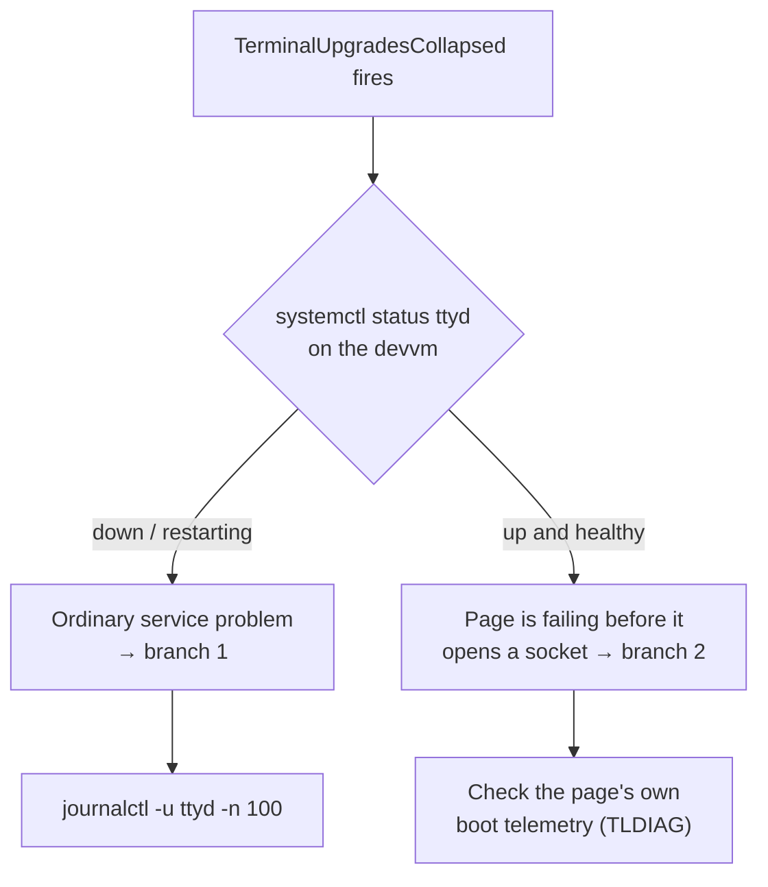

# Terminal upgrades collapsed

Triage for **`TerminalUpgradesCollapsed`** (Loki ruler → Alertmanager → `#alerts`).

## What the alert measures

ttyd writes one journal line per **successful** WebSocket upgrade:

```
[2026/08/28 09:33:18] N: WS   /ws - 10.0.20.105, clients: 4
```

That is a terminal that actually attached — not a page load, not a TCP
connection. The rule counts those lines over 24h and fires below 50, against a
healthy baseline of roughly 227–259/day.

The window is 24h rather than an hourly rate because terminals are driven by a
person: an hourly threshold would false-fire every night. The trade-off is that
the alert catches *dead* rather than *degraded* — see "What this does not
catch" below.

## Triage

The first question is whether ttyd is running, because the two branches lead to
completely different places and the more interesting one looks, from the
backend, like nothing is wrong.



### Branch 1 — ttyd is down

The ordinary case. On the devvm:

```bash
systemctl status ttyd
journalctl -u ttyd -n 100 --no-pager
```

Restart it, then confirm upgrades resume with the query in "Verify recovery".

### Branch 2 — ttyd is up, but nothing is attaching

This is the case the alert was written for, and the one that hid for three days
in August 2026. ttyd was healthy the entire time; the frontend threw during
boot and never reached its `new WebSocket(...)` call, so from the backend there
was simply an absence of clients.

The lobby's own client diagnostics (ADR-0008 in the terminal-lobby repo) record
these, so start there rather than on the box. Exceptions over the last 72h,
most frequent first:

```bash
homelab logs query 'sum by (msg, client) (count_over_time(
  {job="devvm-journal"} |= "TLDIAG" |= "app.exception"
  | line_format `{{ regexReplaceAll "^.*?TLDIAG " __line__ "" }}`
  | json msg="attrs[\"tl.msg\"]", client="attrs[\"tl.client\"]" [72h]))' --since 1h
```

`client=term` is the terminal surface. A boot-path exception there means the
page is dying before it connects. Run against the August 2026 outage this
returned:

```
  32  client=term  Cannot access 'heldComposeOwns' before initialization.
   3  client=term  Cannot access uninitialized variable.
```

— the same temporal-dead-zone fault in both Chromium's and WebKit's wording.

To read individual records with their stack and device:

```bash
homelab logs query '{job="devvm-journal"} |= "TLDIAG" |= "app.exception"' --since 24h --limit 50
```

Each carries `tl.stack` (a `term.html:<line>:<col>` location), `tl.device`,
`tl.build` and `tl.session`, which is usually enough to place the fault without
reproducing it.

Two things worth knowing about this branch:

- **The exception count is small even when the breakage is total** — 4 records
  on 26 Aug, 14 on 27 Aug, ~35 across the whole outage. One record per affected
  tab, and a broken surface gets *fewer* visits, not more. That is why the
  upgrade collapse is the alerting signal and the exception stream is the
  diagnostic one; a threshold on exceptions would not have fired.
- **It can fail by pointer type.** The August fault only tripped on a coarse
  pointer, so every phone was broken while every desktop was fine. If the
  exception records cluster on one `tl.device` class, or upgrades fall without
  reaching zero, suspect a path that only some clients take.

The ADR's own example queries use `| logfmt | name = "..."`, which predates the
current record shape — the shipped records are JSON with an `event.name` field
behind a `TLDIAG ` line prefix, which is why the queries above strip the prefix
with `line_format` and then use `| json`.

## Verify recovery

```bash
homelab logs query 'sum(count_over_time(
  {job="devvm-journal", unit="ttyd.service"} |= "WS   /ws" [1h]))' --since 1h
```

The 1h window responds immediately; the alert's own 24h window lags, so it can
still read below 50 for several hours after a genuine fix while the dead period
ages out. Confirm the hourly rate has recovered rather than waiting on the
alert to clear.

## What this does not catch

A partial regression. On 25 Aug 2026 the count was 57 — touch was completely
broken, desktop was fine, and the total stayed above the threshold. The alert
would have fired on 26 Aug, two days before the fault was actually found, but
not on the first day it existed.

Catching the degraded case needs a baseline-ratio rule (a recording rule plus a
trailing comparison) rather than a fixed floor. That is more machinery than one
incident justifies today; it is the thing to build if a partial regression
happens again.
