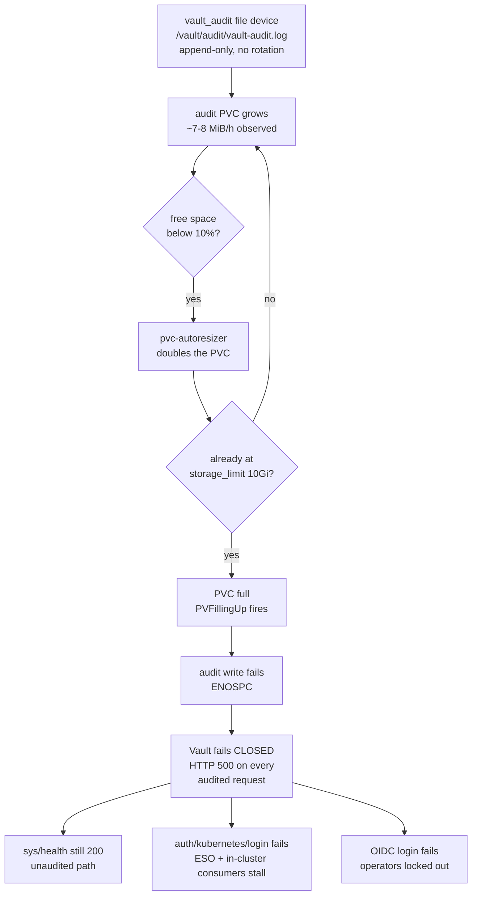

# Runbook: Vault Returns HTTP 500 on Everything — Audit Device Out of Space

Captures the 2026-08-23/24 pattern. When the audit PVC backing
`/vault/audit/vault-audit.log` fills up, Vault's file audit device can no
longer write, and Vault **fails closed**: every request that must be audited
returns HTTP 500. Reads, writes, and logins all stop.

The part that costs the most time is the signal. `sys/health` and
`sys/seal-status` are not audited, so they keep returning 200 with
`sealed: false` / `HA Mode: active`. `vault status` reports a healthy cluster
while nothing usable works, and the only alert that fires is
`PVFillingUp` — which reads as a capacity warning rather than an outage.

**Related**: [vault-raft-leader-deadlock.md](vault-raft-leader-deadlock.md)
(a different failure mode with a superficially similar "Vault is unreachable"
presentation), [../architecture/security.md](../architecture/security.md)
"Audit Logging & Anomaly Detection".

## Symptoms

- Every authenticated path returns `Code: 500. Raw Message: Error 500:
  Internal Server Error` — `auth/oidc/oidc/auth_url`,
  `auth/kubernetes/login`, `sys/internal/ui/mounts/...`, any `kv get`.
- `vault login -method=oidc` fails before a browser ever opens.
- `https://vault.viktorbarzin.me/v1/sys/health` returns **200** and
  `vault status` reports `Initialized: true`, `Sealed: false`,
  `HA Mode: active`. This is not a contradiction — see below.
- Server logs repeat, per request:
  ```
  error writing file for sink "/vault/audit/vault-audit.log": unable to
  re-write to file for sink "/vault/audit/vault-audit.log":
  write /vault/audit/vault-audit.log: no space left on device
  [ERROR] core: failed to audit request:  path=auth/kubernetes/login
  [ERROR] core: failed to audit response: request_path=auth/kubernetes/login
  ```
- `PVFillingUp` fires for `namespace=vault`.
- Downstream: in-cluster consumers cannot authenticate
  (`auth/kubernetes/login` is audited too), so ESO-backed secrets stop
  refreshing and any pod that fetches a secret at startup fails. Non-admin
  workstation tooling degrades in a confusing way: `homelab vault kv` is
  unusable, and `homelab vault` (Vaultwarden) cannot even be set up, because
  its per-user credentials live in Vault.

### Why the health endpoints still look fine

Vault audits requests, not liveness probes. `sys/health` and
`sys/seal-status` are on the unaudited path, so they answer normally while
every audited path fails. Treat a green `vault status` as evidence about the
seal and raft state only — it says nothing about whether Vault can serve a
read.

## Failure chain



Two pieces of existing design are worth knowing before you change anything,
because they shape the remediation:

**The autoresizer buys time, and has a ceiling.** `stacks/vault/main.tf`
applies `pvc-autoresizer` annotations directly to the live PVCs — threshold
10%, increase 100%, `storage_limit = 10Gi` — deliberately, because the
chart maps `auditStorage.annotations` into immutable
`volumeClaimTemplates` and every helm upgrade with that block set fails
with `StatefulSet spec: Forbidden`. The audit PVCs therefore double from
their 2Gi baseline as they fill. In the 2026-08 incident the three volumes
had reached 4Gi, 8Gi and 10Gi, and the 10Gi one belonged to the active
node. Doubling had been absorbing unbounded growth for months; the incident
is what the ceiling looks like when it is finally reached.

**The audit trail is already off-box.** The `audit-tail` sidecar
(`busybox`, `tail -F` on the audit log, read-only mount) exists so Alloy
ships audit lines to Loki as `job=vault-audit` — without it the audit log
would sit on the PVC and the V1–V7 alert rules could not fire. Practically,
this means the on-disk file is not the only copy of the audit record, which
is what makes truncation a reasonable first move rather than evidence
destruction. The limit to keep in mind is Loki's retention window (30 days),
which is shorter than an on-disk log that never rotates.

## 0. Confirm the diagnosis

Two commands separate this from every other "Vault is down" report:

```sh
# 1. Health says fine, an audited path says 500 -> this runbook.
curl -s -o /dev/null -w 'health=%{http_code}\n' https://vault.viktorbarzin.me/v1/sys/health
curl -s -o /dev/null -w 'audited=%{http_code}\n' \
  -H "X-Vault-Token: $(cat ~/.vault-token)" \
  https://vault.viktorbarzin.me/v1/auth/token/lookup-self

# 2. The audit device is the reason.
homelab logs query '{namespace="vault"} |= "no space left on device"' --since 1h --limit 5
```

`health=200` together with `audited=500` and ENOSPC lines in the log is the
whole diagnosis. If health is 503 instead, you are in
[vault-raft-leader-deadlock.md](vault-raft-leader-deadlock.md), not here.

Identify which volume and which pod, and confirm the ceiling:

```sh
kubectl -n vault get pvc          # audit-vault-{0,1,2} sizes; 10Gi == at the limit

homelab metrics query \
  'kubelet_volume_stats_available_bytes{namespace="vault", persistentvolumeclaim=~"audit-.*"}'

# Which pod is the active node? Its audit volume is the one that matters.
kubectl -n vault exec vault-0 -c vault -- vault status 2>&1 | grep -E 'HA Mode|Active'
```

To place the start of the outage, sample the same metric backwards — the
gauge is an instant query, so walk it with offsets:

```sh
for off in 1 3 6 12 24 48 96 168; do
  printf 't-%-4sh ' "$off"
  homelab metrics query \
    "kubelet_volume_stats_available_bytes{persistentvolumeclaim=\"audit-vault-1\"} offset ${off}h" \
    2>/dev/null | head -1 | awk '{printf "%.1f MiB\n", $1/1048576}'
done
```

In the 2026-08 incident this put exhaustion between t-24h and t-22h
(2026-08-23, roughly 11:30–13:30 UTC), after declining about 7–8 MiB/h
(~180 MiB/day) over the preceding week.

## 1. Restore service

Truncating the audit log in place is the fastest path back, and the
`audit-tail` sidecar means the lines up to that point have already been
shipped to Loki. Exec into the **`vault` container** — the sidecar mounts
`/vault/audit` read-only:

```sh
POD=vault-1   # the active node from step 0

kubectl -n vault exec $POD -c vault -- sh -c 'ls -lh /vault/audit/'
kubectl -n vault exec $POD -c vault -- sh -c ': > /vault/audit/vault-audit.log'
kubectl -n vault exec $POD -c vault -- sh -c 'df -h /vault/audit'
```

Vault picks the write back up on the next request; no restart is needed. If
you would rather keep a tail of the on-disk history, copy the last slice
before truncating:

```sh
kubectl -n vault exec $POD -c vault -- sh -c \
  'tail -c 50000000 /vault/audit/vault-audit.log > /vault/audit/vault-audit.log.keep \
   && mv /vault/audit/vault-audit.log.keep /vault/audit/vault-audit.log'
```

Verify recovery on an audited path, not on health:

```sh
curl -s -o /dev/null -w 'audited=%{http_code}\n' \
  -H "X-Vault-Token: $(cat ~/.vault-token)" \
  https://vault.viktorbarzin.me/v1/auth/token/lookup-self   # expect 200

vault login -method=oidc      # expect the usual browser flow
```

Then check the consumers that were failing while Vault was closed —
ExternalSecrets in particular, since they will have been erroring for the
duration:

```sh
kubectl get externalsecrets -A | grep -v SecretSynced
```

Do the same truncation on the other two pods if their volumes are also near
the ceiling. They are standbys, so they are not causing the outage, but a
standby that becomes active with a full audit volume reproduces it
immediately.

## 2. Keep it from returning

Step 1 restores service and leaves the underlying growth untouched. Three
directions, roughly in order of how much they actually fix:

**a. Send the audit stream to stdout instead of a file.** In
`stacks/vault/main.tf`, `vault_audit "file"` writes to
`/vault/audit/vault-audit.log`; the file audit device also accepts
`file_path = "stdout"`. That routes audit lines to the container's stdout,
where Alloy already collects them — the same destination the `audit-tail`
sidecar exists to reach. It removes the growing volume and the sidecar in
one step. The trade-off is real and worth a deliberate decision: Loki's
30-day retention becomes the audit record's only horizon, and there is no
longer a local copy if log shipping breaks. Decide this against whatever
audit-retention expectation applies, rather than on operational convenience
alone.

**b. Rotate the file.** Vault's file audit device reopens its file on
`SIGHUP`, which is the standard logrotate integration: rotate, then signal.
This keeps the on-disk copy and bounds it, at the cost of a rotation
mechanism (sidecar or CronJob) that has to be maintained and that itself
needs to be alerted on when it stops working.

**c. Raise `storage_limit` above 10Gi.** One line in
`stacks/vault/main.tf`, and it buys proportional time — at ~180 MiB/day,
each additional 10Gi is roughly two months. It does not change the shape of
the problem, so treat it as a stopgap alongside (a) or (b) rather than a
resolution.

### Make the alert say what happened

`PVFillingUp` fired correctly here and pointed at the right namespace, but
it describes a filling volume, not a service that has stopped answering.
Because Vault's own ENOSPC and `failed to audit request` lines reach Loki on
the server-log path (verified during the incident — that is how the cause
was found), an alert on those lines distinguishes "the audit volume is
getting full" from "Vault is failing closed right now":

```logql
{namespace="vault"} |= "failed to audit request"
```

Vault also emits `vault.audit.log_request_failure` telemetry. Whether that
metric is currently scraped here has not been confirmed — worth checking
before choosing between a metric-based and a log-based rule.

## Open questions

- Whether `vault.audit.log_request_failure` is present in Prometheus today,
  which would make a cleaner alert than the LogQL rule above.
- Which of (a) / (b) / (c) matches the intended audit-retention posture.
  This is a policy call, not an operational one, and the runbook
  deliberately stops short of it.
- Whether the standby audit volumes should be truncated on a schedule, or
  whether whichever fix lands makes that moot.
