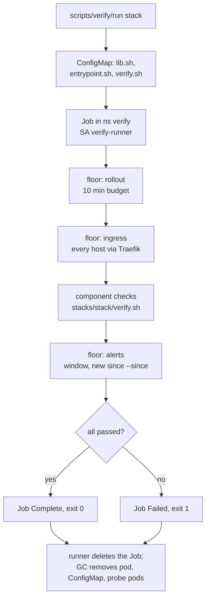

# Verify Jobs runbook

Design: the "Verification contract" in `docs/plans/2026-10-09-software-currency-design.md`. An upgrade counts as landed only when the component's checks pass. The checks run as a Kubernetes Job, so the Woodpecker rails (wave 4) and a person on the devvm run exactly the same thing.

| Piece | Where |
|---|---|
| Runner (starts the Job, streams its log, returns pass/fail, cleans up) | `scripts/verify/run` |
| Floor checks and helpers, shared by every stack | `scripts/verify/lib.sh` |
| Job entrypoint (floor rollout, floor ingress, component checks, floor alerts) | `scripts/verify/entrypoint.sh` |
| A stack's own checks | `stacks/<stack>/verify.sh` |
| Namespace, ServiceAccount, RBAC, test storage classes, credentials | `stacks/verify` |

## Run it

```sh
cd ~/code/infra
scripts/verify/run traefik                     # one stack, full checks, 10-minute alert watch
scripts/verify/run --quick dbaas               # skip backup runs and smoke tests, 60 s alert watch
scripts/verify/run -j 4 --all --log-dir /tmp/v # every stack that has a verify.sh, 4 at a time
scripts/verify/run --list                      # which stacks have a script, which fail closed
```

Exit status: `0` all checks passed, `1` a check failed, `2` usage error, `3` the stack has a `helm_release` or is a database/GPU stack and has no `verify.sh` (fail closed: it must not auto-land).

The runner needs a kubeconfig that can create ConfigMaps and Jobs in the `verify` namespace: an admin kubeconfig on the devvm, or `KUBECONFIG=$PWD/config` inside the Woodpecker apply step (the `woodpecker/default` ServiceAccount is cluster-admin). It uses the current kubectl context, so check `kubectl config current-context` first on a machine with several.

`--since <epoch>` sets the time from which a firing alert counts as new. The rails pass the time taken before `terragrunt apply`; by hand it defaults to the moment the runner starts. A full run takes the alert window (600 s) plus the checks: about 11 minutes for most stacks, and about 17 minutes for `dbaas`, whose PostgreSQL and MySQL backup runs take 14 and 16 minutes.

## What a run does



The floor, implemented once in `lib.sh`:

- **Rollout**: every Deployment, StatefulSet and DaemonSet in the stack's namespaces has observed its latest spec and has all replicas updated and ready, within `VERIFY_ROLLOUT_TIMEOUT` (600 s). Workloads scaled to 0 (Sablier) count as converged; `OnDelete` StatefulSets/DaemonSets skip the revision test. No pod there may be in `CrashLoopBackOff`, `ImagePullBackOff`/`ErrImagePull` or `CreateContainerConfigError`.
- **Ingress**: the first host and path of every Ingress in those namespaces is requested through the in-cluster Traefik Service (`--resolve host:443:<traefik ClusterIP>`), so the check exercises the route and not Cloudflare or external DNS. Any status from 100 to 499 passes (Authentik redirects, 401, 404 on API-only roots); `000` and 5xx fail after three tries.
- **Alerts**: Prometheus `/api/v1/alerts` is polled every 30 s for `VERIFY_ALERT_WINDOW` seconds. A firing alert fails the run when it became active at or after `--since` and its `namespace` (or `exported_namespace`) is one of the stack's namespaces, its Traefik `service` label starts with one of them, or its name matches the stack's `VERIFY_ALERTNAMES`. `Trivy*`, `Watchdog` and `InfoInhibitor` never count. Alerts with a `for:` longer than the window cannot fire inside it; the window catches the fast ones.

Helm release status is not read (Helm keeps it in Secrets, which the verify identity cannot read). The apply covers it: every `helm_release` is `atomic = true`, so a failed upgrade fails the apply.

## The verify identity

`stacks/verify` creates ServiceAccount `verify/verify-runner` with:

| Access | Why |
|---|---|
| ClusterRole `verify-read`: get/list/watch on core resources except Secrets, and on every API group the checks read | rollout, CRD status, node allocatable, logs |
| Role in `verify`: create/delete pods and PVCs; create `ExternalSecret` and CNPG `Cluster` | probe pods (database clients, `nvidia-smi`, CUDA vectorAdd), CSI smoke tests, server-side dry runs that an admission webhook must refuse |
| Role `verify-backup-run` in `dbaas`, `immich`, `redis`, `rybbit`, `beads-server`: create/get/delete Jobs | "the backup job runs on the new version": a one-off Job from the backup CronJob |

It has no `pods/exec` anywhere. Database checks log in over the network:

| Secret in `verify` | Source | Used for |
|---|---|---|
| `verify-db-creds` | ESO from `vault-database`: static roles `pg-verify-probe`, `mysql-verify-probe` (7-day rotation, ESO refresh 2 min) | pg-cluster and MySQL as `verify_probe`, which owns only its `verify_probe` scratch database (pg also has `pg_monitor` and CONNECT on `dawarich`, `claude_memory`) |
| `verify-app-creds` | ESO from `vault-kv`: `secret/immich` `db_password`, `secret/rybbit` `clickhouse_password` | Immich Postgres and the rybbit ClickHouse, single-tenant servers; the probes write only to a scratch schema/database and drop it |

Redis (no `requirepass`, risk-accepted in `stacks/redis`) and Dolt (`beads` user, empty password) need no secret.

The Job pod gets both Secrets as environment variables. Probe pods that need a database client (`postgres:16.15-trixie`, `mysql:8.4.8`) get them through `run_pod ... secret=<name>`.

Storage classes `verify-proxmox-lvm` and `verify-nfs` match `proxmox-lvm` and `nfs-pve` but use `reclaimPolicy: Delete`, so a smoke-test volume (an LV on the PVE host, a directory under `/srv/nfs/verify-smoke/`) disappears with its PVC.

Everything a run creates in `verify` carries an owner reference to the Job; the runner deletes only the Job and garbage collection removes the rest. That keeps the runner clear of `K8sMassDelete` (more than 5 pod/ConfigMap deletes in 60 s by one user). Jobs also carry `ttlSecondsAfterFinished: 3600` in case the runner dies. A backup Job that fails is left in its namespace for inspection and `BackupCronJobFailed` fires for it, which is the right signal.

## Write a verify.sh

A `verify.sh` is a bash fragment the entrypoint sources after `lib.sh`. It sets variables and defines `verify_component`:

```bash
# shellcheck shell=bash
VERIFY_GROUP="chart"                 # chart | db | gpu | app
VERIFY_NAMESPACES="traefik"          # floor scope: rollout, ingress, alerts
VERIFY_ALERTNAMES="^Traefik"         # optional: alerts without a namespace label
VERIFY_INGRESS_SKIP=""               # optional regex over "<ns>/<ingress>"
VERIFY_ROLLOUT_SKIP=""               # optional regex over "<ns>/<Kind>/<name>"

verify_component() {
  check "traefik runs 3 ready replicas" workload_ready traefik deployment/traefik
  check "websecure 5xx rate is low" expect_prom 'sum(rate(traefik_entrypoint_requests_total{entrypoint="websecure",code=~"5.."}[5m]))' -lt 1
}
```

Rules that keep these scripts useful:

- Check function, not configuration. "The webhook refuses a privileged pod" beats "the webhook object exists".
- Do not pin versions, image tags or exact counts that move on their own. The script must pass before and after an upgrade.
- Every `check` prints the value it judged, so a failure explains itself in the log.
- Anything slow (backup runs, PVC smoke tests, model loads) goes behind `[ "${VERIFY_QUICK:-0}" = 1 ] || ...`.
- Create things only in the `verify` namespace, through `run_pod`, and name them through the helpers, so the owner reference is set.

Helpers in `lib.sh` (each prints what it saw and returns 0/1): `check`, `retry`, `workload_ready`, `expect_workload_image`, `expect_prom`, `expect_series`, `prom_value`, `expect_http`, `expect_body`, `expect_ingress`, `via_traefik`, `tcp_open`, `expect_no_log_errors`, `expect_alert_inactive`, `expect_dry_run_denied`, `run_pod`, `run_cronjob`, `pod_of`.

To iterate on a script, edit it in a worktree and run the runner from that worktree: the runner ships the local files in the ConfigMap, so nothing has to be pushed first. Editing only `stacks/<stack>/verify.sh` does not make CI apply that stack (`.woodpecker/default.yml` filters it out).

## When a run fails

1. Read the `FAIL` lines in the runner output; each names the check and the value it saw.
2. `--keep` leaves the Job, its pod and the probe pods in `verify` for `kubectl -n verify logs` and `describe`.
3. A floor alert failure names the alert and when it became active. If it is unrelated to the change (for example a weekly credential rotation in the same namespace), rerun with `--since` set after it started.
4. A check that is wrong for the current healthy state is a bug in the script: fix the script, not the threshold of a real symptom.

## Open questions

- The floor alert window catches alerts whose `for:` is shorter than the window. Slower alerts are left to the normal Alertmanager path.
- Dependent-app checks for pg-cluster and MySQL cover the apps' workloads and routes (floor checks on their namespaces); apps get their own `verify.sh` as Renovate starts moving them.
