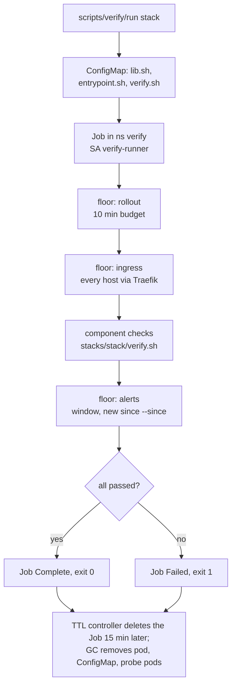

# Verify Jobs runbook

Design: the "Verification contract" in `docs/plans/2026-10-09-software-currency-design.md`. An upgrade counts as landed only when the component's checks pass. The checks run as a Kubernetes Job, so the Woodpecker rails (wave 4) and a person on the devvm run exactly the same thing.

| Piece | Where |
|---|---|
| Runner (starts the Job, streams its log, returns pass/fail; Kubernetes cleans up) | `scripts/verify/run` |
| Floor checks and helpers, shared by every stack | `scripts/verify/lib.sh` |
| Job entrypoint (floor rollout, floor ingress, component checks, floor alerts) | `scripts/verify/entrypoint.sh` |
| A stack's own checks | `stacks/<stack>/verify.sh` |
| Namespace, ServiceAccount, RBAC, test storage classes, credentials | `stacks/verify` |

## Run it

```sh
cd ~/code/infra
scripts/verify/run traefik                     # one stack, full checks, 10-minute alert watch
scripts/verify/run --quick dbaas               # skip backup runs and smoke tests, 60 s alert watch
scripts/verify/run -j 4 --all --log-dir /tmp/v # every stack that has a verify.sh, 4 at a time
scripts/verify/run --list                      # which stacks have a script, which fail closed
```

Exit status: `0` all checks passed, `1` a check failed, `2` usage error, `3` the stack has a `helm_release` or is a database/GPU stack and has no `verify.sh` (fail closed: it must not auto-land).

The runner needs a kubeconfig that can create ConfigMaps and Jobs in the `verify` namespace: an admin kubeconfig on the devvm, or `KUBECONFIG=$PWD/config` inside the Woodpecker apply step (the `woodpecker/default` ServiceAccount is cluster-admin). It uses the current kubectl context, so check `kubectl config current-context` first on a machine with several.

`--since <epoch>` sets the time from which a firing alert counts as new. The rails pass the time taken before `terragrunt apply`; by hand it defaults to the moment the runner starts. A full run takes the alert window (600 s) plus the checks. Measured on 2026-10-10: about 10 minutes for most stacks, 13 for `immich` (backup), 15 to 19 for `nfs-csi` and `proxmox-csi` (smoke tests), 28 for `dbaas` (PostgreSQL and MySQL backups run together, 16 minutes), and up to an hour for `descheduler` when it has to wait for the next scheduled run.

## What a run does



The floor, implemented once in `lib.sh`:

- **Rollout**: every Deployment, StatefulSet and DaemonSet in the stack's namespaces has observed its latest spec and has all replicas updated and ready, within `VERIFY_ROLLOUT_TIMEOUT` (600 s). Workloads scaled to 0 (Sablier) count as converged; `OnDelete` StatefulSets/DaemonSets skip the revision test. No pod there may be in `CrashLoopBackOff`, `ImagePullBackOff`/`ErrImagePull` or `CreateContainerConfigError`.
- **Ingress**: the first host and path of every Ingress in those namespaces is requested through the in-cluster Traefik Service (`--resolve host:443:<traefik ClusterIP>`), so the check exercises the route and not Cloudflare or external DNS. Any status from 100 to 499 passes (Authentik redirects, 401, 404 on API-only roots); `000` and 5xx fail after three tries. A 503 from a route whose backend Service has no ready endpoint counts as a parked app (Deployment at 0 replicas, by hand or by Sablier), because a crashed app still asks for replicas and fails the rollout check instead. Every HTTP probe sends the user agent `homelab-verify/1 (blackbox probe ...)`: Sablier ignores user agents matching `blackbox`, so a probe never wakes a parked app (a plain curl woke `affine` for its 3-hour session on the first run).
- **Alerts**: Prometheus `/api/v1/alerts` is polled every 30 s for `VERIFY_ALERT_WINDOW` seconds. A firing alert fails the run when it became active at or after `--since` and its `namespace` (or `exported_namespace`) is one of the stack's namespaces, its Traefik `service` label starts with one of them, or its name matches the stack's `VERIFY_ALERTNAMES`. `Trivy*`, `Watchdog` and `InfoInhibitor` never count. Alerts with a `for:` longer than the window cannot fire inside it; the window catches the fast ones.

Helm release status is not read (Helm keeps it in Secrets, which the verify identity cannot read). The apply covers it: every `helm_release` is `atomic = true`, so a failed upgrade fails the apply.

## The verify identity

`stacks/verify` creates ServiceAccount `verify/verify-runner` with:

| Access | Why |
|---|---|
| ClusterRole `verify-read`: get/list/watch on core resources except Secrets, and on every API group the checks read | rollout, CRD status, node allocatable, logs |
| Role in `verify`: create/delete pods and PVCs; create `ExternalSecret` and CNPG `Cluster` | probe pods (database clients, `nvidia-smi`, CUDA vectorAdd), CSI smoke tests, server-side dry runs that an admission webhook must refuse |
| Role `verify-backup-run` in `dbaas`, `immich`, `redis`, `rybbit`, `beads-server`: create/get/delete Jobs | "the backup job runs on the new version": a one-off Job from the backup CronJob |

It has no `pods/exec` anywhere. Database checks log in over the network:

| Secret in `verify` | Source | Used for |
|---|---|---|
| `verify-db-creds` | ESO from `vault-database`: static roles `pg-verify-probe`, `mysql-verify-probe` (7-day rotation, ESO refresh 2 min) | pg-cluster and MySQL as `verify_probe`, which owns only its `verify_probe` scratch database (pg also has `pg_monitor` and CONNECT on `dawarich`, `claude_memory`) |
| `verify-app-creds` | ESO from `vault-kv`: `secret/immich` `db_password`, `secret/rybbit` `clickhouse_password` | Immich Postgres and the rybbit ClickHouse, single-tenant servers; the probes write only to a scratch schema/database and drop it |

Redis (no `requirepass`, risk-accepted in `stacks/redis`) and Dolt (`beads` user, empty password) need no secret. Redis is fenced by a namespace allowlist, `local.redis_client_namespaces` in `stacks/redis`, which includes `verify`.

The GPU probe pod requests one `nvidia.com/gpu` slot without a `viktorbarzin.me/gpumem` seat: `verify` is on the Kyverno `require-gpumem-declaration` exclude list (`local.gpumem_excluded_namespaces`, `stacks/kyverno`), because the card is fully seated and the probe holds a CUDA context for a few seconds.

The Job pod gets both Secrets as environment variables. Probe pods that need a database client (`postgres:16.15-trixie`, `mysql:8.4.8`) get them through `run_pod ... secret=<name>`.

Storage classes `verify-proxmox-lvm` and `verify-nfs` match `proxmox-lvm` and `nfs-pve` but use `reclaimPolicy: Delete`, so a smoke-test volume (an LV on the PVE host, a directory under `/srv/nfs/verify-smoke/`) disappears with its PVC.

The namespace runs at `tier-4-aux` priority, so the scheduler may preempt a verify pod for a real workload. The Job's `podFailurePolicy` ignores failures with a `DisruptionTarget` condition (preemption, eviction): the Job starts a new pod, which runs every check again, and the runner follows the new pod's log. On the first full run a preempted pod failed the healthy `rybbit` stack; an eviction test on 2026-10-10 shows the replacement passing.

Everything a run creates in `verify` carries an owner reference to the Job, and the Job carries `ttlSecondsAfterFinished: 900`. Fifteen minutes after the Job finishes, the TTL controller deletes it and the garbage collector removes its pod, the ConfigMap and the probe pods. The runner deletes nothing on a normal exit; an interrupted run (Ctrl-C, SIGTERM) deletes only its Job so the checks stop. `K8sMassDelete` counts Pod, Secret and ConfigMap deletes per user and excludes the garbage collector, so this keeps runs out of it. Until 2026-10-10 the runner deleted its Job and ConfigMap itself, and a day of runs (117 of each, as `kubernetes-admin`) fired that critical alert. The Job is created suspended and started once its ConfigMap exists, and the ConfigMap is created with its owner reference already set, so neither can be left behind alone. Probe pods are deleted only when a check needs it (`rm=1`, for PVC release) or when a replacement Job pod reruns a check under the same pod name. A backup Job that fails is left in its namespace for inspection and `BackupCronJobFailed` fires for it, which is the right signal.

## Write a verify.sh

A `verify.sh` is a bash fragment the entrypoint sources after `lib.sh`. It sets variables and defines `verify_component`:

```bash
# shellcheck shell=bash
VERIFY_GROUP="chart"                 # chart | db | gpu | app
VERIFY_NAMESPACES="traefik"          # floor scope: rollout, ingress, alerts
VERIFY_ALERTNAMES="^Traefik"         # optional: alerts without a namespace label
VERIFY_INGRESS_SKIP=""               # optional regex over "<ns>/<ingress>"
VERIFY_ROLLOUT_SKIP=""               # optional regex over "<ns>/<Kind>/<name>"

verify_component() {
  check "traefik runs 3 ready replicas" workload_ready traefik deployment/traefik
  check "websecure 5xx rate is low" expect_prom 'sum(rate(traefik_entrypoint_requests_total{entrypoint="websecure",code=~"5.."}[5m]))' -lt 1
}
```

Rules that keep these scripts useful:

- Check function, not configuration. "The webhook refuses a privileged pod" beats "the webhook object exists".
- Do not pin versions, image tags or exact counts that move on their own. The script must pass before and after an upgrade.
- Every `check` prints the value it judged, so a failure explains itself in the log.
- Anything slow (backup runs, PVC smoke tests, model loads) goes behind `[ "${VERIFY_QUICK:-0}" = 1 ] || ...`.
- Create things only in the `verify` namespace, through `run_pod`, and name them through the helpers, so the owner reference is set.

Helpers in `lib.sh` (each prints what it saw and returns 0/1): `check`, `retry`, `workload_ready`, `expect_workload_image`, `expect_prom`, `expect_series`, `prom_value`, `expect_http`, `expect_body`, `expect_ingress`, `via_traefik`, `tcp_open`, `expect_no_log_errors`, `expect_alert_inactive`, `expect_dry_run_denied`, `run_pod`, `run_cronjob`, `pod_of`.

Probe pods that mount a PVC are started with `run_pod ... rm=1`, which deletes the pod once its log is read: a Completed pod still holds its PVC against deletion.

To iterate on a script, edit it in a worktree and run the runner from that worktree: the runner ships the local files in the ConfigMap, so nothing has to be pushed first. Editing only `stacks/<stack>/verify.sh` does not make CI apply that stack (`.woodpecker/default.yml` filters it out).

## What each stack checks

Every stack also gets the floor. "Full only" checks are skipped with `--quick`.

| Stack | Group | Component checks |
|---|---|---|
| authentik | chart | server, worker, pgbouncer, public outpost converged; ready/live probes; API root config; default authentication flow renders; forward-auth route redirects to Authentik; public outpost ping; Authentik scrape targets up |
| beads-server | db | Dolt answers `dolt_version()`; `code.issues` and `code.dolt_log` readable; scratch database created, written, read and dropped; beadboard and workbench converged; no panic/corruption logs; full only: `dolt-backup` Job (dump and restore check) |
| calico | chart | operator and calico-node converged; every tigerastatus Available and not Degraded; Installation reports a version; `v3.projectcalico.org` Available; a new pod gets an IP, resolves DNS and reaches a ClusterIP |
| cnpg | chart | operator converged; pg-cluster healthy with all instances ready; exporters up; primary streams to every replica; lag under 5 s; the validating webhook refuses an invalid Cluster (dry run) |
| crowdsec | chart | LAPI, AppSec, agents, firewall bouncers converged; scrape targets up; CAPI decisions over 10k; Traefik bouncers polling; parsers and AppSec processing; WAF returns 403 to an XSS probe on a CRS host |
| dbaas | db | pg-cluster healthy; exporters up; as `verify_probe`: scratch table on the primary, replicas replay its LSN (lag 0), row read back on a replica, PostGIS distance on `dawarich`, pgvector distance on `claude_memory`; MySQL converged, `mysql_up`, scratch table write/read/drop; apps on pg-cluster and on MySQL healthy; full only: `postgresql-backup` and `mysql-backup` Jobs |
| descheduler | chart | CronJob succeeded within 90 min; a run completed on the current image (full runs wait for the next :55 run when the newest one predates `--since`); its log has the eviction summary and no policy or RBAC errors |
| external-secrets | chart | controller, webhook, cert-controller converged; both ClusterSecretStores Ready; every ExternalSecret Ready; a 2-minute ExternalSecret refreshed from Vault within 5 min; webhook admits a valid ExternalSecret (dry run); no provider errors |
| homepage | chart | healthcheck `up`; service list renders (5+ groups, 50+ services); Kubernetes widget reads the cluster |
| immich | db | Postgres has `vchord` and `vector`, `vchord` preloaded, `clip_index` is a vchordrq index, an ANN query over `smart_search` returns rows, scratch schema write/read/drop; server and ML ping; one CLIP textual inference; full only: `postgresql-backup` Job |
| k8s-dashboard | chart | all seven deployments converged; web serves the UI; API issues a CSRF token; kong to auth to API lists namespaces with a bearer token |
| keel | chart | converged; health endpoint; no panics (stack is retired in wave 5) |
| kured | chart | both DaemonSets converged; startup log has the schedule and lock; gated sentinel and Prometheus filter in the args; `kured_reboot_required` served |
| kyverno | chart | three controllers converged; every ClusterPolicy Ready; a privileged pod is denied and a plain pod gets `tier-4-aux` priority and `ndots=2` (dry runs); policy reports stay off; update requests bounded |
| metallb | chart | controller and speakers converged; every LoadBalancer Service has an IP; configuration Valid; L2 announcements have a node; TCP to the state DB, Forgejo SSH, DNS and ingress VIPs |
| metrics-server | chart | APIService Available; node metrics for every Ready node; pod metrics served |
| monitoring | chart | Prometheus ready, rules healthy, over 95% of targets up, 25-week-old sample queryable; Alertmanager cluster ready; Grafana database ok; Loki ready, ingesting, recent logs queryable, ruler loaded; Alloy on every node, configs loaded, no dropped entries. Read-only: nothing restarts prometheus-server |
| nextcloud | chart | `status.php` installed, not in maintenance, no pending DB upgrade; login page 200; WebDAV 401; watchdog succeeded within the hour |
| nfs-csi | chart | controller and node plugin converged; every node registers the driver; kubelet volume stats flow; full only: provision, write, read on a second pod, delete a 1Gi volume on `verify-nfs` |
| nvidia | gpu | `nvidia.com/gpu` allocatable 100; ClusterPolicy ready with the time-slicing config; driver, device plugin, DCGM converged; validator init containers passed; test pod runs `nvidia-smi` and CUDA vectorAdd; every GPU pod running; one inference each on llama-swap (chat completion, using the loaded model), Immich ML (`/predict`) and Frigate (detector inference speed); DCGM metrics fresh; exporters up |
| proxmox-csi | chart | controller and node plugin converged; worker nodes report attach capacity; every volume attachment attached; no ghost disks; full only: provision a 1Gi LV on `verify-proxmox-lvm`, write, expand to 2Gi, read on a second pod, delete |
| pvc-autoresizer | chart | converged; the lease holder runs the resize loop with no API client failures |
| redis | db | PING; scratch key set, read, deleted in db 15; AOF and RDB status ok; clients connected; exporter up; an Anubis-fronted site answers; full only: `redis-backup` Job |
| reloader | chart | converged; annotations reload strategy; reload counter served; no RBAC errors |
| rybbit | db | ClickHouse answers; events readable, no detached parts; scratch MergeTree written, merged, read, dropped; metrics scraped; rybbit backend healthy; full only: `clickhouse-backup` Job |
| sealed-secrets | chart | controller converged; serves a valid sealing certificate; private keys loaded; metrics; every SealedSecret Synced |
| traefik | chart | converged; LB IP on the TCP and UDP Services; Forgejo, Authentik and a forward-auth route answer through Traefik; ingress VIP open; requests flowing with under 5% 5xx; no plugin errors |
| trivy-operator | chart | operator and server converged; server healthz; reports exist and the newest is under 24h old; `trivy_` metrics scraped |
| vault | chart | every pod initialised and unsealed; one active node; autopilot healthy with failure tolerance 1; ESO stores Valid and a database credential refreshed through Vault; public health endpoint |
| woodpecker | chart | server and agents converged; version and healthz; UI through Traefik; agents connected without auth errors; no migration errors |

## When a run fails

1. Read the `FAIL` lines in the runner output; each names the check and the value it saw.
2. `--keep` leaves the Job, its pod and the probe pods in `verify` for `kubectl -n verify logs` and `describe` (no TTL is set; delete the Job when done). Without it, a finished run stays for 15 minutes.
3. A floor alert failure names the alert and when it became active. If it is unrelated to the change (for example a weekly credential rotation in the same namespace), rerun with `--since` set after it started.
4. A check that is wrong for the current healthy state is a bug in the script: fix the script, not the threshold of a real symptom.

## Open questions

- The floor alert window catches alerts whose `for:` is shorter than the window. Slower alerts are left to the normal Alertmanager path.
- Dependent-app checks for pg-cluster and MySQL cover the apps' workloads and routes (floor checks on their namespaces); apps get their own `verify.sh` as Renovate starts moving them.
