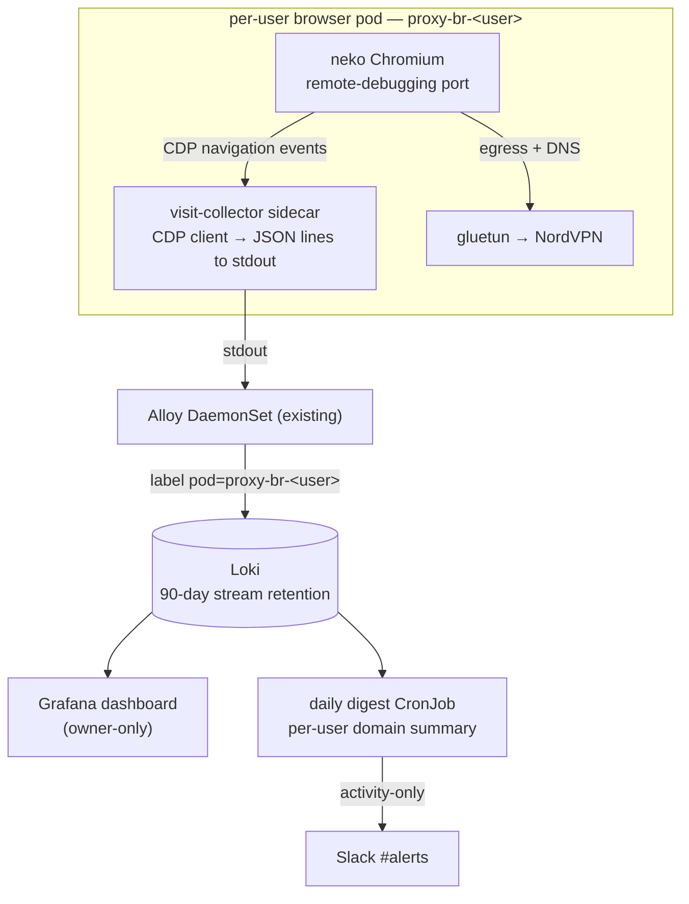

# Proxy visit tracking — capture, dashboard, daily digest

## Problem Statement

Viktor runs **`proxy.viktorbarzin.me`**, a remote-browser service that a few
trusted people use to browse the web through a NordVPN tunnel. He trusts the
users, but — under a privacy policy the users have agreed to — he wants
**visibility into what sites they visit**: a way to inspect browsing per user,
and a low-noise **daily summary**, without standing up a heavy real-time
surveillance apparatus or getting paged over individual visits.

Today nothing captures this. Because each browser egresses through the NordVPN
tunnel with **DNS resolved inside the tunnel** (gluetun DoT), the homelab's
existing Technitium DNS query logs see none of it, and Traefik only ever sees
the display stream, never the sites visited.

## Solution

Every page a user opens in their proxy browser is recorded — **full URL + page
title + timestamp, attributed to the Authentik user** — into Loki. Two surfaces
consume it:

- An **owner-only Grafana dashboard** to inspect visits: recent activity,
  filter by user, top sites, per-user drill-down, over a 90-day window.
- A **daily digest** posted to Slack **#alerts** with a per-user **domain
  summary**, sent only on days with activity.

There is **no real-time watchlist / per-visit alerting** — the daily digest is
the notification surface. The capture is observe-only; it never blocks or
filters browsing, and it does not touch the broker or the traffic/egress path.

## User Stories

1. As the operator, I want every page a proxy user opens recorded with its full
   URL, title and time, so that I can see what happened if I ever need to.
2. As the operator, I want each visit attributed to the specific Authentik user
   who made it, so that the record is meaningful across multiple users.
3. As the operator, I want to open a dashboard and see the most recent visits
   across all users, so that I can glance at current activity.
4. As the operator, I want to filter the dashboard by a single user, so that I
   can review one person's browsing in isolation.
5. As the operator, I want a "top sites" view over a chosen time range, so that
   I can see where time is being spent without reading every line.
6. As the operator, I want the detailed per-visit history kept for 90 days and
   then auto-deleted, so that I have a useful window without hoarding sensitive
   data indefinitely.
7. As the operator, I want a daily digest in #alerts summarising which sites
   each user visited, so that I stay passively informed without checking a
   dashboard.
8. As the operator, I want the digest to show a per-user domain summary with
   visit counts rather than every URL, so that the daily message stays short
   and scannable.
9. As the operator, I want the digest sent only on days when someone actually
   used the proxy, so that I am not pinged with empty reports.
10. As the operator, I want my own account excluded from the digest, so that I
    am not reporting my own browsing back to myself.
11. As the operator, I want the digest to reuse the existing #alerts channel and
    Slack webhook, so that no new notification plumbing is introduced.
12. As the operator, I want the whole thing to reuse Loki, Grafana, Alloy and
    the alert-digest pattern, so that it costs nothing new and fits existing
    operational habits.
13. As the operator, I want capture to not require any change to the broker or
    the NordVPN egress path, so that adding tracking cannot destabilise the
    live service.
14. As a proxy user, I want the tracking to be invisible to my browsing
    experience and never slow me down or break sites, so that the service stays
    usable.
15. As a proxy user who agreed to the policy, I want only my page visits
    recorded — not my keystrokes, form contents, or page bodies — so that the
    monitoring is proportionate to what I consented to.
16. As the operator, I want visits captured live during the session rather than
    from browser history, so that ephemeral or cleared history does not create
    blind spots.
17. As the operator, I want the capture to survive the browser being restarted
    or navigating rapidly, so that the log is complete.
18. As the operator, I want in-app (single-page-app) navigations captured, not
    just full page loads, so that sites like webmail or dashboards still show
    the pages actually viewed.
19. As the operator, I want background sub-resource requests (ads, CDNs,
    trackers, API calls) excluded from the record, so that the log reflects
    sites the user actually visited rather than noise.
20. As the operator, I want the dashboard restricted to me, so that one user
    cannot see another user's browsing.
21. As the operator, I want an easy future path to strip query strings or add
    category exclusions, so that I can tighten privacy later without a redesign.
22. As the operator, I want the digest job to fail safe (skip, not spam) if Loki
    is briefly unavailable, so that an outage doesn't produce a garbage report.

## Implementation Decisions

- **Two new first-party components, both pure-stdlib Python** (no custom image,
  no pip at runtime — same doctrine as the alert-digest CronJob):
  - **visit-collector** — a small sidecar that runs inside each per-user browser
    pod, connects to the local Chromium's DevTools (CDP) endpoint, subscribes to
    navigation events, and emits one JSON line per visit to **stdout**. Because
    the pod is named `proxy-br-<userkey>` and Alloy already tails every pod's
    stdout into Loki with the pod name as a label, **per-user attribution is
    automatic and needs no new logging wiring**. The collector also stamps the
    user (from an env var the broker already knows) into the line so the record
    is self-describing.
  - **visit-digest** — a daily CronJob in the monitoring namespace that queries
    Loki for the day's visit lines, builds a per-user domain summary, and posts
    it to #alerts via the existing Slack webhook. Structurally a clone of the
    alert-digest CronJob (pure `build_message` + thin Loki/Slack I/O wrappers,
    `DRY_RUN` support).

- **Capture mechanism = CDP navigation events.** The collector attaches to the
  browser target, auto-attaches to page targets, enables `Page` domain events,
  and records **`Page.frameNavigated` (main frame only)** plus
  **`Page.navigatedWithinDocument`** (SPA history navigations). Sub-frame
  navigations and network sub-resource requests are **not** recorded. Each
  record is `{ts, user, url, title, kind}`. The primary risk is exposing
  Chromium's `--remote-debugging-port` under neko's launch; the **validated
  fallback** is a force-loaded logging browser-extension (via the managed-policy
  ConfigMap already mounted at `/etc/chromium/policies/managed`) reporting to a
  tiny in-pod collector — same record shape, same stdout→Loki path.

- **Reuse the chrome-service CDP handling pattern.** The existing CDP bridge
  demonstrates the stdlib approach to Chrome's DevTools HTTP/WebSocket endpoint
  (target discovery via `/json`, WS framing, Host-rebinding quirks). The
  collector is a CDP *client* built in the same stdlib spirit.

- **Storage = Loki, with a dedicated stream label** for the visit lines so a
  **per-stream 90-day retention** can be set independently of the global Loki
  retention. Prometheus is not used for per-URL data (cardinality); aggregate
  counts, if wanted later, follow the existing share-link-analytics
  recording-rule pattern.

- **Dashboard = Grafana over the Loki datasource**, in an **owner-only** folder:
  a recent-visits table (time / user / URL / title), a per-user template
  variable, and a top-sites panel. Full URLs, 90-day window.

- **Digest = daily, activity-only, domain summary, #alerts.** Excludes the
  operator's own account. Runs at 08:00 Europe/London (matching the alert
  digest), covering the previous day. If there were no visits, it sends nothing.
  If Loki is unreachable, it logs and exits without posting.

- **Broker change is additive only:** the browser-pod spec gains the collector
  sidecar container (sharing the pod, reaching Chromium on loopback) and the
  Chromium launch gains the debug-port exposure. No change to gluetun, DNS
  policy, WireGuard peering, Services, Ingresses, reaping, or the traffic path.

- **Privacy defaults (all adjustable later without redesign):** full URLs
  including query strings are recorded; no category exclusions; only page
  visits (not page content) are captured; 90-day retention; owner-only
  dashboard; operator's own visits excluded from the digest but present in the
  dashboard.

- **Zero new cost.** Reuses Loki, Grafana, Alloy, Alertmanager's Slack webhook,
  the CronJob pattern, and the existing per-user pod model.

## Testing Decisions

- **Good tests here exercise external behaviour at two pure seams**, not
  implementation details, mirroring how the alert-digest CronJob isolates a
  pure `build_message` from its network I/O:
  - **Seam 1 — CDP event → visit record.** Given a raw CDP event payload (a
    `Page.frameNavigated`, a `navigatedWithinDocument`, a sub-frame event, an
    `about:blank`/`chrome://` event), the transform returns the correct visit
    record or `None` (dropped). Tests assert inclusion/exclusion and field
    extraction (url, title, kind). The WebSocket/CDP transport is **not** unit
    tested — it is thin I/O at the edge.
  - **Seam 2 — visit records → digest message.** Given a list of visit records
    for a day, the transform returns the exact Slack message text: per-user
    grouping, domain counts, correct ordering, operator-account exclusion, and
    the empty-input case returning "no message" (so the job sends nothing).
    Loki fetch and Slack post are **not** unit tested — thin I/O at the edge.
- **Prior art in-repo:** the alert-digest `build_message` unit shape; the
  `homelab invite` CLI helper tests (pure helpers tested, network client not).
- Terraform/ConfigMap/dashboard-JSON wiring is not unit tested (config, per the
  repo's execution rules); it is validated by applying and observing live Loki
  lines + a `DRY_RUN` digest run.

## Out of Scope

- **Real-time watchlist / per-visit alerting** — explicitly dropped in favour of
  the daily digest.
- **All-domain / background-request capture** — only page visits are recorded,
  not every domain contacted.
- **Blocking, filtering, or content inspection** — this is observe-only; no
  page bodies, form data, or keystrokes.
- **The cancelled SOCKS5 / proxy-endpoint surface** — there is no path to cover
  but the remote browser.
- **Category-based exclusions and query-string stripping** — designed to be
  easy to add later, not built now.
- **Long-term analytics / retention beyond 90 days** — the daily digests are the
  long-term record.

## Further Notes

- **Consent & proportionality:** users have agreed to the privacy policy; the
  design records page visits only (not content), keeps detail for a bounded 90
  days, and confines the dashboard to the operator.
- **The one build risk to validate first:** whether neko will expose Chromium's
  DevTools port cleanly. Validate on the live browser pod before building the
  collector; if it resists, take the force-loaded-extension fallback (same
  downstream path). Everything else reuses proven homelab patterns.
