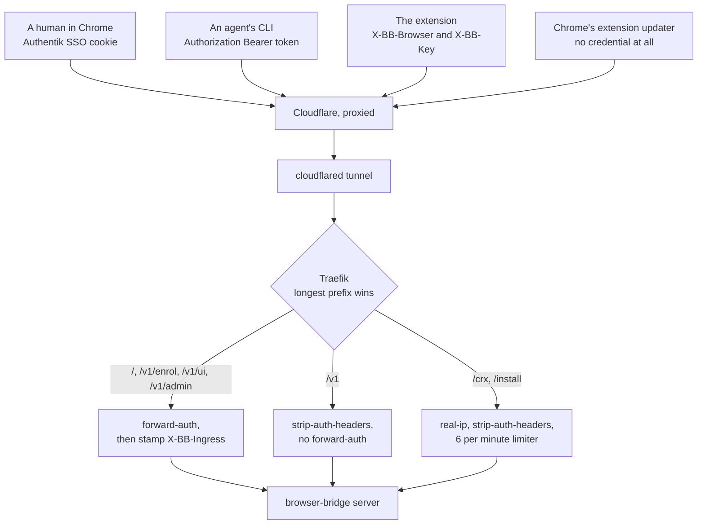

# browser-bridge

Drives the Chrome a human is actually signed in to. An agent runs
`homelab browser bridge <cmd>`, the CLI posts an action to this server, the
server hands it to a Chrome extension over SSE, the extension runs it over the
DevTools Protocol and posts the result back.

Sibling of `homelab browser run`, which drives a headless Chrome in the cluster
with nobody's session attached. Reach for browser-bridge when the human's
logged-in session is the point, and for `browser run` when it is not.

Code and protocol live in `~/code/browser-bridge`. The wire contract is
`docs/protocol.md` there, and it is authoritative for anything this file
summarises.

## What this stack runs

| resource | detail |
|---|---|
| namespace `browser-bridge` | tier `4-aux`, no resource-governance opt-out labels |
| deployment `browser-bridge` | 1 replica, `Recreate`, `ghcr.io/viktorbarzin/browser-bridge`, 25m CPU request, 256Mi requests = limits |
| service `browser-bridge` | ClusterIP on 8080. Port 8081 is deliberately absent |
| ExternalSecret `browser-bridge-secrets` | `BB_INGRESS_SECRET` and `BB_EXTENSION_ID` from Vault `secret/browser-bridge` |
| Middleware `ingress-secret` | stamps `X-BB-Ingress` on the forward-auth'd routers |
| Middleware `crx-rate-limit` | 6 a minute, burst 12, keyed on `X-Real-Ip` |
| three `ingress_factory` calls | one host, three auth postures, below |

One replica is a constraint, not a default. Result blobs (screenshots, page
text, response bodies) are held in the server process's memory because the
protocol rules out carrying them over SSE or through Redis, so a second replica
would hand the CLI a blob id the other pod cannot serve. Blobs in object
storage, or a sticky route, come before a second replica.

State lives in the shared Redis at `redis-master.redis.svc.cluster.local:6379`
under the `bb:` key prefix. That instance has no password (`protected-mode no`,
no `requirepass`), so `BB_REDIS_PASSWORD` stays unset and the NetworkPolicy
allowlist in `stacks/redis` is what gates access. Redis runs
`maxmemory-policy volatile-lru`, which evicts keys that carry a TTL and spares
keys that do not, and every browser-bridge record has a TTL. An enrolment can
therefore disappear before its 30 days are up, which is why the extension
treats "the server has never heard of me" as a state to re-enrol from rather
than an error.

## The routers, and the one unauthenticated path

Three kinds of client reach one hostname with three different credentials, and
Authentik can only vouch for one of them.



| paths | `auth` | what gates it |
|---|---|---|
| `/`, `/v1/enrol`, `/v1/ui`, `/v1/admin` | `required` | Authentik forward-auth, group `Home Server Admins`, plus the `X-BB-Ingress` shared secret |
| `/v1` | `app` | the server's own credentials: a CLI bearer token, the extension's browserId and browserKey, or a one-time pair code, each checked against a stored hash in constant time |
| `/crx`, `/install` | `none` | nothing, by design |

**Why `/crx` has to be open.** Chrome's extension updater sends no cookie and
cannot run an OIDC flow, and `curl -fsSL https://browser-bridge.viktorbarzin.me/install | sh`
cannot either. Forward-auth on those paths would break both installing and
updating. Four things are served under them and none carries user data: the
update manifest `/crx/update.xml`, the signed extension `/crx/browser_bridge.crx`,
the installer `/crx/install.sh`, and a 302 at `/install` that keeps the
one-liner short. No handler under that prefix reads an identity,
`traefik-strip-auth-headers` removes any inbound `X-authentik-*`, and the
server ignores identity headers entirely unless the request also carries the
ingress secret, which this router does not stamp.

**Why `/v1` is not behind forward-auth.** The Authentik outpost answers a
request with no session with a 302 to the login page. An agent's bearer token
and the extension's browser key would both be redirected into HTML. The brief
called for forward-auth on everything except the two CRX artifacts, and that
is not reachable as written for this reason. The split above keeps forward-auth
on every route that reads a human identity.

**Why the ingress secret exists.** Any pod in the cluster can reach the Service
directly, skipping Traefik, and a forged `X-authentik-username` on that path
would otherwise be believed. `customRequestHeaders` sets `X-BB-Ingress`
unconditionally, overwriting any client copy, and the server requires both the
username header and a matching secret before it treats a request as a signed-in
human. The header is stamped only on routers that also run forward-auth: on a
router without it, the pair would let a client supply their own identity.

## The routes that moved to fit this split

Four operations the web UI performs used to sit on the `/v1` router, which
stamps no identity header, so the settings page and the web Stop button
answered `401 no_credential`. A longer Traefik prefix could not fix that.
`/v1/control/stop` takes a CLI token and a UI identity on one path and method,
and `/v1/browsers` is `GET` for the CLI and `PATCH`/`DELETE` for the UI on the
same prefix, so splitting them by router would have meant hand-written
IngressRoute objects in place of `ingress_factory`.

The server moved them under `/v1/ui/` instead, which the forward-auth router
already covers. This stack did not change:

| operation | route | router |
|---|---|---|
| Stop, from the web UI | `POST /v1/ui/control/stop` | forward-auth |
| rename a browser | `PATCH /v1/ui/browsers/{id}` | forward-auth |
| revoke a browser | `DELETE /v1/ui/browsers/{id}` | forward-auth |
| mark a browser default | `POST /v1/ui/browsers/{id}/default` | forward-auth |
| Stop, from the CLI or the toolbar popup | `POST /v1/control/stop` | `/v1`, bearer |
| list your browsers, from the CLI | `GET /v1/browsers` | `/v1`, bearer |

The kill switch has three routes onto it and none of them share a failure:
the toolbar popup cuts the connection in the browser with no server round
trip, `homelab browser bridge stop` goes through the CLI bearer, and the web
button goes through forward-auth.

## First apply, in order

1. **Create the Vault path.** The stack reads `secret/browser-bridge` at plan
   time for the Traefik middleware, because Traefik's headers middleware takes a
   literal string and there is no secret reference for it. Until the path
   exists, `homelab tf plan browser-bridge` fails with
   `no secret found at "secret/data/browser-bridge"`. `terraform validate` is
   unaffected and passes today.

   ```sh
   vault kv put secret/browser-bridge \
     ingress_secret="$(head -c 32 /dev/urandom | base64 | tr -d '=+/' | cut -c1-43)" \
     extension_id="PLACEHOLDER_UNTIL_THE_CRX_IS_SIGNED"
   ```

   **Done, 2026-09-20.** The path holds `crx_signing_key`,
   `crx_public_key_spki_b64`, `extension_id` and, since a plan-time failure
   found it missing, `ingress_secret`. Use `vault kv patch` rather than
   `vault kv put` on it from here: a `put` replaces the whole secret and would
   drop the signing key, which is the one value here that cannot be
   regenerated without changing the extension id. The data source carries a
   postcondition that names the field if it is ever absent again, instead of
   failing with Terraform's "the given key does not identify an element"
   message.

   `ingress_secret` must be at least 16 characters or the server refuses to
   start. `extension_id` is not a secret; it lives here because it is unknown
   until the extension is packed and its signing key derives the id, and this
   way setting it is `vault kv patch` plus a Reloader-driven restart rather
   than a Terraform change.

2. **The two cross-stack edits are already in this branch**, and both are
   required or the first deploy fails:
   - `stacks/kyverno/modules/kyverno/ghcr-credentials.tf` adds `browser-bridge`
     to `ghcr_private_namespaces`, so the `ghcr-credentials` pull secret is
     cloned into the namespace. Without it the pod sits in `ImagePullBackOff`,
     because a private ghcr package cannot use the node-side pull-through cache.
     Editing a Kyverno generate rule in place is denied by Kyverno's own
     validate webhook, so that resource carries `force_new` and the plan shows a
     replace rather than an update. Generated secrets survive it.
   - `stacks/redis/modules/redis/main.tf` adds `browser-bridge` to
     `redis_client_namespaces`. Without it the pod starts, answers `/healthz`,
     fails `/readyz`, and every action returns `store_unavailable`.

   `kyverno` is on `PLATFORM_STACKS`, so it applies through the platform path on
   the same push. `redis` and `browser-bridge` are picked up from the git diff.

3. **Onboard the repo to CI** so an image exists. Do not hand-write the two CI
   files:

   ```sh
   infra/scripts/offinfra-onboard browser-bridge \
     --clone /home/wizard/code/browser-bridge \
     --visibility private \
     --namespace browser-bridge \
     --deploy "browser-bridge=server" \
     --dry-run
   ```

   Terraform pins `:latest` as a placeholder and has the image in
   `ignore_changes`, so Woodpecker's `kubectl set image` owns the tag from then
   on.

   The image has to carry the packed extension and the installer at
   `/srv/crx/browser_bridge.crx` and `/srv/crx/install.sh`, which is the
   server's `BB_CRX_DIR` default and is why this stack mounts no volume for
   them. Nothing in Kubernetes checks that. `/readyz` reports the Redis round
   trip only, so a pod with an empty `/srv/crx` is Ready and answers 500 on the
   CRX paths.

4. **Provision the CLI tokens.** `secret/browser-bridge` also holds
   `provision_token`, written 2026-09-20, which is the one bearer
   `POST /v1/provision/tokens` accepts. It reaches the pod as
   `BB_PROVISION_TOKEN` through the same ExternalSecret as the ingress
   secret, and the server refuses to start if it is present and shorter than
   32 characters.

   Nothing else needs doing by hand. `t3-provision-users.sh` step 5d-quater
   runs hourly, and per roster user it reads
   `secret/browser-bridge/tokens`, mints through that route if the user has
   no token yet, writes the result back to Vault, and installs
   `~/.config/browser-bridge/token` at mode 0600. It is install-if-absent and
   best effort: while this stack is undeployed the mint fails, the reconcile
   logs a warning and carries on, and the first run after the service is up
   fills every user in.

   The admin route `POST /v1/admin/tokens` stays for a human at the web UI.
   It cannot serve the provisioner, because /v1/admin runs forward-auth and
   the Authentik outpost answers a request with no SSO cookie with a 302 to a
   login page.

5. **Set the real extension id** once the CRX is signed:
   `vault kv patch secret/browser-bridge extension_id=<32 chars>`. External
   Secrets re-syncs within the hour, or immediately with
   `kubectl annotate es browser-bridge-secrets -n browser-bridge force-sync=$(date +%s) --overwrite`,
   and Reloader bounces the pod.

## Cloudflare

Nothing here declares a `cloudflare_ruleset`, and that is two separate
decisions.

**The bot skip cannot be built on this plan.** Cloudflare's documentation is
explicit: "You cannot bypass or skip Bot Fight Mode using WAF custom rules or
Page Rules." Exceptions need Super Bot Fight Mode, which starts at the Pro
plan. Cloudflare lists Pro at 25 USD a month billed monthly, or 20 USD a month
billed annually, per zone (checked 2026-09-20). That is new spend and was not
approved, so it is recorded here as a gap rather than enabled. The same
constraint already cost this repo one revert, infra#91, where Bot Fight Mode
403'd a Forgejo package upload from a GitHub Actions runner.

How much risk that leaves, measured on 2026-09-20 against a proxied host
through the Cloudflare anycast address: four clients reached the origin, a
Chrome user agent, `Go-http-client/2.0`, `curl/8.5.0` and a
`Chrome Extension Updater` string, all four returning the application's own 404
with its origin timing header rather than an edge 403. The client that was
blocked in infra#91 came from a hosting ASN; Chrome's updater runs on the
user's own machine from a residential address with a real Chrome user agent,
which is the passing profile.

If an update check is ever challenged, the escape is not to fight Bot Fight
Mode, because the free plan offers no way to win. Move the two artifacts to a
second hostname with `dns_type = "non-proxied"`, which emits explicit A and AAAA
records that shadow the wildcard and bypass Cloudflare entirely. That is one
more `ingress_factory` call, and it does trade away the property that everything
lives on one host.

**The rate limit is in Traefik rather than at the edge**, and that is the better
of the two rather than a fallback. Cloudflare's free plan allows one rate
limiting rule for the whole zone; Traefik allows any number, per path, and
costs nothing. Split DNS also means the devvm and every WireGuard client reach
Traefik without a Cloudflare hop, so an edge-only limit would never see them.

If an edge-side cap is wanted anyway, this validates against the pinned provider
(`cloudflare/cloudflare 4.52.9`) and there is no `http_ratelimit` ruleset in the
zone today, so it would create the phase rather than replace anything. Re-run
`GET /zones/<zone>/rulesets` first, because the phase list moves, and remember
that a `cloudflare_ruleset` owns its entire phase.

```hcl
resource "cloudflare_ruleset" "bb_crx_ratelimit" {
  zone_id     = "fd2c5dd4efe8fe38958944e74d0ced6d"
  name        = "browser-bridge CRX update endpoint rate limit"
  description = "Cap the one unauthenticated path on browser-bridge.viktorbarzin.me."
  kind        = "zone"
  phase       = "http_ratelimit"

  rules {
    ref         = "bb_crx_rl"
    description = "browser-bridge /crx/* : 20 requests per 60s per IP"
    expression  = "(http.host eq \"browser-bridge.viktorbarzin.me\" and starts_with(http.request.uri.path, \"/crx/\"))"
    action      = "block"
    enabled     = true

    ratelimit {
      characteristics     = ["ip.src"]
      period              = 60
      requests_per_period = 20
      mitigation_timeout  = 600
    }
  }
}
```

`period` must be at least 10 on the free plan, and `ip.src` is the only counting
characteristic it allows.

## Runbook: a browser that will not enrol

Work down the list. Each step names what to look at and what a healthy answer
looks like.

**1. Is the server up and talking to Redis?**

```sh
homelab k8s status browser-bridge
kubectl -n browser-bridge logs deploy/browser-bridge --tail=50
```

`readyz` failing while `healthz` passes means Redis, not the server. Check that
`browser-bridge` is still in `redis_client_namespaces` in `stacks/redis`, then
that the Redis pod is up. A `store_unavailable` on every action is the same
fault seen from the CLI.

A pod stuck in `CreateContainerConfigError` means the Kubernetes secret is
missing, which means the ExternalSecret has not synced:

```sh
kubectl -n browser-bridge get externalsecret browser-bridge-secrets -o wide
```

`SecretSyncedError` almost always means a key is absent in Vault. Both
`ingress_secret` and `extension_id` must exist or the whole sync fails.

**2. Did the installer actually write the policy?**

On Linux the file is `/etc/opt/chrome/policies/managed/browser-bridge.json`. It
has to name the pinned extension id and the update URL
`https://browser-bridge.viktorbarzin.me/crx/update.xml`. Chrome reads it at
startup, so a Chrome that was already running has not seen it. Open
`chrome://policy` and press Reload policies, then `chrome://extensions` with
developer mode on.

**3. Can Chrome fetch the CRX at all?**

From the machine running Chrome, not from the devvm, because split DNS sends
the devvm down a different path:

```sh
curl -sI https://browser-bridge.viktorbarzin.me/crx/update.xml
curl -sI https://browser-bridge.viktorbarzin.me/crx/browser_bridge.crx
```

A 200 with `application/xml` and a 200 with `application/x-chrome-extension` is
healthy. A 302 to `authentik.viktorbarzin.me` means the `/crx` router is not
matching and the request fell through to the `/` router, which is a Traefik
routing problem rather than an auth one. A 429 is the per-path limiter, 6 a
minute per client address, and it clears within the minute. A 403 with a
Cloudflare body and no origin timing header is Bot Fight Mode, which is the gap
described above.

**4. Does the enrolment page load and does Connect work?**

The extension opens `/enrol?ext=<id>&nonce=<nonce>` on install. That page is
behind Authentik, so an expired SSO session shows the login page instead. After
signing in, Connect posts to `/v1/enrol` with the session cookie.

A `401 no_credential` from that POST means the request reached the server
without an identity, which is the `X-BB-Ingress` and forward-auth pair. Check
that the Middleware exists and carries a value:

```sh
kubectl -n browser-bridge get middleware ingress-secret -o yaml
kubectl -n browser-bridge get ingress browser-bridge -o jsonpath='{.metadata.annotations.traefik\.ingress\.kubernetes\.io/router\.middlewares}'
```

The annotation must end with
`traefik-authentik-forward-auth@kubernetescrd,browser-bridge-ingress-secret@kubernetescrd`.
If the value in the Middleware and the value in `secret/browser-bridge` have
drifted apart, re-apply this stack, which rewrites the Middleware from Vault,
and bounce the pod so it picks up the same value.

**5. The extension has a credential but shows as offline.**

It holds `browserId` and `browserKey` in `chrome.storage.local` but the server
shows no live browser. Either the SSE stream is not open or the enrolment
record expired. Enrolments last 30 days and are refreshed on every reconnect,
and Redis `volatile-lru` can evict one early under memory pressure, so a
browser that has been closed for a long time may simply need re-enrolling. The
extension is built to treat that as recoverable rather than an error.

**6. Authentik will not let the human in at all.**

The ingress allows the `Home Server Admins` group. A user outside it gets as far
as the Authentik login and then a denial. Adding a dedicated group means an
`authentik_group` resource in `stacks/authentik` plus a matching
`allowed_groups` here, or `check-allowed-groups.py` blocks the plan.

## Fallback: the pair code

For a Chrome that cannot reach Authentik. The human runs
`homelab browser bridge pair` at a shell that has a CLI token, gets a six
character code valid for 10 minutes, and types it into the extension popup. The
enrolment is owned by the Authentik user behind the CLI token that minted the
code, so identity still flows from the authenticated side and the browser never
asserts who it belongs to. Unlike the tool this borrows the idea from, the pair
endpoints require the CLI token, so the flow cannot be started from the browser.
